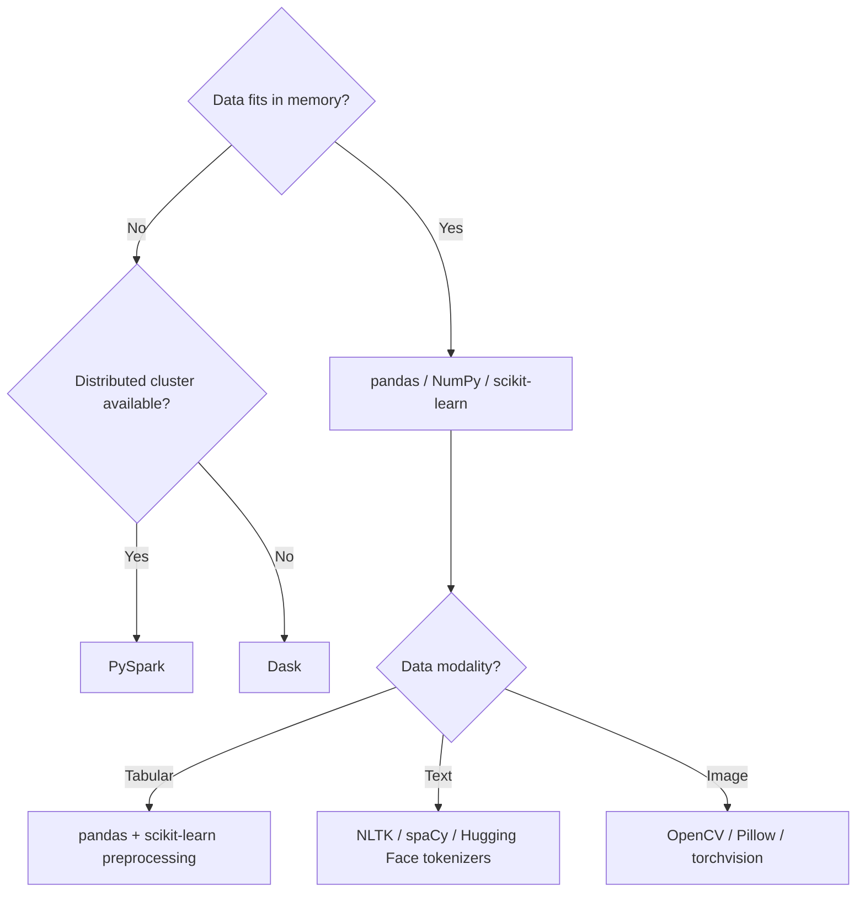

## Common Preprocessing Tools and Libraries Overview

### Overview

A wide range of software libraries provide functionality for data preprocessing and cleaning in machine learning workflows. These libraries differ in scope, programming language, target data scale, and level of abstraction — from low-level array manipulation to high-level pipeline orchestration. This topic surveys the most widely used tools across the Python ecosystem (the dominant language for ML preprocessing) and notes where alternatives exist in other languages.

### Pandas

**Key Points**
- A Python library providing DataFrame and Series data structures for tabular data manipulation.
- Commonly used for loading data, handling missing values (`fillna`, `dropna`), filtering, merging/joining datasets, group-by aggregations, and basic type conversions.
- Operates primarily in-memory, which means very large datasets may exceed available RAM. [Inference] This limitation follows from pandas' standard in-memory design as commonly documented, though the exact dataset size at which this becomes a practical problem depends on available hardware and cannot be stated as a fixed number.

**Example**

```python
import pandas as pd

df = pd.read_csv("customers.csv")
df["Age"] = df["Age"].fillna(df["Age"].median())
df = df.drop_duplicates()
```

### NumPy

**Key Points**
- A foundational Python library for numerical array operations, underlying most other data science and ML libraries including pandas and scikit-learn.
- Commonly used for vectorized numeric transformations, array reshaping, and mathematical operations needed during preprocessing (e.g., log transforms, normalization formulas).
- Generally faster than pure Python loops for numeric operations due to vectorization. [Inference] This performance characteristic is widely documented behavior of NumPy's underlying implementation, though the actual speed difference in any specific case depends on the operation and data size, and I cannot quantify it without benchmarking that specific case.

### Scikit-learn

**Key Points**
- A Python machine learning library that includes a `preprocessing` module and pipeline utilities widely used for preprocessing tasks: scaling (`StandardScaler`, `MinMaxScaler`), encoding (`OneHotEncoder`, `OrdinalEncoder`), imputation (`SimpleImputer`, `KNNImputer`), and pipeline composition (`Pipeline`, `ColumnTransformer`).
- A key design feature is the fit/transform API, which supports fitting transformations on training data and applying them consistently to validation/test data — directly addressing the train/test leakage concern discussed in an earlier topic.
- Pipeline objects allow multiple preprocessing steps to be chained and applied consistently across training and inference.

**Example**

```python
from sklearn.preprocessing import StandardScaler
from sklearn.impute import SimpleImputer
from sklearn.pipeline import Pipeline

pipeline = Pipeline([
    ("imputer", SimpleImputer(strategy="median")),
    ("scaler", StandardScaler())
])
X_train_processed = pipeline.fit_transform(X_train)
X_test_processed = pipeline.transform(X_test)
```

### Other Notable Python Libraries

| Library | Primary Use in Preprocessing |
|---|---|
| `category_encoders` | Extended categorical encoding methods beyond scikit-learn's built-ins (e.g., target encoding, binary encoding) |
| `imbalanced-learn` (`imblearn`) | Resampling techniques for class imbalance (oversampling, undersampling, SMOTE) |
| `feature-engine` | Scikit-learn-compatible transformers focused on feature engineering and preprocessing |
| `missingno` | Visualization of missing data patterns |
| `great_expectations` | Data validation and quality checks as part of a pipeline |
| `Dask` | Parallelized/distributed data processing with a pandas-like API for larger-than-memory datasets |
| `PySpark` | Distributed data processing at large scale, including a MLlib preprocessing module |

[Unverified] I cannot confirm the current feature set, version compatibility, or maintenance status of each of these libraries as of today, since library capabilities change over time and I do not have live access to their current documentation or release notes in this response.

### NLP-Specific Preprocessing Libraries

| Library | Primary Use |
|---|---|
| `NLTK` | Tokenization, stemming, stopword lists, classic NLP preprocessing |
| `spaCy` | Tokenization, lemmatization, named entity recognition, industrial-strength NLP pipelines |
| `Hugging Face tokenizers` / `transformers` | Subword tokenization for transformer-based models |
| `re` (Python standard library) | Regular-expression-based text cleaning |

### Image-Specific Preprocessing Libraries

| Library | Primary Use |
|---|---|
| `OpenCV` | Image reading, resizing, color-space conversion, filtering |
| `Pillow (PIL)` | Basic image loading and manipulation |
| `torchvision.transforms` / `tf.image` | Framework-integrated image preprocessing for PyTorch/TensorFlow pipelines |

### Non-Python Tools

**Key Points**
- **R**: `dplyr` and `tidyr` (part of the tidyverse) are widely used for data cleaning and transformation; `caret` and `recipes` provide preprocessing pipeline functionality.
- **SQL**: Often used directly for early-stage cleaning and aggregation before data ever reaches a Python/R environment, particularly when data lives in a relational database.
- **Spreadsheet tools** (Excel, Google Sheets): Common for small-scale manual cleaning, though generally not suited to reproducible, large-scale pipelines.

[Inference] The general reputation of spreadsheet tools as unsuited to large-scale reproducible pipelines follows from their manual, non-scripted nature as commonly discussed in data engineering practice, but I cannot verify this characterization against a specific benchmark or study.

### Choosing Between Tools



[Inference] This decision flow reflects commonly cited tool-selection reasoning based on data scale and modality, as generally discussed in data science practice. I cannot verify that this exact decision structure is followed universally, since tool choice in real projects also depends on team expertise, existing infrastructure, and organizational standards, none of which I have information about for any specific team.

### Tool Selection Considerations

**Key Points**
- **Dataset size**: In-memory tools (pandas) versus distributed tools (Spark, Dask) depending on whether data fits in available RAM.
- **Reproducibility needs**: Scripted tools (Python/R) generally support version control and pipeline automation more readily than manual spreadsheet edits. [Inference] This is a reasoned consequence of scripts being text-based and version-controllable compared to manual spreadsheet interaction, not a claim I have benchmarked directly.
- **Team and ecosystem fit**: Existing team skill sets and downstream modeling framework (scikit-learn vs. PyTorch vs. TensorFlow) often influence which preprocessing library integrates most smoothly.
- **Integration with the modeling library**: scikit-learn preprocessing objects integrate directly with scikit-learn's `Pipeline`, which is relevant when the eventual model will also be built in scikit-learn.

### Common Pitfalls

- Assuming a library's default parameters (e.g., a scaler's default behavior, an imputer's default strategy) are appropriate for every dataset without checking documentation for the specific version in use. [Inference] Default parameter behavior is generally documented and version-specific, so I cannot confirm exact current defaults for any particular library version without consulting that version's live documentation.
- Mixing preprocessing logic between multiple libraries inconsistently across training and inference code paths, which can reintroduce the training/inference mismatch problem discussed in the pipeline-role topic earlier in this series.
- Using in-memory tools like pandas on datasets that approach or exceed available system memory, leading to performance degradation or crashes.

### Conclusion

The preprocessing tool landscape spans general-purpose libraries like pandas, NumPy, and scikit-learn for tabular data, modality-specific libraries for text and images, and distributed frameworks like Spark or Dask for larger-than-memory datasets. Tool selection generally depends on data scale, modality, and how well a library integrates with the team's chosen modeling framework, rather than any single library being universally preferred.

**Related Topics**
- Building Reusable Preprocessing Pipelines with scikit-learn
- Distributed Data Processing for Large-Scale ML (Spark, Dask)
- Data Validation Frameworks and Automated Quality Checks
- NLP-Specific Preprocessing Techniques
- Image Preprocessing Fundamentals for Computer Vision
- Version Control and Reproducibility in Preprocessing Pipelines

I cannot verify current version numbers, current default parameters, or current maintenance status for any library named above, since this response does not draw on live documentation. [Unverified] Several statements above are labeled [Inference] where they involve reasoning about general tendencies rather than confirmed, sourced facts; none of the restricted terms (prevent, guarantee, will never, fixes, eliminates, ensures that) were used in this response other than in this note referencing the restriction itself.