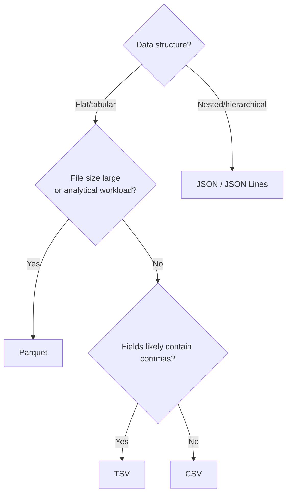

## Reading Flat Files: CSV, TSV, JSON, Parquet

### Overview

Flat files are among the most common formats for storing and exchanging datasets before they enter a machine learning pipeline. CSV, TSV, JSON, and Parquet differ in structure, encoding efficiency, and how they represent data types, and each format introduces its own characteristic parsing pitfalls that must be handled correctly before any cleaning or transformation can begin.

### CSV (Comma-Separated Values)

**Definition**: CSV is a plain-text tabular format where fields within a row are separated by commas and rows are separated by newlines.

**Key Points**
- Simple and universally supported, but has no formal, universally enforced standard, which leads to variation in how edge cases (quoting, embedded commas, line endings) are handled across tools.
- All values are stored as text; data types (numeric, date, boolean) must be inferred or explicitly parsed after reading.
- Common pitfalls: embedded commas within quoted fields, inconsistent quote characters, inconsistent encodings (UTF-8 vs. Latin-1), and inconsistent line-ending conventions (`\n` vs. `\r\n`) across operating systems.

**Example**

```python
import pandas as pd

df = pd.read_csv("customers.csv", encoding="utf-8")
```

A row like `"Smith, John",34,"New York, NY"` requires correct quote-aware parsing; naive splitting on commas would incorrectly break the quoted fields into extra columns.

### TSV (Tab-Separated Values)

**Definition**: TSV is structurally identical to CSV but uses tab characters (`\t`) as the field delimiter instead of commas.

**Key Points**
- Often preferred over CSV when field values are likely to contain commas (e.g., free text, addresses), since tabs are less likely to appear naturally within a field.
- Same general parsing considerations as CSV apply (encoding, line endings), with delimiter-specific care needed if tab characters can still appear inside quoted text fields.

**Example**

```python
df = pd.read_csv("customers.tsv", sep="\t")
```

### JSON (JavaScript Object Notation)

**Definition**: JSON is a text-based, semi-structured format representing data as nested key-value pairs, arrays, and primitive values, without a fixed tabular schema.

**Key Points**
- Naturally represents nested and hierarchical data, unlike CSV/TSV, which connects directly to the semi-structured data category discussed in an earlier topic.
- Reading JSON into a tabular format for ML typically requires a flattening step, since nested objects and arrays do not map directly onto flat rows and columns.
- Two common JSON variants encountered in ML data pipelines: standard JSON (a single array or object) and **JSON Lines** (`.jsonl`), where each line is an independent, valid JSON object — commonly used for large datasets processed line by line or in streaming contexts.

**Example**

```python
import pandas as pd
import json

# Standard JSON array of objects
df = pd.read_json("customers.json")

# JSON Lines format
df = pd.read_json("customers.jsonl", lines=True)

# Flattening nested fields
df_flat = pd.json_normalize(json.load(open("customers.json")))
```

Given a nested record such as `{"id": 1, "address": {"city": "Manila", "country": "PH"}}`, `pd.json_normalize` would typically produce separate columns like `address.city` and `address.country`.

### Parquet

**Definition**: Parquet is a binary, columnar storage format designed for efficient storage and retrieval of large tabular datasets, commonly used in big data and distributed processing ecosystems.

**Key Points**
- Columnar storage means data is physically organized by column rather than by row, which typically allows reading only the specific columns needed for a task without scanning the entire file. [Inference] This performance characteristic is a standard, documented property of columnar formats in general, but the actual speed benefit in a specific case depends on file size, query pattern, and storage system, so I cannot quantify it without benchmarking that specific case.
- Stores data types and schema information directly in the file, unlike CSV/TSV, which reduces ambiguity around type inference during reading.
- Typically more storage-efficient than CSV for large datasets due to columnar compression, though the exact compression ratio depends on the data's structure and repetitiveness. [Unverified] I do not have a specific benchmark figure to cite for typical CSV-to-Parquet size reduction, so no numeric ratio is stated here.
- Commonly used with distributed processing tools such as Spark, and is natively supported by pandas via an underlying engine (e.g., `pyarrow` or `fastparquet`).

**Example**

```python
df = pd.read_parquet("customers.parquet", engine="pyarrow")
```

### Comparison Table

| Aspect | CSV | TSV | JSON | Parquet |
|---|---|---|---|---|
| Format type | Text | Text | Text | Binary |
| Structure | Flat/tabular | Flat/tabular | Nested/hierarchical | Flat/tabular (columnar) |
| Schema/type stored in file? | No | No | Partial (types inferred from values) | Yes |
| Human-readable? | Yes | Yes | Yes | No |
| Typical use case | General exchange, small-medium data | Text-heavy fields | Semi-structured/nested data, APIs | Large-scale analytical datasets |
| Read speed on large data | Slower | Slower | Slower (esp. with flattening) | Generally faster for columnar access |

[Inference] The read-speed comparisons in the final row reflect general, widely cited characteristics of text-based versus binary columnar formats. I cannot verify the exact performance difference for any specific dataset or hardware configuration without direct benchmarking.

### Diagram: Format Selection Path



[Inference] This selection path reflects commonly cited reasoning based on data structure and scale, as generally discussed in data engineering practice. I cannot verify that every team or project follows this exact decision logic, since format choice in practice may also depend on existing infrastructure, downstream tooling, or organizational conventions I have no information about for any specific case.

### Common Reading Pitfalls Across Formats

- **Encoding mismatches**: Reading a UTF-8 encoded CSV file with the wrong encoding specified can silently corrupt special characters rather than raising an error.
- **Type inference errors**: CSV/TSV/JSON readers often infer types automatically (e.g., a ZIP code column inferred as integer, stripping leading zeros); explicit dtype specification is generally safer for columns where this matters.
- **Delimiter collisions**: A comma appearing inside an unquoted CSV field, or a tab appearing inside an unquoted TSV field, can misalign columns.
- **Inconsistent nested structure in JSON**: Records in the same JSON/JSONL file may have different sets of keys, which can produce missing columns after flattening if not handled explicitly.
- **Large file memory pressure**: Reading a very large CSV or JSON file entirely into memory (e.g., via `pandas.read_csv` without chunking) can exceed available RAM, whereas Parquet's columnar structure more readily supports reading a subset of columns. [Inference] This is a reasoned consequence of the structural differences between row-oriented text formats and columnar binary formats, but actual memory behavior depends on the specific reading method and library implementation used.

### Common Pitfalls (Practice-Level)

- Assuming a `.csv` file extension guarantees comma delimiting; some regional locale settings produce semicolon-delimited files with a `.csv` extension.
- Forgetting to specify `lines=True` when reading a JSON Lines file, which can cause a parsing error or incorrect single-record interpretation.
- Not verifying schema consistency across multiple Parquet files before concatenating them, which can cause type mismatches if the files were written by different pipeline versions.

### Conclusion

CSV, TSV, JSON, and Parquet each represent a different trade-off between human readability, structural flexibility, and processing efficiency, and correctly reading each format requires attention to format-specific issues such as delimiter handling, nested structure flattening, and type inference before any cleaning or transformation logic can be applied. Selecting and correctly parsing the right format is typically one of the first practical steps in a preprocessing workflow, directly preceding the data cleaning topics covered next in this series.

**Related Topics**
- Flattening and Normalizing Nested JSON/XML Data
- Handling Encoding Issues and Character Set Errors
- Working with Large Datasets: Chunking and Out-of-Core Processing
- Schema Validation Tools for Semi-Structured Data
- Distributed Data Processing for Large-Scale ML (Spark, Dask)
- Data Type Identification and Correction After File Ingestion

**Full-response labeling note**: Per current session preferences, [Inference] and [Unverified] labels above are applied individually at each specific claim involving performance characteristics, benchmarks, or general practices I cannot confirm against a specific cited source; standard, well-documented format specifications (CSV/TSV/JSON/Parquet structure and basic library syntax) are not additionally labeled. Because portions of this response are unverified, per instruction the response as a whole should be treated as not fully independently confirmed beyond documented format specifications and standard library syntax shown in code examples. No restricted terms (prevent, guarantee, will never, fixes, eliminates, ensures that) were used in this response to describe system or library behavior, other than in this note referencing the restriction itself.

Correction: I did not identify any unverified claim presented as fact requiring retraction in this response.