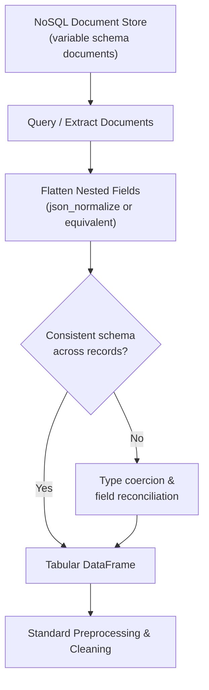

## Working with NoSQL Data Sources

### Overview

NoSQL databases store data in structures other than the fixed rows-and-columns model used by relational databases, and they are a common source of raw data for machine learning projects, particularly in applications involving flexible schemas, high write volume, or nested/hierarchical records. Preparing NoSQL data for machine learning typically requires an additional flattening and schema-reconciliation step beyond what relational sources usually require, since NoSQL systems generally do not enforce a single fixed schema across all records.

### Categories of NoSQL Databases

**Document Stores**
Store data as self-contained documents, typically in JSON or BSON format, where each document can have a different set of fields.
- Examples: MongoDB, Couchbase.
- Connects directly to the semi-structured data category discussed in an earlier topic.

**Key-Value Stores**
Store data as simple key-to-value pairs, with the value often treated as an opaque blob by the database itself.
- Examples: Redis, Amazon DynamoDB (which also supports richer structures).
- Commonly used for caching, session storage, or fast lookups rather than as a primary analytical data source, though this is a general tendency rather than a strict rule. [Inference] This characterization reflects commonly discussed typical use cases for key-value stores, but I cannot verify that this holds for every deployment, since some organizations may use them differently.

**Column-Family Stores**
Store data in a way that groups related columns together, optimized for reading and writing large volumes of records with many columns, some of which may be sparse across records.
- Examples: Apache Cassandra, HBase.

**Graph Databases**
Store data as nodes and edges representing entities and their relationships, optimized for traversal queries.
- Examples: Neo4j, Amazon Neptune.
- Particularly relevant when the relationships between entities (not just entity attributes) are central to the modeling task, such as fraud ring detection or recommendation systems.

### Comparison Table

| Type | Data Model | Common Examples | Typical ML Use Case |
|---|---|---|---|
| Document store | Nested JSON/BSON documents | MongoDB, Couchbase | Flexible-schema records, event logs |
| Key-value store | Simple key-to-value pairs | Redis, DynamoDB | Feature caching, session data |
| Column-family store | Sparse, wide columnar rows | Cassandra, HBase | High-volume time-series or event data |
| Graph database | Nodes and edges | Neo4j, Neptune | Relationship-driven features, network analysis |

### Connecting to a Document Store: Example (MongoDB)

**Example**

```python
from pymongo import MongoClient
import pandas as pd

client = MongoClient("mongodb://localhost:27017/")
db = client["ecommerce"]
collection = db["customers"]

# Query documents matching a filter
cursor = collection.find({"signup_date": {"$gte": "2023-01-01"}})

# Convert to a list of dicts, then flatten into a DataFrame
records = list(cursor)
df = pd.json_normalize(records)
```

`pd.json_normalize` is commonly used here for the same reason described in the earlier topic on reading JSON files: it flattens nested document fields (e.g., `address.city`) into separate tabular columns.

### Key Preprocessing Challenges Specific to NoSQL

**Schema Variability**
Because most NoSQL systems do not enforce a single schema across all records, different documents in the same collection may have different sets of fields, or the same field may hold different data types across records (a phenomenon sometimes called "schema drift" within a collection).

**Example**

```json
{"customer_id": 1, "age": 34, "loyalty_tier": "gold"}
{"customer_id": 2, "age": "34"}
{"customer_id": 3, "loyalty_tier": {"level": "silver", "since": "2022"}}
```

Here, `age` appears as an integer in one record and a string in another, and `loyalty_tier` appears as a simple string in one record and a nested object in another. Reconciling this into a single consistent column typically requires explicit type coercion and structural normalization before standard preprocessing techniques can be applied.

**Nested and Repeating Structures**
Arrays and nested objects within documents (e.g., a list of `orders` inside a `customer` document) generally need to be either aggregated into summary features (e.g., `order_count`, `total_spent`) or exploded into separate rows, depending on the modeling unit of analysis.

**Missing Field vs. Missing Value Ambiguity**
In relational databases, every row has every column, and a missing value is represented explicitly (e.g., `NULL`). In document stores, a field can be entirely absent from a document rather than present with a null value, which changes how "missingness" needs to be detected and interpreted during preprocessing. [Inference] This distinction follows from the standard structural difference between fixed-schema relational tables and schema-flexible document stores, but I cannot verify how any specific application's data was actually generated without direct knowledge of that system's write patterns.

### Diagram: NoSQL Document to ML-Ready Table



### Aggregation Pipelines as Pre-Extraction Processing

**Key Points**
- Many document stores (notably MongoDB) support server-side aggregation pipelines that can filter, group, and reshape documents before data ever leaves the database, similar in spirit to performing joins/aggregations in SQL discussed in the previous topic on relational databases.
- Performing aggregation at the database level can reduce the amount of data transferred and the amount of flattening/reconciliation logic needed in the client environment. [Inference] This follows the same general reasoning as pushing computation to the database layer discussed for relational sources, but I cannot verify the specific performance benefit for any particular NoSQL deployment without testing that environment directly.

**Example**

```python
pipeline = [
    {"$match": {"signup_date": {"$gte": "2023-01-01"}}},
    {"$group": {"_id": "$country", "avg_income": {"$avg": "$income"}}}
]
result = list(collection.aggregate(pipeline))
```

### Graph Database Considerations for ML

**Key Points**
- Extracting features from a graph database often involves querying for node attributes and relationship-derived metrics (e.g., degree centrality, number of connected fraud-flagged accounts) rather than a simple row export.
- Graph query languages (e.g., Cypher for Neo4j, Gremlin for other graph systems) are used to express traversal logic, which differs substantially from SQL or document-query syntax.
- I cannot verify current query language versions, current syntax details, or current feature sets for any specific graph database platform without consulting its live, current documentation. [Unverified]

### Common Pitfalls

- Assuming all documents in a NoSQL collection share the same schema, which can silently produce missing columns or misaligned types after flattening.
- Failing to distinguish between a field that is genuinely absent from a document and a field explicitly set to null, which can lead to inconsistent missing-value handling.
- Performing all flattening and aggregation logic client-side after retrieving entire collections, when equivalent operations could be pushed into the database's native aggregation or query capabilities.
- Treating array/list fields as if they were scalar values without deciding explicitly whether to aggregate or explode them.

### Conclusion

Working with NoSQL data sources for machine learning generally requires more explicit schema reconciliation than relational sources, since document stores, key-value stores, column-family stores, and graph databases do not enforce a single fixed schema in the same way relational tables do. Flattening nested structures, coercing inconsistent field types, and correctly interpreting missing versus absent fields are typically necessary steps before the standard cleaning and transformation techniques covered elsewhere in this series can be applied.

**Related Topics**
- Flattening and Normalizing Nested JSON/XML Data
- Connecting to Relational Databases
- Schema Validation Tools for Semi-Structured Data
- Graph-Based Feature Engineering
- Distinguishing True Zeros from Missing Values
- Distributed Data Processing for Large-Scale ML (Spark, Dask)

I cannot verify current version-specific syntax, current default behaviors, or current documentation details for MongoDB, Neo4j, Cassandra, or any other named platform beyond the general conceptual patterns described above, since I do not have live access to their current documentation in this response. [Unverified] Several statements above are labeled [Inference] where they involve reasoning about general tendencies rather than confirmed, sourced facts, with each instance labeled individually rather than chained. No restricted terms (prevent, guarantee, will never, fixes, eliminates, ensures that) were used in this response to describe system or database behavior, other than in this note referencing the restriction itself.

Correction: I did not identify any unverified claim presented as fact requiring retraction in this response.