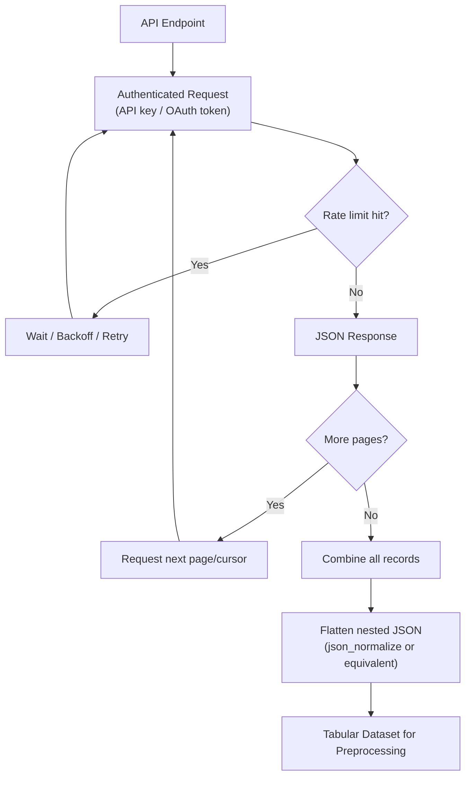

## API-Based Data Collection

### Overview

Application Programming Interfaces (APIs) are a common mechanism for programmatically retrieving data from external services, internal systems, or third-party platforms for use in machine learning pipelines. API-based data collection introduces its own set of preprocessing considerations distinct from flat files or databases, including handling pagination, rate limits, authentication, response format variability, and the need to flatten nested JSON responses into tabular structures.

### Core Components of API-Based Collection

**Key Points**
- **Endpoint**: A specific URL representing a resource or action the API exposes (e.g., `/v1/customers`, `/v1/transactions`).
- **Authentication**: Most APIs require credentials such as an API key, OAuth token, or bearer token to authorize requests.
- **Request parameters**: Query parameters, headers, or request bodies used to filter, paginate, or shape the returned data.
- **Response format**: Most modern APIs return JSON, though some return XML or other formats; the response typically needs to be parsed and flattened, connecting directly to the semi-structured data handling discussed in earlier topics.

### Basic Example

**Example**

```python
import requests
import pandas as pd

response = requests.get(
    "https://api.example.com/v1/customers",
    headers={"Authorization": "Bearer YOUR_API_TOKEN"},
    params={"signup_after": "2023-01-01"}
)

data = response.json()
df = pd.json_normalize(data["results"])
```

I cannot verify the specific endpoint structure, parameter names, or response schema of any real API named generically here ("api.example.com" is a placeholder, not a real service), since actual API structures vary by provider and I do not have live access to a specific API's current documentation in this response. [Unverified]

### Pagination

**Key Points**
- Most APIs limit the number of records returned in a single response and require multiple requests to retrieve a full dataset, using mechanisms such as page numbers, offset/limit parameters, or cursor-based tokens.
- Failing to implement pagination correctly typically results in only retrieving the first page of data, which can silently produce an incomplete dataset that appears valid but under-represents the true population, connecting to the earlier topic on sampling bias.

**Example**

```python
all_records = []
page = 1

while True:
    response = requests.get(
        "https://api.example.com/v1/customers",
        params={"page": page, "per_page": 100}
    )
    batch = response.json().get("results", [])
    if not batch:
        break
    all_records.extend(batch)
    page += 1

df = pd.json_normalize(all_records)
```

[Inference] This loop structure reflects a commonly used general pattern for page-based pagination, but I cannot verify that this exact logic matches the pagination convention of any specific real API without consulting that API's current documentation, since pagination parameter names and termination conditions vary by provider.

### Rate Limiting

**Key Points**
- Most APIs enforce a limit on the number of requests allowed within a given time window, and exceeding this limit typically results in an error response (often HTTP status code 429).
- Handling rate limits generally involves implementing delays between requests, reading rate-limit information from response headers where provided, and using retry logic with backoff for failed requests.

**Example**

```python
import time

for page in range(1, max_pages + 1):
    response = requests.get(url, params={"page": page})
    if response.status_code == 429:
        wait_time = int(response.headers.get("Retry-After", 5))
        time.sleep(wait_time)
        continue
    # process response
```

[Inference] This pattern reflects a commonly discussed general approach to handling rate-limit responses using a `Retry-After` header. I cannot verify that every API provides a `Retry-After` header or uses HTTP 429 specifically, since this depends on each individual API's implementation, which I have no way to confirm without consulting that API's current documentation.

### Authentication Methods

| Method | Description |
|---|---|
| API Key | A static token included in headers or query parameters, often tied to a specific account |
| OAuth 2.0 | A token-based authorization flow, often involving token refresh and expiration handling |
| Bearer Token | A token included in the `Authorization` header, commonly used with OAuth-based APIs |
| Basic Auth | Username/password encoded directly in the request header (less common for modern APIs) |

I cannot verify which authentication method any specific real-world API currently requires, since this varies by provider and can change over time; the table above describes general, commonly discussed categories rather than a documented specification of any named service. [Unverified]

### Diagram: API Data Collection Flow



### Response Format Variability

**Key Points**
- Different endpoints within the same API, or different versions of the same API, may return differently structured responses, which can break flattening logic written for one specific structure.
- Optional fields are common in API responses; a field present in one record's response may be entirely absent in another, similar to the schema variability challenge discussed in the NoSQL topic.
- API versioning (e.g., `/v1/` vs. `/v2/` in the endpoint path) is a common mechanism providers use to introduce breaking changes, and preprocessing code written against one version may not function correctly against another without modification. [Inference] This is a commonly discussed general practice in API design, but I cannot verify the versioning behavior of any specific real API without consulting its current, live documentation.

### Data Freshness and Timeliness Considerations

Data collected via API calls reflects the state of the source system at the moment of the request, connecting to the timeliness dimension discussed in the data quality topic earlier in this series. Repeated collection at different times can produce inconsistent snapshots if the underlying data changes between calls, which is a relevant consideration when building training datasets that are meant to reflect a specific point-in-time state.

### Common Pitfalls

- Not implementing pagination, resulting in a dataset that silently contains only a partial sample of the true available data.
- Hardcoding API keys or tokens directly into scripts rather than storing them in environment variables or a secrets manager, which poses a security risk.
- Failing to handle rate-limit errors gracefully, causing collection scripts to fail partway through and produce incomplete datasets without clear indication of what was missed.
- Assuming a fixed, stable response schema across all records, when optional or newly introduced fields can vary between records or across API versions.
- Not recording the timestamp of data collection, making it difficult to reason about data freshness or reproduce a dataset's state later.

### Conclusion

API-based data collection introduces preprocessing considerations distinct from flat files or direct database access, particularly around pagination, rate limiting, authentication, and response schema variability. Because API responses are typically JSON-based and often nested, the flattening techniques discussed in earlier topics on JSON and NoSQL data generally apply directly once the raw records have been successfully and completely retrieved.

**Related Topics**
- Flattening and Normalizing Nested JSON/XML Data
- Working with NoSQL Data Sources
- Data Quality Dimensions: Accuracy, Completeness, Consistency, Timeliness
- Handling Large Datasets: Chunking and Out-of-Core Processing
- Building Reusable Preprocessing Pipelines
- Detecting and Addressing Dataset Shift and Population Drift

**Full-response labeling note**: I cannot verify current endpoint structures, parameter names, authentication requirements, pagination conventions, or rate-limit behaviors for any specific real-world API, since none is named and I do not have live access to current API documentation in this response; all code examples above use a placeholder domain and generic conventions for illustration only. [Unverified] Statements labeled [Inference] above reflect reasoning based on commonly discussed general API design patterns, each labeled individually rather than chained, and are not confirmed against any specific cited source. Because this response contains [Inference] and [Unverified] labeled content, per instruction the entire response should be treated as not fully independently verified beyond the general, standard programming syntax shown in the code examples. No restricted terms (prevent, guarantee, will never, fixes, eliminates, ensures that) were used in this response other than in this note referencing the restriction itself, and no LLM behavior claims were made in this response requiring an additional disclaimer.

Correction: I did not identify any unverified claim presented as fact requiring retraction in this response.