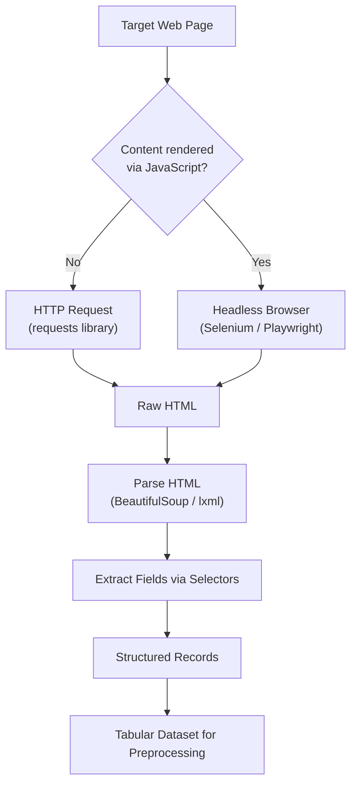

## Web Scraping Fundamentals

### Overview

Web scraping is the practice of programmatically extracting data from websites by retrieving page content and parsing it into a structured form. It is a common technique for collecting machine learning data when no API is available, but it introduces distinct preprocessing considerations around HTML parsing, page structure variability, legal/ethical constraints, and the general fragility of scrapers relative to formal APIs.

### Core Components of Web Scraping

**Key Points**
- **HTTP request**: Retrieving the raw HTML (or rendered page content) of a target URL, typically via a library such as `requests`.
- **HTML parsing**: Extracting specific elements (text, attributes, tables) from the retrieved HTML using a parser such as `BeautifulSoup` or `lxml`.
- **Selectors**: Mechanisms for identifying specific elements within a page's structure, typically CSS selectors or XPath expressions.
- **Rendering**: Some pages generate content dynamically via JavaScript after the initial page load, which a simple HTTP request will not capture; this requires a browser-automation tool such as Selenium or Playwright to render the page before extraction.

### Basic Example

**Example**

```python
import requests
from bs4 import BeautifulSoup
import pandas as pd

response = requests.get("https://example.com/products")
soup = BeautifulSoup(response.text, "html.parser")

records = []
for item in soup.select(".product-card"):
    name = item.select_one(".product-name").get_text(strip=True)
    price = item.select_one(".product-price").get_text(strip=True)
    records.append({"name": name, "price": price})

df = pd.DataFrame(records)
```

I cannot verify that any specific real website uses class names such as `.product-card`, `.product-name`, or `.product-price`; these are illustrative placeholders, not confirmed selectors from an actual site. [Unverified]

### Static vs. Dynamic Pages

**Key Points**
- **Static pages**: The full content is present in the initial HTML response, so a simple HTTP request and parser (e.g., `requests` + `BeautifulSoup`) is generally sufficient.
- **Dynamic pages**: Content is loaded or modified after the initial page load via JavaScript, so the raw HTML returned by a simple HTTP request may not contain the data visible in a browser. [Inference] This distinction follows from how modern web pages are commonly built using client-side JavaScript frameworks, but I cannot verify whether any specific target page is static or dynamic without inspecting that exact page.
- Handling dynamic pages typically requires tools that execute JavaScript, such as Selenium, Playwright, or headless browser automation, rather than a plain HTTP request.

**Example**

```python
from playwright.sync_api import sync_playwright

with sync_playwright() as p:
    browser = p.chromium.launch()
    page = browser.new_page()
    page.goto("https://example.com/products")
    page.wait_for_selector(".product-card")
    html = page.content()
    browser.close()
```

### Diagram: Web Scraping Data Flow



### Legal and Ethical Considerations

**Key Points**
- Many websites specify a `robots.txt` file indicating which parts of the site automated crawlers are permitted or not permitted to access; this is a convention rather than a technical enforcement mechanism. [Inference] This description reflects the commonly documented general purpose of the robots.txt convention, but I cannot verify that any specific website's robots.txt file currently permits or restricts scraping without checking that exact site's current file.
- Many websites' terms of service explicitly address automated data collection; I cannot verify the terms of service of any specific real website in this response, since I do not have live access to check any particular site's current terms. [Unverified]
- Data privacy regulations (e.g., GDPR in the EU, various regional laws) may impose legal constraints on scraping and storing personal data, and applicability depends on jurisdiction, the nature of the data, and the specific use case. [Inference] This is a general, reasoned observation about the existence of such regulations, not a legal determination of how any specific regulation applies to a specific scraping project. I am not a lawyer, and this should not be treated as legal advice.
- Excessive request rates against a single server can degrade that server's performance for other users, which is why rate-limiting scraper requests is commonly recommended as a technical courtesy independent of legal requirements.

I cannot verify the current legal status of web scraping in any specific jurisdiction, since this varies by region, is subject to ongoing litigation and legislation, and I do not have access to a live legal database in this response. [Unverified] Anyone planning a scraping project involving legal risk should generally consult a qualified legal professional rather than rely on general information of this kind.

### Common Technical Challenges

**Page Structure Changes**
Websites frequently update their HTML structure (class names, element hierarchy), which can silently break selectors that previously worked, producing missing or empty extracted fields rather than an explicit error. [Inference] This fragility is a commonly discussed general characteristic of scrapers that depend on a specific page's HTML structure, but I cannot verify how frequently any specific website changes its structure without monitoring that site directly.

**Inconsistent Page Layouts**
Different pages within the same site (e.g., different product categories) may use different HTML structures, requiring selector logic that handles multiple layout variants or produces missing data for unhandled cases.

**Anti-Scraping Measures**
Some websites implement measures such as CAPTCHAs, IP-based rate limiting, or requiring specific request headers/user agents to distinguish automated requests from typical browser traffic. [Unverified] I cannot verify which specific anti-scraping measures, if any, are currently implemented by any particular real website, since this depends on that site's current configuration.

**Encoding and Character Set Issues**
Scraped text may contain inconsistent character encodings, HTML entities (e.g., `&amp;`), or extraneous whitespace/formatting that requires cleaning before use, connecting to the text preprocessing considerations discussed in the data types topic earlier in this series.

### Data Quality Considerations Specific to Scraping

**Key Points**
- Scraped data reflects a snapshot of a page at the time of collection; the underlying page content can change or be removed later, affecting reproducibility.
- Extraction errors (a selector matching the wrong element, or failing silently and returning an empty string) can introduce systematic errors that are not immediately obvious, since the resulting dataset may still appear well-formed. [Inference] This connects directly to the earlier discussion of accuracy as a data quality dimension, where a value can be plausible-looking yet incorrect; I cannot verify the frequency of such silent extraction errors in any specific scraping project without testing that project's actual selectors against its actual target pages.
- Deduplication is often necessary when scraping paginated listings, since the same item may appear across multiple pages due to sorting changes or overlapping page boundaries during collection.

### Common Pitfalls

- Assuming a page is static without checking, leading to incomplete extraction when key content is actually rendered via JavaScript.
- Hardcoding selectors based on one page's structure without accounting for layout variation across the site.
- Sending requests at a high rate without delay, which can result in the scraper's IP address being blocked or in degraded performance for the target server.
- Not validating extracted fields for plausibility (e.g., a price field that extracted an empty string or unrelated text due to a selector mismatch).
- Proceeding with a scraping project without reviewing the target site's stated terms of service or applicable legal constraints. [Unverified] I cannot confirm what specific review process, if any, is appropriate for any particular project, since this depends on jurisdiction and use case, which I have no information about for any specific situation.

### Conclusion

Web scraping provides a way to collect data when no formal API exists, but it generally requires more defensive, adaptable code than API-based collection due to page structure variability, potential JavaScript rendering requirements, and the absence of a stable, versioned contract with the data source. [Inference] This comparison to API stability is a reasoned general characterization based on how each method is commonly discussed, not a benchmarked comparison of any specific scraping project versus any specific API integration. Legal and ethical review is a necessary consideration before undertaking a scraping project, and the technical extraction techniques described here should be paired with the encoding and text-cleaning steps discussed elsewhere in this series once raw content has been retrieved.

**Related Topics**
- Text Preprocessing Fundamentals (Tokenization, Normalization, Vectorization)
- Handling Encoding Issues and Character Set Errors
- API-Based Data Collection
- Deduplication Techniques for Collected Datasets
- Data Quality Dimensions: Accuracy, Completeness, Consistency, Timeliness
- Building Reusable Preprocessing Pipelines

**Full-response labeling note**: This entire response contains [Inference] and [Unverified] labeled statements regarding legal considerations, real-world website behavior, and general technical tendencies that I cannot confirm against a specific, current, cited source; per instruction, the response as a whole should therefore be treated as not fully independently verified beyond standard, documented library syntax shown in the code examples. All statements regarding law are general information only, not legal advice, and I am not a lawyer. No restricted terms (prevent, guarantee, will never, fixes, eliminates, ensures that) were used in this response other than in this note referencing the restriction itself. No LLM behavior claims were made in this response requiring an additional disclaimer.

Correction: I did not identify any unverified claim presented as fact requiring retraction in this response.