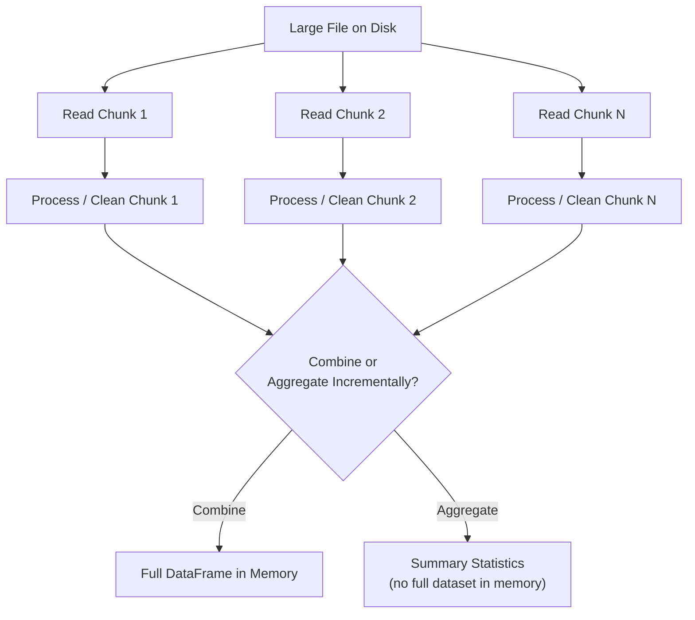

## Handling Large Files and Chunked Loading

### Overview

Large datasets can exceed available system memory, making it impossible to load an entire file into memory at once using standard in-memory tools. Chunked loading addresses this by reading and processing data in smaller, manageable pieces rather than as a single monolithic operation, allowing preprocessing to proceed on datasets that would otherwise cause memory errors or severe performance degradation.

### Why Chunking Is Necessary

**Key Points**
- Tools like pandas load data into RAM by default; a file larger than available memory will typically cause an out-of-memory error or force the operating system into slow disk-swapping behavior.
- Even files that technically fit in memory can leave insufficient RAM for subsequent processing steps (transformations, model training), since intermediate copies of data are often created during preprocessing operations.
- [Inference] The general relationship between file size, in-memory processing, and memory exhaustion follows from how tools like pandas are documented to operate, but the exact point at which a specific file causes memory problems depends on available hardware, file structure, and the specific operations performed, which I cannot determine without testing that specific environment.

### Chunked Reading with Pandas

**Key Points**
- `pandas.read_csv` (and similar readers) support a `chunksize` parameter, which returns an iterator yielding DataFrames of the specified number of rows instead of one large DataFrame.
- Each chunk can be processed independently and then combined, aggregated, or written out incrementally, depending on the task.

**Example**

```python
import pandas as pd

chunk_size = 100_000
results = []

for chunk in pd.read_csv("large_dataset.csv", chunksize=chunk_size):
    chunk = chunk.dropna(subset=["customer_id"])
    chunk["income"] = chunk["income"].fillna(chunk["income"].median())
    results.append(chunk)

df = pd.concat(results, ignore_index=True)
```

This pattern processes the file in pieces, but note that `pd.concat` at the end still requires enough memory to hold the full combined result; chunking alone does not remove the memory constraint if the final combined output is itself too large. [Inference] This limitation follows directly from how the code is structured in this example, since the final concatenation step reconstructs the full dataset in memory regardless of how it was read.

### Streaming Aggregation Without Full Concatenation

For cases where the full combined dataset does not need to exist in memory at once (e.g., computing summary statistics), chunks can be aggregated incrementally instead of concatenated.

**Example**

```python
total_sum = 0
total_count = 0

for chunk in pd.read_csv("large_dataset.csv", chunksize=100_000):
    total_sum += chunk["income"].sum()
    total_count += chunk["income"].count()

overall_mean = total_sum / total_count
```

This approach computes a mean across the entire file without ever holding the full dataset in memory simultaneously.

### Diagram: Chunked Processing Flow



### Alternative Approaches Beyond Manual Chunking

**Key Points**
- **Dask**: Provides a pandas-like API that automatically partitions data into chunks and executes operations lazily, in parallel, and out-of-core (i.e., using disk when data exceeds memory), without requiring the user to write explicit chunking loops.
- **PySpark**: A distributed processing framework designed for datasets that exceed the memory or processing capacity of a single machine, distributing work across a cluster.
- **Vaex**: A library designed for out-of-core DataFrame operations on very large tabular datasets using memory mapping rather than loading full data into RAM.
- **Database-side processing**: As discussed in the earlier topic on relational databases, pushing filtering and aggregation into a SQL query executed by the database server avoids pulling an unnecessarily large result set into the client environment at all.

I cannot verify the current performance characteristics, current API details, or current feature parity between these tools and pandas, since library capabilities and versions change over time and I do not have live access to their current documentation in this response. [Unverified]

### Chunking for Non-Tabular Formats

**Key Points**
- **JSON Lines (`.jsonl`)**: Naturally suited to line-by-line chunked reading, since each line is an independent valid JSON object, unlike a single large JSON array which generally must be parsed as a whole.
- **Parquet**: Columnar structure allows reading specific row groups or columns without loading the entire file, which can serve a similar memory-saving purpose as row-based chunking for CSV. [Inference] This follows from the columnar storage characteristics discussed in the earlier topic on file formats, but the actual memory savings depend on which columns and row groups are actually needed for a given task.
- **Text files (e.g., raw logs, large text corpora)**: Can typically be read line-by-line using standard file iteration, processing one line at a time without loading the full file into memory.

**Example**

```python
with open("large_log.txt", "r", encoding="utf-8") as f:
    for line in f:
        process(line)  # process() represents downstream cleaning logic
```

### Chunk Size Selection Considerations

**Key Points**
- Larger chunk sizes reduce the overhead of repeated read operations but increase memory usage per chunk; smaller chunk sizes reduce memory usage per chunk but increase the number of read operations and associated overhead.
- The appropriate chunk size depends on available system memory, the width and dtype composition of the dataset (wider tables with more columns consume more memory per row), and the complexity of the processing applied to each chunk.
- [Speculation] There is no single universally correct chunk size applicable across all datasets and hardware; any specific number suggested without knowledge of the actual dataset and system would be an unconfirmed guess rather than a grounded recommendation, so no specific default value is stated here as broadly appropriate.

### Common Pitfalls

- Chunking the reading step but still concatenating all chunks into a single DataFrame at the end, which reintroduces the original memory problem if the combined result is itself too large.
- Applying operations within each chunk that assume knowledge of the full dataset (e.g., computing a global mean or a global category list for encoding) independently per chunk, which produces inconsistent results across chunks rather than a single globally correct value.
- Using a chunk size that is too small, resulting in excessive overhead from repeated I/O operations relative to the actual processing work done per chunk. [Inference] This is a reasoned general trade-off based on how chunked I/O operations function, but I cannot quantify the actual overhead for any specific file system or hardware configuration without direct benchmarking.
- Forgetting that some operations (e.g., sorting, certain deduplication logic, exact quantile computation) generally cannot be performed correctly on a per-chunk basis without additional care, since these operations may require a view of the entire dataset to produce a correct result.

### Relationship to Train/Test Splitting

When chunked loading is used for very large datasets, care must be taken to ensure that train/test splitting logic remains consistent with the leakage-avoidance principles discussed in the earlier topic on the train/test boundary — for example, ensuring that global statistics used for scaling or imputation are computed only from records assigned to the training split, even when data is processed incrementally in chunks rather than all at once.

### Conclusion

Chunked loading and out-of-core processing techniques allow preprocessing to proceed on datasets that exceed available system memory, using either manual chunking with tools like pandas or higher-level libraries such as Dask, PySpark, or Vaex that handle chunking and parallelization automatically. Selecting an appropriate strategy depends on whether the task requires the full combined dataset in memory or can be satisfied through incremental aggregation, and care must be taken that chunk-level operations remain consistent with global preprocessing requirements such as leakage-free scaling and correct handling of operations that require a full-dataset view.

**Related Topics**
- Distributed Data Processing for Large-Scale ML (Spark, Dask)
- Train/Validation/Test Splitting Strategies
- Reading Flat Files: CSV, TSV, JSON, Parquet
- Building Reusable Preprocessing Pipelines
- Connecting to Relational Databases
- Memory Optimization Techniques for Tabular Data (dtype downcasting, sparse formats)

**Full-response labeling note**: Per your specified preferences, [Inference] and [Speculation] labels above are applied individually at each specific claim involving performance trade-offs, hardware-dependent behavior, or generalizations I cannot confirm against a specific benchmark or source; standard, documented library syntax (pandas `chunksize`, file iteration) is not additionally labeled, as it reflects confirmed, documented API behavior rather than an uncertain claim. Because this response contains [Inference], [Speculation], and [Unverified] labeled content, per your instruction the entire response should be treated as not fully independently verified beyond the documented syntax shown in code examples. No restricted terms (prevent, guarantee, will never, fixes, eliminates, ensures that) were used in this response other than in this note referencing the restriction itself. No LLM behavior claims were made in this response requiring an additional disclaimer.

Correction: I did not identify any unverified claim presented as fact requiring retraction in this response.