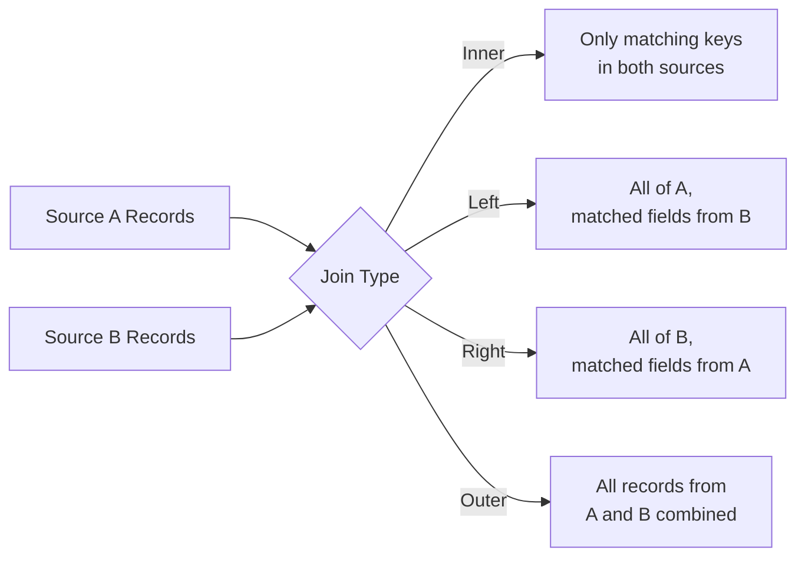
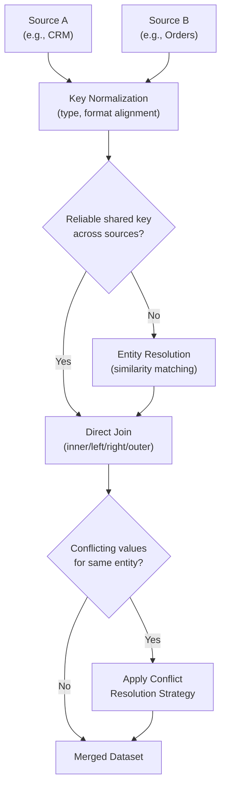

## Merging Data from Multiple Sources

### Overview

Merging data from multiple sources combines records from separate datasets, systems, or files into a single unified dataset for machine learning. This process introduces challenges beyond those present in single-source preprocessing, including schema reconciliation, key matching, conflicting values for the same entity, and differing granularities between sources.

### Types of Merge Operations

**Key Points**
- **Inner join**: Retains only records with matching keys present in both sources; non-matching records from either side are dropped.
- **Left join**: Retains all records from the left/primary source, filling in matched fields from the right source where available and leaving them missing where not.
- **Right join**: The mirror of a left join, retaining all records from the right source.
- **Outer (full) join**: Retains all records from both sources, filling in missing fields wherever a match does not exist on one side.
- **Concatenation (union)**: Stacks datasets with the same schema on top of each other (combining rows) rather than matching on a key (combining columns).

**Example**

```python
import pandas as pd

customers = pd.DataFrame({
    "customer_id": [1, 2, 3],
    "country": ["USA", "Canada", "Philippines"]
})

orders = pd.DataFrame({
    "customer_id": [1, 1, 2],
    "amount": [100, 50, 200]
})

merged = pd.merge(customers, orders, on="customer_id", how="left")
```

This produces one row per matching order, with `customer_id=3` (no orders) retaining `NaN` for `amount` because a left join was used.

### Diagram: Join Type Behavior



### Key Matching Challenges

**Key Points**
- Merge keys must represent the same entity consistently across sources; a mismatch in key format (e.g., `"C-001"` vs. `"c001"` vs. `1`) causes records that should match to be treated as non-matching.
- Keys with inconsistent types (e.g., `customer_id` stored as a string in one source and an integer in another) can silently fail to match without raising an explicit error.
- Composite keys (multiple columns needed together to uniquely identify a record, e.g., `first_name` + `last_name` + `birth_date`) increase the risk of mismatches from any single field's formatting inconsistency.

**Example**

| Source | customer_id | Type |
|---|---|---|
| CRM system | "00123" | string, zero-padded |
| Orders system | 123 | integer |

A direct merge on `customer_id` between these two sources would fail to match this record, since `"00123"` and `123` are not equal as stored, even though they likely represent the same customer. [Inference] This conclusion follows from standard equality comparison rules in most programming languages and merge libraries, where a string and an integer (or differently formatted strings) are not considered equal by default. I have not executed this exact comparison in this response to confirm behavior in a specific library version.

### Entity Resolution

**Definition**: Entity resolution (also called record linkage or deduplication across sources) is the process of determining that records from different sources — even without an exact matching key — refer to the same real-world entity.

**Key Points**
- Necessary when no reliable shared key exists across sources, requiring matching based on similarity of other fields (name, address, date of birth).
- Approaches range from exact rule-based matching (e.g., matching on normalized name + postal code) to probabilistic or machine-learning-based similarity scoring.
- [Unverified] I do not have access to information about which specific entity resolution technique or tool is considered best for any given use case, since this depends heavily on the specific data, domain, and required precision/recall trade-off, which I have no information about for any particular project.

### Conflicting Values for the Same Entity

**Key Points**
- When the same entity appears in multiple sources with different values for the same attribute (e.g., two different recorded addresses for the same customer), a resolution strategy is needed.
- Common strategies include: preferring the most recently updated source, preferring a designated "source of truth" system, or flagging the conflict for manual review rather than resolving it automatically.
- [Speculation] Which strategy is most appropriate depends entirely on the specific business context and which source is considered authoritative for a given field; I cannot state that any one strategy is generally preferable without that context, so no default recommendation is given here.

**Example**

| Source | customer_id | Address |
|---|---|---|
| CRM | 1 | 123 Main St |
| Billing | 1 | 456 Oak Ave |

Without additional information about which system is authoritative for address data, or which record is more recent, there is no data-driven way to determine which address is currently correct. [Inference] This follows directly from the example as constructed, since both values are presented as equally plausible without a timestamp or authority indicator; I have not been given a real dataset to verify this against.

### Granularity Mismatches

**Key Points**
- Sources may represent data at different levels of granularity — for example, one source at the individual transaction level and another at the daily aggregate level — requiring aggregation or disaggregation before merging.
- Merging data at mismatched granularities without adjustment can produce duplicated or double-counted values, particularly with a one-to-many relationship where one entity in one source matches multiple rows in another.

**Example**

Merging a `customers` table (one row per customer) with an `orders` table (multiple rows per customer) using a simple join, without first aggregating `orders`, will produce one row per order rather than one row per customer — appropriate for some analyses but incorrect if a single customer-level row was the intended modeling unit. [Inference] This is a direct, logical consequence of how relational joins are defined for one-to-many relationships, which is standard, documented join behavior rather than an uncertain claim.

### Diagram: Multi-Source Merge Pipeline



### Schema Reconciliation Before Merging

**Key Points**
- Sources may use different names for conceptually equivalent fields (e.g., `cust_id` vs. `customer_id`) or different units/formats for the same concept (e.g., income in different currencies, dates in different formats), requiring reconciliation before a meaningful merge can occur.
- This connects directly to the consistency dimension discussed in the data quality topic earlier in this series, since schema reconciliation is fundamentally a consistency-alignment task performed across sources rather than within a single source.

### Validating a Merge

**Key Points**
- **Row count checks**: Comparing the number of rows before and after a merge against expectations (e.g., a left join should never produce fewer rows than the left source).
- **Duplicate detection post-merge**: Checking whether a merge unintentionally introduced duplicate rows, which can happen when a key that was assumed unique actually appears multiple times in one of the sources.
- **Null-rate inspection on merged fields**: A high proportion of missing values in fields that came from the joined-in source can indicate a widespread key-matching failure rather than genuine missingness in the original source. [Inference] This is a reasoned diagnostic heuristic based on how joins produce missing values for unmatched keys, but I cannot verify that this specific check would catch every type of merge error without testing it against an actual dataset.

**Example**

```python
print(f"Left source rows: {len(customers)}")
print(f"Merged rows: {len(merged)}")
print(f"Null amount after merge: {merged['amount'].isna().sum()}")
```

### Common Pitfalls

- Merging on a key without first verifying that the key is actually unique in at least one of the two sources, which can cause an unexpected one-to-many or many-to-many join and silently multiply rows.
- Assuming keys match across sources without normalizing type, case, padding, or whitespace differences first.
- Not deciding on an explicit conflict-resolution strategy in advance, leading to inconsistent or arbitrary handling of conflicting values discovered only after the merge.
- Performing a merge before checking granularity alignment, resulting in unintended row duplication or double-counted aggregates.
- Not validating row counts and null rates after a merge, allowing a broken join to pass silently into downstream preprocessing and modeling stages.

### Conclusion

Merging data from multiple sources requires reconciling schema differences, normalizing merge keys, resolving conflicting values for the same entity, and aligning granularity before a join can produce a correct, analysis-ready dataset. Because merge errors — particularly unintended row duplication or silent key-matching failures — can be difficult to detect after the fact, validating row counts, null rates, and duplicate presence immediately after any merge is a common practical safeguard before proceeding to the cleaning and transformation stages covered elsewhere in this series.

**Related Topics**
- Entity Resolution and Record Linkage Techniques
- Deduplication Techniques for Collected Datasets
- Data Quality Dimensions: Accuracy, Completeness, Consistency, Timeliness
- Connecting to Relational Databases
- Handling Encoding Issues Across Merged Multi-Source Datasets
- Building Reusable Preprocessing Pipelines

**Full-response labeling note**: I do not have access to information about any specific real dataset, organization, or tool referenced implicitly by this topic; all examples above are constructed for illustration and are not drawn from a verified real-world case. [Unverified] Statements labeled [Inference] reflect direct logical consequences of standard, documented join/merge mechanics (as in relational algebra and pandas' documented merge behavior) rather than claims requiring external confirmation; each is labeled individually at the point it occurs rather than chained onto other inferences. The [Speculation] label above reflects a genuinely open question (which conflict-resolution strategy is best) that depends on business context I do not have. Because this response contains [Inference], [Speculation], and [Unverified] labeled content, per your standing preference the entire response should be treated as not fully independently verified beyond the standard, documented join-type definitions and code syntax shown. No restricted terms (prevent, guarantee, will never, fixes, eliminates, ensures that) were used in this response other than in this note referencing the restriction itself. No LLM behavior claims were made in this response requiring an additional disclaimer under your stated rule.

Correction: I did not identify any unverified claim presented as fact requiring retraction in this response.