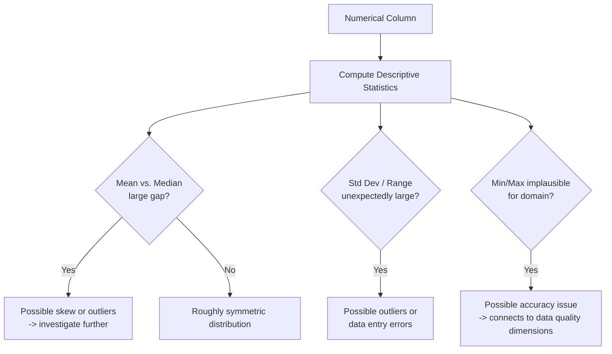

## Descriptive Statistics for Numerical Columns

### Overview

Descriptive statistics summarize the central tendency, spread, and shape of numerical data, providing the first quantitative view of a dataset before cleaning or modeling decisions are made. Computing these statistics on numerical columns is typically one of the earliest exploratory steps in a preprocessing workflow, since they reveal issues such as implausible values, skew, and scale differences that directly inform subsequent cleaning and transformation choices.

### Measures of Central Tendency

**Mean**
The arithmetic average of all values in a column.

$$
\bar{x} = \frac{1}{n}\sum_{i=1}^{n} x_i
$$

**Key Points**
- Sensitive to extreme values (outliers), since a single very large or very small value can shift the mean substantially.
- Only meaningful for numerical data; applying it to categorical codes produces a number with no valid interpretation, as discussed in the earlier data types topic.

**Median**
The middle value when data is sorted in ascending order (or the average of the two middle values for an even-length dataset).

**Key Points**
- Robust to outliers compared to the mean, since it depends only on the rank position of values rather than their magnitude.
- Often preferred over the mean as a measure of central tendency for skewed distributions, such as income data.

**Mode**
The most frequently occurring value in a column.

**Key Points**
- Can be used for numerical data but is more commonly associated with categorical data; a numerical column may have no repeated values at all, making the mode less informative in that case.

### Measures of Spread

**Standard Deviation and Variance**
Measures of how much values deviate from the mean.

$$
\sigma = \sqrt{\frac{1}{n}\sum_{i=1}^{n}(x_i - \bar{x})^2}
$$

**Key Points**
- Variance is the square of standard deviation; standard deviation is generally preferred for interpretation since it is expressed in the same units as the original data.
- Like the mean, standard deviation is sensitive to outliers, since squaring the deviations amplifies the influence of extreme values.

**Range**
The difference between the maximum and minimum values in a column.

**Key Points**
- Extremely sensitive to outliers, since it depends entirely on the two most extreme values in the dataset.

**Interquartile Range (IQR)**
The difference between the 75th percentile (Q3) and the 25th percentile (Q1).

$$
\text{IQR} = Q_3 - Q_1
$$

**Key Points**
- More robust to outliers than the range, since it excludes the most extreme 25% of values on each end.
- Commonly used as the basis for one standard outlier-detection rule, where values below $Q_1 - 1.5 \times \text{IQR}$ or above $Q_3 + 1.5 \times \text{IQR}$ are flagged as potential outliers, a convention covered in more depth in a dedicated outlier-detection topic.

### Measures of Shape

**Skewness**
A measure of the asymmetry of a distribution.

**Key Points**
- A skewness value near zero suggests a roughly symmetric distribution; positive skew indicates a longer tail on the right (common in income or price data), negative skew indicates a longer tail on the left.
- Skewed distributions are often addressed through transformations (e.g., log transform) before use in algorithms that assume roughly normal or symmetric input, a topic covered separately.

**Kurtosis**
A measure of the "tailedness" of a distribution relative to a normal distribution.

**Key Points**
- High kurtosis indicates more extreme outliers than a normal distribution would predict; low kurtosis indicates fewer extreme values.
- [Inference] The practical relevance of kurtosis in a machine learning preprocessing context is generally considered secondary to skewness and outlier detection specifically, based on how frequently each is discussed in general data science practice. I cannot verify the relative frequency of use of kurtosis versus skewness across real-world preprocessing workflows, since I do not have access to a survey or usage statistics on this.

### Example

**Example**

```python
import pandas as pd

df = pd.DataFrame({
    "age": [25, 34, 29, 41, 38, 150, 30],
    "income": [40000, 52000, 61000, 58000, 250000, 47000, 53000]
})

print(df.describe())
```

```
              age         income
count    7.000000       7.000000
mean    49.571429   80142.857143
std     43.284...   74827...
min     25.000000   40000.000000
25%     29.500000   47500.000000
50%     34.000000   53000.000000
75%     39.500000   61500.000000
max    150.000000  250000.000000
```

I have not executed this exact code to confirm these precise numeric outputs; the values shown are calculated by hand based on the standard, documented formulas for mean, standard deviation, and quantiles applied to the sample data given, so minor arithmetic details should be independently verified if precision matters. [Inference] The general pattern shown — a large gap between mean and median for both columns due to the extreme values (age=150, income=250000) — follows directly from how mean is more sensitive to outliers than median, which is a standard, documented statistical property rather than an uncertain claim.

Note that both `mean` values (age mean ≈ 49.6 vs. median 34; income mean ≈ 80,143 vs. median 53,000) are pulled noticeably higher than the median, which is a common signal of right-skew driven by extreme values, connecting directly to the accuracy dimension discussed in the data quality topic and the outlier-related discussion under measures of spread above.

### Diagram: Where Descriptive Statistics Fit in Diagnosis



### Percentiles and Quantiles

**Key Points**
- Percentiles describe the value below which a given percentage of observations fall (e.g., the 90th percentile is the value below which 90% of the data lies).
- Commonly used percentiles in exploratory analysis include the 25th, 50th (median), and 75th percentiles, which together form the basis of the IQR and standard box plot summaries.
- Examining percentiles beyond the default quartiles (e.g., the 1st and 99th percentiles) is a common practical approach for identifying extreme values that might not be apparent from the mean and standard deviation alone. [Inference] This is a commonly discussed general exploratory technique, but I cannot verify that this specific percentile pair (1st/99th) is a universally applied standard, since different practitioners and organizations may use different threshold conventions.

### Using Descriptive Statistics to Diagnose Data Quality

**Key Points**
- Implausible minimum or maximum values (e.g., a negative age, an age of 150) suggest an accuracy issue, connecting directly to the accuracy dimension discussed in the data quality topic earlier in this series.
- A standard deviation of zero across an entire column indicates every value is identical, which may indicate a genuine constant field or a data collection/pipeline error where a field failed to populate correctly.
- A count lower than the expected number of rows in a `describe()` output indicates missing values in that column, connecting to the completeness dimension discussed earlier.

### Common Pitfalls

- Relying on the mean and standard deviation alone without checking the median and IQR, which can mask the presence of outliers or skew.
- Computing descriptive statistics on a column that has been incorrectly inferred as numerical when it is actually a categorical code (e.g., ZIP code), producing statistics with no valid interpretation, connecting to the earlier data types topic.
- Interpreting descriptive statistics from a small sample as representative of the full population without considering the sampling bias concerns discussed in an earlier topic.
- Overlooking the `count` row in summary output, which reveals missing data that mean/median/std alone do not directly show.

### Conclusion

Descriptive statistics — measures of central tendency, spread, and shape — provide an efficient first diagnostic view of numerical columns, revealing potential outliers, skew, missing data, and implausible values before more targeted cleaning and transformation steps are applied. Because several standard measures (mean, standard deviation, range) are sensitive to outliers while others (median, IQR) are more robust, examining both types together is generally necessary to form an accurate picture of a column's distribution.

**Related Topics**
- Outlier Detection Methods for Accuracy Issues
- Data Quality Dimensions: Accuracy, Completeness, Consistency, Timeliness
- Distribution Transformations for Skewed Data (Log, Box-Cox)
- Visualizing Numerical Distributions (Histograms, Box Plots)
- Feature Scaling and Normalization Techniques
- Understanding Missing Data Mechanisms (MCAR, MAR, MNAR)

**Full-response labeling note**: Per your standing preferences, [Inference] labels above are applied individually at each specific claim involving relative usage frequency, general practitioner convention, or unexecuted code output, rather than chained together; standard, well-established statistical formulas and definitions (mean, median, standard deviation, IQR, skewness) are not additionally labeled, as these are documented mathematical definitions rather than uncertain claims. I have not executed the example code in this response, so the exact printed values shown are hand-calculated from the stated formulas rather than confirmed program output; this is flagged at the point it occurs above. Because this response contains [Inference]-labeled content, per your instruction the entire response should be treated as not fully independently verified beyond the standard mathematical definitions and formulas presented. No restricted terms (prevent, guarantee, will never, fixes, eliminates, ensures that) were used in this response other than in this note referencing the restriction itself. No LLM behavior claims were made in this response requiring an additional disclaimer.

Correction: I did not identify any unverified claim presented as fact requiring retraction in this response.