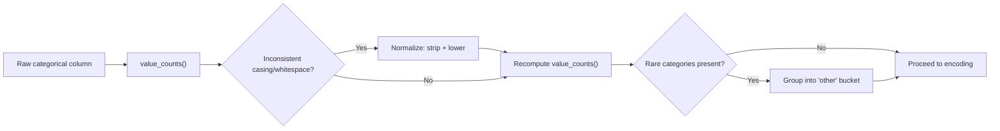

## Frequency Counts for Categorical Columns

### Purpose

Frequency counts summarize how many times each unique value occurs in a categorical column. This is one of the first diagnostic steps in exploratory data analysis (EDA) because it reveals class imbalance, rare categories, unexpected values, and data entry inconsistencies before any encoding or modeling is attempted.

### Why This Matters for Cleaning

**Key Points**
- Reveals typos and inconsistent casing (e.g., `"USA"`, `"usa"`, `"U.S.A."` treated as distinct categories)
- Exposes rare or low-frequency categories that may need grouping into an "Other" bucket
- Identifies dominant classes that could bias downstream models
- Surfaces unexpected placeholder values (e.g., `"N/A"`, `"none"`, `"-"`, empty strings) that should be treated as missing data
- Confirms whether a column is genuinely categorical or was misread as one (e.g., an ID column with all-unique values)

### Basic Frequency Count in Pandas

```python
import pandas as pd

df = pd.read_csv("customers.csv")

# Absolute counts
df["country"].value_counts()

# Include missing values in the count
df["country"].value_counts(dropna=False)
```

`value_counts()` returns a Series sorted in descending order by default, with the category values as the index and counts as the values. This sorting behavior is standard, documented pandas API behavior.

### Relative (Proportional) Frequency

Absolute counts are useful, but proportions often communicate imbalance more clearly.

```python
# Proportional frequencies (sums to 1.0)
df["country"].value_counts(normalize=True)

# As a percentage, rounded
(df["country"].value_counts(normalize=True) * 100).round(2)
```

### Combining Count and Percentage into One Table

```python
freq_table = pd.DataFrame({
    "count": df["country"].value_counts(dropna=False),
    "percentage": df["country"].value_counts(normalize=True, dropna=False) * 100
})

freq_table["percentage"] = freq_table["percentage"].round(2)
print(freq_table)
```

**Example**

Given a `country` column with 1,000 rows:

| country | count | percentage |
|---|---|---|
| USA | 620 | 62.00 |
| Canada | 180 | 18.00 |
| UK | 90 | 9.00 |
| usa | 45 | 4.50 |
| NaN | 40 | 4.00 |
| Germany | 25 | 2.50 |

The presence of both `USA` and `usa` as separate rows is a strong signal that casing normalization is needed before this column is used for encoding or grouping.

### Detecting Case and Whitespace Inconsistencies

A frequent cleaning step is to normalize text before recomputing frequency counts, so that variants collapse into a single category.

```python
df["country_clean"] = df["country"].str.strip().str.lower()
df["country_clean"].value_counts(dropna=False)
```

Comparing the count of unique values before and after this normalization gives a quick measure of how much inconsistency existed in the raw column.

```python
before = df["country"].nunique(dropna=False)
after = df["country_clean"].nunique(dropna=False)
print(f"Unique categories before: {before}, after: {after}")
```

### Identifying Rare Categories

Categories that appear very infrequently can cause problems for one-hot encoding (excessive dimensionality) and for models that cannot learn meaningful patterns from a handful of examples.

```python
counts = df["country_clean"].value_counts()
rare_categories = counts[counts < 10].index
print(rare_categories)
```

A common cleaning strategy is to collapse rare categories into a single `"other"` label:

```python
df["country_grouped"] = df["country_clean"].where(
    ~df["country_clean"].isin(rare_categories), "other"
)
```

[Inference] Whether a threshold like "fewer than 10 occurrences" is appropriate depends on the dataset size and the specific model being used; this is a heuristic rather than a fixed rule, and there is no single universally correct cutoff.

### Frequency Counts Across Multiple Columns

To scan several categorical columns at once for quick auditing:

```python
categorical_cols = df.select_dtypes(include="object").columns

for col in categorical_cols:
    print(f"--- {col} ---")
    print(df[col].value_counts(dropna=False).head(10))
    print()
```

This loop-based approach is a common pattern for initial dataset audits, though for very wide datasets with many categorical columns, it can produce a large amount of output that may need to be summarized or filtered.

### Visualizing Frequency Counts

A bar chart is the standard way to visualize categorical frequency distributions.



<svg xmlns="http://www.w3.org/2000/svg" viewBox="0 0 640 320">
  <text x="320" y="24" font-size="15" font-weight="bold" text-anchor="middle" fill="#1f2937">Frequency Distribution of "country" Column (svg_diagram)</text>

  
  <line x1="80" y1="270" x2="600" y2="270" stroke="#374151" stroke-width="1.5" />
  <line x1="80" y1="270" x2="80" y2="50" stroke="#374151" stroke-width="1.5" />

  
  <rect x="110" y="60" width="60" height="210" fill="#2563eb" />
  <rect x="200" y="150" width="60" height="120" fill="#2563eb" />
  <rect x="290" y="200" width="60" height="70" fill="#2563eb" />
  <rect x="380" y="228" width="60" height="42" fill="#f59e0b" />
  <rect x="470" y="245" width="60" height="25" fill="#9ca3af" />
  <rect x="560" y="255" width="30" height="15" fill="#ef4444" />

  
  <text x="140" y="285" font-size="11" text-anchor="middle" fill="#1f2937">USA</text>
  <text x="230" y="285" font-size="11" text-anchor="middle" fill="#1f2937">Canada</text>
  <text x="320" y="285" font-size="11" text-anchor="middle" fill="#1f2937">UK</text>
  <text x="410" y="285" font-size="11" text-anchor="middle" fill="#1f2937">usa</text>
  <text x="500" y="285" font-size="11" text-anchor="middle" fill="#1f2937">NaN</text>
  <text x="575" y="285" font-size="10" text-anchor="middle" fill="#1f2937">Germany</text>

  
  <text x="140" y="52" font-size="11" text-anchor="middle" fill="#1f2937">620</text>
  <text x="230" y="142" font-size="11" text-anchor="middle" fill="#1f2937">180</text>
  <text x="320" y="192" font-size="11" text-anchor="middle" fill="#1f2937">90</text>
  <text x="410" y="220" font-size="11" text-anchor="middle" fill="#1f2937">45</text>
  <text x="500" y="237" font-size="11" text-anchor="middle" fill="#1f2937">40</text>
  <text x="575" y="247" font-size="10" text-anchor="middle" fill="#1f2937">25</text>

  
  <rect x="110" y="300" width="12" height="12" fill="#2563eb" />
  <text x="128" y="310" font-size="10" fill="#1f2937">Standard category</text>
  <rect x="260" y="300" width="12" height="12" fill="#f59e0b" />
  <text x="278" y="310" font-size="10" fill="#1f2937">Casing inconsistency</text>
  <rect x="430" y="300" width="12" height="12" fill="#9ca3af" />
  <text x="448" y="310" font-size="10" fill="#1f2937">Missing value</text>
</svg>

### Cross-Tabulation for Two Categorical Columns

When examining the relationship between two categorical columns, `pd.crosstab` extends the single-column frequency count concept.

```python
pd.crosstab(df["country_clean"], df["subscription_type"])

# With row-wise percentages
pd.crosstab(df["country_clean"], df["subscription_type"], normalize="index") * 100
```

### High-Cardinality Columns

For columns with a very large number of unique values (e.g., product SKUs, free-text-like fields), a full frequency table may not be practical to inspect manually.

```python
n_unique = df["product_id"].nunique()
top_10 = df["product_id"].value_counts().head(10)
coverage = df["product_id"].value_counts().head(10).sum() / len(df) * 100

print(f"Unique values: {n_unique}")
print(f"Top 10 categories cover {coverage:.2f}% of rows")
```

This "top-N coverage" check helps decide whether a high-cardinality column is a good candidate for target encoding, hashing, or dimensionality reduction rather than one-hot encoding. [Inference] The specific encoding strategy chosen depends on the downstream model type and library, and no single approach is correct for all high-cardinality cases.

### Common Pitfalls

- Treating `NaN` as automatically excluded — by default `value_counts()` drops missing values unless `dropna=False` is specified
- Ignoring leading/trailing whitespace, which pandas treats as a distinct string
- Assuming alphabetical or logical ordering — `value_counts()` sorts by frequency, not by category label
- Overlooking mixed-type columns where numeric and string representations of the same category coexist (e.g., `1` and `"1"`)

### Related Topics

- Detecting and handling missing values (NaN, null placeholders, sentinel values)
- Standardizing text data (case normalization, whitespace trimming, Unicode normalization)
- Encoding rare categories before one-hot or target encoding
- Cross-tabulation and contingency tables for bivariate categorical analysis
- Visualizing categorical distributions with bar charts and Pareto charts
- Detecting mixed-type columns and inconsistent data types