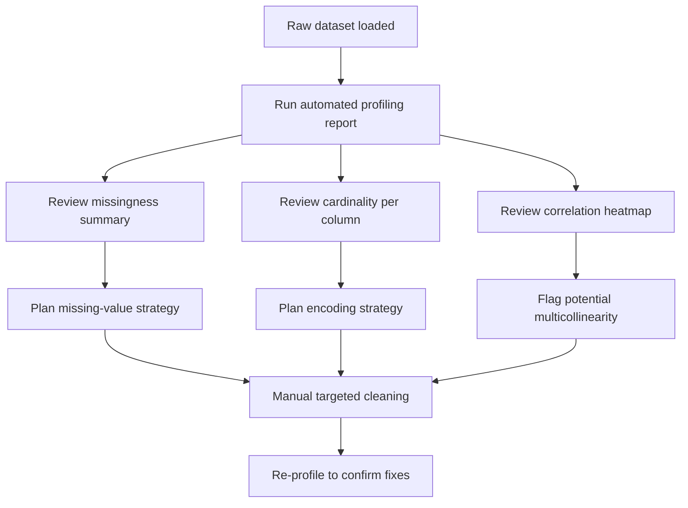

## Data Profiling Tools and Automated Reports

### Purpose

Data profiling tools automate the generation of exploratory summaries — data types, missing value counts, distributions, correlations, and frequency tables — that would otherwise require writing repetitive manual EDA code for every new dataset. These tools produce standardized reports that accelerate the initial cleaning and quality assessment phase.

### Why This Matters for Cleaning

**Key Points**
- Consolidates dozens of manual EDA steps (missingness, cardinality, distributions, correlations) into a single generated report
- Surfaces data quality issues that are easy to miss manually, such as high correlation between features or columns with near-constant values
- Provides a consistent, repeatable baseline for comparing datasets or dataset versions over time
- Useful as a starting point, not a replacement for domain-informed manual inspection

### ydata-profiling (formerly pandas-profiling)

`ydata-profiling` is a widely used open-source library that generates an HTML report from a DataFrame.

```python
from ydata_profiling import ProfileReport
import pandas as pd

df = pd.read_csv("customers.csv")

profile = ProfileReport(df, title="Customer Data Profiling Report")
profile.to_file("customer_report.html")
```

A generated report from this library typically includes sections such as: overview (row/column counts, missing cells, duplicate rows), per-variable statistics (mean, median, quantiles, distinct count), a missing-values matrix, and a correlation heatmap. [Unverified] The exact set of sections and visualizations depends on the installed library version and configuration, and this may have changed since my knowledge cutoff — I cannot verify the current default output of the latest release.

### Configuring Profile Depth

Full profiling (including pairwise correlations) can be computationally expensive on large datasets. Most profiling libraries expose a "minimal" mode to reduce runtime.

```python
profile = ProfileReport(df, minimal=True)
profile.to_file("quick_report.html")
```

[Inference] The `minimal=True` setting is documented as disabling expensive computations such as correlations and interactions, but the specific performance improvement will vary depending on dataset size, hardware, and library version. I cannot verify a specific speed multiplier without benchmarking the exact environment in question.

### Sweetviz

`sweetviz` is another automated profiling library, notable for its side-by-side comparison layout and its ability to compare two datasets (e.g., train vs. test splits) directly.

```python
import sweetviz as sv

report = sv.analyze(df)
report.show_html("sweetviz_report.html")

# Comparing train and test sets
comparison_report = sv.compare(train_df, test_df)
comparison_report.show_html("comparison_report.html")
```

This train/test comparison view is useful for detecting distribution shift between splits before model training — a common source of silent data leakage or generalization problems.

### D-Tale

`d-tale` launches an interactive web application (rather than a static HTML file) for exploring a DataFrame, including sorting, filtering, correlation views, and chart building.

```python
import dtale

d = dtale.show(df)
d.open_browser()
```

Because this tool launches a live local server process, its behavior in notebook environments, cloud environments, or restricted networks may differ. [Unverified] I do not have access to information confirming how this behaves in every possible execution environment.

### pandas Built-in Quick Profiling

Without external libraries, pandas itself provides fast, lightweight profiling building blocks that are often sufficient for a quick check:

```python
df.info()                      # dtypes, non-null counts, memory usage
df.describe(include="all")     # summary stats for numeric and categorical columns
df.isnull().mean() * 100       # percentage missing per column
df.nunique()                   # cardinality per column
```

These are documented, standard pandas API methods and their behavior is stable and well-established.

### Comparing Profiling Approaches

| Tool | Output format | Notable strength | Consideration |
|---|---|---|---|
| ydata-profiling | Static HTML | Comprehensive single-dataset report | Can be slow on large/wide datasets |
| sweetviz | Static HTML | Dataset comparison (train vs. test) | Fewer configuration options than ydata-profiling |
| d-tale | Interactive web app | Live filtering/sorting/exploration | Requires a running server process |
| pandas built-ins | Console/text output | No extra dependency, fast | Manual assembly of a full report |

[Inference] This comparison reflects general, commonly cited tradeoffs discussed in documentation and community usage; it is not based on a controlled benchmark I have run, so relative performance claims should be treated as general guidance rather than measured fact.

### Workflow: Where Profiling Fits in the Cleaning Pipeline



<svg xmlns="http://www.w3.org/2000/svg" viewBox="0 0 640 260">
  <text x="320" y="24" font-size="15" font-weight="bold" text-anchor="middle" fill="#1f2937">Automated Profiling Report — Section Breakdown (svg_diagram)</text>

  <rect x="40" y="60" width="130" height="60" rx="6" fill="#2563eb" />
  <text x="105" y="85" font-size="11" text-anchor="middle" fill="#ffffff">Overview</text>
  <text x="105" y="100" font-size="9" text-anchor="middle" fill="#dbeafe">rows, cols, memory</text>

  <rect x="190" y="60" width="130" height="60" rx="6" fill="#059669" />
  <text x="255" y="85" font-size="11" text-anchor="middle" fill="#ffffff">Missing Values</text>
  <text x="255" y="100" font-size="9" text-anchor="middle" fill="#d1fae5">matrix + counts</text>

  <rect x="340" y="60" width="130" height="60" rx="6" fill="#d97706" />
  <text x="405" y="85" font-size="11" text-anchor="middle" fill="#ffffff">Variables</text>
  <text x="405" y="100" font-size="9" text-anchor="middle" fill="#fef3c7">type, stats, distinct</text>

  <rect x="490" y="60" width="130" height="60" rx="6" fill="#7c3aed" />
  <text x="555" y="85" font-size="11" text-anchor="middle" fill="#ffffff">Correlations</text>
  <text x="555" y="100" font-size="9" text-anchor="middle" fill="#ede9fe">heatmap</text>

  <rect x="190" y="160" width="260" height="55" rx="6" fill="#4b5563" />
  <text x="320" y="185" font-size="11" text-anchor="middle" fill="#ffffff">Feeds into manual cleaning decisions</text>
  <text x="320" y="200" font-size="9" text-anchor="middle" fill="#e5e7eb">imputation, encoding, feature selection</text>

  <line x1="105" y1="120" x2="270" y2="160" stroke="#9ca3af" stroke-width="1.5" />
  <line x1="255" y1="120" x2="300" y2="160" stroke="#9ca3af" stroke-width="1.5" />
  <line x1="405" y1="120" x2="360" y2="160" stroke="#9ca3af" stroke-width="1.5" />
  <line x1="555" y1="120" x2="400" y2="160" stroke="#9ca3af" stroke-width="1.5" />
</svg>

### Limitations of Automated Profiling

- Correlation and distribution summaries describe statistical patterns only; they do not identify why a value is wrong or whether it reflects a genuine outlier versus a data entry error — that judgment requires domain knowledge
- Large or wide datasets (many columns, high row counts) can make full profiling reports slow or memory-intensive to generate
- Automated reports can flag a large number of items (skewed distributions, high-cardinality columns) without indicating which ones are actually problematic for the specific modeling task — human review of the report remains necessary
- Reports reflect the data at the time they were generated; if cleaning changes the DataFrame, the report must be regenerated to remain accurate

[Inference] These limitations are commonly discussed in data science practice, but the specific relevance of each limitation depends on the dataset and library version in use; I cannot verify how a specific report will behave on a specific dataset without running it directly.

### Next Steps

- Correlation analysis and multicollinearity detection
- Outlier detection methods (IQR, Z-score, isolation forest)
- Missing value visualization (missingno library, missing-value matrices)
- Automated data quality rule frameworks (e.g., Great Expectations)
- Detecting distribution drift between dataset versions or train/test splits