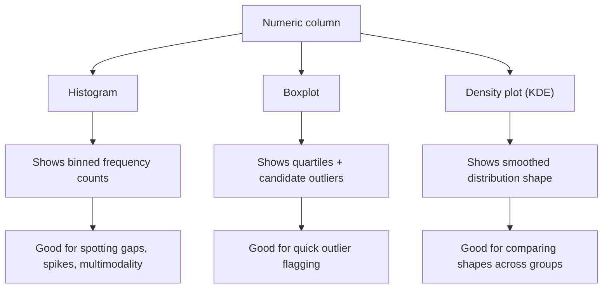

## Visualizing Distributions: Histograms, Boxplots, Density Plots

### Purpose

Visualizing the distribution of a numeric column reveals shape, spread, central tendency, skewness, and outliers — information that summary statistics alone can understate or hide entirely. This is a standard step in exploratory data analysis before deciding on cleaning strategies such as outlier handling, transformation, or imputation.

### Why This Matters for Cleaning

**Key Points**
- Histograms reveal skewness, multimodality, and gaps in the data that a mean/median alone would not show
- Boxplots provide a compact view of quartiles and flag potential outliers using the interquartile range (IQR) convention
- Density plots (KDE) smooth out histogram bin artifacts and make it easier to compare distribution shapes across groups
- Distribution shape informs downstream choices such as whether to apply a log transform, which imputation strategy to use, or which outlier detection method is appropriate

### Histograms

A histogram bins continuous values into intervals and displays the count of observations per bin.

```python
import matplotlib.pyplot as plt

df["age"].plot(kind="hist", bins=30, edgecolor="black")
plt.title("Distribution of Age")
plt.xlabel("Age")
plt.ylabel("Frequency")
plt.show()
```

Using seaborn for a comparable, more styled output:

```python
import seaborn as sns

sns.histplot(df["age"], bins=30, kde=False)
plt.title("Distribution of Age")
plt.show()
```

**Choosing Bin Count**

The number of bins affects how much detail versus noise the histogram shows. Too few bins can hide structure; too many can make the chart look noisy.

```python
# Fixed bin count
df["age"].plot(kind="hist", bins=20)

# Automatic bin edge calculation using a standard rule
import numpy as np
bin_edges = np.histogram_bin_edges(df["age"].dropna(), bins="fd")
```

[Inference] The `"fd"` (Freedman-Diaconis) rule and similar automatic binning rules are documented in NumPy's API reference as methods for estimating bin width from data variance and sample size. Whether a specific rule produces the most visually informative histogram for a given dataset is a judgment call that depends on the data itself, not something I can verify in general.

### Boxplots

A boxplot displays the median, first and third quartiles (Q1, Q3), and whiskers typically extending to 1.5 times the interquartile range (IQR) from the box edges. Points beyond the whiskers are plotted individually and are commonly treated as candidate outliers.

```python
sns.boxplot(x=df["age"])
plt.title("Boxplot of Age")
plt.show()
```

**Boxplots Across Categories**

Boxplots are often used to compare a numeric distribution across groups defined by a categorical column.

```python
sns.boxplot(x="department", y="salary", data=df)
plt.title("Salary Distribution by Department")
plt.xticks(rotation=45)
plt.show()
```

The IQR calculation itself is a defined statistical formula:

$$IQR = Q_3 - Q_1$$

$$\text{Lower whisker} = Q_1 - 1.5 \times IQR$$
$$\text{Upper whisker} = Q_3 + 1.5 \times IQR$$

[Unverified] The 1.5×IQR multiplier is the conventional default used by most plotting libraries, but I cannot verify without checking the specific library version whether this default has been changed or is configurable in every plotting function you might use. This is a convention, not a universal mathematical requirement.

### Density Plots (KDE)

A kernel density estimate (KDE) plot produces a smoothed, continuous curve approximating the underlying probability density of the data, avoiding the bin-edge artifacts of histograms.

```python
sns.kdeplot(df["age"], fill=True)
plt.title("Density Plot of Age")
plt.show()
```

**Overlaying Histogram and KDE**

```python
sns.histplot(df["age"], bins=30, kde=True)
plt.title("Age Distribution with Density Overlay")
plt.show()
```

**Comparing Densities Across Groups**

```python
sns.kdeplot(data=df, x="salary", hue="department", fill=True, common_norm=False)
plt.title("Salary Density by Department")
plt.show()
```

Setting `common_norm=False` scales each group's density independently rather than as a proportion of the combined dataset; this is documented, standard seaborn API behavior.

### Interpreting Shape for Cleaning Decisions

| Observed shape | Common interpretation | Typical cleaning consideration |
|---|---|---|
| Right-skewed (long right tail) | A small number of large values pull the mean upward | Consider log or power transformation |
| Left-skewed (long left tail) | A small number of small values pull the mean downward | Consider reflection + transformation |
| Bimodal (two peaks) | Possible mixture of two distinct subpopulations | Consider segmenting before imputation |
| Sharp spike at one value | Possible placeholder value (e.g., 0 or -999 used for missing) | Investigate whether spike represents true zeros or coded missingness |
| Long tail with isolated points | Potential outliers or data entry errors | Apply IQR/Z-score check before deciding to remove or cap |

[Inference] These are commonly cited heuristics in exploratory data analysis practice for interpreting distribution shape. They are reasoned interpretations, not deterministic rules — the same shape can arise from different underlying causes, and confirming the actual cause requires domain knowledge of the specific dataset, which I do not have access to.

### Visual Comparison: Histogram vs. Boxplot vs. Density Plot



<svg xmlns="http://www.w3.org/2000/svg" viewBox="0 0 640 300">
  <text x="320" y="24" font-size="15" font-weight="bold" text-anchor="middle" fill="#1f2937">Right-Skewed Distribution — Histogram vs Boxplot (svg_diagram)</text>

  
  <text x="150" y="50" font-size="12" text-anchor="middle" fill="#1f2937">Histogram</text>
  <line x1="60" y1="180" x2="280" y2="180" stroke="#374151" stroke-width="1.5" />
  <line x1="60" y1="180" x2="60" y2="60" stroke="#374151" stroke-width="1.5" />
  <rect x="65" y="70" width="18" height="110" fill="#2563eb" />
  <rect x="85" y="90" width="18" height="90" fill="#2563eb" />
  <rect x="105" y="115" width="18" height="65" fill="#2563eb" />
  <rect x="125" y="140" width="18" height="40" fill="#2563eb" />
  <rect x="145" y="158" width="18" height="22" fill="#2563eb" />
  <rect x="165" y="168" width="18" height="12" fill="#2563eb" />
  <rect x="185" y="174" width="18" height="6" fill="#2563eb" />
  <rect x="205" y="176" width="18" height="4" fill="#f59e0b" />
  <rect x="225" y="178" width="18" height="2" fill="#f59e0b" />
  <rect x="245" y="178" width="18" height="2" fill="#ef4444" />
  <text x="150" y="195" font-size="9" text-anchor="middle" fill="#1f2937">long right tail</text>

  
  <text x="470" y="50" font-size="12" text-anchor="middle" fill="#1f2937">Boxplot</text>
  <line x1="340" y1="180" x2="600" y2="180" stroke="#374151" stroke-width="1.5" />
  <line x1="380" y1="140" x2="380" y2="110" stroke="#374151" stroke-width="1.5" />
  <rect x="360" y="110" width="60" height="30" fill="#2563eb" stroke="#1f2937" />
  <line x1="390" y1="110" x2="390" y2="140" stroke="#ffffff" stroke-width="2" />
  <line x1="360" y1="95" x2="420" y2="95" stroke="#374151" stroke-width="1" />
  <line x1="390" y1="95" x2="390" y2="110" stroke="#374151" stroke-width="1" />
  <line x1="360" y1="150" x2="420" y2="150" stroke="#374151" stroke-width="1" />
  <line x1="390" y1="140" x2="390" y2="150" stroke="#374151" stroke-width="1" />
  <circle cx="450" cy="90" r="3" fill="#ef4444" />
  <circle cx="480" cy="80" r="3" fill="#ef4444" />
  <circle cx="520" cy="70" r="3" fill="#ef4444" />
  <text x="480" y="170" font-size="9" text-anchor="middle" fill="#1f2937">dots = candidate outliers</text>
</svg>

### Small Multiples for Multiple Columns

When checking distributions across many numeric columns at once, a grid of histograms avoids generating one plot at a time.

```python
df.select_dtypes(include="number").hist(figsize=(15, 10), bins=20)
plt.tight_layout()
plt.show()
```

### Common Pitfalls

- Interpreting boxplot "outlier" points as automatically wrong or requiring removal — the 1.5×IQR rule is a heuristic convention, not a statistical test of validity
- Using default bin counts without checking whether they hide bimodal structure
- Comparing histograms across groups with different sample sizes without normalizing (e.g., using density instead of raw counts)
- Ignoring that KDE plots can imply density in regions with no actual data support (KDE curves are smoothed estimates, not the raw data)

### Next Steps

- Outlier detection methods (IQR rule, Z-score, Modified Z-score, Isolation Forest)
- Skewness and kurtosis as numeric summaries of distribution shape
- Data transformation techniques (log, Box-Cox, Yeo-Johnson) for skewed distributions
- Handling placeholder/sentinel values disguised as numeric spikes
- Visualizing missingness patterns alongside distributions