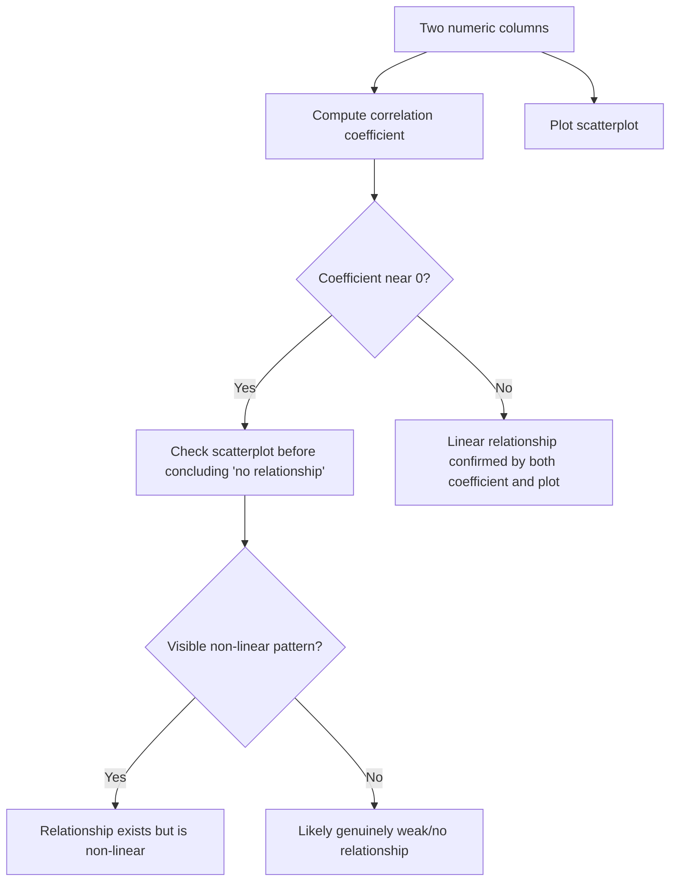

## Visualizing Relationships: Scatterplots, Correlation Matrices

### Purpose

Visualizing relationships between two or more numeric variables reveals linear and non-linear associations, clusters, and anomalous joint values that univariate distribution plots cannot show. This informs cleaning decisions such as detecting bivariate outliers, identifying multicollinearity, and spotting data entry errors that only become visible when two columns are examined together.

### Why This Matters for Cleaning

**Key Points**
- Scatterplots reveal whether a relationship between two variables is linear, non-linear, or absent
- Points that are unremarkable in a single-variable histogram can appear as clear outliers when plotted against a second variable
- Correlation matrices provide a compact, dataset-wide view of pairwise linear relationships, useful for detecting redundant or leaking features
- Visual inspection can catch relationship patterns (e.g., clusters, banding, non-linear curves) that a single correlation coefficient would summarize poorly or hide entirely

### Scatterplots

A scatterplot places one variable on the x-axis and another on the y-axis, with each point representing one observation.

```python
import matplotlib.pyplot as plt

plt.scatter(df["age"], df["income"], alpha=0.5)
plt.xlabel("Age")
plt.ylabel("Income")
plt.title("Age vs Income")
plt.show()
```

Using seaborn for additional styling and regression overlay options:

```python
import seaborn as sns

sns.scatterplot(x="age", y="income", data=df)
plt.title("Age vs Income")
plt.show()
```

**Adding a Trend Line**

```python
sns.regplot(x="age", y="income", data=df, scatter_kws={"alpha": 0.4})
plt.title("Age vs Income with Linear Fit")
plt.show()
```

`regplot` overlays a fitted linear regression line with a confidence interval band by default; this is documented, standard seaborn API behavior.

**Coloring by a Third Variable**

```python
sns.scatterplot(x="age", y="income", hue="department", data=df)
plt.title("Age vs Income by Department")
plt.show()
```

Adding a categorical `hue` can reveal whether an apparent overall relationship is actually driven by, or differs across, subgroups — a pattern sometimes referred to as Simpson's paradox when the subgroup trends contradict the aggregate trend.

### Bivariate Outlier Detection via Scatterplots

A point can fall within the normal range on both individual axes yet still be an outlier in the joint relationship between the two variables.

```python
sns.scatterplot(x="height_cm", y="weight_kg", data=df)
plt.title("Height vs Weight")
plt.show()
```

**Example**

A row with `height_cm = 175` and `weight_kg = 30` may not appear as an outlier in either column's individual histogram if both values fall within plausible individual ranges, but the combination is physically implausible and would be visible as an isolated point far from the main cluster in a scatterplot.

### Pair Plots for Multiple Variables

A pair plot (scatterplot matrix) shows scatterplots for every pair of numeric columns simultaneously, with univariate distributions on the diagonal.

```python
sns.pairplot(df[["age", "income", "years_experience", "salary"]])
plt.show()
```

```python
# With grouping
sns.pairplot(df[["age", "income", "years_experience", "salary", "department"]], hue="department")
plt.show()
```

[Inference] Pair plots become visually cluttered and slower to render as the number of columns increases; this is a reasoned expectation based on the fact that the number of subplots grows quadratically with column count, not a specific benchmarked figure I can confirm for any given dataset or hardware.

### Correlation Matrices

A correlation matrix computes a pairwise correlation coefficient (commonly Pearson's r by default) between every pair of numeric columns.

```python
corr_matrix = df.select_dtypes(include="number").corr()
print(corr_matrix)
```

**Visualizing as a Heatmap**

```python
sns.heatmap(corr_matrix, annot=True, cmap="coolwarm", fmt=".2f", center=0)
plt.title("Correlation Matrix Heatmap")
plt.show()
```

The Pearson correlation coefficient between two variables $X$ and $Y$ is defined as:

$$r_{XY} = \frac{\sum_{i=1}^{n}(X_i - \bar{X})(Y_i - \bar{Y})}{\sqrt{\sum_{i=1}^{n}(X_i - \bar{X})^2}\sqrt{\sum_{i=1}^{n}(Y_i - \bar{Y})^2}}$$

This produces a value between $-1$ and $1$, where values near $1$ or $-1$ indicate strong linear association and values near $0$ indicate weak or no linear association. This is a standard, well-established statistical definition.

### Choosing a Correlation Method

`.corr()` supports multiple correlation methods, and the choice affects what kind of relationship is detected.

```python
df.corr(method="pearson")    # linear relationships, sensitive to outliers
df.corr(method="spearman")   # monotonic relationships, rank-based, robust to outliers
df.corr(method="kendall")    # rank-based, often used for smaller samples
```

[Inference] Spearman and Kendall correlation are documented as rank-based methods that are generally less sensitive to outliers than Pearson correlation, because they operate on ranks rather than raw values. Whether this makes a meaningful practical difference for a specific dataset depends on the actual data and cannot be confirmed without testing on that dataset directly.

### Why Correlation Alone Can Mislead

A correlation coefficient summarizes only the strength of a *linear* relationship. Non-linear relationships (e.g., quadratic, cyclical) can produce a correlation coefficient near zero despite an obvious visual pattern in a scatterplot.



<svg xmlns="http://www.w3.org/2000/svg" viewBox="0 0 640 300">
  <text x="320" y="24" font-size="15" font-weight="bold" text-anchor="middle" fill="#1f2937">Correlation Coefficient Can Hide Non-Linear Patterns (svg_diagram)</text>

  
  <text x="150" y="50" font-size="12" text-anchor="middle" fill="#1f2937">r ≈ 0.85 (linear)</text>
  <line x1="60" y1="180" x2="280" y2="180" stroke="#374151" stroke-width="1.5" />
  <line x1="60" y1="180" x2="60" y2="60" stroke="#374151" stroke-width="1.5" />
  <circle cx="80" cy="165" r="3" fill="#2563eb" />
  <circle cx="100" cy="155" r="3" fill="#2563eb" />
  <circle cx="120" cy="148" r="3" fill="#2563eb" />
  <circle cx="140" cy="135" r="3" fill="#2563eb" />
  <circle cx="160" cy="125" r="3" fill="#2563eb" />
  <circle cx="180" cy="112" r="3" fill="#2563eb" />
  <circle cx="200" cy="105" r="3" fill="#2563eb" />
  <circle cx="220" cy="90" r="3" fill="#2563eb" />
  <circle cx="240" cy="80" r="3" fill="#2563eb" />
  <circle cx="260" cy="70" r="3" fill="#2563eb" />

  
  <text x="470" y="50" font-size="12" text-anchor="middle" fill="#1f2937">r ≈ 0.02 (quadratic)</text>
  <line x1="340" y1="180" x2="600" y2="180" stroke="#374151" stroke-width="1.5" />
  <line x1="340" y1="180" x2="340" y2="60" stroke="#374151" stroke-width="1.5" />
  <circle cx="355" cy="80" r="3" fill="#ef4444" />
  <circle cx="375" cy="110" r="3" fill="#ef4444" />
  <circle cx="395" cy="135" r="3" fill="#ef4444" />
  <circle cx="415" cy="155" r="3" fill="#ef4444" />
  <circle cx="435" cy="165" r="3" fill="#ef4444" />
  <circle cx="455" cy="168" r="3" fill="#ef4444" />
  <circle cx="475" cy="160" r="3" fill="#ef4444" />
  <circle cx="495" cy="145" r="3" fill="#ef4444" />
  <circle cx="515" cy="120" r="3" fill="#ef4444" />
  <circle cx="535" cy="90" r="3" fill="#ef4444" />
  <circle cx="555" cy="65" r="3" fill="#ef4444" />
  <text x="470" y="195" font-size="9" text-anchor="middle" fill="#1f2937">clear pattern, low linear r</text>
</svg>

### Detecting Multicollinearity via Correlation Matrix

**Example**

If a correlation matrix shows a coefficient of $0.95$ between `total_price` and `unit_price_times_quantity`, this suggests the two columns encode largely the same information. Retaining both as separate features in a model may introduce multicollinearity, which can distort coefficient interpretation in linear models. [Inference] Whether this specific correlation level is problematic depends on the modeling technique used; tree-based models are generally documented as less sensitive to multicollinearity than linear regression, but the practical impact on any specific model and dataset cannot be confirmed without testing it directly.

### Common Pitfalls

- Concluding "no relationship" from a low correlation coefficient without checking the scatterplot for non-linear patterns
- Computing Pearson correlation on data with extreme outliers, which can inflate or deflate the coefficient
- Treating high correlation as evidence of causation
- Overplotting: with very large datasets, scatterplots can become a solid mass of overlapping points, obscuring density differences (mitigated with `alpha` transparency, hexbin plots, or sampling)

```python
# Hexbin plot for large datasets to address overplotting
plt.hexbin(df["age"], df["income"], gridsize=30, cmap="Blues")
plt.colorbar(label="count")
plt.show()
```

### Next Steps

- Multicollinearity detection using Variance Inflation Factor (VIF)
- Non-linear association measures (mutual information, distance correlation)
- Bivariate and multivariate outlier detection (Mahalanobis distance)
- Feature selection based on correlation thresholds
- Handling Simpson's paradox in grouped data analysis