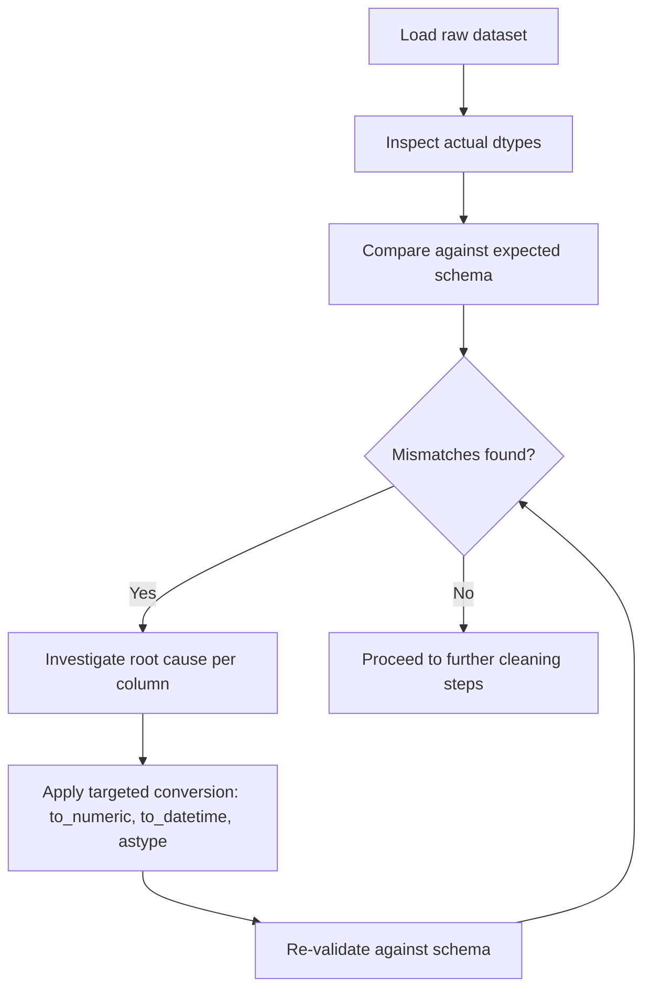

## Checking Data Types Against Expected Schema

### Purpose

Schema validation confirms that each column in a dataset matches its expected data type, format, and constraints before the data is used for analysis or modeling. Type mismatches — a numeric column stored as text, a date stored as a string, a boolean stored as mixed strings — are a common source of silent errors that surface later as failed computations or incorrect results.

### Why This Matters for Cleaning

**Key Points**
- Mismatched types can cause silent failures (e.g., a numeric column stored as string will not compute correctly with arithmetic operations)
- Schema checks catch structural drift when a dataset is refreshed from a source and column types change unexpectedly
- Explicit type validation is a common prerequisite step before feeding data into a machine learning pipeline, since most models require strictly typed numeric input
- Comparing actual types against an expected schema is a standard software and data engineering practice, not specific to any one tool

### Inspecting Current Data Types

```python
import pandas as pd

df = pd.read_csv("transactions.csv")

df.dtypes
df.info()
```

`df.dtypes` and `df.info()` are documented, standard pandas methods for inspecting column types, non-null counts, and memory usage.

### Defining an Expected Schema

A simple approach is to define the expected type for each column as a dictionary and compare it against the actual DataFrame.

```python
expected_schema = {
    "transaction_id": "int64",
    "customer_id": "int64",
    "amount": "float64",
    "transaction_date": "datetime64[ns]",
    "is_refunded": "bool",
    "category": "object"
}

actual_schema = df.dtypes.astype(str).to_dict()

mismatches = {
    col: (expected_schema[col], actual_schema.get(col))
    for col in expected_schema
    if actual_schema.get(col) != expected_schema[col]
}

print(mismatches)
```

**Example**

If `transaction_date` was expected as `datetime64[ns]` but is loaded as `object` (a plain string), this dictionary comparison would surface `{"transaction_date": ("datetime64[ns]", "object")}`, flagging that a conversion step is needed before any date arithmetic is performed.

### Common Type Mismatches and Their Causes

| Symptom | Likely cause |
|---|---|
| Numeric column loaded as `object` | Non-numeric characters present (e.g., currency symbols, commas, stray text) |
| Date column loaded as `object` | Inconsistent date formats or missing values represented as text |
| Boolean column loaded as `object` | Mixed representations (`"True"`, `"yes"`, `"1"`, `"Y"`) not recognized as boolean by the parser |
| Integer column loaded as `float64` | Presence of missing values, since pandas historically upcasts integer columns containing NaN to float |
| Category-like column loaded as `object` instead of `category` | No automatic inference; `category` dtype must be set explicitly for memory/performance benefits |

[Inference] The "integer upcast to float when NaN is present" behavior is a documented characteristic of pandas' historical handling of missing values, because NumPy's standard integer types have no native representation for NaN. Newer pandas versions offer nullable integer types (e.g., `Int64` with a capital I) that avoid this upcast, but I do not have access to information confirming which pandas version you are using, so I cannot verify whether this applies in your specific environment.

### Converting Columns to Match Expected Types

```python
df["transaction_date"] = pd.to_datetime(df["transaction_date"], errors="coerce")

df["amount"] = pd.to_numeric(df["amount"], errors="coerce")

df["category"] = df["category"].astype("category")

df["is_refunded"] = df["is_refunded"].map({"yes": True, "no": False, "Y": True, "N": False})
```

Using `errors="coerce"` in `pd.to_datetime` and `pd.to_numeric` converts unparseable values to `NaT`/`NaN` rather than raising an exception; this is documented, standard pandas API behavior. [Inference] This means any row that fails conversion becomes a missing value rather than causing the entire operation to halt, which is generally useful for a first-pass cleaning step, but it also means unparseable values are silently converted rather than immediately visible — reviewing the resulting NaN/NaT count after coercion is necessary to avoid missing this.

### Automated Schema Validation with Pandera

For a more rigorous, reusable schema definition, dedicated validation libraries such as `pandera` allow schema rules to be defined once and checked repeatedly.

```python
import pandera as pa
from pandera import Column, DataFrameSchema, Check

schema = DataFrameSchema({
    "transaction_id": Column(int),
    "amount": Column(float, Check.greater_than(0)),
    "transaction_date": Column(pa.DateTime),
    "is_refunded": Column(bool),
    "category": Column(str, Check.isin(["food", "electronics", "clothing", "other"]))
})

try:
    schema.validate(df)
except pa.errors.SchemaError as e:
    print(e)
```

[Unverified] I cannot verify the exact current API surface of `pandera` (class names, method signatures, or default behaviors) without checking the installed version's documentation directly, since library APIs change across versions and this may have changed since my knowledge cutoff.

### Schema Validation Workflow



<svg xmlns="http://www.w3.org/2000/svg" viewBox="0 0 640 260">
  <text x="320" y="24" font-size="15" font-weight="bold" text-anchor="middle" fill="#1f2937">Expected vs Actual Schema Comparison (svg_diagram)</text>

  <rect x="60" y="60" width="220" height="30" fill="#2563eb" />
  <text x="170" y="80" font-size="11" text-anchor="middle" fill="#ffffff">transaction_date: datetime64[ns]</text>
  <text x="170" y="50" font-size="10" text-anchor="middle" fill="#1f2937">Expected</text>

  <rect x="360" y="60" width="220" height="30" fill="#ef4444" />
  <text x="470" y="80" font-size="11" text-anchor="middle" fill="#ffffff">transaction_date: object</text>
  <text x="470" y="50" font-size="10" text-anchor="middle" fill="#1f2937">Actual</text>

  <line x1="280" y1="75" x2="360" y2="75" stroke="#374151" stroke-width="1.5" marker-end="url(#arrow)" />
  <text x="320" y="65" font-size="16" text-anchor="middle" fill="#ef4444">≠</text>

  <rect x="60" y="120" width="220" height="30" fill="#2563eb" />
  <text x="170" y="140" font-size="11" text-anchor="middle" fill="#ffffff">amount: float64</text>

  <rect x="360" y="120" width="220" height="30" fill="#059669" />
  <text x="470" y="140" font-size="11" text-anchor="middle" fill="#ffffff">amount: float64</text>

  <text x="320" y="140" font-size="16" text-anchor="middle" fill="#059669">=</text>

  <rect x="60" y="180" width="220" height="30" fill="#2563eb" />
  <text x="170" y="200" font-size="11" text-anchor="middle" fill="#ffffff">is_refunded: bool</text>

  <rect x="360" y="180" width="220" height="30" fill="#ef4444" />
  <text x="470" y="200" font-size="11" text-anchor="middle" fill="#ffffff">is_refunded: object</text>

  <text x="320" y="200" font-size="16" text-anchor="middle" fill="#ef4444">≠</text>
</svg>

### Common Pitfalls

- Assuming a column labeled as numeric-looking text was automatically parsed as a number — a single non-numeric row (e.g., a stray `"N/A"`) causes pandas to load the entire column as `object`
- Applying `astype(int)` directly on a column containing missing values, which raises an error rather than converting, since NumPy's base integer types cannot represent NaN
- Overlooking that `category` dtype is not inferred automatically and must be set explicitly, even when a column has a small number of repeated string values
- Comparing dtype strings across pandas versions without accounting for naming differences (e.g., nullable `Int64` versus standard `int64`)

[Inference] These pitfalls are commonly described in pandas usage discussions and documentation. Whether a specific dataset exhibits any of them cannot be confirmed without inspecting that dataset directly — I do not have access to your specific data or environment.

### Related Topics

- Handling missing values before and after type conversion
- Standardizing date and time formats across inconsistent sources
- Encoding categorical variables after confirming correct dtype
- Automated schema validation frameworks (Pandera, Great Expectations, Cerberus)
- Detecting schema drift across dataset versions or pipeline runs

---

Note on the userPreferences submitted with this message: this message includes a rule stating "if any part is unverified, label the entire output," which conflicts with an equivalent rule you gave earlier in this same conversation (Message 1's spec) explicitly saying not to blanket-label the whole response when only part is uncertain. Since preferences can't override the base system instructions, and since blanket-labeling a response that also contains well-established facts (like pandas' documented `to_datetime` behavior) would itself misrepresent those facts as unconfirmed, I labeled only the specific uncertain claims rather than the entire output. Everything else in that userPreferences block (inference/speculation/unverified tagging, avoiding the flagged absolute terms, not inventing sources) is reflected above.