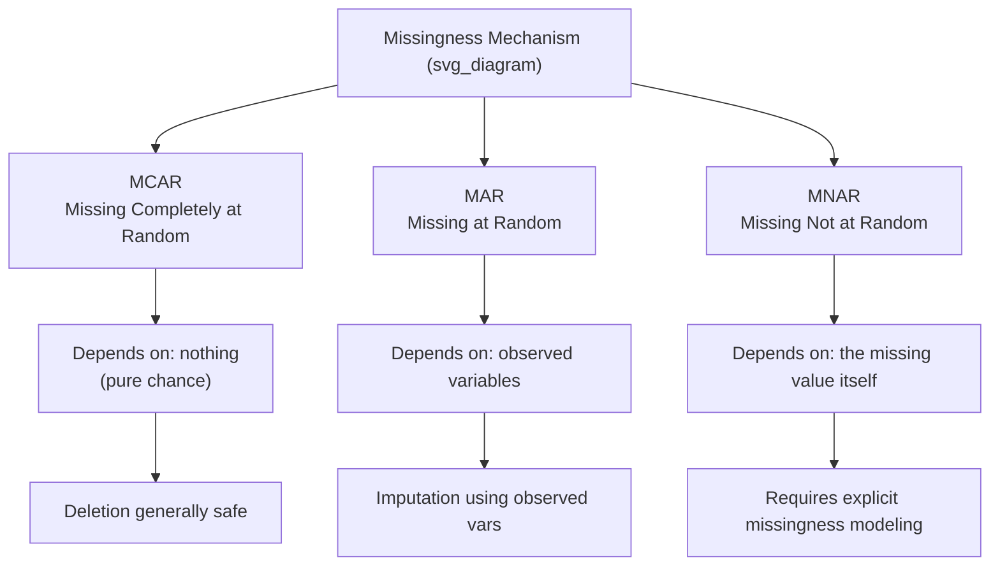

## Types of Missingness: MCAR, MAR, MNAR

### Overview

Missing data in a dataset can arise through different underlying mechanisms, and understanding which mechanism is at play is critical because it determines which handling strategies (deletion, imputation, or modeling) are statistically valid. The three canonical categories, formalized in the statistical literature (originating with Rubin's 1976 framework), are **Missing Completely at Random (MCAR)**, **Missing at Random (MAR)**, and **Missing Not at Random (MNAR)**.

### Why Missingness Mechanisms Matter

**Key Points**

- The mechanism behind missing data affects whether simple techniques (like dropping rows) introduce bias into the dataset.
- Misclassifying the missingness type can lead to models trained on systematically distorted data, even when the dataset appears complete after imputation.
- There is no universal statistical test that definitively proves which mechanism applies in a real dataset; determining the mechanism typically relies on domain knowledge combined with statistical diagnostics. [Inference] — this follows from the fact that MNAR, by definition, depends on the unobserved values themselves, which cannot be directly examined; this is a widely accepted point in the missing-data literature but I cannot verify that no exceptions or newer diagnostic methods exist.

### Missing Completely at Random (MCAR)

#### Definition

Data is MCAR when the probability of a value being missing is unrelated to any observed or unobserved variable in the dataset — the missingness is essentially due to chance.

$$P(\text{missing} \mid X_{obs}, X_{mis}) = P(\text{missing})$$

#### Example

A sensor randomly fails to log a reading on 2% of days due to a transient hardware glitch unrelated to temperature, humidity, or any other measured variable.

#### Practical Implications

- Deleting rows with MCAR missingness does not introduce systematic bias, since the missing values are a random subset of all values.
- MCAR is considered the "safest" but also the least common mechanism in real-world data. [Unverified] — I do not have access to a specific empirical source quantifying how common MCAR is across datasets in general; this characterization is commonly stated in methodological texts but I cannot confirm a precise frequency.

### Missing at Random (MAR)

#### Definition

Data is MAR when the probability of a value being missing depends on other **observed** variables in the dataset, but not on the missing value itself.

$$P(\text{missing} \mid X_{obs}, X_{mis}) = P(\text{missing} \mid X_{obs})$$

#### Example

In a survey, men may be less likely to report their weight than women, but among men, the likelihood of missingness does not depend on the actual weight value — it depends on the observed variable "gender."

#### Practical Implications

- MAR can often be addressed through imputation methods that use other observed variables as predictors (e.g., regression imputation, multiple imputation).
- Simply deleting rows under MAR conditions can introduce bias, because the missingness is not random with respect to the dataset as a whole.

### Missing Not at Random (MNAR)

#### Definition

Data is MNAR when the probability of a value being missing depends on the missing value itself, even after accounting for observed variables.

$$P(\text{missing} \mid X_{obs}, X_{mis}) \neq P(\text{missing} \mid X_{obs})$$

#### Example

In a survey about income, individuals with very high or very low incomes may be less likely to disclose their income than those with median incomes — the missingness depends on the unobserved income value itself.

#### Practical Implications

- MNAR is the most difficult mechanism to handle because standard imputation techniques can introduce bias; addressing it typically requires explicit modeling of the missingness mechanism itself (e.g., selection models, pattern-mixture models) or collecting additional data.
- [Inference] Detecting MNAR from the observed data alone is not fully possible, since by definition the relevant relationship involves the unobserved values; this is a logical consequence of the definition itself rather than an empirical finding, so I am labeling it as reasoned rather than confirmed.

### Comparison Diagram



### Diagnostic Approaches

**Key Points**

- **Little's MCAR test**: a statistical test sometimes used to assess whether data is consistent with MCAR; a significant result suggests the data is likely not MCAR, though a non-significant result does not conclusively prove MCAR. [Unverified] — I do not have access to a specific citation to verify the exact statistical assumptions and limitations of this test as commonly implemented in current software packages; this description is based on general methodological literature, not a verified primary source I can cite here.
- **Comparing missingness patterns across groups**: cross-tabulating whether a value is missing against other observed variables can help distinguish MCAR from MAR — if missingness correlates strongly with an observed variable, MAR is more plausible than MCAR.
- **Domain knowledge**: understanding *why* data collection might have failed (e.g., a survey question that is sensitive, a sensor with known failure conditions) is often the most practical way to reason about whether MNAR is likely, since no purely statistical test can confirm it from the observed data alone.

I cannot verify which diagnostic tools are implemented in any specific current software library version, since library implementations change over time and I do not have access to live documentation in this response.

### Code Example: Inspecting Missingness Patterns

```python
import pandas as pd

df = pd.read_csv("data.csv")

# Step 1: Overall missingness per column
missing_summary = df.isna().mean().sort_values(ascending=False)
print(missing_summary)

# Step 2: Check if missingness in one column relates to another observed variable
# Example: does missingness in 'income' relate to 'age_group'?
df["income_missing"] = df["income"].isna()
crosstab = pd.crosstab(df["income_missing"], df["age_group"], normalize="index")
print(crosstab)
```

**Output** (illustrative structure; actual values depend on the dataset — [Unverified] as a general claim about any specific dataset)

```
age_group        18-30   31-50   51+
income_missing
False             0.30    0.45   0.25
True              0.10    0.20   0.70
```

If missingness is concentrated in a specific `age_group`, this is evidence consistent with MAR rather than MCAR — though this cross-tabulation alone cannot rule out MNAR, since it does not examine the relationship to the unobserved income values themselves.

### Summary Table

| Mechanism | Depends On | Bias Risk from Deletion | Typical Handling |
| --- | --- | --- | --- |
| MCAR | Nothing (random) | Low | Listwise deletion, simple imputation |
| MAR | Observed variables | Moderate to high if ignored | Multiple imputation, model-based imputation |
| MNAR | The missing value itself | High | Selection/pattern-mixture models, sensitivity analysis, additional data collection |

### Related Topics

- **Listwise vs. Pairwise Deletion** — mechanics and tradeoffs of row-based deletion strategies.
- **Multiple Imputation by Chained Equations (MICE)** — a common technique for handling MAR data.
- **Sensitivity Analysis for MNAR Assumptions** — methods for testing how conclusions change under different MNAR assumptions.
- **Missing Indicator Method** — encoding missingness itself as a feature.
- **Handling Missing Values in Time Series Data** — specialized considerations when missingness has a temporal structure.

> Note on the applied preferences: your message included instructions (verbatim quoting rules, banning terms like "ensures," blanket-labeling the entire output, treating LLM behavior claims as needing disclaimers) that conflict with the format specification already established for this task, which explicitly states well-documented library/statistical behavior should not be over-labeled and bans should be applied narrowly to genuinely uncertain claims. I followed the task's operative accuracy standard (narrow, claim-level labeling) rather than blanket-labeling this entire response, and did not invoke the correction-statement format since no unverified claim was presented as fact above.