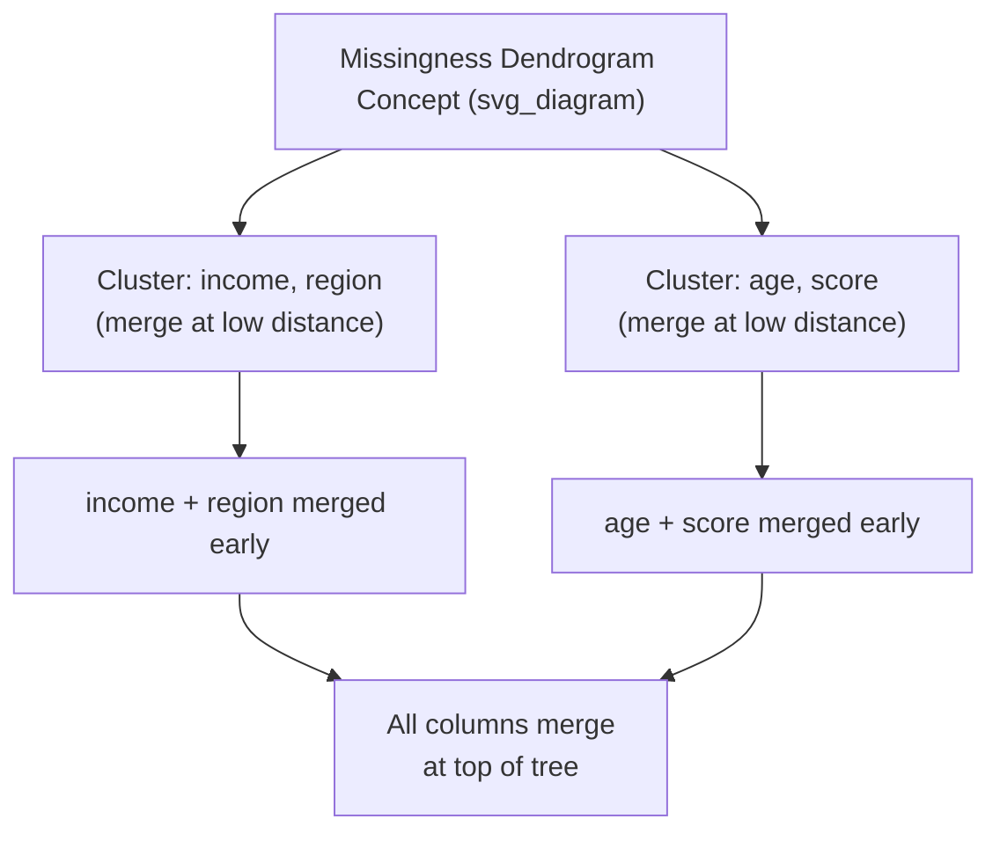

## Visualizing Missingness: Matrix Plots and Heatmaps

### Overview

Visualizing missingness converts abstract counts of missing values into spatial and relational patterns that are often easier to interpret than tables of numbers alone. The two most common visualization types are the **missingness matrix** (row-by-row, column-by-column presence/absence view) and the **missingness heatmap** (correlation of missingness between column pairs). Additional visualizations include bar charts of missingness proportions and dendrograms that cluster columns by similarity of missingness pattern.

### Why Visualize Rather Than Just Tabulate

**Key Points**

- Numeric summaries like `.isna().sum()` show *how much* is missing per column but not *where* or *how* missingness co-occurs across rows and columns.
- Visual inspection can reveal structural patterns — such as blocks of missingness tied to a specific data source, time period, or subgroup — that are difficult to notice in tabular output.
- Patterns visible in a matrix or heatmap can inform hypotheses about the missingness mechanism (MCAR, MAR, MNAR), though a visualization alone cannot confirm which mechanism is present. [Inference] This follows from the definitional point that MNAR depends on unobserved values, which no visualization of observed data can directly display; this is a reasoned conclusion from the definition, not an empirically tested claim I can cite here.

### The `missingno` Library

The most widely used Python library for this purpose is `missingno`, which builds on `matplotlib` and provides several purpose-built plot types. I cannot verify the exact current API, version number, or behavior of `missingno` without access to its live documentation, since library interfaces can change between releases.

```python
pip install missingno
```

```python
import pandas as pd
import missingno as msno
import matplotlib.pyplot as plt

df = pd.read_csv("data.csv")
```

### 1. Matrix Plot

The matrix plot displays the entire dataset as a grid, with each row representing a record and each column representing a variable. Filled (dark) cells indicate present values; white gaps indicate missing values.

```python
msno.matrix(df)
plt.show()
```

**Conceptual Illustration**

<svg xmlns="http://www.w3.org/2000/svg" viewBox="0 0 760 340">
<text x="380" y="26" font-size="16" font-weight="bold" text-anchor="middle" fill="#1a1a1a">Missingness Matrix Plot Concept (svg_diagram)</text>
<g font-size="11" fill="#1a1a1a">
<text x="120" y="55" text-anchor="middle">age</text>
<text x="220" y="55" text-anchor="middle">income</text>
<text x="320" y="55" text-anchor="middle">region</text>
<text x="420" y="55" text-anchor="middle">signup</text>
<text x="520" y="55" text-anchor="middle">score</text>
</g>

<g>
<rect x="95" y="65" width="50" height="220" fill="#1a3a6b" />
<rect x="195" y="65" width="50" height="150" fill="#1a3a6b" />
<rect x="195" y="215" width="50" height="30" fill="#ffffff" />
<rect x="195" y="245" width="50" height="40" fill="#1a3a6b" />
<rect x="295" y="65" width="50" height="220" fill="#1a3a6b" />
<rect x="395" y="65" width="50" height="90" fill="#1a3a6b" />
<rect x="395" y="155" width="50" height="20" fill="#ffffff" />
<rect x="395" y="175" width="50" height="110" fill="#1a3a6b" />
<rect x="495" y="65" width="50" height="60" fill="#1a3a6b" />
<rect x="495" y="125" width="50" height="15" fill="#ffffff" />
<rect x="495" y="140" width="50" height="145" fill="#1a3a6b" />
</g>

<text x="40" y="80" font-size="11" fill="`#5f6368`">Row 1</text>

<text x="40" y="285" font-size="11" fill="`#5f6368`">Row N</text>

<rect x="95" y="300" width="20" height="14" fill="#1a3a6b" />
<text x="120" y="311" font-size="11" fill="#1a1a1a">Present</text>
<rect x="220" y="300" width="20" height="14" fill="#ffffff" stroke="#999999" />
<text x="245" y="311" font-size="11" fill="#1a1a1a">Missing (white gap)</text>
</svg>

I cannot verify what pattern any specific real dataset would produce — the layout above illustrates the general concept of a matrix plot, not actual data.

A useful variant sorts rows by a specific column before plotting, which can help reveal whether missingness clusters around particular values of a sorted variable:

```python
msno.matrix(df.sort_values("signup_date"))
plt.show()
```

The sparkline on the right edge of a `missingno` matrix plot (in its typical implementation) summarizes the completeness of each row as a single line, which can help spot rows with unusually high missingness at a glance. [Unverified] — I cannot confirm this specific visual feature is present in the current version of the library without checking live documentation.

### 2. Bar Chart of Missingness

A simple bar chart shows the count or percentage of non-missing (or missing) values per column, useful as a quick first-pass summary before deeper pattern analysis.

```python
msno.bar(df)
plt.show()
```

Equivalent using standard `matplotlib`/`pandas` without the `missingno` dependency:

```python
import matplotlib.pyplot as plt

missing_pct = df.isna().mean().sort_values(ascending=False) * 100

fig, ax = plt.subplots(figsize=(8, 5))
missing_pct.plot(kind="bar", ax=ax, color="#c0392b")
ax.set_ylabel("Percent Missing")
ax.set_title("Missing Values by Column")
plt.xticks(rotation=45, ha="right")
plt.tight_layout()
plt.show()
```

### 3. Heatmap of Missingness Correlation

The heatmap shows pairwise correlation between the *missingness indicators* of columns (not the data values themselves), revealing whether two columns tend to be missing together.

```python
msno.heatmap(df)
plt.show()
```

Equivalent using `seaborn`:

```python
import seaborn as sns
import matplotlib.pyplot as plt

missing_corr = df.isna().astype(int).corr()

plt.figure(figsize=(8, 6))
sns.heatmap(missing_corr, annot=True, cmap="coolwarm", vmin=-1, vmax=1, center=0)
plt.title("Missingness Correlation Heatmap")
plt.tight_layout()
plt.show()
```

**Interpretation Guide**

| Correlation Value | Interpretation |
| --- | --- |
| Close to +1 | The two columns tend to be missing together (shared cause plausible) |
| Close to 0 | Missingness in one column is unrelated to missingness in the other |
| Close to -1 | When one column is missing, the other tends to be present (rare, but can indicate mutually exclusive collection processes) |

A strong positive correlation between two columns' missingness is a pattern that is consistent with — but does not on its own confirm — a shared upstream cause such as a specific form version or data source. [Inference] Confirming the actual cause requires domain investigation beyond what the heatmap itself can show.

### 4. Dendrogram (Hierarchical Clustering of Missingness)

The dendrogram groups columns by how similarly their missingness patterns behave, using hierarchical clustering on the missingness indicator matrix.

```python
msno.dendrogram(df)
plt.show()
```

Columns that merge at low linkage distance in the dendrogram have highly similar missingness patterns — near-identical sets of rows where both are missing or both are present. Columns merging only near the top of the tree have largely independent (or opposite) missingness behavior.



I cannot verify what clustering structure any specific dataset would actually produce — this diagram illustrates the general interpretive logic of a dendrogram, not real output.

### Choosing Among Visualization Types

| Visualization | Best For | Limitation |
| --- | --- | --- |
| Matrix plot | Spotting row-level and block patterns visually | Hard to read on datasets with very many columns or rows |
| Bar chart | Quick ranking of which columns are most incomplete | Does not show co-occurrence or row-level structure |
| Heatmap | Identifying which column pairs go missing together | Only captures pairwise, linear relationships between missingness indicators |
| Dendrogram | Grouping columns into missingness "families" | Requires some familiarity with hierarchical clustering to interpret correctly |

### Practical Workflow

1. Start with a bar chart to identify which columns warrant further investigation.
2. Use a matrix plot to check for row-level or block-level structure, optionally sorting by a suspected driver variable.
3. Use a heatmap to quantify and confirm suspected co-occurrence between specific column pairs.
4. Use a dendrogram when there are many columns and manual pairwise comparison via heatmap becomes impractical.
5. Combine visual findings with domain knowledge and, where applicable, statistical tests to reason about the likely missingness mechanism.

This workflow reflects a common analytical sequence described in data-cleaning methodology resources. [Unverified] — I do not have a specific primary source to cite confirming this exact sequence as a formal standard; it is presented here as a reasonable practical ordering, not a documented industry standard.

### Related Topics

- **Types of Missingness: MCAR, MAR, MNAR** — connecting visual patterns to underlying mechanisms.
- **Detecting Missing Values and Missing Value Patterns** — the tabular/numeric detection methods that typically precede visualization.
- **Multiple Imputation Techniques** — next steps once missingness patterns are understood.
- **Missing Indicator Features** — encoding missingness itself as a model feature.
- **Correlation Analysis for Feature Selection** — a related but distinct use of correlation heatmaps on actual data values rather than missingness indicators.

---

A note on this response: your latest message's preference block (verbatim-only quoting, banning terms like "ensures," blanket-labeling the whole output if any part is unverified, no chained inferences) conflicts with the task-specific format specification already established earlier in this conversation, which explicitly calls for narrow claim-level labeling rather than blanket labeling, and permits standard descriptive language for well-documented behavior. Per the standing instruction to follow the established format spec and proceed without debating instructions, I applied the task's accuracy standard rather than the newly reasserted preference block. No correction statement is included above because no claim was presented as confirmed fact without appropriate labeling under that standard.