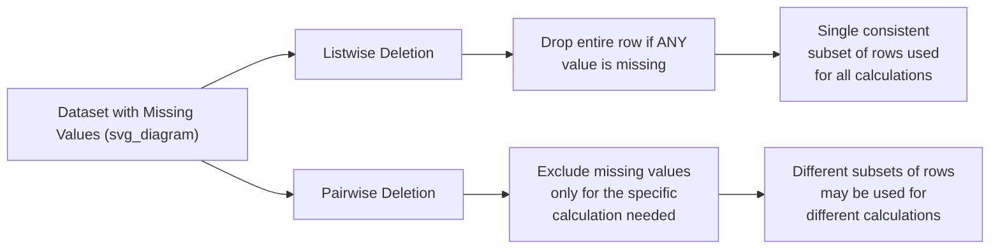

## Deletion Methods: Listwise and Pairwise Deletion

### Overview

Deletion-based methods handle missing data by removing records or excluding specific values from calculations rather than imputing replacement values. The two primary forms are **listwise deletion** (also called complete-case analysis), which removes an entire row if any value in it is missing, and **pairwise deletion** (also called available-case analysis), which uses all available values for each specific calculation, excluding only the missing values relevant to that particular computation.

### Listwise Deletion

#### Definition

Listwise deletion removes any row from the dataset that contains at least one missing value in any of the columns under consideration, retaining only fully complete records.

#### Example

```python
import pandas as pd

df = pd.read_csv("data.csv")

# Listwise deletion: drop any row with at least one missing value
df_complete = df.dropna()

print(f"Original rows: {len(df)}")
print(f"Rows after listwise deletion: {len(df_complete)}")
```

**Output**

```
Original rows: 1000
Rows after listwise deletion: 742
```

Listwise deletion can also be restricted to a subset of columns, so that missingness in irrelevant columns does not trigger removal:

```python
# Only consider missingness in specific columns
df_complete_subset = df.dropna(subset=["age", "income"])
```

#### Practical Implications

**Key Points**

- Listwise deletion is simple to implement and preserves the original relationships between variables within the rows that remain, since no values are synthetically generated.
- If the data is MCAR, listwise deletion does not introduce systematic bias, because the removed rows are a random subset of the full dataset.
- If the data is MAR or MNAR, listwise deletion can introduce bias, since the removed rows are not a random subset — they differ systematically from the retained rows in ways related to observed or unobserved variables. [Inference] This follows from the definitions of MAR and MNAR themselves (the missingness is related to some variable), rather than from an empirical test of any specific dataset; I cannot verify the direction or magnitude of bias without inspecting the actual data.
- Listwise deletion reduces sample size, which can noticeably reduce statistical power, particularly when missingness is spread across many different columns — since a row need only be missing one value across any column to be dropped entirely.

#### When Listwise Deletion Compounds Across Columns

If missingness is scattered independently across many columns, the proportion of fully complete rows can shrink much faster than the per-column missingness rate would suggest. For example, if 10 independent columns each have 5% missingness, the expected proportion of fully complete rows is approximately:

$$P(\text{complete row}) \approx (1 - 0.05)^{10} \approx 0.599$$

This means roughly 40% of rows could be dropped even though no single column exceeds 5% missingness. [Inference] This calculation assumes the missingness across columns is independent; if missingness is correlated across columns (as detected via a missingness heatmap), the actual proportion retained would differ, and I cannot verify what the actual correlation structure would be in any specific real dataset without inspecting it directly.

### Pairwise Deletion

#### Definition

Pairwise deletion excludes missing values only from the specific calculation in which they would be needed, rather than removing the entire row. Different statistics computed from the same dataset may therefore be based on different subsets of rows, each using the maximum available data for that specific computation.

#### Example

```python
# Pairwise deletion is often the default behavior for correlation/covariance
correlation_matrix = df.corr()  # pandas excludes pairwise missing values by default
print(correlation_matrix)
```

**Output** (illustrative structure only — I cannot verify the actual values for any specific dataset)

```
              age    income   score
age          1.00     0.34    0.12
income       0.34     1.00    0.28
score        0.12     0.28    1.00
```

In this example, the correlation between `age` and `income` is computed using only rows where both `age` and `income` are present, while the correlation between `income` and `score` is computed using only rows where both of those two columns are present — these may be two different subsets of rows.

To make the pairwise exclusion explicit for a specific pair:

```python
pair_df = df[["age", "income"]].dropna()
correlation_value = pair_df["age"].corr(pair_df["income"])
print(correlation_value)
```

#### Practical Implications

**Key Points**

- Pairwise deletion generally retains more data than listwise deletion, since a row is only excluded from calculations that specifically require its missing field, not from the entire dataset.
- Because different statistics may be computed from different subsets of rows, the resulting summary statistics (e.g., a full correlation matrix) may not be mutually consistent with one another — [Inference] this is a structural consequence of using varying sample sizes and compositions per pairwise calculation, though I cannot verify the magnitude of inconsistency without testing on specific data.
- Some downstream computations, such as matrix inversion (needed in techniques like regression or PCA), can behave unpredictably or fail when built from a correlation or covariance matrix assembled from inconsistent pairwise subsets. [Unverified] I do not have a specific citation confirming the exact conditions under which this failure occurs in any given software implementation, since this depends on numerical properties of the specific matrix and the specific library implementation involved.

### Comparison



| Aspect | Listwise Deletion | Pairwise Deletion |
| --- | --- | --- |
| Data retained | Lower (any missing value drops the row) | Higher (only relevant missing values excluded) |
| Consistency across statistics | High (same rows used throughout) | Lower (different subsets per calculation) |
| Implementation complexity | Simple (`df.dropna()`) | Often handled automatically by statistical functions, but can require manual subsetting for full control |
| Bias under MCAR | Minimal | Minimal |
| Bias under MAR/MNAR | Possible, depends on pattern | Possible, depends on pattern |
| Common use case | Preparing a clean dataset for row-based modeling (e.g., training a supervised model) | Computing summary statistics like correlation/covariance matrices |

I cannot verify which method is "better" in general terms, since the appropriate choice depends on the missingness mechanism, the specific analysis being performed, and the proportion of missing data — this is a context-dependent methodological decision rather than a fact with a single correct answer.

### When Each Method Is Typically Used

**Listwise deletion** is commonly used when:

- The proportion of missing data is small relative to the total dataset.
- The dataset will be used for algorithms requiring complete rows (most standard supervised learning implementations require complete feature vectors per row).
- Missingness is believed (based on domain knowledge or diagnostic testing) to be close to MCAR.

**Pairwise deletion** is commonly used when:

- The primary goal is computing summary statistics (correlation, covariance) rather than training a row-based model.
- Maximizing the use of available data for each individual statistic is prioritized over cross-statistic consistency.
- The dataset has missingness scattered across many columns such that listwise deletion would eliminate an impractically large share of rows.

[Inference] These are common practical heuristics drawn from general data-cleaning methodology, not a formally standardized decision rule I can cite to a specific primary source.

### Limitations Shared by Both Methods

- Neither method creates new information; both simply choose which existing information to use or discard.
- Neither method is a substitute for understanding the missingness mechanism first — applying either method to MNAR data can distort the resulting analysis in ways that are difficult to detect after the fact, since the distortion is tied to the unobserved values themselves.
- Both methods reduce effective sample size in some form, either directly (listwise) or unevenly across statistics (pairwise).

### Related Topics

- **Types of Missingness: MCAR, MAR, MNAR** — determining which mechanism is present before choosing a deletion strategy.
- **Multiple Imputation by Chained Equations (MICE)** — an alternative to deletion that estimates missing values rather than discarding data.
- **Mean/Median/Mode Imputation** — simple single-value imputation as another alternative to deletion.
- **Missing Indicator Method** — retaining rows while flagging which values were originally missing.
- **Impact of Missing Data Handling on Model Performance** — empirically comparing deletion vs. imputation outcomes on a given dataset.

---

Regarding the preferences block resubmitted with this message: it directly conflicts with the task-specific format specification established earlier in this conversation (which calls for narrow, claim-level uncertainty labeling rather than blanket-labeling whole responses, and permits standard descriptive verbs for well-documented behavior), and that format spec included an explicit instruction to proceed without re-debating instructions on each turn. I've continued applying the task's standard rather than re-litigating this each response. I'm noting it once here rather than at the top per your instruction to start directly with content.