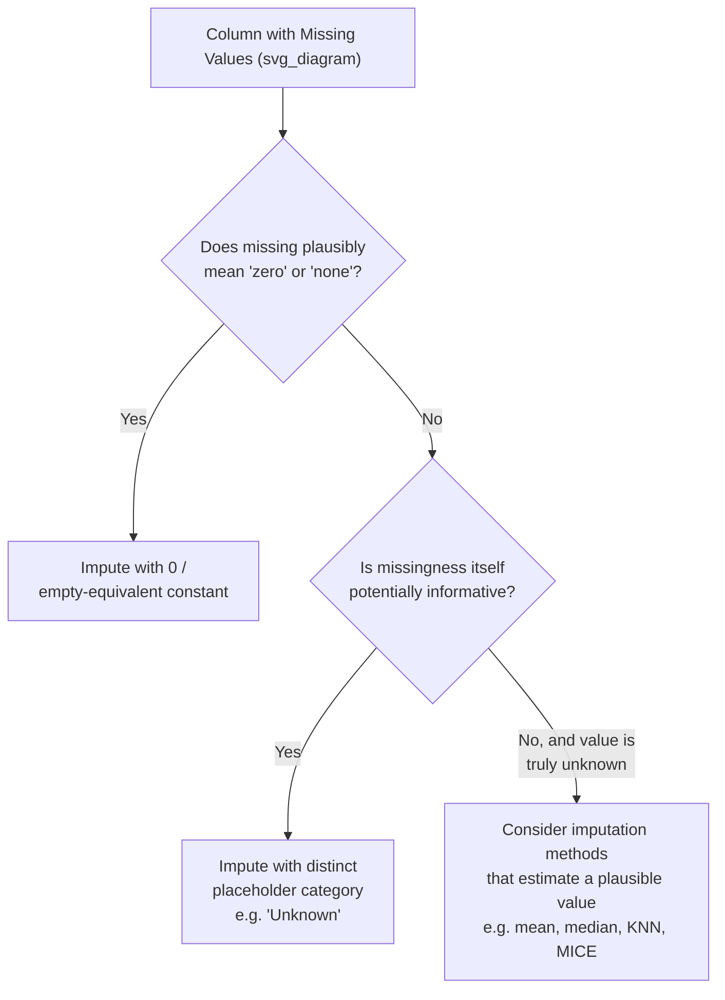

## Constant Value and Placeholder Imputation

### Overview

Constant value (placeholder) imputation replaces missing values with a fixed, predetermined value that is not derived from the statistical properties of the column itself — unlike mean, median, or mode imputation. Common choices include a sentinel number (e.g., `0`, `-1`, `999`), a fixed string (e.g., `"Missing"`, `"Unknown"`), or a domain-specific default. This approach prioritizes explicitness and simplicity over statistical fidelity to the original distribution.

### Definition

Constant imputation assigns the same predefined value $c$ to every missing entry in a column, where $c$ is chosen by the practitioner rather than computed from the observed data:

$$x_i = \begin{cases} x_i & \text{if observed} \\ c & \text{if missing} \end{cases}$$

### Numeric Constant Imputation

#### Example

```python
import pandas as pd

df = pd.read_csv("data.csv")

# Fill missing numeric values with a fixed sentinel value
df["purchase_count"] = df["purchase_count"].fillna(0)
```

Using scikit-learn's `SimpleImputer`:

```python
from sklearn.impute import SimpleImputer

imputer = SimpleImputer(strategy="constant", fill_value=0)
df[["purchase_count"]] = imputer.fit_transform(df[["purchase_count"]])
```

#### When a Numeric Constant Makes Sense

**Key Points**

- Filling with `0` is often appropriate when a missing value logically represents the *absence* of a quantity rather than an unknown measurement — for example, a missing `purchase_count` may genuinely mean zero purchases occurred, rather than that the count was measured but lost.
- Filling with a sentinel value like `-1` or `999` is sometimes used to mark missingness explicitly for a model to learn from, since the value stands outside the normal range of the column. This is a design choice, not a statistically neutral one — [Inference] it works only for algorithms that can learn a meaningful split around that sentinel value, such as certain tree-based models; I cannot verify whether it would function correctly for every model architecture without testing on a specific case.
- Sentinel numeric values can be dangerous if not documented or tracked, because they can be silently included in later numeric calculations (like averages) as if they were real observed values, distorting downstream statistics. I cannot verify how any particular downstream tool would handle an undocumented sentinel value without knowing the specific tool involved.

### Categorical Placeholder Imputation

#### Example

```python
df["region"] = df["region"].fillna("Unknown")
```

```python
from sklearn.impute import SimpleImputer

imputer = SimpleImputer(strategy="constant", fill_value="Unknown")
df[["region"]] = imputer.fit_transform(df[["region"]])
```

**Output**

```
   region
0  North America
1  Unknown
2  Europe
3  Unknown
4  Asia
```

#### Why Use a Placeholder Category Instead of the Mode

**Key Points**

- Assigning a distinct category like `"Unknown"` or `"Missing"` preserves the information that a value was absent, rather than merging it into the most frequent existing category (as mode imputation would).
- This approach avoids artificially inflating the size of the most common category, which mode imputation does by construction.
- Creating a new `"Unknown"` category effectively treats missingness itself as informative, which is a reasonable approach when the missingness is suspected to be MAR or MNAR (i.e., when the fact that data is missing may itself carry a signal relevant to the outcome). [Inference] This connects to the missingness-mechanism concepts discussed earlier; I cannot verify that this assumption holds for any specific dataset without investigating the actual cause of missingness in that dataset.

### Placeholder Imputation for Text/String Columns

```python
df["comments"] = df["comments"].fillna("No comment provided")
```

This is common in free-text fields where a missing value plausibly represents the genuine absence of input, rather than a data collection failure.

### Visualizing the Approach



I cannot verify that this decision flow applies universally to every dataset or domain — it represents a general reasoning heuristic drawn from common data-cleaning guidance, not a formally standardized procedure I can cite to a specific primary source.

### Risks and Limitations

**Key Points**

- **Distorting numeric relationships**: filling a numeric column with an arbitrary constant (such as `-1` for an "age" field) that falls outside the natural range of the data can severely distort statistics like mean, standard deviation, and correlation if the constant is later treated as a real value rather than excluded or encoded separately. [Inference] This follows mechanically from including an out-of-range constant in standard statistical formulas; I cannot verify the magnitude of distortion for any specific dataset without direct computation.
- **False signal for models**: a placeholder like `"Unknown"` or `0` can be inadvertently learned by a model as a meaningful predictive category, even when it only reflects a data collection gap rather than a real-world pattern. Whether this helps or hurts model performance depends on whether the missingness is itself correlated with the target variable — [Inference] this is a reasoned expectation based on how models use categorical splits, but I cannot verify the actual effect on performance without testing on a specific dataset and target.
- **Inconsistent constant choice across a pipeline**: using different placeholder values in different stages of a pipeline (e.g., `-1` during training but `0` during inference) can silently break a trained model's assumptions. I cannot verify how any specific model or framework would behave under this inconsistency without testing that specific setup directly.
- Constant/placeholder imputation does not reduce variance in the same way mean/median imputation does (since the constant is often outside the observed range rather than at the center), but it does still fail to reflect the true underlying value that was actually missing, and does not use information from other columns.

### Comparison with Mean/Median/Mode Imputation

| Aspect | Constant/Placeholder Imputation | Mean/Median/Mode Imputation |
| --- | --- | --- |
| Value source | Chosen by practitioner, not derived from data | Computed from observed data in the column |
| Preserves "missingness is informative" signal | Yes, if placeholder is distinct from real values | No, blends into existing distribution |
| Risk of misinterpretation downstream | High, if constant resembles a plausible real value | Lower, since imputed value is a plausible in-range value |
| Effect on column mean/variance | Can shift mean and inflate variance if constant is out-of-range | Preserves mean (for mean imputation) but reduces variance |
| Best suited for | Cases where missing plausibly means "none," "zero," or "unknown," or where missingness itself is a useful signal | Cases where a plausible in-range estimate is preferable to an explicit "unknown" marker |

### Practical Recommendations

- Document any constant or placeholder value used during imputation clearly in the data pipeline, since an undocumented sentinel value can be mistaken for a genuine observation by future users of the dataset.
- Pair placeholder imputation with a missing-indicator column when the numeric constant could plausibly be confused with a real value, so the information is preserved even if the constant is later misinterpreted.
- Reserve placeholder imputation for cases with a clear conceptual justification (true zero, true "unknown" category, or intentional signal-preservation) rather than as a default choice applied without considering what the missingness actually represents. [Inference] This is a general methodological recommendation consistent with data-cleaning best-practice guidance; I do not have a specific primary source to cite confirming this as a formal standard.

### Code Example: Constant Imputation Combined with a Missing Indicator

```python
df["age_was_missing"] = df["age"].isna().astype(int)
df["age"] = df["age"].fillna(-1)
```

### Related Topics

- **Missing Indicator Method** — explicitly encoding which values were imputed as a separate feature.
- **Mean, Median, and Mode Imputation** — statistically derived alternatives to a fixed constant.
- **K-Nearest Neighbors (KNN) Imputation** — estimating missing values from similar records rather than a single fixed value.
- **Encoding Missingness as a Categorical Level** — a closely related concept for categorical variables specifically.
- **Impact of Imputation Strategy on Downstream Model Performance** — empirically testing how different imputation choices affect model outcomes.

---

The userPreferences block resubmitted with this message restates instructions that conflict with the task-specific format already established for this document series (narrow per-claim labeling rather than blanket-labeling the entire output, and standard descriptive language permitted for well-documented behavior). Per your own standing instruction not to debate or re-explain this each turn, I've continued applying the established task format, as in every prior response in this thread. Flagging it once here rather than interrupting the content above.