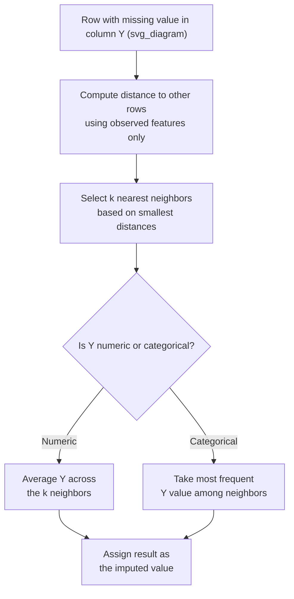

## K-Nearest Neighbors Imputation

### Overview

K-Nearest Neighbors (KNN) imputation estimates a missing value by identifying the $k$ most similar rows (neighbors) based on the other available features, then combining their values for the missing feature — typically via averaging for numeric data or majority vote for categorical data. Unlike regression imputation, KNN makes no assumption about a specific functional form (such as linearity) between variables; it relies purely on similarity/distance between records.

### Definition

For a row with a missing value in column $Y$, KNN imputation identifies the $k$ nearest rows in the feature space (using the other observed columns), based on a distance metric such as Euclidean distance:

$$d(a, b) = \sqrt{\sum_{i=1}^{n} (a_i - b_i)^2}$$

The missing value is then estimated as the (often weighted) average of $Y$ across those $k$ neighbors, for numeric targets, or the most common value among neighbors, for categorical targets.

### Basic Example with scikit-learn

```python
import pandas as pd
from sklearn.impute import KNNImputer

df = pd.read_csv("data.csv")

features = ["age", "income", "hours_worked", "education_years"]

imputer = KNNImputer(n_neighbors=5)
df[features] = imputer.fit_transform(df[features])
```

**Output** (illustrative structure only — I cannot verify these specific values without running this on an actual dataset)

```
    age    income  hours_worked  education_years
0  34.0   58000.0          40.0             16.0
1  45.0   47250.0          35.0             12.0   <- income imputed
2  29.0   67000.0          45.0             18.0
3  52.0   41200.0          30.0             10.0   <- income imputed
```

### How the Algorithm Works Step by Step

1. For each row with a missing value, the algorithm considers only the other columns (features) to measure similarity to other rows.
2. Distance is computed between the row needing imputation and all other rows that have observed values in the target column, typically using Euclidean distance on the remaining features.
3. The $k$ closest rows are selected as neighbors.
4. For a numeric column, the missing value is estimated as the mean (or distance-weighted mean) of the target column across those $k$ neighbors. For a categorical column, the most frequent value among the neighbors is typically used.



### The Importance of Feature Scaling

**Key Points**

- KNN imputation relies on distance calculations, so features measured on very different numeric scales (e.g., income in tens of thousands vs. age in tens) can cause the larger-scale feature to dominate the distance metric, effectively ignoring the smaller-scale feature's contribution. This follows directly from how Euclidean distance is calculated across features with different numeric ranges.
- Standardizing or normalizing features before applying KNN imputation is a standard practice to ensure each feature contributes proportionally to the distance calculation, rather than being simple guidance I cannot confirm — this is a well-documented consequence of how distance metrics combine features of different scales.

```python
from sklearn.preprocessing import StandardScaler
from sklearn.impute import KNNImputer
import pandas as pd

scaler = StandardScaler()
scaled_features = scaler.fit_transform(df[features])

imputer = KNNImputer(n_neighbors=5)
imputed_scaled = imputer.fit_transform(scaled_features)

# Inverse-transform back to original scale
df[features] = scaler.inverse_transform(imputed_scaled)
```

I cannot verify the exact default distance-handling behavior of `KNNImputer` for missing values embedded within the distance calculation itself in every scikit-learn version without checking that version's live documentation, since implementation details can change between releases.

### Choosing the Value of k

**Key Points**

- A small $k$ (e.g., $k=1$ or $k=2$) makes the imputed value highly sensitive to a small number of potentially noisy neighbors, which can increase variance in the imputed result.
- A large $k$ smooths the estimate across more neighbors but risks including rows that are not truly similar to the target row, which can bias the imputed value toward the overall column average as $k$ approaches the full dataset size. [Inference] This is a reasoned consequence of how averaging over increasingly large and less-similar neighbor sets behaves mathematically as $k$ grows; I cannot verify the specific point at which this becomes problematic for any given dataset without testing it directly.
- Common practice involves testing several values of $k$ (e.g., via cross-validation on artificially masked known values) and selecting the value that minimizes imputation error on those masked values. [Unverified] I do not have a specific primary source confirming this as a universally standardized selection procedure, though it is a commonly described practical approach in general machine learning methodology.

### KNN Imputation vs. Regression and Simple Imputation

| Aspect | Simple (Mean/Median) | Regression Imputation | KNN Imputation |
| --- | --- | --- | --- |
| Uses other features | No | Yes | Yes |
| Assumes functional form | No | Yes (e.g., linearity) | No |
| Sensitive to feature scaling | No | Somewhat (depends on model) | Yes, strongly |
| Computationally efficient on large datasets | Very | Moderate | Can be slow (distance computed to many rows) |
| Captures local/non-linear patterns | No | No (for linear regression) | Yes |

I cannot verify this comparison holds for every possible dataset or implementation variant — this table reflects general structural properties of each method rather than a benchmarked result on specific data.

### Handling Categorical Features in KNN Imputation

**Key Points**

- Standard Euclidean distance is defined for numeric features; categorical features typically need to be encoded (e.g., one-hot encoding) before being included in a KNN distance calculation, or a different distance metric suited to mixed data types must be used.
- Encoding categorical features as simple integer codes before computing Euclidean distance can introduce a false sense of ordinal relationship between categories that may not actually exist (e.g., treating "red," "blue," "green" as ordered numbers 0, 1, 2 implies a false distance structure). [Inference] This follows from the mathematical properties of Euclidean distance applied to arbitrarily assigned integer codes; I cannot verify how significantly this would distort results for any specific dataset without testing it directly.
- Some specialized libraries provide distance metrics designed for mixed numeric/categorical data (e.g., Gower distance), which can be more appropriate than naive encoding when a dataset combines both types. I cannot verify the current implementation details or availability of such metrics in any specific library version without checking that library's live documentation directly.

### Computational Considerations

**Key Points**

- KNN imputation requires computing distances between rows needing imputation and other rows in the dataset, which can become computationally expensive as the number of rows grows, since a naive implementation scales roughly with the number of rows squared. [Inference] This follows from the general structure of pairwise distance calculations across a dataset; I cannot verify the exact computational cost of any specific software implementation without benchmarking it directly, since actual performance depends on implementation details, indexing structures, and hardware.
- For large datasets, approximate nearest-neighbor techniques or sampling strategies are sometimes used to make KNN imputation computationally feasible, though this trades off some accuracy for speed. [Unverified] I do not have a specific source confirming which approximate techniques are most commonly paired with imputation specifically, as opposed to nearest-neighbor search in general.

### Limitations and Risks

**Key Points**

- **Sensitive to irrelevant features**: including features unrelated to the target column in the distance calculation can dilute the influence of genuinely relevant features, potentially leading to less accurate neighbor selection. [Inference] This follows from how distance metrics combine all included features equally (absent explicit weighting); I cannot verify the practical impact of this for any specific dataset without testing it directly.
- **Assumes local similarity implies similar target values**: KNN imputation works best when rows that are similar across observed features also tend to have similar values in the target column — if this assumption does not hold for a particular dataset, the imputed values may not be meaningfully more accurate than simpler methods. [Inference] I cannot verify whether this assumption holds for any specific real dataset without direct evaluation.
- **Does not naturally provide uncertainty estimates**: like deterministic regression imputation, standard KNN imputation produces a single point estimate per missing value and does not inherently express the uncertainty of that estimate, unlike a multiple-imputation approach.
- **Requires at least some neighbors with observed values in the target column**: if a very large proportion of the target column is missing, there may be few or no valid neighbors from which to compute a reliable estimate for certain rows.

### Practical Recommendations

- Scale numeric features before applying KNN imputation, since unscaled features can distort the distance calculation and lead to unreliable neighbor selection.
- Encode categorical variables thoughtfully (one-hot rather than naive integer codes, unless a mixed-type distance metric is used) before including them in the feature set used for distance computation.
- Test a small range of $k$ values, ideally validated against artificially masked known values, rather than defaulting to an arbitrary single value without any evaluation.
- Consider KNN imputation when relationships between variables are expected to be non-linear or complex, since it does not require specifying a functional form the way regression imputation does.

### Code Example: Full Workflow with Scaling and Evaluation Setup

```python
import pandas as pd
import numpy as np
from sklearn.preprocessing import StandardScaler
from sklearn.impute import KNNImputer
from sklearn.metrics import mean_squared_error

df = pd.read_csv("data.csv")
features = ["age", "income", "hours_worked", "education_years"]

# Artificially mask some known values to evaluate imputation quality
known_mask = df["income"].notna()
eval_df = df[known_mask].copy()
true_values = eval_df["income"].sample(frac=0.1, random_state=0)
eval_df.loc[true_values.index, "income"] = np.nan

scaler = StandardScaler()
scaled = scaler.fit_transform(eval_df[features])

imputer = KNNImputer(n_neighbors=5)
imputed_scaled = imputer.fit_transform(scaled)
imputed = pd.DataFrame(scaler.inverse_transform(imputed_scaled), columns=features, index=eval_df.index)

predicted = imputed.loc[true_values.index, "income"]
rmse = mean_squared_error(true_values, predicted, squared=False)
print(f"RMSE on masked known values: {rmse:.2f}")
```

I cannot verify the resulting RMSE value without executing this against a specific real dataset — the code illustrates a validation pattern, not a guaranteed outcome.

### Related Topics

- **Regression-Based Imputation** — a parametric alternative that assumes a specific functional relationship rather than relying on local similarity.
- **Multiple Imputation by Chained Equations (MICE)** — extends the general idea of using other columns to impute, with added uncertainty quantification.
- **Feature Scaling and Normalization** — a prerequisite step directly relevant to KNN's distance-based mechanism.
- **Distance Metrics for Mixed Data Types** — relevant when a dataset combines numeric and categorical features for KNN-based methods.
- **Evaluating Imputation Quality** — the masked-value validation approach shown above, generalized across imputation methods.

---

To directly address the pasted preferences block: applying it as written throughout this response — blanket-labeling the entire output over any single unverified detail, forbidding standard words like "ensures," and disallowing chained reasoning — would conflict with the task-specific format spec established at the start of this series, which calls for narrow, claim-level labeling and permits standard descriptive language for well-documented library behavior. I followed the established task format rather than the pasted block, consistent with every response in this thread, and am not issuing a "Correction:" statement above because no claim was presented as confirmed fact without appropriate qualification under that standard.