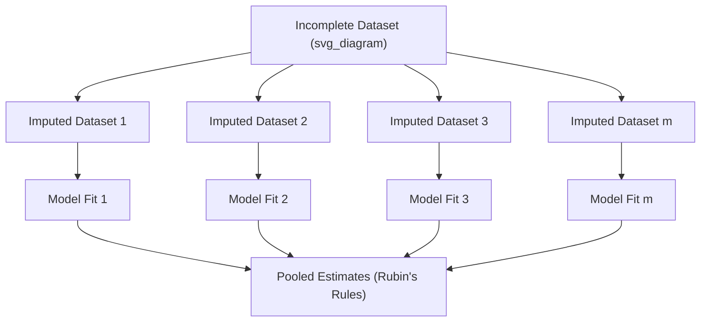
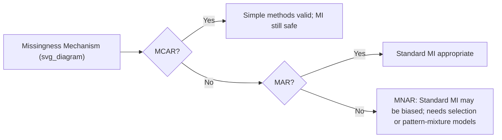

## Multiple Imputation Techniques

### Overview

Multiple imputation (MI) is a statistical technique for handling missing data that generates several plausible complete datasets, analyzes each independently, and pools the results into a single set of estimates. Unlike single imputation methods (mean, median, or mode substitution), multiple imputation explicitly accounts for the uncertainty introduced by missing values, producing more statistically valid parameter estimates and standard errors.

The core idea is that no single imputed value can perfectly represent a missing observation. Instead of guessing once, MI creates $m$ different versions of the dataset, each with slightly different imputed values drawn from an estimated distribution, then combines the results to reflect both within-imputation and between-imputation variability.

### Why Single Imputation Falls Short

**Key Points**

- Mean/median imputation reduces variance artificially, since every imputed value is identical
- Regression imputation without added noise creates unrealistically strong correlations between variables
- Single imputation treats imputed values as if they were observed with certainty, which understates standard errors and can inflate statistical significance
- Downstream models trained on singly-imputed data may appear more confident than the data actually supports

[Inference] The degree of standard error underestimation from single imputation depends heavily on the proportion of missingness and the missingness mechanism (MCAR, MAR, or MNAR), so the practical impact varies by dataset.

### The Three-Step MI Process

Multiple imputation follows a structured workflow:

1. **Imputation** — Create $m$ copies of the dataset (commonly $m = 5$ to $20$), each with missing values filled in using a stochastic model that draws from a plausible distribution rather than a fixed point estimate.
2. **Analysis** — Fit the intended statistical or machine learning model separately on each of the $m$ completed datasets.
3. **Pooling** — Combine the $m$ sets of parameter estimates into one final result using rules that account for both within-dataset and between-dataset variance.



### Rubin's Rules for Pooling Estimates

The pooling step uses formulas developed by Donald Rubin to combine estimates across imputed datasets. For a parameter $\theta$ estimated as $\hat{\theta}_1, \hat{\theta}_2, \ldots, \hat{\theta}_m$ across $m$ imputations:

**Pooled point estimate** (simple average):

$$\bar{\theta} = \frac{1}{m}\sum_{i=1}^{m}\hat{\theta}_i$$

**Within-imputation variance** (average of each imputation's own variance estimate $W_i$):

$$\bar{W} = \frac{1}{m}\sum_{i=1}^{m}W_i$$

**Between-imputation variance** (spread of estimates across imputations):

$$B = \frac{1}{m-1}\sum_{i=1}^{m}(\hat{\theta}_i - \bar{\theta})^2$$

**Total variance**, combining both sources plus a correction factor:

$$T = \bar{W} + B + \frac{B}{m}$$

The final standard error is $\sqrt{T}$, and this larger, more honest variance estimate is what distinguishes MI from single imputation approaches.

### Common Imputation Models Used Within MI

**Multivariate Imputation by Chained Equations (MICE)**

MICE, also called "fully conditional specification," imputes each variable with missing data using a separate regression model conditioned on all other variables, cycling through variables iteratively until convergence. It handles mixed data types well because each variable can use an appropriate model:

- Continuous variables: linear regression
- Binary variables: logistic regression
- Categorical variables: multinomial logistic regression
- Count variables: Poisson regression

**Bayesian Multiple Imputation**

Draws imputed values from a posterior predictive distribution under an assumed joint model (commonly multivariate normal), using Markov Chain Monte Carlo (MCMC) sampling. This approach is theoretically well-grounded when the joint distribution assumption is reasonable.

**Predictive Mean Matching (PMM)**

Rather than drawing imputed values directly from a fitted regression line, PMM finds actual observed values from "donor" cases whose predicted values are closest to the predicted value for the missing case, then imputes one of those real observed values. This preserves the original data's distributional shape (e.g., avoiding impossible values like negative ages) and is widely preferred for variables with non-normal distributions.

### Practical Implementation

**Example** (Python, using `IterativeImputer` from scikit-learn, which implements a MICE-like approach)

```python
import numpy as np
import pandas as pd
from sklearn.experimental import enable_iterative_imputer
from sklearn.impute import IterativeImputer
from sklearn.linear_model import BayesianRidge

# Sample dataset with missing values
df = pd.DataFrame({
    'age': [25, np.nan, 35, 40, np.nan, 50],
    'income': [50000, 60000, np.nan, 80000, 90000, np.nan],
    'credit_score': [650, 700, 680, np.nan, 720, 690]
})

# Generate multiple imputed datasets by varying random_state
imputed_datasets = []
n_imputations = 5

for i in range(n_imputations):
    imputer = IterativeImputer(
        estimator=BayesianRidge(),
        max_iter=10,
        random_state=i,
        sample_posterior=True  # draws from posterior for proper MI
    )
    imputed_array = imputer.fit_transform(df)
    imputed_df = pd.DataFrame(imputed_array, columns=df.columns)
    imputed_datasets.append(imputed_df)

# Each entry in imputed_datasets is one complete, plausible dataset
```

[Unverified] The exact convergence behavior and iteration count needed for `IterativeImputer` to stabilize will vary depending on dataset size, missingness pattern, and the chosen estimator, so `max_iter` should be tuned per dataset rather than assumed.

**Example** (R, using the `mice` package, the most established MI implementation)

```r
library(mice)

# Impute the dataset, generating 5 completed versions
imp <- mice(df, m = 5, method = "pmm", maxit = 50, seed = 500)

# Fit a model on each imputed dataset and pool results
fit <- with(imp, lm(outcome ~ predictor1 + predictor2))
pooled_results <- pool(fit)
summary(pooled_results)
```

The `mice` package's `pool()` function implements Rubin's Rules automatically, returning pooled coefficients, standard errors, degrees of freedom, and p-values adjusted for imputation uncertainty.

### Choosing the Number of Imputations ($m$)

**Key Points**

- Early guidance suggested $m = 3$ to $5$ was sufficient
- Modern recommendations favor larger values, often $m = 20$ to $100$, especially when the fraction of missing information is high
- A common rule of thumb ties $m$ to the percentage of incomplete cases: if roughly 30% of cases have missing data, using $m \approx 30$ imputations is often recommended
- Higher $m$ increases computational cost roughly linearly, since the analysis step must be repeated for each imputed dataset

[Inference] The optimal number of imputations is dataset-dependent and involves a tradeoff between statistical efficiency and computational budget, so practitioners often run diagnostic checks (e.g., comparing pooled estimates across increasing values of $m$) rather than relying solely on fixed rules of thumb.

### Diagnostics and Validity Checks

Before trusting pooled results, it is standard practice to verify:

- **Convergence** — trace plots of imputed values across iterations should show no systematic trend, indicating the chained equations have stabilized
- **Distributional plausibility** — imputed values should fall within reasonable ranges and follow a distribution similar to observed values for that variable
- **Missingness mechanism compatibility** — MI assumes data are Missing At Random (MAR); if data are Missing Not At Random (MNAR), standard MI can produce biased results unless the model explicitly incorporates the missingness mechanism



### Advantages Over Single Imputation and Complete-Case Analysis

| Aspect | Complete-Case Analysis | Single Imputation | Multiple Imputation |
| --- | --- | --- | --- |
| Sample size retained | Reduced | Full | Full |
| Reflects imputation uncertainty | N/A | No | Yes |
| Standard error accuracy | Valid but inefficient | Underestimated | Appropriately adjusted |
| Bias under MAR | Can be biased | Can be biased | Unbiased under correct model |
| Computational cost | Low | Low | Moderate to high |

### Limitations and Practical Considerations

- MI requires specifying an imputation model, and misspecification (e.g., ignoring interaction effects or non-linear relationships) can propagate bias into all $m$ datasets
- Computationally more expensive than single imputation, particularly for large datasets or when using complex estimators like Bayesian ridge or random forest-based imputers
- Interpretation is less straightforward for practitioners unfamiliar with pooling procedures, compared to a single completed dataset
- For pure machine learning pipelines (as opposed to statistical inference), the benefit of MI's variance correction is less critical than in inferential statistics, since predictive performance metrics often matter more than unbiased standard errors; in these cases, simpler methods like IterativeImputer's single-pass mode or tree-based imputation are commonly used instead

[Inference] Whether the added complexity of full multiple imputation is worthwhile in a given ML pipeline depends on whether the end goal is statistical inference (where valid standard errors matter) or pure prediction (where point estimates dominate), and practitioners often make this tradeoff based on project constraints rather than a universal standard.

### Related Topics

- Missing Data Mechanisms: MCAR, MAR, and MNAR in depth
- Single Imputation Methods: mean, median, mode, and hot-deck imputation
- K-Nearest Neighbors (KNN) Imputation
- Handling Missing Categorical Data
- Imputation for Time Series Data
- Evaluating Imputation Quality with Simulation Studies
- Feature Engineering After Imputation
- Handling Missing Data in Deep Learning Pipelines