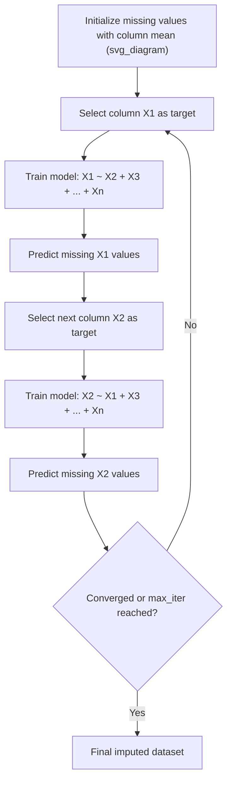
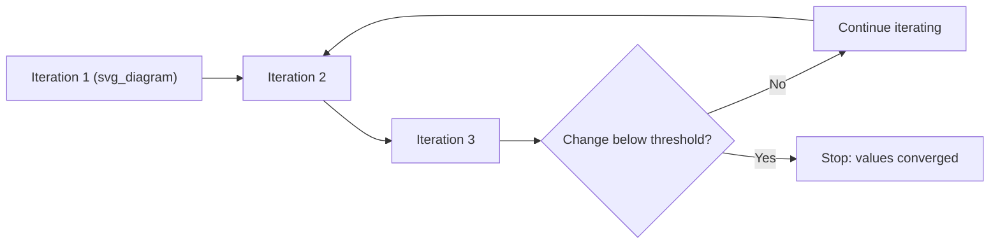

## Model-Based Imputation

### Overview

Model-based imputation treats missing value estimation as a supervised learning problem: for each variable containing missing entries, a predictive model is trained using the other variables as features, and the model's predictions fill in the gaps. This contrasts with simpler statistical approaches (mean, median, mode) by capturing relationships between variables, and it differs from full multiple imputation by typically producing a single completed dataset rather than several plausible versions, though the same underlying models can be extended to a multiple-imputation framework.

The most widely used implementation of this approach is the iterative imputer, which applies a round-robin regression strategy across all incomplete columns.

### Core Concept: Round-Robin Imputation

The iterative imputer models each feature with missing values as a function of all other features, cycling through columns repeatedly until the imputed values stabilize. The general algorithm proceeds as follows:

1. Initialize all missing values with a simple placeholder (typically the column mean or median)
2. Select one column with missing values as the current "target"
3. Train a regression (or classification) model using the other columns as predictors, restricted to rows where the target is observed
4. Predict the missing values in the target column using the trained model
5. Move to the next column with missing values and repeat
6. Continue cycling through all columns for a fixed number of iterations or until values converge



This process is conceptually equivalent to the MICE (Multivariate Imputation by Chained Equations) framework discussed for multiple imputation, but when run as a single pass without generating multiple stochastic datasets, it is often used purely as a deterministic single-imputation method within machine learning preprocessing pipelines.

### Why Model-Based Imputation Outperforms Simpler Methods

**Key Points**

- Captures relationships between features rather than assuming independence, so imputed values reflect patterns observed elsewhere in the data
- Handles both linear and non-linear relationships depending on the chosen estimator
- Adapts naturally to mixed data types when different models are assigned per column type
- Reduces the artificial variance reduction seen with mean/median imputation, since predictions vary by row rather than being a single constant

[Inference] The magnitude of improvement over simple imputation depends on how strongly the missing variable correlates with the other available features; if a variable is largely independent of the rest of the dataset, model-based imputation may offer little advantage over the column mean.

### scikit-learn's IterativeImputer

Scikit-learn provides `IterativeImputer` as its primary model-based imputation tool, explicitly modeled on the MICE approach. It remains marked as experimental in scikit-learn's API, meaning its behavior or parameters may change between versions without following standard deprecation cycles.

**Example** (basic usage with default Bayesian Ridge estimator)

```python
import numpy as np
import pandas as pd
from sklearn.experimental import enable_iterative_imputer
from sklearn.impute import IterativeImputer

df = pd.DataFrame({
    'age': [25, np.nan, 35, 40, np.nan, 50, 29, 33],
    'income': [50000, 60000, np.nan, 80000, 90000, np.nan, 52000, 58000],
    'credit_score': [650, 700, 680, np.nan, 720, 690, 660, 675]
})

imputer = IterativeImputer(
    max_iter=10,
    random_state=42,
    initial_strategy='mean',   # how missing values are seeded initially
    imputation_order='ascending'  # order in which columns are visited
)

imputed_array = imputer.fit_transform(df)
imputed_df = pd.DataFrame(imputed_array, columns=df.columns)
```

**Key Parameters**

| Parameter | Purpose | Common Values |
| --- | --- | --- |
| `estimator` | Regression model used for each column | `BayesianRidge` (default), `RandomForestRegressor`, `KNeighborsRegressor` |
| `max_iter` | Maximum number of round-robin cycles | 10–50 |
| `initial_strategy` | How missing values are seeded before iteration begins | `mean`, `median`, `most_frequent`, `constant` |
| `imputation_order` | Sequence in which columns are imputed | `ascending`, `descending`, `roman`, `arabic`, `random` |
| `sample_posterior` | Whether to draw from a posterior distribution (enables proper multiple imputation) | `True`/`False` |
| `n_nearest_features` | Limits predictors to the N most correlated features, useful for high-dimensional data | integer or `None` |

### Choosing an Estimator

The choice of underlying regression model significantly affects imputation quality and computational cost.

**Bayesian Ridge Regression** (scikit-learn default)

- Assumes approximately linear relationships between features
- Computationally efficient and stable
- Provides built-in regularization, reducing overfitting risk when many predictors are used

**Random Forest Regressor**

```python
from sklearn.ensemble import RandomForestRegressor

imputer = IterativeImputer(
    estimator=RandomForestRegressor(n_estimators=100, random_state=42),
    max_iter=10,
    random_state=42
)
imputed_array = imputer.fit_transform(df)
```

- Captures non-linear relationships and interactions between features automatically
- More computationally expensive, especially as dataset size or `n_estimators` grows
- Generally more robust to outliers than linear estimators

**K-Nearest Neighbors Regressor**

- Imputes based on similarity to nearby observations in feature space
- Sensitive to feature scaling — standardization is typically required beforehand
- Can struggle in high-dimensional spaces due to the curse of dimensionality

[Unverified] The relative performance ranking of these estimators (Bayesian Ridge vs. Random Forest vs. KNN) for imputation accuracy is dataset-specific, and no single estimator is universally superior across all missingness patterns and feature distributions.

### Handling Mixed Data Types

`IterativeImputer` is natively designed for numeric data. Categorical variables typically require encoding before imputation, or a separate specialized approach:

```python
from sklearn.preprocessing import OrdinalEncoder
from sklearn.impute import IterativeImputer
from sklearn.ensemble import RandomForestClassifier, RandomForestRegressor

# Encode categoricals first, preserving NaN for missing entries
encoder = OrdinalEncoder(handle_unknown='use_encoded_value', unknown_value=-1)
df_encoded = df.copy()
categorical_cols = ['category_column']
df_encoded[categorical_cols] = encoder.fit_transform(df[categorical_cols])

# Note: IterativeImputer's estimator must be regression-based;
# categorical columns imputed this way get rounded post-hoc
imputer = IterativeImputer(estimator=RandomForestRegressor(), max_iter=10)
imputed_array = imputer.fit_transform(df_encoded)
```

[Inference] Rounding continuous predictions back to valid categorical codes after imputation is a common workaround, but this can occasionally produce inconsistent or invalid category labels depending on the encoding scheme, so validation of the rounded output is generally advisable.

### R's MICE with Random Forest (`miceRanger` / `mice` with `method = "rf"`)

R practitioners commonly use random forest-based chained equations through the `mice` package directly or the specialized `miceRanger` package.

```r
library(mice)

# Use random forest as the conditional model for each variable
imp <- mice(df, method = "rf", m = 5, maxit = 10, ntree = 100, seed = 42)
completed_data <- complete(imp, 1)  # extract first completed dataset
```

### Convergence and Stability Considerations

Because model-based imputation is iterative, monitoring convergence is important:

- Track the change in imputed values between successive iterations; convergence is typically assumed once changes fall below a small threshold
- Excessively high `max_iter` values increase computation time with diminishing returns once stability is reached
- Poor convergence can indicate that the chosen estimator is a poor fit for the underlying data relationships, or that the missingness pattern is complex (e.g., many variables missing simultaneously in overlapping patterns)



### Computational Cost Comparison

| Method | Relative Speed | Captures Non-Linearity | Handles High Dimensionality | Typical Use Case |
| --- | --- | --- | --- | --- |
| Mean/Median Imputation | Fastest | No | Yes | Quick baseline, low-stakes missingness |
| KNN Imputation | Moderate | Partially | Poor (curse of dimensionality) | Small-to-medium datasets, similar-case reasoning |
| IterativeImputer (Bayesian Ridge) | Moderate | No | Moderate | General-purpose, linear relationships |
| IterativeImputer (Random Forest) | Slow | Yes | Good | Complex, non-linear feature relationships |

### Practical Considerations and Pitfalls

- **Data leakage risk** — the imputer must be fit only on training data and then applied (via `transform`, not `fit_transform`) to validation/test sets, to avoid leaking information from held-out data into the imputation model
- **Feature scaling** — distance-based or regularized estimators (KNN, Bayesian Ridge) generally benefit from standardized features before imputation
- **Order sensitivity** — the sequence in which columns are imputed (`imputation_order`) can influence final results, particularly when `max_iter` is small and convergence has not fully stabilized
- **Not inherently multiple imputation** — by default by default `IterativeImputer` produces one deterministic completed dataset; proper uncertainty quantification requires setting `sample_posterior=True` and generating multiple runs with different random seeds, as described in the multiple imputation discussion

**Example** (correct train/test workflow avoiding leakage)

```python
from sklearn.model_selection import train_test_split

X_train, X_test = train_test_split(df, test_size=0.2, random_state=42)

imputer = IterativeImputer(max_iter=10, random_state=42)
imputer.fit(X_train)  # fit only on training data

X_train_imputed = imputer.transform(X_train)
X_test_imputed = imputer.transform(X_test)  # transform only, no refitting
```

### Related Topics

- Multiple Imputation Techniques and Rubin's Rules
- KNN Imputation in Depth: Distance Metrics and Scaling Requirements
- Handling Missing Categorical Data
- Data Leakage Prevention in Preprocessing Pipelines
- Missing Data Mechanisms: MCAR, MAR, and MNAR
- Deep Learning-Based Imputation (Autoencoders, GAIN)
- Evaluating Imputation Accuracy with Held-Out Masking Experiments