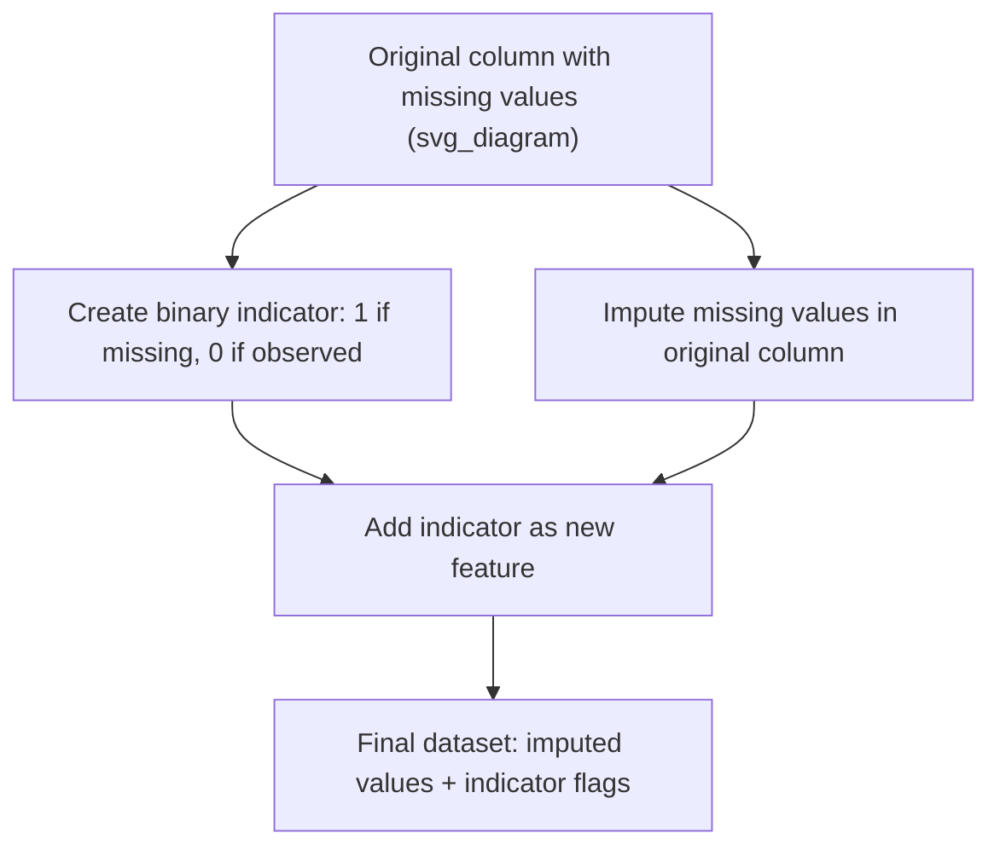

## Creating Missingness Indicator Features

### Overview

A missingness indicator feature (also called a "missing flag" or "shadow variable") is a binary column added to a dataset to explicitly record whether a value was originally missing before imputation. Rather than treating imputation as the final step in handling missing data, this technique preserves the information that a value was absent in the first place, which can itself be predictive of the target variable, particularly under the Missing Not At Random (MNAR) mechanism.

The core principle is straightforward: imputing a value fills the gap numerically, but it discards the fact that a gap existed. Missingness indicators recover that discarded signal by encoding it as a separate feature.

### Why Missingness Itself Can Be Informative

In many real-world datasets, the pattern of missingness is not random noise but carries meaning:

- A missing income field in a loan application might correlate with applicant hesitancy or non-disclosure, which itself relates to credit risk
- A missing lab test result in medical records might indicate the test was not ordered because a physician judged it unnecessary given other observed symptoms — a decision correlated with patient outcome
- A missing survey response might reflect respondent disengagement, which itself correlates with the outcome being measured

[Inference] Whether missingness carries predictive signal depends entirely on the underlying data-generating process, and this cannot be determined from the data alone without domain knowledge or explicit hypothesis testing about why values are missing.

### The Basic Technique

The standard implementation adds one binary column per feature that has missing values, then imputes the original column using any standard method (mean, median, model-based, etc.):



**Example** (Python, pandas)

```python
import pandas as pd
import numpy as np

df = pd.DataFrame({
    'age': [25, np.nan, 35, 40, np.nan, 50],
    'income': [50000, 60000, np.nan, 80000, 90000, 62000]
})

# Create indicator columns before imputing
for col in ['age', 'income']:
    df[f'{col}_was_missing'] = df[col].isna().astype(int)

# Impute the original columns after flags are captured
df['age'] = df['age'].fillna(df['age'].mean())
df['income'] = df['income'].fillna(df['income'].median())

print(df)
```

**Output**

```
    age   income  age_was_missing  income_was_missing
0  25.0  50000.0                0                    0
1  37.5  60000.0                1                    0
2  35.0  63000.0                0                    1
3  40.0  80000.0                0                    0
4  37.5  90000.0                1                    0
5  50.0  62000.0                0                    0
```

### Using scikit-learn's `add_indicator` Parameter

Scikit-learn's imputers include a built-in option to generate these flags automatically as part of the transformation pipeline, avoiding manual column creation.

```python
from sklearn.impute import SimpleImputer
import numpy as np

X = np.array([
    [25, 50000],
    [np.nan, 60000],
    [35, np.nan],
    [40, 80000],
    [np.nan, 90000]
])

imputer = SimpleImputer(strategy='mean', add_indicator=True)
X_transformed = imputer.fit_transform(X)

print(X_transformed)
```

**Output**

```
[[   25.   50000.       0.       0. ]
 [   33.33 60000.       1.       0. ]
 [   35.   70000.       0.       1. ]
 [   40.   80000.       0.       0. ]
 [   33.33 90000.       1.       0. ]]
```

The output array appends indicator columns after the imputed feature columns, with one indicator per original column that contained at least one missing value. This same `add_indicator` parameter is available on `IterativeImputer` and `KNNImputer` as well, allowing the technique to be combined with model-based imputation approaches.

**Using `MissingIndicator` as a standalone transformer**

For more control, scikit-learn also provides a dedicated `MissingIndicator` class that can be used independently or combined with imputers inside a `FeatureUnion` or `ColumnTransformer`:

```python
from sklearn.impute import MissingIndicator, SimpleImputer
from sklearn.pipeline import FeatureUnion

indicator = MissingIndicator()
indicator_features = indicator.fit_transform(X)

imputer = SimpleImputer(strategy='mean')
imputed_features = imputer.fit_transform(X)

# Combine imputed values with indicator flags
X_combined = np.hstack([imputed_features, indicator_features])
```

### When This Technique Adds the Most Value

**Key Points**

- Most beneficial when missingness is suspected to be MAR or MNAR, since MCAR missingness by definition carries no relationship to any variable, including the target
- Particularly useful for tree-based models (random forests, gradient boosting), which can naturally split on indicator flags to learn missingness-related patterns
- Less useful for linear models unless interaction terms between the indicator and the imputed value are explicitly included, since a plain additive indicator only shifts the intercept for missing cases
- Adds interpretability value in domains like healthcare and finance, where "why is this missing" is itself an actionable question

[Inference] The performance benefit of adding indicator features is model-dependent and dataset-dependent; some studies and practitioners report measurable gains from this technique, but it is not guaranteed to improve every model or every dataset, and it should be validated empirically (e.g., via cross-validation with and without the indicators) rather than assumed.

### Interaction Effects with Imputed Values

For linear models, simply adding a flag without allowing it to interact with the imputed feature can understate the missingness signal. An interaction term allows the model to learn a different slope for observed versus imputed cases:

$$y = \beta_0 + \beta_1 x_{imputed} + \beta_2 \cdot m + \beta_3 \cdot (x_{imputed} \times m) + \epsilon$$

where $m$ is the binary missingness indicator (1 if originally missing, 0 otherwise) and $x_{imputed}$ is the feature after imputation. The term $\beta_3$ captures whether the relationship between $x$ and $y$ differs specifically for rows where $x$ was imputed.

```python
df['age_x_missing_interaction'] = df['age'] * df['age_was_missing']
```

### Handling Multiple Missing Columns and Correlated Missingness

When several features share a common missingness pattern (e.g., an entire block of survey questions was skipped together), individual per-column indicators may be redundant. In these cases, a single combined indicator or a missingness pattern encoding can be more efficient:

```python
# Combined indicator for a known co-missing group
survey_cols = ['q1', 'q2', 'q3']
df['survey_block_missing'] = df[survey_cols].isna().any(axis=1).astype(int)

# Alternative: encode the exact missingness pattern as a categorical feature
df['missing_pattern'] = df[survey_cols].isna().astype(int).astype(str).agg(''.join, axis=1)
```

[Unverified] Whether combined pattern indicators outperform per-column indicators depends on how strongly the missingness is jointly correlated across those specific columns in the dataset at hand, and this should be checked rather than assumed from general principle.

### Dimensionality Considerations

Adding one indicator per column with missing data increases feature count, which introduces tradeoffs:

| Consideration | Effect |
| --- | --- |
| Feature count | Increases by one column per originally-incomplete feature |
| Multicollinearity risk | Can occur if missingness patterns are highly correlated across features |
| Sparse indicator columns | If a feature has very few missing values, its indicator column may have near-zero variance and contribute little signal, sometimes warranting removal via variance thresholding |
| Tree-based model impact | Generally low overhead, since trees handle additional binary splits efficiently |
| Linear/regularized model impact | Regularization (L1/L2) can automatically shrink uninformative indicator coefficients toward zero if included in the model |

### Common Pitfalls

- **Applying indicators only after imputation on the wrong array** — the indicator must be captured based on the original missingness mask before any fill operation overwrites the missing values; imputing first and then trying to reconstruct which values were originally missing at is unreliable if the fill value coincides with real data
- **Data leakage across train/test splits** — as with imputation itself, the indicator logic must be derived independently for training and test sets, using only training-set statistics for any imputation applied after flagging (the binary flag itself is row-level and does not leak, but the associated imputation must still respect the train/test boundary)
- **Ignoring indicators for tree-based feature importance analysis** — when interpreting feature importances, forgetting that a missingness indicator exists alongside the imputed feature can lead to underestimating the total contribution of "missingness-related information" for that variable, since the signal is now split across two columns

### Related Topics

- Multiple Imputation Techniques and Rubin's Rules
- Model-Based Imputation with IterativeImputer
- Missing Data Mechanisms: MCAR, MAR, and MNAR
- Feature Engineering for Tree-Based Models
- Handling Missing Categorical Data
- Data Leakage Prevention in Preprocessing Pipelines
- Feature Selection and Dimensionality Reduction After Preprocessing