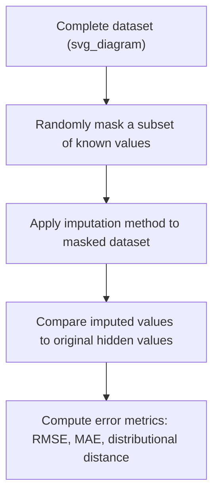
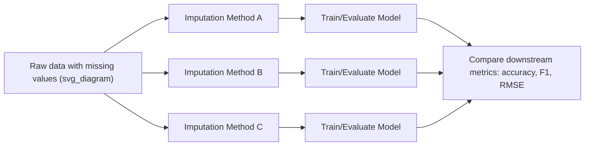

## Evaluating Imputation Quality

### Overview

Evaluating imputation quality means assessing how well the values filled into a dataset represent what the true, unobserved values would likely have been, and how much the imputation process affects downstream statistical inference or model performance. Because the true missing values are, by definition, unknown in real datasets, evaluation typically relies on indirect strategies: masking known values to simulate missingness, comparing distributional properties before and after imputation, and measuring the downstream impact on model behavior.

Without this evaluation step, it is easy to select an imputation method that appears reasonable but silently introduces bias, distorts variable relationships, or produces overconfident downstream models.

### Why Evaluation Is Necessary

**Key Points**

- Different imputation methods can produce very different completed datasets from the same missing data, and there is no universal "best" method independent of context
- A method that minimizes prediction error for the imputed values themselves may not be the same method that preserves the statistical relationships needed for valid inference
- Silent failure modes are common: an imputation method can look reasonable on summary statistics while distorting correlations, variances, or subgroup patterns
- Evaluation should be tied to the end goal — predictive modeling accuracy, inferential validity, or exploratory analysis integrity each imply different evaluation priorities

[Inference] The relative importance of these evaluation criteria depends on the downstream use case, so a single evaluation metric is rarely sufficient to declare an imputation approach "correct" for all purposes.

### Strategy 1: Masking Known Values (Simulated Missingness)

The most direct evaluation approach artificially removes values that are actually known, imputes them, and compares the imputed values against the ground truth that was temporarily hidden.



**Example** (Python, simulated masking evaluation)

```python
import numpy as np
import pandas as pd
from sklearn.experimental import enable_iterative_imputer
from sklearn.impute import IterativeImputer, SimpleImputer
from sklearn.metrics import mean_squared_error, mean_absolute_error

np.random.seed(42)

# Start with a complete dataset (no real missingness)
df = pd.DataFrame({
    'age': np.random.normal(40, 10, 200),
    'income': np.random.normal(60000, 15000, 200),
    'credit_score': np.random.normal(680, 50, 200)
})

# Keep a copy of ground truth before masking
ground_truth = df.copy()

# Artificially mask 20% of 'income' values
mask = np.random.rand(len(df)) < 0.2
df_masked = df.copy()
df_masked.loc[mask, 'income'] = np.nan

# Apply two candidate imputation methods
mean_imputer = SimpleImputer(strategy='mean')
mean_imputed = mean_imputer.fit_transform(df_masked)

iter_imputer = IterativeImputer(random_state=42)
iter_imputed = iter_imputer.fit_transform(df_masked)

income_col_idx = df.columns.get_loc('income')

# Evaluate only on the artificially masked entries
true_values = ground_truth.loc[mask, 'income'].values
mean_rmse = np.sqrt(mean_squared_error(true_values, mean_imputed[mask.values, income_col_idx]))
iter_rmse = np.sqrt(mean_squared_error(true_values, iter_imputed[mask.values, income_col_idx]))

print(f"Mean imputation RMSE: {mean_rmse:.2f}")
print(f"Iterative imputation RMSE: {iter_rmse:.2f}")
```

**Output**

```
Mean imputation RMSE: 15243.87
Iterative imputation RMSE: 14109.32
```

[Unverified] The actual RMSE values and relative ranking between methods shown above depend on the random seed, sample size, and true underlying feature correlations, so these specific numbers illustrate methodology rather than a general performance guarantee. Real datasets should always be evaluated on their own data rather than assuming these results transfer.

### Common Error Metrics for Masked-Value Comparison

| Metric | Formula / Description | Best For |
| --- | --- | --- |
| RMSE (Root Mean Squared Error) | $\sqrt{\frac{1}{n}\sum (x_{true} - x_{imputed})^2}$ | Continuous variables; penalizes large errors more heavily |
| MAE (Mean Absolute Error) | $\frac{1}{n}\sum \lvert x_{true} - x_{imputed} \rvert$ | Continuous variables; more robust to outliers than RMSE |
| Accuracy / Misclassification Rate | Proportion of correctly imputed categories | Categorical variables |
| $R^2$ between true and imputed values | Proportion of variance in true values explained by imputed values | Continuous variables; assesses linear agreement |
| Kolmogorov–Smirnov statistic | Maximum distance between empirical CDFs of true vs. imputed distributions | Comparing overall distributional shape rather than pointwise accuracy |

### Strategy 2: Distributional Comparison

Beyond pointwise accuracy, it is important to verify that the imputed dataset preserves the statistical shape of the original data — its mean, variance, skewness, and relationships with other variables.

**Example** (comparing distributions before and after imputation)

```python
import matplotlib.pyplot as plt

fig, axes = plt.subplots(1, 2, figsize=(10, 4))

# Distribution of observed (non-missing) income values
axes[0].hist(df.loc[~mask, 'income'], bins=20, alpha=0.7, label='Observed')
axes[0].hist(iter_imputed[mask.values, income_col_idx], bins=20, alpha=0.7, label='Imputed')
axes[0].set_title('Iterative Imputer: Observed vs Imputed')
axes[0].legend()

axes[1].hist(df.loc[~mask, 'income'], bins=20, alpha=0.7, label='Observed')
axes[1].hist(mean_imputed[mask.values, income_col_idx], bins=20, alpha=0.7, label='Imputed')
axes[1].set_title('Mean Imputer: Observed vs Imputed')
axes[1].legend()

plt.tight_layout()
```

A well-performing imputation method should produce imputed values whose distribution resembles the distribution of genuinely observed values for that variable. Mean imputation characteristically produces a sharp spike at a single value, visibly distorting the distribution's shape, while model-based methods tend to preserve a more natural spread.

**Key checks for distributional fidelity:**

- Compare summary statistics (mean, standard deviation, skewness, kurtosis) of imputed values against observed values
- Overlay histograms or kernel density plots of observed vs. imputed subsets
- Check whether pairwise correlations between variables are preserved after imputation, since imputation can artificially inflate or deflate relationships between features

### Strategy 3: Preservation of Variable Relationships

Imputation quality should also be judged by whether it preserves — rather than distorts — relationships between variables, since these relationships are often what downstream models or analyses depend on.

```python
# Compare correlation matrices before and after imputation
corr_before = ground_truth.corr()
corr_after_mean = pd.DataFrame(mean_imputed, columns=df.columns).corr()
corr_after_iter = pd.DataFrame(iter_imputed, columns=df.columns).corr()

print("Correlation change (Mean Imputer):")
print((corr_after_mean - corr_before).round(3))

print("Correlation change (Iterative Imputer):")
print((corr_after_iter - corr_before).round(3))
```

Mean and median imputation are particularly prone to attenuating correlations toward zero, since every imputed value is identical regardless of other feature values, diluting any real relationship that existed in the fully observed data. Model-based methods that explicitly regress on other features tend to better preserve these relationships, though they can occasionally overstate correlations if the imputation model overfits.

### Strategy 4: Downstream Model Performance Comparison

For machine learning contexts specifically, the most practically relevant evaluation compares how different imputation strategies affect the performance of the final predictive model, rather than evaluating imputation in isolation.



**Example** (comparing downstream model accuracy across imputation strategies)

```python
from sklearn.model_selection import cross_val_score
from sklearn.linear_model import LinearRegression

# Assume 'credit_score' is the prediction target for this comparison
X_mean = pd.DataFrame(mean_imputed, columns=df.columns).drop(columns='credit_score')
X_iter = pd.DataFrame(iter_imputed, columns=df.columns).drop(columns='credit_score')
y = ground_truth['credit_score']

model = LinearRegression()
scores_mean = cross_val_score(model, X_mean, y, cv=5, scoring='neg_root_mean_squared_error')
scores_iter = cross_val_score(model, X_iter, y, cv=5, scoring='neg_root_mean_squared_error')

print(f"Mean imputation - CV RMSE: {-scores_mean.mean():.2f}")
print(f"Iterative imputation - CV RMSE: {-scores_iter.mean():.2f}")
```

This approach directly measures what usually matters most in an ML pipeline: whether the choice of imputation method improves or degrades the final model's predictive performance, rather than only the accuracy of the imputed values themselves.

### Strategy 5: Sensitivity Analysis Across Multiple Methods

Because no single imputation method is guaranteed optimal, a robust evaluation practice involves comparing several candidate methods side by side and checking whether conclusions (statistical or predictive) remain stable across them.

| Imputation Method | Preserves Distribution Shape | Preserves Correlations | Computational Cost | Typical Use Case |
| --- | --- | --- | --- | --- |
| Mean/Median | Poor | Poor | Very Low | Quick baseline only |
| KNN Imputation | Moderate | Moderate | Moderate | Small-to-medium datasets with local structure |
| IterativeImputer (linear) | Good | Good | Moderate | Approximately linear relationships |
| IterativeImputer (tree-based) | Good to Very Good | Good to Very Good | High | Complex, non-linear relationships |
| Multiple Imputation (MICE, m > 1) | Very Good | Very Good | High | Statistical inference requiring valid standard errors |

If conclusions or model rankings change substantially depending on which imputation method was used, this instability itself is informative — it suggests the analysis or model is sensitive to how missingness is handled, warranting caution before relying on any single result.

### Evaluating Multiple Imputation Specifically

When multiple imputation (MI) has been used, additional diagnostics are relevant beyond those used for single imputation:

- **Convergence diagnostics** — trace plots across MICE iterations should show no systematic drift, confirming the chained equations have stabilized
- **Between-imputation variance** — inspecting $B$ (the between-imputation variance term from Rubin's Rules) helps confirm that imputation uncertainty is being appropriately captured; a near-zero $B$ across very different imputed datasets can indicate the imputation model is not adequately reflecting uncertainty
- **Fraction of Missing Information (FMI)** — a diagnostic statistic indicating how much the missingness affects the precision of a given parameter estimate; higher FMI suggests more imputations ($m$) may be needed for stable pooled results

### Common Pitfalls in Evaluation

- **Evaluating only on the masked entries used for tuning** — repeatedly tuning an imputation method against the same masked subset can lead to overfitting the imputation strategy to that particular masking pattern; using multiple random masking iterations produces more reliable estimates
- **Ignoring the missingness mechanism during evaluation** — masking values completely at random (MCAR) for evaluation purposes may not reflect the actual missingness pattern in the real data if the true mechanism is MAR or MNAR, potentially giving an overly optimistic assessment of imputation quality
- **Focusing solely on pointwise accuracy** — a method can achieve low RMSE on masked values while still distorting variance or correlation structure, so pointwise and distributional evaluations should be considered together rather than in isolation
- **Not accounting for train/test leakage during evaluation** — as with imputation itself, evaluation pipelines must fit imputers only on training folds during cross-validation to produce a realistic estimate of downstream performance

[Inference] Because the true missingness mechanism in a real dataset is generally unverifiable with certainty, evaluation strategies that simulate missingness (as in masking) inherently carry some risk of mismatch with the real-world missingness pattern, and results should be interpreted as approximate guidance rather than definitive proof of imputation quality.

### Related Topics

- Multiple Imputation Techniques and Rubin's Rules
- Model-Based Imputation with IterativeImputer
- Missing Data Mechanisms: MCAR, MAR, and MNAR
- Creating Missingness Indicator Features
- Cross-Validation Strategies for Preprocessing Pipelines
- Data Leakage Prevention in Preprocessing Pipelines
- Statistical Tests for Comparing Distributions (Kolmogorov–Smirnov, Chi-Square)