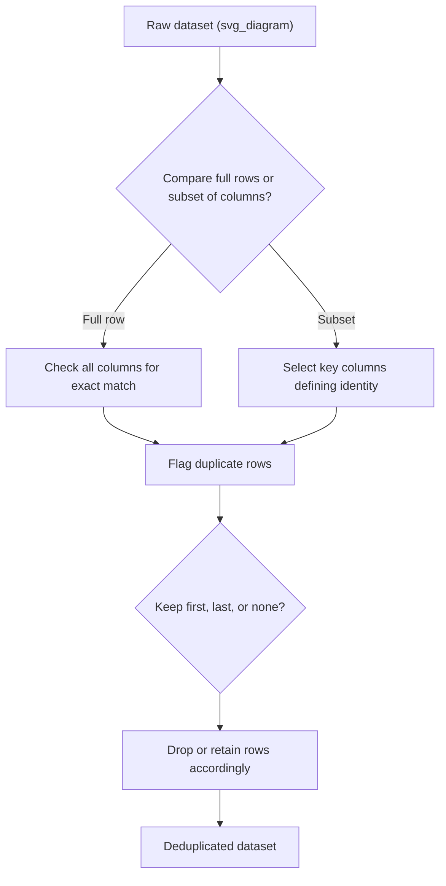

## Exact Duplicate Detection

### Overview

Exact duplicate detection is the process of identifying records within a dataset that are perfectly identical to one another across all (or a defined subset of) fields. Unlike fuzzy or near-duplicate detection, which tolerates minor variations such as typos or formatting differences, exact duplicate detection relies on strict equality comparison. It is typically one of the earliest and most computationally inexpensive steps in a data cleaning pipeline, since exact duplicates are unambiguous and require no similarity thresholding or judgment calls.

Duplicate records can distort downstream analysis in several ways: they inflate the apparent sample size, bias statistical estimates by overweighting certain observations, and can cause data leakage if identical rows end up split across training and test sets.

### Why Exact Duplicates Occur

**Key Points**

- Repeated data entry, such as a user accidentally submitting the same form twice
- Merging data from multiple sources that already share overlapping records
- ETL (Extract, Transform, Load) pipeline errors, such as re-running an ingestion job without deduplication logic
- Logging systems that record the same event multiple times due to retries or replication
- Web scraping processes that revisit the same page or resource across multiple runs

### Full-Row Exact Duplicate Detection

The most straightforward case considers two rows duplicates only if every column value matches exactly.

**Example** (Python, pandas)

```python
import pandas as pd

df = pd.DataFrame({
    'customer_id': [101, 102, 103, 101, 104],
    'name': ['Alice', 'Bob', 'Carol', 'Alice', 'Dave'],
    'email': ['alice@example.com', 'bob@example.com', 'carol@example.com',
              'alice@example.com', 'dave@example.com']
})

# Identify duplicate rows (all columns match)
duplicate_mask = df.duplicated()
print(duplicate_mask)
```

**Output**

```
0    False
1    False
2    False
3     True
4    False
dtype: bool
```

By default, `duplicated()` marks the first occurrence as `False` and any subsequent identical rows as `True`. The `keep` parameter controls which occurrence is treated as the "original":

```python
df.duplicated(keep='first')   # default: mark all but the first occurrence as duplicate
df.duplicated(keep='last')    # mark all but the last occurrence as duplicate
df.duplicated(keep=False)     # mark ALL occurrences involved in a duplicate set as True
```

**Removing exact duplicates**

```python
df_deduplicated = df.drop_duplicates(keep='first')
print(df_deduplicated)
```

**Output**

```
   customer_id   name               email
0          101  Alice   alice@example.com
1          102    Bob     bob@example.com
2          103  Carol   carol@example.com
4          104   Dave    dave@example.com
```

### Subset-Based Duplicate Detection

Often, exact duplication should be judged on a meaningful subset of columns rather than every column in the dataset. For example, two customer records might differ only in a `last_updated` timestamp while representing the same underlying entity.

```python
df_with_timestamp = pd.DataFrame({
    'customer_id': [101, 102, 101],
    'email': ['alice@example.com', 'bob@example.com', 'alice@example.com'],
    'last_login': ['2026-01-01', '2026-01-02', '2026-03-15']
})

# Consider rows duplicates based only on customer_id and email
duplicates_subset = df_with_timestamp.duplicated(subset=['customer_id', 'email'], keep='first')
print(duplicates_subset)
```

**Output**

```
0    False
1    False
2     True
dtype: bool
```

[Inference] The choice of which columns define a "true" duplicate is a domain-specific judgment call rather than a purely technical one; including or excluding a timestamp, ID, or metadata column can substantially change how many duplicates are detected, so this decision should be guided by an understanding of what constitutes a meaningfully distinct record in context.

### Duplicate Detection Workflow



### Handling Case Sensitivity and Whitespace Before Exact Matching

Exact duplicate detection is strict by definition, so values that are semantically identical but differ in case or whitespace will not be flagged unless normalized first. This normalization step is a common precursor to exact matching, even though it introduces a small amount of "fuzziness" into an otherwise exact process.

```python
df = pd.DataFrame({
    'email': ['Alice@Example.com', 'alice@example.com  ', 'BOB@EXAMPLE.COM']
})

# Normalize before checking for exact duplicates
df['email_normalized'] = df['email'].str.strip().str.lower()
duplicates = df.duplicated(subset='email_normalized')
print(duplicates)
```

**Output**

```
0    False
1     True
2    False
dtype: bool
```

[Inference] Whether this kind of normalization should be applied before duplicate detection depends on whether the original casing/whitespace differences are meaningful in context (e.g., case-sensitive system identifiers) or purely incidental formatting artifacts (e.g., user-entered email addresses), so this determination generally requires knowledge of the data source.

### Using SQL for Exact Duplicate Detection

Exact duplicate detection is also commonly performed directly at the database layer, particularly for large datasets where loading everything into memory is impractical.

```sql
-- Identify duplicate rows based on a subset of columns
SELECT customer_id, email, COUNT(*) AS occurrence_count
FROM customers
GROUP BY customer_id, email
HAVING COUNT(*) > 1;
```

```sql
-- Remove exact duplicates, keeping only one row per group (using a window function)
WITH ranked_rows AS (
    SELECT *,
           ROW_NUMBER() OVER (
               PARTITION BY customer_id, email
               ORDER BY last_login DESC
           ) AS row_num
    FROM customers
)
DELETE FROM customers
WHERE customer_id IN (
    SELECT customer_id FROM ranked_rows WHERE row_num > 1
);
```

### Hashing for Efficient Large-Scale Duplicate Detection

For very large datasets, comparing rows column-by-column can be computationally expensive. A common optimization is to compute a hash of each row (or the relevant subset of columns) and compare hashes instead, since hash comparison is much faster than repeated multi-column equality checks.

```python
import pandas as pd

df = pd.DataFrame({
    'customer_id': [101, 102, 103, 101],
    'email': ['alice@example.com', 'bob@example.com', 'carol@example.com', 'alice@example.com']
})

# Create a hash of the relevant columns for fast comparison
df['row_hash'] = pd.util.hash_pandas_object(df[['customer_id', 'email']], index=False)
duplicates_by_hash = df.duplicated(subset='row_hash')
print(duplicates_by_hash)
```

**Output**

```
0    False
1    False
2    False
3     True
dtype: bool
```

[Unverified] The performance advantage of hash-based comparison over direct column comparison depends on the number of columns involved, row count, and the underlying hashing implementation, so the actual speedup should be benchmarked on the dataset and environment in question rather than assumed universally.

### Verifying Duplicate Counts Before and After Removal

A basic but important sanity check after deduplication is confirming the expected reduction in row count and inspecting a sample of removed duplicates to confirm the logic behaved as intended.

```python
original_count = len(df)
deduplicated_df = df.drop_duplicates(subset=['customer_id', 'email'], keep='first')
removed_count = original_count - len(deduplicated_df)

print(f"Original rows: {original_count}")
print(f"Duplicates removed: {removed_count}")
print(f"Remaining rows: {len(deduplicated_df)}")
```

### Duplicate Detection Across Multiple Tables (Cross-Source Deduplication)

When merging data from multiple systems, exact duplicates may appear across table boundaries rather than within a single table. A common approach is concatenating relevant tables and applying the same subset-based logic:

```python
df_source_a = pd.DataFrame({'id': [1, 2], 'email': ['x@example.com', 'y@example.com']})
df_source_b = pd.DataFrame({'id': [3, 4], 'email': ['x@example.com', 'z@example.com']})

combined = pd.concat([df_source_a, df_source_b], ignore_index=True)
cross_source_duplicates = combined.duplicated(subset='email', keep=False)
print(combined[cross_source_duplicates])
```

**Output**

```
   id           email
0   1   x@example.com
2   3   x@example.com
```

### Common Pitfalls

- **Deduplicating on the full row when a natural key exists** — if a dataset has an identifiable unique key (e.g., `customer_id`, `transaction_id`), deduplicating on the entire row can miss duplicates that differ only in a non-essential column like a timestamp or a system-generated log field
- **Deduplicating before understanding why duplicates exist** — removing duplicates without investigating the root cause (e.g., an upstream ETL bug) can mask a recurring data quality problem that will continue to generate duplicates in future data loads
- **Applying `keep='first'` or `keep='last'` without considering row order significance** — if the dataset is not sorted meaningfully (e.g., by timestamp) before deduplication, keeping the "first" or "last" occurrence may not correspond to the most recent or most accurate record
- **Ignoring case sensitivity and whitespace differences** — treating `"Alice@Example.com"` and `"alice@example.com"` as distinct when they represent the same underlying entity can cause exact duplicate detection to under-count true duplicates
- **Applying exact matching where near-duplicate detection is actually needed** — exact duplicate detection will not catch records that differ due to typos, formatting inconsistencies, or minor data entry variations; these require fuzzy matching techniques instead

### Related Topics

- Near-Duplicate and Fuzzy Matching Techniques
- Record Linkage and Entity Resolution Across Datasets
- Data Leakage Prevention in Preprocessing Pipelines
- String Normalization and Standardization Techniques
- Handling Duplicate Detection at Scale (Distributed Computing Approaches)
- Root Cause Analysis for Recurring Data Quality Issues