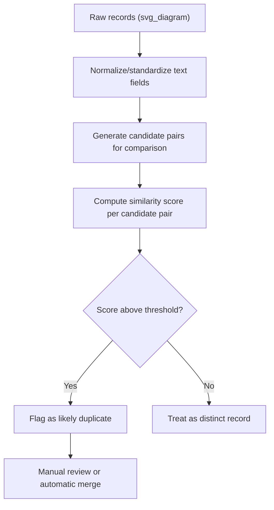
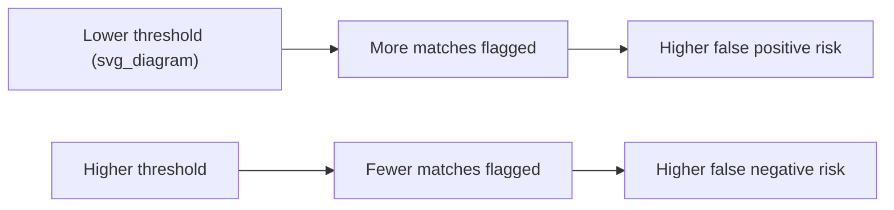

## Fuzzy Duplicate and Near-Duplicate Detection

### Overview

Fuzzy duplicate detection identifies records that represent the same real-world entity despite not being perfectly identical at the character or value level. Unlike exact duplicate detection, which relies on strict equality, fuzzy matching tolerates typos, formatting inconsistencies, abbreviations, word reordering, and other minor variations. This makes it essential for cleaning data drawn from human data entry, merged multi-source datasets, or free-text fields where the same entity can legitimately be represented in many different ways.

The central challenge in fuzzy duplicate detection is defining and computing a notion of "similarity" between records, then choosing a threshold above which two records are considered likely duplicates.

### Why Fuzzy Duplicates Occur

**Key Points**

- Typos and misspellings during manual data entry (e.g., "Jonh Smith" vs. "John Smith")
- Inconsistent formatting or abbreviation (e.g., "St." vs. "Street", "Corp." vs. "Corporation")
- Word order differences (e.g., "Smith, John" vs. "John Smith")
- Differing levels of completeness (e.g., "123 Main St, Apt 4" vs. "123 Main Street")
- Transliteration or encoding differences for names originating in non-Latin scripts
- Multiple independent data sources describing the same entity using slightly different conventions

### String Similarity Metrics

Fuzzy matching relies on quantitative measures of how similar two strings are. Different metrics are suited to different types of variation.

**Levenshtein (Edit) Distance**

Measures the minimum number of single-character insertions, deletions, or substitutions required to transform one string into another.

$$\text{lev}(a, b) = \begin{cases} |a| & \text{if } |b| = 0 \\ |b| & \text{if } |a| = 0 \\ \text{lev}(a_{2:}, b_{2:}) & \text{if } a_1 = b_1 \\ 1 + \min\begin{cases}\text{lev}(a_{2:}, b) \\ \text{lev}(a, b_{2:}) \\ \text{lev}(a_{2:}, b_{2:})\end{cases} & \text{otherwise} \end{cases}$$

```python
import Levenshtein

distance = Levenshtein.distance("Jonh Smith", "John Smith")
print(distance)
```

**Output**

```
2
```

**Jaro-Winkler Similarity**

Designed specifically for short strings like names, giving extra weight to matching prefixes. Produces a similarity score between 0 (no similarity) and 1 (identical).

```python
import jellyfish

similarity = jellyfish.jaro_winkler_similarity("Jonh Smith", "John Smith")
print(similarity)
```

**Output**

```
0.9733333333333333
```

**Cosine Similarity on N-grams / TF-IDF Vectors**

Treats strings as vectors of character n-grams or word tokens, then measures the angle between them. Well-suited to longer text fields like addresses or company names where word order and partial overlap matter more than character-level edits.

```python
from sklearn.feature_extraction.text import TfidfVectorizer
from sklearn.metrics.pairwise import cosine_similarity

names = ["Acme Corporation", "ACME Corp.", "Umbrella Industries"]

vectorizer = TfidfVectorizer(analyzer='char_wb', ngram_range=(2, 3))
tfidf_matrix = vectorizer.fit_transform(names)

similarity_matrix = cosine_similarity(tfidf_matrix)
print(similarity_matrix.round(2))
```

**Output**

```
[[1.   0.55 0.05]
 [0.55 1.   0.03]
 [0.05 0.03 1.  ]]
```

**Soundex and Metaphone (Phonetic Matching)**

Encode strings based on how they sound when spoken, rather than how they are spelled, which is useful for catching names that are spelled differently but pronounced similarly.

```python
import jellyfish

print(jellyfish.soundex("Smith"))
print(jellyfish.soundex("Smyth"))
```

**Output**

```
S530
S530
```

### Comparison of Similarity Metrics

| Metric | Best Suited For | Sensitive To |
| --- | --- | --- |
| Levenshtein Distance | Short strings, typo detection | Character-level insertions/deletions/substitutions |
| Jaro-Winkler | Personal names, short identifiers | Prefix matches, transpositions |
| Cosine Similarity (TF-IDF/n-grams) | Longer text, addresses, company names | Word/character overlap, less sensitive to order |
| Soundex / Metaphone | Phonetically similar names | Pronunciation, not spelling |
| Jaccard Similarity (token sets) | Multi-word fields with reordering | Set overlap of tokens, ignores order and repetition |

[Inference] No single metric is universally best; the appropriate choice depends on the nature of the field being compared (short identifiers vs. long free text) and the type of variation expected in the data, so practitioners often combine multiple metrics or test several before settling on one.

### The Fuzzy Matching Workflow



### Preprocessing Before Fuzzy Matching

Normalizing text before computing similarity scores substantially improves match quality by removing incidental variation that similarity metrics would otherwise have to absorb:

```python
import re

def normalize_text(text):
    text = text.lower().strip()
    text = re.sub(r'[^\w\s]', '', text)   # remove punctuation
    text = re.sub(r'\s+', ' ', text)       # collapse whitespace
    return text

names = ["Acme Corp.", "ACME  Corporation", "acme corp"]
normalized = [normalize_text(n) for n in names]
print(normalized)
```

**Output**

```
['acme corp', 'acme corporation', 'acme corp']
```

Common normalization steps include lowercasing, punctuation removal, whitespace collapsing, and standardizing known abbreviations (e.g., mapping "St." to "Street", "Ave" to "Avenue") using a lookup table.

### The Blocking Problem: Avoiding Quadratic Comparisons

Comparing every record against every other record scales as $O(n^2)$, which becomes computationally infeasible for large datasets. **Blocking** (also called indexing) addresses this by grouping records into smaller candidate buckets — based on a cheap-to-compute key like the first few letters of a name or a postal code — and only performing detailed similarity comparisons within each block.

```python
import pandas as pd

df = pd.DataFrame({
    'name': ['John Smith', 'Jonh Smith', 'Jane Doe', 'Jane Dow', 'Bob Lee']
})

# Simple blocking key: first letter of the name
df['block_key'] = df['name'].str[0].str.lower()
print(df)
```

**Output**

```
         name block_key
0  John Smith         j
1  Jonh Smith         j
2    Jane Doe         j
3    Jane Dow         j
4     Bob Lee         b
```

Within each block, only the records sharing that key are compared pairwise, dramatically reducing the number of comparisons needed compared to a full cross-product of the dataset.

[Inference] The effectiveness of a given blocking key depends on how well it groups genuinely similar records together without splitting true duplicates into different blocks; overly strict blocking keys risk missing matches, while overly loose ones reduce the computational benefit, so blocking strategy typically requires iteration specific to the dataset.

### Using Dedicated Fuzzy Matching Libraries

**RapidFuzz** (Python) — a high-performance library for string matching, commonly used for finding best matches within a list.

```python
from rapidfuzz import process, fuzz

choices = ["Acme Corporation", "Umbrella Industries", "Globex Inc."]
query = "ACME Corp."

best_match = process.extractOne(query, choices, scorer=fuzz.token_sort_ratio)
print(best_match)
```

**Output**

```
('Acme Corporation', 72.0, 0)
```

**recordlinkage** (Python) — a library purpose-built for record linkage and deduplication, combining blocking, similarity comparison, and classification into a structured pipeline.

```python
import recordlinkage
import pandas as pd

df = pd.DataFrame({
    'name': ['John Smith', 'Jonh Smith', 'Jane Doe'],
    'city': ['Boston', 'Boston', 'Chicago']
})

indexer = recordlinkage.Index()
indexer.block('city')  # only compare records within the same city
candidate_pairs = indexer.index(df)

comparer = recordlinkage.Compare()
comparer.string('name', 'name', method='jarowinkler', threshold=0.85, label='name_match')
features = comparer.compute(candidate_pairs, df)

print(features)
```

**Output**

```
         name_match
0 1           1.0
```

### Choosing a Similarity Threshold

Selecting the threshold above which two records are treated as duplicates involves a tradeoff between two types of error:

- **False positives** (setting the threshold too low) — distinct entities are incorrectly merged as duplicates, potentially losing legitimate records
- **False negatives** (setting the threshold too high) — true duplicates are missed and retained as separate records, leaving redundancy in the dataset



A common practical approach is to compute similarity scores for a sample of known duplicate and known non-duplicate pairs (if such labeled examples exist or can be manually created), then select a threshold that balances precision and recall according to the specific cost of each error type in context.

[Inference] There is no universally correct threshold value; the appropriate cutoff depends on the relative cost of merging distinct entities versus failing to merge true duplicates in the specific application, and this is typically determined empirically rather than through a fixed rule.

### Automated Merge vs. Manual Review

For high-confidence matches (very high similarity scores), automatic merging is often reasonable. For borderline matches near the decision threshold, routing candidate pairs to human review is a common practice to avoid compounding errors from an imperfect automated threshold:

```python
def classify_match(score, auto_merge_threshold=0.95, review_threshold=0.80):
    if score >= auto_merge_threshold:
        return 'auto_merge'
    elif score >= review_threshold:
        return 'manual_review'
    else:
        return 'distinct'
```

### Handling Multi-Field Fuzzy Matching

Real-world entity matching often relies on multiple fields simultaneously (name, address, phone number, email) rather than a single field in isolation, since combining evidence across fields improves confidence.

```python
def combined_similarity(row1, row2, weights=None):
    if weights is None:
        weights = {'name': 0.5, 'address': 0.3, 'phone': 0.2}
    
    name_sim = jellyfish.jaro_winkler_similarity(row1['name'], row2['name'])
    address_sim = jellyfish.jaro_winkler_similarity(row1['address'], row2['address'])
    phone_sim = 1.0 if row1['phone'] == row2['phone'] else 0.0
    
    combined_score = (
        weights['name'] * name_sim +
        weights['address'] * address_sim +
        weights['phone'] * phone_sim
    )
    return combined_score
```

[Unverified] The specific weights assigned to each field in a multi-field similarity score are typically chosen based on domain knowledge about which fields are most reliable indicators of true identity in a given dataset, and optimal weights can vary considerably across domains and data sources.

### Common Pitfalls

- **Applying a single global threshold across heterogeneous fields** — a similarity score appropriate for matching short names may be poorly calibrated for matching longer address strings, since string length and structure affect how similarity scores distribute
- **Ignoring blocking, leading to infeasible runtime on large datasets** — without blocking, pairwise comparison across a dataset of millions of records becomes computationally prohibitive
- **Over-normalizing text and losing meaningful distinctions** — aggressive normalization (e.g., stripping all numbers) can accidentally merge genuinely distinct entities, such as different apartment units at the same street address
- **Treating fuzzy matching as a one-time step** — new data sources or ongoing data entry can continue introducing near-duplicates, so fuzzy deduplication is often more effective as a recurring pipeline stage rather than a single cleaning pass
- **Not validating against a labeled sample** — deploying a fuzzy matching threshold without checking it against any manually verified examples of true and false matches makes it difficult to know whether the chosen threshold is actually performing well

### Related Topics

- Exact Duplicate Detection
- Record Linkage and Entity Resolution Across Datasets
- String Normalization and Standardization Techniques
- Handling Duplicate Detection at Scale (Blocking and Distributed Computing)
- Address Parsing and Standardization
- Evaluating Deduplication Precision and Recall