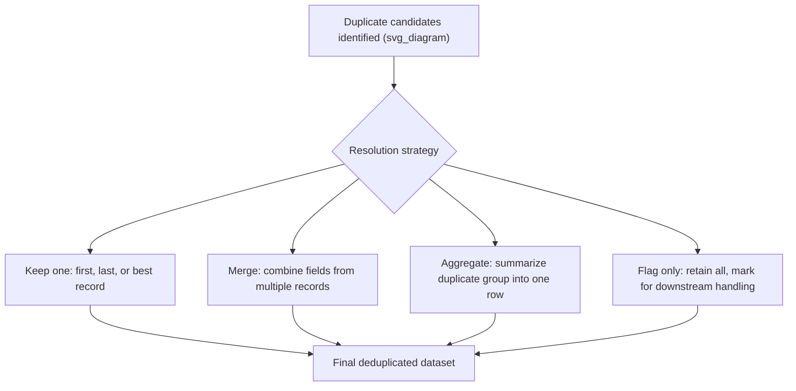
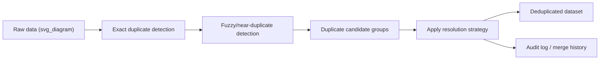

## Deduplication Strategies for Records

### Overview

Deduplication strategy refers to the overall design decisions made once potential duplicate records have been identified — through exact matching, fuzzy matching, or record linkage — regarding how those duplicates should actually be resolved. Identifying that two or more records likely refer to the same entity is only half the problem; the remaining question is what to do with them: which record to keep, how to merge conflicting information, and how to preserve traceability for auditing or reversal.

A well-designed deduplication strategy balances data integrity (not silently losing valid information), consistency (applying rules uniformly across the dataset), and auditability (being able to explain and, if needed, reverse deduplication decisions).

### The Deduplication Decision Framework

Once duplicate candidates are flagged, four broad resolution strategies are commonly available:



### Strategy 1: Keep-One Rules

The simplest approach retains a single representative record from each duplicate group and discards the rest. The choice of which record to keep can follow several common rules:

**Key Points**

- **Keep first** — retains the earliest occurrence, often based on row order or a timestamp; useful when the first-recorded version is presumed most authoritative
- **Keep last** — retains the most recent occurrence; useful when later records are presumed to reflect corrections or updates
- **Keep most complete** — retains the record with the fewest missing fields, preserving maximum information
- **Keep by source priority** — when merging multiple data sources, records from a designated "trusted" source are retained over others

**Example** (keep the most complete record per duplicate group)

```python
import pandas as pd
import numpy as np

df = pd.DataFrame({
    'customer_id': [101, 101, 102, 102],
    'name': ['Alice Smith', 'Alice Smith', 'Bob Lee', 'Bob Lee'],
    'email': ['alice@example.com', np.nan, np.nan, 'bob@example.com'],
    'phone': [np.nan, '555-1234', '555-5678', '555-5678']
})

# Count non-null fields per row as a completeness score
df['completeness'] = df.notna().sum(axis=1)

# Sort so the most complete record appears first within each group, then keep it
df_sorted = df.sort_values(['customer_id', 'completeness'], ascending=[True, False])
deduplicated = df_sorted.drop_duplicates(subset='customer_id', keep='first').drop(columns='completeness')

print(deduplicated)
```

**Output**

```
   customer_id         name              email     phone
1          101  Alice Smith                NaN  555-1234
3          102      Bob Lee  bob@example.com  555-5678
```

[Inference] The "most complete" rule assumes that having more populated fields correlates with data quality, which is a reasonable default but not guaranteed — a record could have more filled fields that are themselves incorrect, so this heuristic works best combined with other quality signals when they are available.

### Strategy 2: Field-Level Merging

Rather than keeping one entire record and discarding the rest, field-level merging combines the best available value for each individual field across all records in a duplicate group, potentially producing a single "golden record" that no single original row fully represented.

```python
def merge_duplicate_group(group):
    merged = {}
    for col in group.columns:
        if col == 'customer_id':
            merged[col] = group[col].iloc[0]
        else:
            non_null_values = group[col].dropna()
            merged[col] = non_null_values.iloc[0] if len(non_null_values) > 0 else np.nan
    return pd.Series(merged)

merged_df = df.drop(columns='completeness', errors='ignore').groupby('customer_id').apply(
    merge_duplicate_group
).reset_index(drop=True)

print(merged_df)
```

**Output**

```
   customer_id         name              email     phone
0          101  Alice Smith  alice@example.com  555-1234
1          102      Bob Lee    bob@example.com  555-5678
```

This "golden record" approach recovers information that a simple keep-one strategy would have discarded, since it combines the email from one duplicate row with the phone number from another rather than sacrificing one or the other.

### Strategy 3: Conflict Resolution Rules for Merging

When merging duplicate records, conflicting non-null values in the same field require an explicit resolution rule rather than an arbitrary default like "first non-null."

| Conflict Resolution Rule | Description | Best Suited For |
| --- | --- | --- |
| Most recent value wins | Use the value from the record with the latest timestamp | Fields expected to change over time (address, phone) |
| Most frequent value wins | Use the value appearing most often across duplicate records | Fields with independent repeated entry (categorical attributes) |
| Source priority | Use the value from a designated authoritative source | Multi-source merges with known data quality hierarchy |
| Longest/most detailed value | Use the most complete or descriptive string | Free-text fields like addresses or notes |
| Manual review flag | Route conflicting values to a human reviewer instead of auto-resolving | High-stakes fields (legal names, financial identifiers) |

```python
def resolve_by_recency(group, value_col, timestamp_col):
    sorted_group = group.sort_values(timestamp_col, ascending=False)
    return sorted_group[value_col].dropna().iloc[0] if sorted_group[value_col].notna().any() else np.nan
```

[Inference] The appropriate conflict resolution rule depends heavily on the semantics of the specific field in question; a rule that works well for resolving conflicting phone numbers (most recent wins) may be inappropriate for resolving conflicting legal names (which might warrant manual review instead), so a uniform rule applied across all fields is often too coarse for production data quality pipelines.

### Strategy 4: Aggregation for Transactional Duplicates

In some contexts, "duplicate" records are not erroneous copies but legitimate repeated events that should be summarized rather than deduplicated in the traditional sense — for example, multiple purchase transactions by the same customer.

```python
transactions = pd.DataFrame({
    'customer_id': [101, 101, 102],
    'purchase_amount': [50.00, 75.00, 120.00],
    'purchase_date': ['2026-01-01', '2026-01-15', '2026-02-01']
})

# Aggregate rather than deduplicate, since each row is a valid distinct event
customer_summary = transactions.groupby('customer_id').agg(
    total_spent=('purchase_amount', 'sum'),
    transaction_count=('purchase_amount', 'count'),
    last_purchase=('purchase_date', 'max')
).reset_index()

print(customer_summary)
```

**Output**

```
   customer_id  total_spent  transaction_count last_purchase
0          101       125.00                  2    2026-01-15
1          102       120.00                  1    2026-02-01
```

This distinction matters: applying a keep-one or merge strategy to genuinely distinct transactional records would incorrectly discard legitimate data, whereas aggregation preserves the full informational content in a summarized form appropriate for entity-level analysis.

### Strategy 5: Flagging Without Removal

In some pipelines, especially those requiring strict auditability, duplicates are flagged but not removed, leaving the resolution decision to a downstream process or human reviewer.

```python
df['is_duplicate_group'] = df.duplicated(subset='customer_id', keep=False)
df['duplicate_group_id'] = df.groupby('customer_id').ngroup()

print(df[['customer_id', 'name', 'is_duplicate_group', 'duplicate_group_id']])
```

**Output**

```
   customer_id         name  is_duplicate_group  duplicate_group_id
0          101  Alice Smith                 True                   0
1          101  Alice Smith                 True                   0
2          102      Bob Lee                 True                   1
3          102      Bob Lee                 True                   1
```

This approach is particularly relevant in regulated industries (finance, healthcare) where silently altering records without an audit trail may violate compliance requirements.

### Preserving an Audit Trail

Regardless of which resolution strategy is chosen, it is generally good practice to retain a record of what was removed or merged, rather than deduplicating destructively.

```python
# Store the original data before deduplication for traceability
original_records = df.copy()
original_records.to_csv('pre_deduplication_snapshot.csv', index=False)

# Record which rows were merged into which final record
merge_log = pd.DataFrame({
    'original_row_index': [0, 1],
    'merged_into_customer_id': [101, 101],
    'merge_timestamp': pd.Timestamp.now()
})
```

**Key Points**

- Storing a pre-deduplication snapshot allows results to be recomputed if the deduplication logic is later found to be flawed
- A merge log mapping original rows to final merged records supports traceability, especially in regulated or high-stakes domains
- Audit trails support reversing incorrect merges, which is otherwise difficult once original rows have been permanently deleted

### Deduplication in a Pipeline Context



### Choosing a Strategy Based on Data Context

| Data Context | Recommended Strategy |
| --- | --- |
| Exact copies from a repeated ETL run | Keep-one (first or last, based on pipeline semantics) |
| Multi-source customer records with partial overlap | Field-level merge with source priority rules |
| Legitimate repeated transactions | Aggregation, not deduplication |
| Regulated or compliance-sensitive data | Flag-only with manual review, preserving full audit trail |
| Large-scale, low-stakes data cleaning | Automated keep-one or merge based on completeness heuristics |

[Inference] Selecting the right strategy for a given dataset is a judgment call informed by the domain, the regulatory environment, and the relative cost of losing information versus retaining redundant or conflicting records, rather than a decision that can be made from the data structure alone.

### Common Pitfalls

- **Applying a single deduplication rule uniformly across all fields** — different fields (names, timestamps, monetary amounts) often warrant different conflict resolution logic, and a one-size-fits-all rule can silently discard the more accurate value in specific fields
- **Deduplicating transactional or event-level data as if it were entity-level data** — collapsing legitimately repeated events into a single row destroys information that aggregation would have preserved appropriately
- **Destructive deduplication without an audit trail** — permanently deleting rows during deduplication removes the ability to review, validate, or reverse the decision later if the logic is found to be flawed
- **Ignoring source reliability during multi-source merges** — treating all data sources as equally trustworthy when merging conflicting values can introduce lower-quality data into the final "golden record" if a less reliable source happens to be processed later in the merge order
- **Not re-running deduplication as new data arrives** — deduplication is often treated as a one-time cleaning step, but new records continuing to enter the pipeline require deduplication logic to be applied on an ongoing basis, not just once historically

### Related Topics

- Exact Duplicate Detection
- Fuzzy Duplicate and Near-Duplicate Detection
- Record Linkage and Entity Resolution Across Datasets
- Golden Record Construction in Master Data Management
- Data Lineage and Audit Trail Design
- Data Quality Monitoring in Production Pipelines