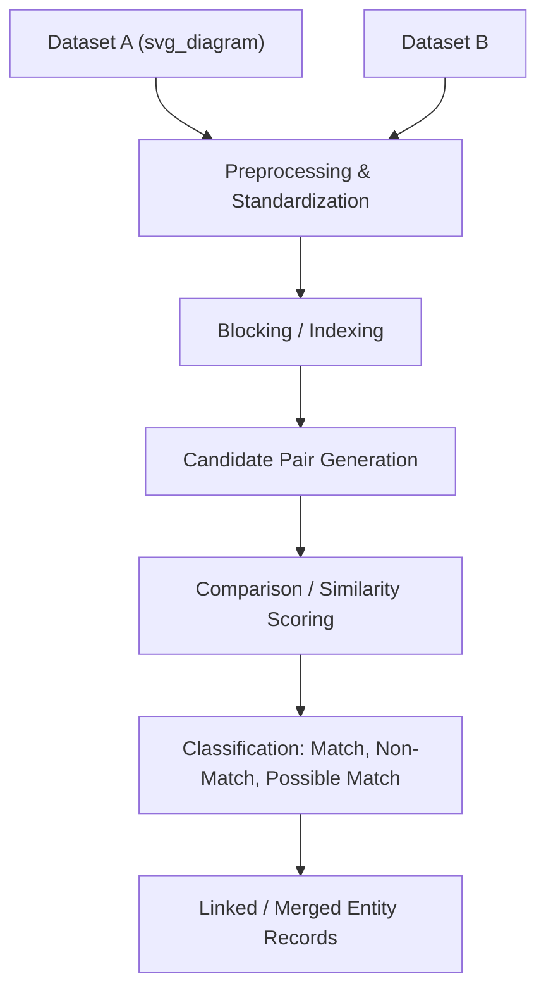
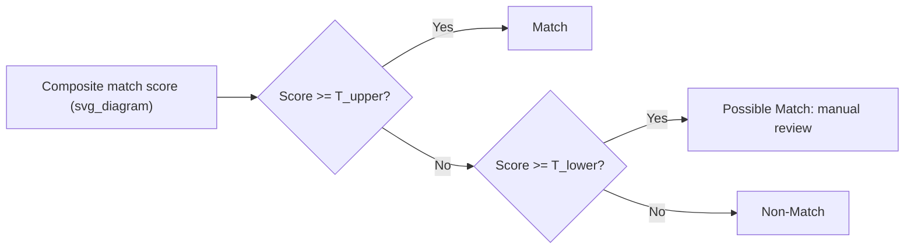
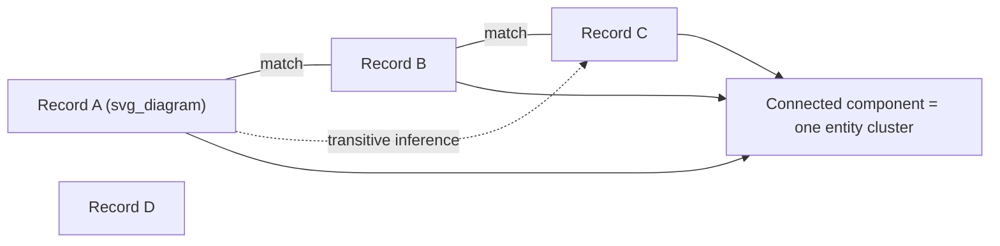

## Entity Resolution and Record Linkage Basics

### Overview

Entity resolution (also called record linkage) is the process of determining which records across one or more datasets refer to the same real-world entity, even when those records lack a shared unique identifier and may differ in formatting, completeness, or accuracy. While deduplication typically focuses on removing redundant copies within a single dataset, entity resolution addresses the broader and often more difficult problem of linking related records both within and across datasets, forming the foundation on which fuzzy deduplication techniques are built.

Entity resolution underlies many practical data integration tasks: merging customer databases after a company acquisition, linking patient records across different healthcare providers, or consolidating product listings scraped from multiple e-commerce sites.

### Core Terminology

**Key Points**

- **Entity** — the real-world object or concept a record refers to (a person, company, product, location)
- **Record linkage** — the process of matching records across two or more datasets that refer to the same entity
- **Deduplication** — a special case of entity resolution where matching occurs within a single dataset
- **Golden record** — a single, consolidated, authoritative representation of an entity built from multiple matched records
- **Candidate pair** — two records being evaluated for a potential match
- **Match, non-match, and possible match** — the three-way classification outcome common in probabilistic record linkage, where uncertain pairs are routed for further review rather than being forced into a binary decision

### The General Record Linkage Pipeline



This pipeline extends the fuzzy matching workflow discussed previously by formalizing the classification step into a structured decision process, and by explicitly supporting the linkage of records across separate datasets rather than only within one.

### Deterministic vs. Probabilistic Record Linkage

**Deterministic Record Linkage**

Applies a fixed set of exact-match rules across one or more fields to determine a match. A pair is linked only if it satisfies the specified rule exactly.

```python
import pandas as pd

df_a = pd.DataFrame({'ssn': ['123-45-6789', '987-65-4321'], 'name': ['John Smith', 'Jane Doe']})
df_b = pd.DataFrame({'ssn': ['123-45-6789', '111-22-3333'], 'name': ['Jonathan Smith', 'Bob Lee']})

# Deterministic linkage on an exact identifier field
linked = pd.merge(df_a, df_b, on='ssn', suffixes=('_a', '_b'))
print(linked)
```

**Output**

```
           ssn      name_a      name_b
0  123-45-6789  John Smith  Jonathan Smith
```

Deterministic linkage is simple, fast, and highly precise when a reliable shared identifier (like a national ID number or account number) exists across datasets. Its main limitation is that it fails entirely when no such reliable field is available, or when that field contains errors.

**Probabilistic Record Linkage**

Instead of requiring an exact match, probabilistic linkage computes the likelihood that two records refer to the same entity based on the combined evidence from multiple partially-matching fields, even when no single field matches perfectly.

[Inference] Probabilistic approaches are generally necessary whenever no single reliable identifier is shared across datasets, which is common when merging data collected independently by different organizations using different conventions.

### The Fellegi-Sunter Model

The Fellegi-Sunter framework, developed in 1969, remains the theoretical foundation for most modern probabilistic record linkage systems. It formalizes the matching decision using likelihood ratios based on how informative each field comparison is.

For each field being compared, two conditional probabilities are estimated:

$$m_i = P(\text{field } i \text{ agrees} \mid \text{records are a true match})$$


$$u_i = P(\text{field } i \text{ agrees} \mid \text{records are not a true match})$$

The ratio $m_i / u_i$ indicates how much a matching value on field $i$ should increase confidence that two records are a true match — an agreement on a rare, highly specific value (like an unusual last name) provides much stronger evidence than an agreement on a common value.

A composite match score across all compared fields is computed as a weighted sum, typically using log-likelihood ratios:

$$\text{score} = \sum_{i} \log\left(\frac{m_i}{u_i}\right) \cdot \text{agreement}_i$$

Two thresholds are then applied to classify each candidate pair:

$$\text{score} \geq T_{upper} \implies \text{Match}$$


$$T_{lower} \leq \text{score} < T_{upper} \implies \text{Possible Match (manual review)}$$


$$\text{score} < T_{lower} \implies \text{Non-Match}$$



[Unverified] The specific values chosen for $T_{upper}$ and $T_{lower}$ are dataset- and application-specific, typically calibrated using a sample of manually labeled true and false matches rather than derived analytically, so no universal threshold values apply across domains.

### Implementing Probabilistic Linkage with the `recordlinkage` Library

```python
import recordlinkage
import pandas as pd

df_a = pd.DataFrame({
    'name': ['John Smith', 'Jane Doe', 'Robert Brown'],
    'city': ['Boston', 'Chicago', 'Austin'],
    'birth_year': [1985, 1990, 1978]
})

df_b = pd.DataFrame({
    'name': ['Jon Smith', 'Jayne Doe', 'Robert Browne'],
    'city': ['Boston', 'Chicago', 'Austin'],
    'birth_year': [1985, 1991, 1978]
})

# Step 1: Blocking to reduce candidate pairs
indexer = recordlinkage.Index()
indexer.block('city')
candidate_pairs = indexer.index(df_a, df_b)

# Step 2: Compare fields using appropriate similarity methods
comparer = recordlinkage.Compare()
comparer.string('name', 'name', method='jarowinkler', label='name_score')
comparer.exact('birth_year', 'birth_year', label='birth_year_score')
features = comparer.compute(candidate_pairs, df_a, df_b)

print(features)
```

**Output**

```
     name_score  birth_year_score
0 0    0.911111                 1
1 1    0.888889                 0
2 2    0.943939                 1
```

```python
# Step 3: Classify matches using a simple weighted sum threshold
features['total_score'] = features['name_score'] * 0.6 + features['birth_year_score'] * 0.4
matches = features[features['total_score'] >= 0.85]
print(matches)
```

**Output**

```
     name_score  birth_year_score  total_score
0 0    0.911111                 1     0.946667
2 2    0.943939                 1     0.966364
```

### Machine Learning-Based Entity Resolution

Rather than manually specifying weights for a linear scoring rule, entity resolution can be framed as a supervised classification problem: given a labeled set of known matching and non-matching pairs, train a classifier to predict match probability from similarity feature vectors.

```python
from sklearn.ensemble import RandomForestClassifier
from sklearn.model_selection import train_test_split

# Assume 'features' contains similarity scores for candidate pairs
# and 'labels' contains manually verified match/non-match outcomes (1/0)
X_train, X_test, y_train, y_test = train_test_split(
    features[['name_score', 'birth_year_score']], labels, test_size=0.2, random_state=42
)

clf = RandomForestClassifier(n_estimators=100, random_state=42)
clf.fit(X_train, y_train)

match_probabilities = clf.predict_proba(X_test)[:, 1]
```

**Key Points**

- ML-based approaches can automatically learn complex, non-linear combinations of field similarities that a simple weighted sum might miss
- Requires a labeled training set of verified matches and non-matches, which can be costly to construct, often via active learning or manual annotation of a sample
- Feature importance from tree-based classifiers can reveal which fields are most informative for distinguishing true matches, offering insight beyond a black-box decision

[Inference] The practicality of machine learning-based entity resolution depends on the availability of sufficient labeled training data; for one-off or small-scale linkage tasks, the effort of building a labeled training set may not be justified compared to a simpler rule-based or threshold-based approach.

### Comparing Linkage Approaches

| Approach | Requires Shared Identifier | Requires Labeled Training Data | Handles Complex Field Interactions | Interpretability |
| --- | --- | --- | --- | --- |
| Deterministic (exact match) | Yes | No | No | Very High |
| Fellegi-Sunter Probabilistic | No | Partially (for calibrating m/u weights) | Limited (linear combination) | High |
| Machine Learning Classifier | No | Yes | Yes | Moderate to Low (depending on model) |
| Fuzzy String Matching (threshold-based) | No | No | No | High |

### Graph-Based Entity Resolution

For datasets involving more than two sources, or where transitive relationships matter (Record A matches Record B, and Record B matches Record C, implying A and C should also be grouped), entity resolution is often modeled as a graph clustering problem rather than pairwise classification alone.



Records connected directly or transitively through matches are grouped into connected components, each representing a single resolved entity, using graph algorithms such as connected components analysis or more sophisticated clustering methods when match confidence varies across edges.

[Inference] Transitive closure assumptions (if A matches B and B matches C, then A matches C) can occasionally introduce errors in graph-based entity resolution, particularly when pairwise match decisions near the classification threshold are individually uncertain, so some systems apply additional consistency checks before finalizing entity clusters.

### Evaluating Record Linkage Quality

As with fuzzy deduplication, evaluating entity resolution quality relies on precision and recall against a labeled sample of known true matches and non-matches:

$$\text{Precision} = \frac{\text{True Matches Identified}}{\text{Total Pairs Classified as Matches}}$$


$$\text{Recall} = \frac{\text{True Matches Identified}}{\text{Total Actual True Matches}}$$


$$F_1 = 2 \cdot \frac{\text{Precision} \cdot \text{Recall}}{\text{Precision} + \text{Recall}}$$

A common practice is manually reviewing a random sample of classified matches and non-matches (not only the borderline "possible match" cases) to estimate these metrics realistically, since focusing evaluation only on uncertain cases can give a distorted picture of overall system performance.

### Common Pitfalls

- **Relying solely on a single shared field assumed to be a reliable identifier** — fields like email or phone number can be shared across different individuals (e.g., a family email account) or can change over time, undermining deterministic linkage assumptions
- **Ignoring blocking strategy design** — a poorly chosen blocking key can either miss true matches (if the key is too strict) or fail to reduce computational cost meaningfully (if the key is too loose)
- **Treating all candidate pairs as independent when transitive relationships exist** — pairwise matching decisions made independently can produce inconsistent entity groupings across a larger network of records unless graph-based consistency is applied
- **Insufficient evaluation sampling** — evaluating linkage quality only on pairs near the decision threshold, rather than a representative random sample across the full score distribution, tends to overestimate precision and recall
- **Assuming probabilistic weights transfer across datasets** — m and u probabilities estimated from one data source pairing may not generalize to a different pairing of sources with different data quality characteristics, so recalibration is often necessary

### Related Topics

- Exact Duplicate Detection
- Fuzzy Duplicate and Near-Duplicate Detection
- Deduplication Strategies for Records
- Golden Record Construction in Master Data Management
- Graph Clustering Algorithms for Data Integration
- Active Learning for Labeling Match/Non-Match Training Data