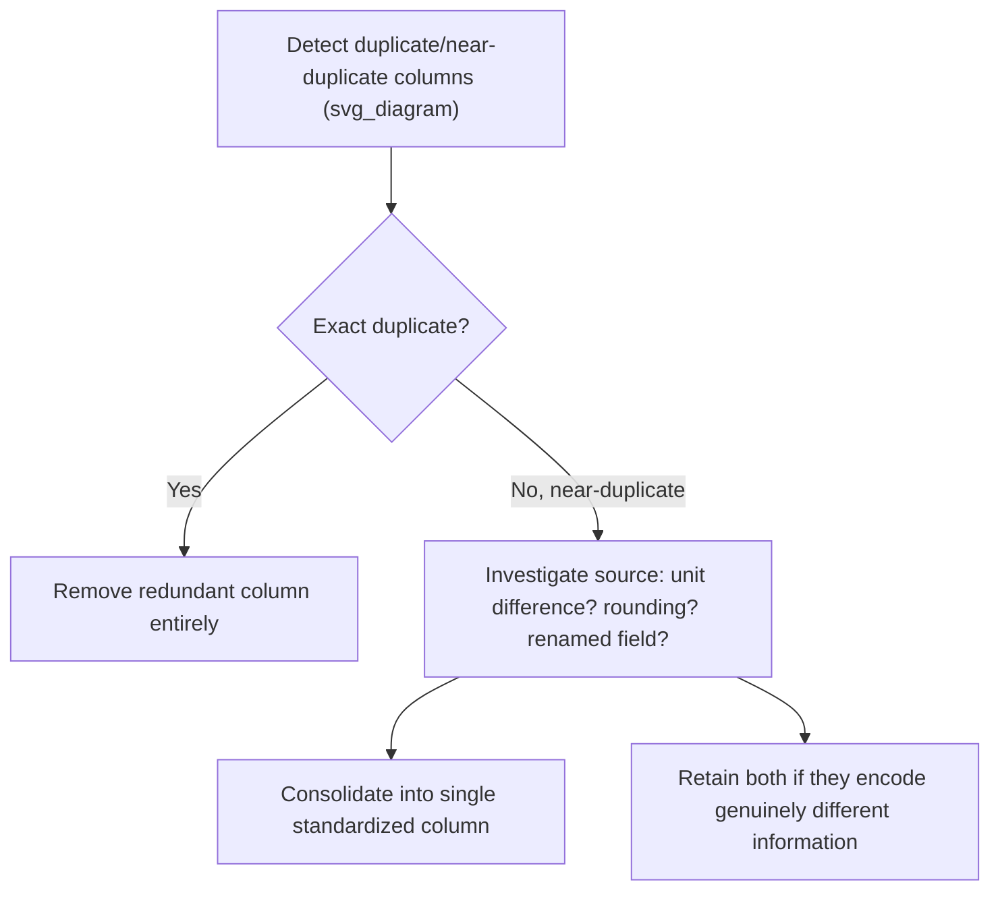

## Handling Duplicate Features and Multicollinearity at the Raw Data Level

### Overview

While earlier deduplication topics addressed duplicate *rows* (records referring to the same entity), this topic addresses duplicate and redundant *columns* — features that carry the same or highly overlapping information. Duplicate features arise when identical or near-identical variables are present under different names, and multicollinearity arises when features are not identical but are strongly linearly related to one another. Both problems can degrade model interpretability, destabilize certain algorithms, and inflate dimensionality without adding genuine information, making them an important consideration at the raw data level before feature engineering or model training begins.

Unlike missing data or duplicate rows, which are usually visibly problematic, duplicate and redundant features can be subtle, since two columns may appear differently named or scaled while conveying essentially the same underlying signal.

### Distinguishing Duplicate Features from Multicollinearity

**Key Points**

- **Duplicate features** — two or more columns contain identical or near-identical values across all rows (e.g., `temperature_celsius` and `temperature_c`, or a column accidentally included twice under different names)
- **Multicollinearity** — two or more features are strongly linearly correlated but not identical (e.g., `height_cm` and `weight_kg`, which often correlate but represent distinct measurements)
- **Perfect multicollinearity** — a special case where one feature is an exact linear combination of others (e.g., `total_price = quantity * unit_price`, where all three columns are present)
- Duplicate features are a data cleaning problem solvable by removal; multicollinearity is a more nuanced statistical issue that may or may not require intervention depending on the modeling approach used

### Detecting Exact Duplicate Columns

The simplest case involves columns that are byte-for-byte identical across all rows.

```python
import pandas as pd
import numpy as np

df = pd.DataFrame({
    'age': [25, 30, 35, 40],
    'age_years': [25, 30, 35, 40],
    'income': [50000, 60000, 75000, 80000],
    'salary': [50000, 60000, 75000, 80000]
})

# Transpose and check for duplicate rows in the transposed dataframe
duplicate_columns = df.T[df.T.duplicated()].index.tolist()
print(duplicate_columns)
```

**Output**

```
['age_years', 'salary']
```

```python
# Remove exact duplicate columns, keeping the first occurrence
df_deduplicated = df.loc[:, ~df.T.duplicated()]
print(df_deduplicated.columns.tolist())
```

**Output**

```
['age', 'income']
```

[Unverified] The transpose-based approach shown above is computationally efficient for datasets with a moderate number of columns, but for very wide datasets (thousands of columns) this method's memory and runtime cost should be evaluated, since transposing large dataframes can be expensive; hashing column contents is a common alternative for such cases.

### Detecting Near-Duplicate Columns

Near-duplicate columns are not byte-identical but carry effectively the same information, often due to unit conversion, rounding differences, or minor formatting inconsistencies.

```python
df_near_dup = pd.DataFrame({
    'temp_celsius': [20.0, 25.0, 30.0],
    'temp_celsius_rounded': [20, 25, 30],
    'humidity': [45, 50, 55]
})

# Check correlation between numeric columns as a proxy for near-duplication
correlation_matrix = df_near_dup.corr()
print(correlation_matrix)
```

**Output**

```
                       temp_celsius  temp_celsius_rounded  humidity
temp_celsius               1.000000               1.000000  0.998461
temp_celsius_rounded       1.000000               1.000000  0.998461
humidity                   0.998461               0.998461  1.000000
```

A correlation coefficient of exactly or nearly 1.0 between two columns is a strong signal of near-duplication, though this check alone does not distinguish genuine near-duplicates from features that are simply strongly and legitimately correlated for domain reasons.

### Understanding Multicollinearity

Multicollinearity occurs when two or more predictor variables in a dataset are linearly related, which can create instability in certain model types, particularly linear regression, even though the features are not literal duplicates.

**Why Multicollinearity Is a Problem for Certain Models**

- Coefficient estimates in linear regression become highly sensitive to small changes in the data when predictors are collinear, since the model cannot reliably attribute effect size to one correlated variable versus another
- Standard errors of coefficients inflate, making it difficult to determine whether a given predictor's effect is statistically significant
- Interpretation of individual feature importance becomes unreliable, since the model may arbitrarily distribute weight or attribution across correlated features

[Inference] Multicollinearity's practical impact depends substantially on the intended use of the model; it is a significant concern when the goal is interpreting individual coefficients (inferential modeling), but is often less critical when the sole goal is predictive accuracy, since many models remain predictively effective despite correlated inputs.

### Detecting Multicollinearity: Correlation Matrix

The simplest diagnostic for pairwise multicollinearity is a correlation matrix, typically visualized as a heatmap for easier interpretation across many features.

```python
import pandas as pd
import numpy as np

np.random.seed(42)
n = 200
height_cm = np.random.normal(170, 10, n)
weight_kg = height_cm * 0.5 + np.random.normal(0, 5, n)  # correlated with height
age = np.random.normal(35, 8, n)

df = pd.DataFrame({'height_cm': height_cm, 'weight_kg': weight_kg, 'age': age})
correlation_matrix = df.corr()
print(correlation_matrix.round(3))
```

**Output**

```
           height_cm  weight_kg    age
height_cm      1.000      0.891 -0.045
weight_kg      0.891      1.000 -0.038
age           -0.045     -0.038  1.000
```

A pairwise correlation matrix only reveals two-variable relationships and can miss cases where three or more variables together are collinear even if no single pair shows a high correlation coefficient.

### Detecting Multicollinearity: Variance Inflation Factor (VIF)

The Variance Inflation Factor addresses the limitation of pairwise correlation by quantifying how much a given feature's variance is inflated due to its linear relationship with *all* other features combined, not just one at a time.

$$\text{VIF}_i = \frac{1}{1 - R_i^2}$$

where $R_i^2$ is the coefficient of determination obtained by regressing feature $i$ against all other features in the dataset.

```python
from statsmodels.stats.outliers_influence import variance_inflation_factor
import pandas as pd

X = df[['height_cm', 'weight_kg', 'age']]
X_with_const = pd.concat([pd.Series(1, index=X.index, name='const'), X], axis=1)

vif_data = pd.DataFrame()
vif_data['feature'] = X.columns
vif_data['VIF'] = [variance_inflation_factor(X_with_const.values, i + 1) for i in range(len(X.columns))]

print(vif_data)
```

**Output**

```
     feature       VIF
0  height_cm  4.371852
1  weight_kg  4.371852
2        age  1.003103
```

**Common VIF Interpretation Guidelines**

| VIF Range | Interpretation |
| --- | --- |
| 1 | No correlation with other predictors |
| 1–5 | Moderate correlation, generally considered acceptable |
| 5–10 | High correlation, warrants investigation |
| > 10 | Severe multicollinearity, often considered problematic |

[Inference] These VIF thresholds are widely used conventions rather than universally agreed-upon statistical rules; some fields and practitioners apply stricter or more lenient cutoffs depending on sample size, the number of predictors, and the specific modeling context.

### Visualizing Multicollinearity

<svg xmlns="http://www.w3.org/2000/svg" viewBox="0 0 640 380">
<text x="320" y="28" text-anchor="middle" font-size="17" font-weight="bold" fill="#1a1a2e">Correlation Heatmap (svg_diagram)</text>

<g font-family="sans-serif" font-size="13">

<text x="230" y="65" text-anchor="middle" fill="#333">height_cm</text>
<text x="350" y="65" text-anchor="middle" fill="#333">weight_kg</text>
<text x="470" y="65" text-anchor="middle" fill="#333">age</text>

```

<text x="130" y="105" text-anchor="end" fill="#333">height_cm</text>
<text x="130" y="165" text-anchor="end" fill="#333">weight_kg</text>
<text x="130" y="225" text-anchor="end" fill="#333">age</text>


<rect x="170" y="80" width="120" height="60" fill="#08306b" />
<text x="230" y="115" text-anchor="middle" fill="#fff">1.00</text>
<rect x="290" y="80" width="120" height="60" fill="#4292c6" />
<text x="350" y="115" text-anchor="middle" fill="#fff">0.89</text>
<rect x="410" y="80" width="120" height="60" fill="#f7fbff" stroke="#ccc" />
<text x="470" y="115" text-anchor="middle" fill="#333">-0.05</text>


<rect x="170" y="140" width="120" height="60" fill="#4292c6" />
<text x="230" y="175" text-anchor="middle" fill="#fff">0.89</text>
<rect x="290" y="140" width="120" height="60" fill="#08306b" />
<text x="350" y="175" text-anchor="middle" fill="#fff">1.00</text>
<rect x="410" y="140" width="120" height="60" fill="#f7fbff" stroke="#ccc" />
<text x="470" y="175" text-anchor="middle" fill="#333">-0.04</text>


<rect x="170" y="200" width="120" height="60" fill="#f7fbff" stroke="#ccc" />
<text x="230" y="235" text-anchor="middle" fill="#333">-0.05</text>
<rect x="290" y="200" width="120" height="60" fill="#f7fbff" stroke="#ccc" />
<text x="350" y="235" text-anchor="middle" fill="#333">-0.04</text>
<rect x="410" y="200" width="120" height="60" fill="#08306b" />
<text x="470" y="235" text-anchor="middle" fill="#fff">1.00</text>
```

</g>


<text x="320" y="290" text-anchor="middle" font-size="12" fill="#555">Darker blue = stronger positive correlation</text>

<rect x="220" y="305" width="200" height="14" fill="url(#grad)" />

<text x="220" y="333" font-size="11" fill="#555">0.0</text>

<text x="410" y="333" font-size="11" fill="#555" text-anchor="end">1.0</text>

</svg>

### Strategies for Addressing Duplicate Features



For exact duplicate columns, removal is typically straightforward and low-risk, since no information is lost by dropping a column that is identical to one already retained.

### Strategies for Addressing Multicollinearity

Unlike exact duplicates, multicollinearity does not always warrant removing a feature, since correlated variables may each carry some unique, legitimate signal. Common strategies include:

**Removing One of the Correlated Features**

```python
# Drop one feature from a highly correlated pair based on domain knowledge or lower relevance
df_reduced = df.drop(columns=['weight_kg'])
```

Simple and interpretable, but risks discarding genuinely useful information if the removed feature contributes unique predictive value beyond its correlated counterpart.

**Combining Correlated Features**

```python
# Create a combined feature, such as Body Mass Index, from two correlated raw variables
df['bmi'] = df['weight_kg'] / (df['height_cm'] / 100) ** 2
df_combined = df.drop(columns=['height_cm', 'weight_kg'])
```

Domain-informed combination can retain the useful signal from both original features while resolving the collinearity between them.

**Dimensionality Reduction (e.g., Principal Component Analysis)**

```python
from sklearn.decomposition import PCA
from sklearn.preprocessing import StandardScaler

X = df[['height_cm', 'weight_kg', 'age']]
X_scaled = StandardScaler().fit_transform(X)

pca = PCA(n_components=2)
X_pca = pca.fit_transform(X_scaled)

print(f"Explained variance ratio: {pca.explained_variance_ratio_}")
```

**Output**

```
Explained variance ratio: [0.63741235 0.33591872]
```

PCA transforms correlated features into a smaller set of uncorrelated components, resolving multicollinearity entirely, though at the cost of interpretability, since principal components are linear combinations of original features rather than the original features themselves.

**Regularization (Ridge Regression)**

Rather than removing or transforming features, regularized models can directly accommodate multicollinearity by penalizing large coefficients, which stabilizes estimates even when predictors are correlated.

$$\text{Ridge Loss} = \sum_{i=1}^{n}(y_i - \hat{y}_i)^2 + \lambda \sum_{j=1}^{p}\beta_j^2$$

```python
from sklearn.linear_model import Ridge

ridge_model = Ridge(alpha=1.0)
ridge_model.fit(X_scaled, np.random.normal(0, 1, len(X_scaled)))  # example target
```

This approach avoids discarding features altogether, which is useful when all correlated variables are believed to carry some genuine relevance to the target variable.

### Comparing Strategies

| Strategy | Information Loss | Interpretability | Best Suited For |
| --- | --- | --- | --- |
| Remove one correlated feature | Moderate to High | High | Simple cases with clear redundancy |
| Combine into domain-informed feature | Low | High (if combination is meaningful) | When correlated features have a known joint interpretation |
| PCA / dimensionality reduction | Low (variance-wise) | Low | High-dimensional data, predictive modeling over interpretability |
| Regularization (Ridge, Elastic Net) | None (features retained) | Moderate | Linear models where all features may carry some signal |
| No action (tree-based models) | None | High | Random forests, gradient boosting, which are comparatively robust to multicollinearity |

[Inference] Tree-based models are commonly described as more robust to multicollinearity than linear models because splits depend on relative ordering rather than coefficient estimation, but this robustness applies primarily to predictive performance; feature importance rankings from tree-based models can still be distorted when features are highly correlated, since importance may be arbitrarily split between correlated variables.

### Detecting Multicollinearity Beyond Linear Relationships

VIF and correlation matrices primarily detect *linear* relationships between features. Non-linear dependencies between features (e.g., a quadratic or exponential relationship) may not be captured by standard correlation-based diagnostics.

[Unverified] The extent to which non-linear feature redundancy affects specific downstream models depends on the model class and the strength of the non-linear relationship, and detecting such redundancy typically requires additional techniques such as mutual information scores or non-linear dependence measures rather than standard VIF alone.

### Common Pitfalls

- **Removing correlated features without checking their individual relevance to the target variable** — high correlation between two predictors does not indicate which one, if either, should be dropped without considering their relationship to the outcome being modeled
- **Applying VIF thresholds mechanically without considering context** — sample size, number of predictors, and the specific field of study all affect what a "concerning" VIF value looks like, so fixed thresholds should be treated as guidelines rather than strict rules
- **Ignoring multicollinearity in tree-based models under the assumption it never matters** — while less problematic for predictive accuracy, correlated features can still distort feature importance interpretation in tree-based models
- **Confusing exact duplicate detection with multicollinearity remediation** — exact duplicates should generally simply be removed, while multicollinear-but-distinct features often warrant more nuanced treatment (combination, regularization, or retention) rather than automatic removal
- **Failing to re-check for multicollinearity after feature engineering** — newly engineered features (ratios, interaction terms, polynomial features) can introduce fresh multicollinearity even after an initial raw-data cleaning pass addressed it

### Related Topics

- Exact Duplicate Detection
- Feature Engineering and Interaction Terms
- Dimensionality Reduction Techniques (PCA, t-SNE, UMAP)
- Regularization Methods for Linear Models
- Feature Importance and Interpretability in Tree-Based Models
- Correlation vs. Causation in Feature Selection