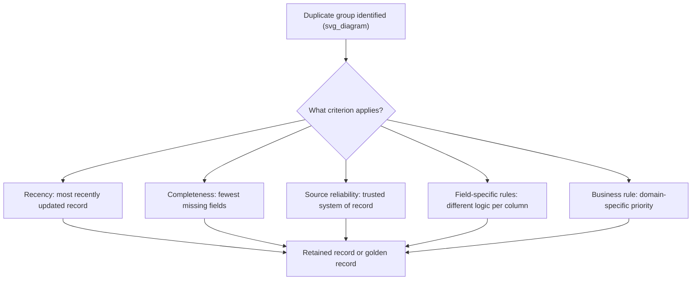
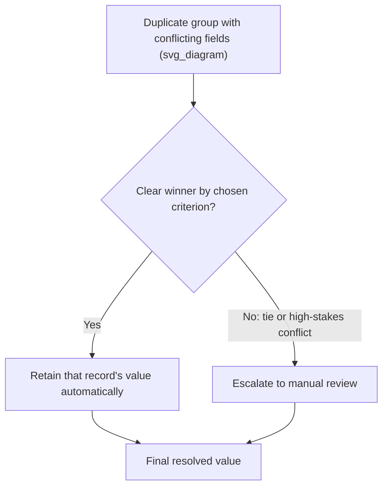

## Deciding Which Duplicate Record to Retain

### Overview

Once duplicate or near-duplicate records have been identified — whether through exact matching, fuzzy matching, or entity resolution — a distinct decision remains: which single record (or which combination of field values) should be treated as authoritative. This decision is often more consequential than the detection step itself, since choosing incorrectly can silently propagate inaccurate, stale, or lower-quality data into all downstream analysis, even when the duplicate detection logic worked perfectly.

This topic focuses specifically on the decision criteria and practical implementation for selecting a retained record, building on the broader resolution strategies (keep-one, merge, aggregate, flag) introduced earlier by examining in depth *how* the "keep" decision itself should be made when it is not obvious.

### Why This Decision Is Non-Trivial

**Key Points**

- Duplicate records are rarely truly identical in every field; each version typically has some fields more accurate, complete, or current than the others
- No single criterion (recency, completeness, source) is universally correct — the right criterion depends on what the field represents and how it changes over time
- An incorrect retention decision does not raise an error or warning; it silently substitutes lower-quality data into the dataset, making it a difficult mistake to catch after the fact
- The decision can vary field-by-field within the same duplicate group, meaning a single "which row do we keep" framing may be too coarse for well-designed retention logic

### Common Retention Criteria



### Criterion 1: Recency

Retaining the most recently updated record assumes that later data reflects corrections, refreshed information, or an updated state of the entity. This is often appropriate for fields that naturally change over time.

```python
import pandas as pd

df = pd.DataFrame({
    'customer_id': [101, 101, 101],
    'address': ['12 Elm St', '12 Elm Street', '45 Oak Ave'],
    'last_updated': ['2025-03-01', '2025-06-15', '2026-01-10']
})

df['last_updated'] = pd.to_datetime(df['last_updated'])
most_recent = df.sort_values('last_updated', ascending=False).drop_duplicates(
    subset='customer_id', keep='first'
)
print(most_recent)
```

**Output**

```
   customer_id      address last_updated
2          101   45 Oak Ave   2026-01-10
```

[Inference] Recency is a reasonable default for fields expected to genuinely change (addresses, phone numbers, employment status), but applying it blindly to fields that should be stable over time (e.g., date of birth, national ID number) can retain an erroneous later entry over a correct earlier one, so recency should be applied selectively rather than as a blanket rule.

### Criterion 2: Completeness

Retaining the record with the fewest missing or null fields maximizes the information preserved in the final dataset, on the assumption that a more complete record reflects more careful or thorough data entry.

```python
import numpy as np

df = pd.DataFrame({
    'customer_id': [101, 101],
    'name': ['Alice Smith', 'Alice Smith'],
    'email': [np.nan, 'alice@example.com'],
    'phone': ['555-1234', np.nan],
    'address': ['12 Elm St', np.nan]
})

df['completeness_score'] = df.notna().sum(axis=1)
most_complete = df.sort_values('completeness_score', ascending=False).drop_duplicates(
    subset='customer_id', keep='first'
).drop(columns='completeness_score')

print(most_complete)
```

**Output**

```
   customer_id         name      email      phone   address
0          101  Alice Smith        NaN  555-1234  12 Elm St
```

[Inference] Completeness as a criterion assumes that a record with more populated fields is more reliable overall, which is a reasonable heuristic but does not guarantee that the populated fields are themselves accurate; a highly complete record could still contain an incorrect email or an outdated address relative to a more sparsely populated but more current entry.

### Criterion 3: Source Reliability

When duplicates arise from merging multiple data sources, it is common to establish a priority ranking among sources based on known reliability, authority, or data governance standing.

```python
df = pd.DataFrame({
    'customer_id': [101, 101, 101],
    'email': ['alice@old.com', 'alice@example.com', 'alice@typo.con'],
    'source': ['legacy_crm', 'verified_signup_form', 'web_scrape']
})

# Define an explicit source priority ranking
source_priority = {'verified_signup_form': 1, 'legacy_crm': 2, 'web_scrape': 3}
df['source_rank'] = df['source'].map(source_priority)

most_trusted = df.sort_values('source_rank').drop_duplicates(
    subset='customer_id', keep='first'
).drop(columns='source_rank')

print(most_trusted)
```

**Output**

```
   customer_id               email                 source
1          101  alice@example.com  verified_signup_form
```

Source-based prioritization is particularly valuable in master data management contexts, where certain systems (e.g., a verified registration form) are understood to have stronger data entry controls than others (e.g., inferred data from web scraping).

### Criterion 4: Field-Specific Rules

Rather than selecting one entire row as authoritative, retention logic can be applied independently per field, since the "best" record often differs depending on which attribute is being considered.

```python
def resolve_duplicate_group(group):
    resolved = {}
    resolved['customer_id'] = group['customer_id'].iloc[0]
    
    # Email: prefer the most recently updated non-null value
    email_sorted = group.sort_values('last_updated', ascending=False)
    resolved['email'] = email_sorted['email'].dropna().iloc[0] if email_sorted['email'].notna().any() else np.nan
    
    # Date of birth: prefer the most frequently occurring value (majority vote)
    if 'date_of_birth' in group.columns:
        dob_values = group['date_of_birth'].dropna()
        resolved['date_of_birth'] = dob_values.mode().iloc[0] if len(dob_values) > 0 else np.nan
    
    return pd.Series(resolved)
```

This field-level approach often produces a higher-quality final record than any single-row selection strategy, since it does not force a single record's weaknesses onto fields where a different duplicate had better information.

### Criterion 5: Data Quality Scoring

A more systematic approach assigns a composite quality score to each duplicate candidate, combining multiple signals (completeness, source reliability, validation checks) into a single ranking metric.

```python
def compute_quality_score(row, source_priority):
    score = 0
    score += row.notna().sum() * 2                      # reward completeness
    score += (4 - source_priority.get(row['source'], 4)) * 3   # reward trusted sources
    if '@' in str(row.get('email', '')) and '.' in str(row.get('email', '')):
        score += 5                                        # reward apparently valid email format
    return score

df['quality_score'] = df.apply(lambda row: compute_quality_score(row, source_priority), axis=1)
best_record = df.sort_values('quality_score', ascending=False).drop_duplicates(
    subset='customer_id', keep='first'
)
```

[Unverified] The specific weighting scheme used in a composite quality score (how much to reward completeness versus source trust versus format validity) is typically tuned empirically for a given dataset and organizational context, and there is no universal formula that applies correctly across all domains.

### Decision Framework by Field Type

| Field Type | Typical Criterion | Rationale |
| --- | --- | --- |
| Contact information (phone, email, address) | Recency | Naturally changes over time; latest is usually most accurate |
| Immutable identifiers (date of birth, national ID) | Majority vote / source reliability | Should not change; disagreement usually indicates an error in one source |
| Free-text fields (notes, descriptions) | Completeness / longest value | More detail generally preserves more information |
| Categorical status fields (active/inactive, tier) | Recency or authoritative source | Reflects current state, which should come from the most current or most authoritative system |
| Financial or transactional amounts | Source reliability / manual review | High stakes for errors; often warrants human verification rather than automated resolution |

### Handling Ties and Ambiguous Cases

When multiple retention criteria disagree, or when duplicate records are equally ranked under the chosen criterion, an explicit tie-breaking rule or escalation path should be defined rather than leaving the outcome to arbitrary row order.

```python
def resolve_with_tiebreak(group, primary_col='quality_score', tiebreak_col='last_updated'):
    return group.sort_values(
        [primary_col, tiebreak_col], ascending=[False, False]
    ).iloc[0]
```

For cases where automated rules cannot confidently resolve a conflict — such as two records with equally high quality scores but materially different values in a critical field — routing the case to manual review is often preferable to forcing an arbitrary automated decision.



### Preserving Traceability of the Retention Decision

As with broader deduplication strategy, it is good practice to log which record (or which field values) were selected and why, rather than silently discarding the alternatives.

```python
retention_log = pd.DataFrame({
    'customer_id': [101],
    'retained_source': ['verified_signup_form'],
    'discarded_sources': [['legacy_crm', 'web_scrape']],
    'criterion_applied': ['source_reliability'],
    'decision_timestamp': [pd.Timestamp.now()]
})
```

This log supports later auditing, allows the retention logic to be revisited if a criterion turns out to have been poorly chosen, and provides an explanation trail if a downstream user questions why a particular value appears in the cleaned dataset.

### Common Pitfalls

- **Applying a single row-level "winner" when field-level resolution would serve better** — forcing an entire record to be selected as authoritative can discard a better value in a specific field that a different, otherwise "losing" duplicate happened to have
- **Assuming recency is always correct** — for fields that should be stable over time, a more recent but erroneous entry can override a correct earlier one if recency is applied without considering field semantics
- **Treating completeness as a proxy for accuracy** — a fully populated record is not necessarily a correct one; complete but wrong data can be retained over sparse but accurate data if completeness is the sole criterion
- **Not defining a tie-breaking rule in advance** — relying on arbitrary row order or non-deterministic sorting to resolve ties introduces inconsistency that can make results difficult to reproduce
- **Discarding rejected duplicate values without logging them** — losing the ability to trace back why a particular value was chosen makes it difficult to correct the decision later if the criterion is found to have been flawed for a specific case

### Related Topics

- Deduplication Strategies for Records
- Entity Resolution and Record Linkage Basics
- Golden Record Construction in Master Data Management
- Data Lineage and Audit Trail Design
- Data Quality Scoring Frameworks
- Handling Conflicting Data Across Multiple Sources