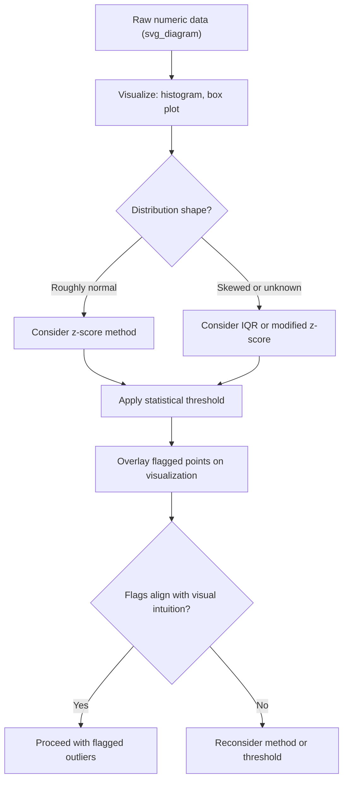

## Visualization-Based Outlier Detection

### Overview

Visualization-based outlier detection relies on graphical representations of data to identify observations that appear unusual relative to the rest of the distribution, using human visual pattern recognition rather than a purely automated statistical threshold. While statistical methods like z-score and IQR produce precise, reproducible numeric flags, visualizations often reveal structure that summary statistics alone can obscure — including multimodal distributions, clusters, non-linear relationships, and outliers that are only apparent when considering multiple variables jointly.

Visualization is typically used alongside, rather than instead of, statistical methods: a common workflow involves visually exploring the data first to build intuition about its shape and irregularities, then applying quantitative thresholds informed by that visual understanding.

### Why Visualization Complements Statistical Methods

**Key Points**

- Statistical thresholds (z-score, IQR) reduce a distribution to a small number of summary values, which can miss structural features like multimodality or clustering that are visually obvious
- Visualizations can reveal *multivariate* outliers — points that are unremarkable on any single variable but unusual in combination — which single-variable statistical tests cannot detect
- Visual inspection helps distinguish genuine data errors (e.g., impossible values, sensor glitches) from legitimate rare events, since a human reviewer can bring domain context that a purely numeric threshold cannot
- Certain visualizations (box plots) directly correspond to statistical methods (IQR) and serve as a graphical summary of the same underlying calculation, while others (scatter plots, pair plots) reveal patterns statistical summaries do not capture at all

[Inference] Visualization is best understood as a complementary diagnostic tool rather than a replacement for statistical outlier detection; visual inspection benefits from human judgment and context but does not scale well to very high-dimensional data or very large numbers of variables, where automated statistical or model-based methods become more practical.

### Box Plots

Box plots directly visualize the IQR method, displaying the median, quartiles, and whiskers extending to the outlier fences, with points beyond the fences plotted individually as candidate outliers.

```python
import matplotlib.pyplot as plt
import pandas as pd

data = pd.DataFrame({
    'age': [22, 24, 23, 25, 21, 26, 24, 95, 23, 22],
    'income': [50000, 60000, 55000, 58000, 52000, 61000, 59000, 500000, 53000, 54000]
})

fig, axes = plt.subplots(1, 2, figsize=(10, 4))
axes[0].boxplot(data['age'], vert=True)
axes[0].set_title('Age Distribution')
axes[1].boxplot(data['income'], vert=True)
axes[1].set_title('Income Distribution')
plt.tight_layout()
```

Box plots are particularly effective for quickly scanning many numeric columns for outliers side by side, and they scale reasonably well when displayed as small multiples across a wide dataset.

**Grouped box plots** extend this further by revealing outliers relative to a specific subgroup rather than the overall population, which is often more meaningful when the data contains distinct categories:

```python
df_grouped = pd.DataFrame({
    'department': ['sales', 'sales', 'sales', 'engineering', 'engineering', 'engineering'],
    'salary': [55000, 58000, 62000, 95000, 98000, 250000]
})

fig, ax = plt.subplots(figsize=(6, 4))
df_grouped.boxplot(column='salary', by='department', ax=ax)
ax.set_title('Salary by Department')
plt.suptitle('')
```

A value that appears unremarkable in a global box plot might stand out clearly as an outlier once grouped by department, since typical salary ranges can differ substantially by role.

### Histograms

Histograms display the frequency distribution of a variable across bins, making it possible to visually identify isolated bars far from the main cluster of data, as well as revealing distributional shape characteristics (skewness, multimodality) that inform which statistical outlier method is appropriate.

```python
fig, ax = plt.subplots(figsize=(6, 4))
ax.hist(data['income'], bins=15, edgecolor='black')
ax.set_title('Income Distribution Histogram')
ax.set_xlabel('Income')
ax.set_ylabel('Frequency')
```

Histograms are especially useful for catching a specific kind of outlier that summary statistics can mask: an isolated small cluster of values far from the main body of the distribution, which might not be extreme enough individually to trigger a z-score or IQR flag but is visually obvious as anomalous.

### Scatter Plots

Scatter plots reveal outliers in the relationship *between* two variables, which is a category of outlier that single-variable methods (z-score, IQR, histograms) cannot detect at all, since a point can be entirely normal on each variable individually while still being an outlier in their joint relationship.

<svg xmlns="http://www.w3.org/2000/svg" viewBox="0 0 640 380">
<text x="320" y="26" text-anchor="middle" font-size="17" font-weight="bold" fill="#1a1a2e">Bivariate Outlier Detection (svg_diagram)</text>
<line x1="80" y1="320" x2="580" y2="320" stroke="#333" stroke-width="1.5" />
<line x1="80" y1="320" x2="80" y2="60" stroke="#333" stroke-width="1.5" />
<text x="330" y="355" text-anchor="middle" font-size="13" fill="#333">Height</text>
<text x="30" y="190" text-anchor="middle" font-size="13" fill="#333" transform="rotate(-90 30 190)">Weight</text>

<circle cx="150" cy="290" r="5" fill="#457b9d" />
<circle cx="180" cy="270" r="5" fill="#457b9d" />
<circle cx="210" cy="260" r="5" fill="#457b9d" />
<circle cx="230" cy="240" r="5" fill="#457b9d" />
<circle cx="260" cy="230" r="5" fill="#457b9d" />
<circle cx="290" cy="210" r="5" fill="#457b9d" />
<circle cx="320" cy="195" r="5" fill="#457b9d" />
<circle cx="350" cy="180" r="5" fill="#457b9d" />
<circle cx="380" cy="165" r="5" fill="#457b9d" />
<circle cx="410" cy="150" r="5" fill="#457b9d" />
<circle cx="440" cy="135" r="5" fill="#457b9d" />
<circle cx="470" cy="120" r="5" fill="#457b9d" />

<line x1="140" y1="298" x2="480" y2="112" stroke="#a8dadc" stroke-width="2" stroke-dasharray="6,4" />

<circle cx="200" cy="120" r="7" fill="#e63946" />
<text x="200" y="105" text-anchor="middle" font-size="12" fill="#e63946">Bivariate outlier</text>
<text x="200" y="140" text-anchor="middle" font-size="11" fill="#555">(low height, high weight)</text>

<text x="320" y="370" text-anchor="middle" font-size="11" fill="#666">Normal individually on each axis, but unusual in combination</text>

</svg>

```python
import numpy as np

np.random.seed(42)
height = np.random.normal(170, 8, 50)
weight = height * 0.9 + np.random.normal(0, 5, 50)

# Insert a bivariate outlier: normal height, but unusually low weight for that height
height = np.append(height, 172)
weight = np.append(weight, 60)

fig, ax = plt.subplots(figsize=(6, 5))
ax.scatter(height, weight, alpha=0.6)
ax.scatter(172, 60, color='red', s=100, label='Bivariate outlier')
ax.set_xlabel('Height (cm)')
ax.set_ylabel('Weight (kg)')
ax.legend()
```

### Pair Plots (Scatter Plot Matrices)

For datasets with several numeric variables, pair plots display scatter plots for every combination of variable pairs simultaneously, alongside histograms of each individual variable along the diagonal, providing an efficient way to scan for multivariate outliers across many variable combinations at once.

```python
import seaborn as sns

df_numeric = pd.DataFrame({
    'height': height,
    'weight': weight,
    'age': np.random.normal(35, 8, len(height))
})

sns.pairplot(df_numeric, diag_kind='hist')
```

[Unverified] The practical usefulness of pair plots tends to decline as the number of variables grows, since the number of pairwise panels increases quadratically with the number of columns, making very wide datasets impractical to inspect this way without first narrowing down to a subset of variables of particular interest.

### Violin Plots

Violin plots combine the summary statistics of a box plot with a rotated kernel density estimate showing the full shape of the distribution, which can reveal multimodality or unusual distributional shape more clearly than a box plot alone.

```python
fig, ax = plt.subplots(figsize=(6, 4))
sns.violinplot(y=data['income'], ax=ax)
ax.set_title('Income Distribution: Violin Plot')
```

A box plot alone shows only the quartiles and whiskers, whereas a violin plot's width at each point reflects the density of observations there, making it easier to notice, for instance, a distribution with two separate clusters of typical values rather than one.

### Scatter Plots with Color-Coded Statistical Flags

Combining a statistical method with a visualization is a common practical pattern: compute outlier flags numerically (via z-score or IQR), then overlay those flags visually to confirm they align with genuinely unusual-looking points.

```python
from scipy import stats

df_numeric['z_score_weight'] = np.abs(stats.zscore(df_numeric['weight']))
df_numeric['is_outlier'] = df_numeric['z_score_weight'] > 2.5

fig, ax = plt.subplots(figsize=(6, 5))
colors = df_numeric['is_outlier'].map({True: 'red', False: 'steelblue'})
ax.scatter(df_numeric['height'], df_numeric['weight'], c=colors, alpha=0.7)
ax.set_xlabel('Height')
ax.set_ylabel('Weight')
ax.set_title('Outliers Flagged by Z-Score, Shown on Scatter Plot')
```

This combined approach helps validate whether a purely statistical threshold is producing sensible results, since points flagged numerically can be visually cross-checked against the overall pattern of the data.

### Time Series Line Plots

For temporal data, line plots are especially effective for spotting outliers that represent sudden spikes, drops, or discontinuities relative to a variable's typical trend over time — a pattern that a single-variable static statistical test, applied without regard to time ordering, would not capture as clearly.

```python
dates = pd.date_range('2026-01-01', periods=30, freq='D')
values = np.random.normal(100, 5, 30)
values[15] = 250  # inject an anomalous spike

fig, ax = plt.subplots(figsize=(8, 4))
ax.plot(dates, values, marker='o', markersize=3)
ax.scatter(dates[15], values[15], color='red', s=100, zorder=5, label='Anomalous spike')
ax.set_title('Time Series with Point Anomaly')
ax.legend()
```

[Inference] Time series outlier detection often benefits from methods that account for trend and seasonality (such as comparing a point against a rolling average or a seasonal decomposition residual) rather than a simple global z-score or IQR calculated across the entire series, since a value that is a legitimate part of a seasonal peak could otherwise be incorrectly flagged as an outlier by a method that ignores time-based structure.

### Comparing Visualization Techniques

| Visualization | Best Detects | Limitation |
| --- | --- | --- |
| Box plot | Univariate outliers, quick multi-column scanning | Does not reveal underlying distribution shape beyond quartiles |
| Histogram | Distributional shape, isolated clusters, skewness | Bin size choice can obscure or exaggerate patterns |
| Scatter plot | Bivariate/relationship outliers | Only shows two variables at a time |
| Pair plot | Multivariate outliers across several variable pairs | Scales poorly with a large number of variables |
| Violin plot | Multimodal distributions, distributional shape detail | Less familiar to some audiences than box plots |
| Time series line plot | Temporal anomalies, spikes, discontinuities | Requires accounting for trend/seasonality to avoid false flags |

### Practical Workflow: Combining Visualization and Statistical Methods



### Common Pitfalls

- **Relying on visual inspection alone for large or high-dimensional datasets** — visualization does not scale well beyond a manageable number of variables or observations, making purely visual review impractical for wide datasets without first narrowing focus using statistical summaries or dimensionality reduction
- **Choosing histogram bin widths that obscure genuine patterns** — too few bins can hide isolated clusters, while too many bins can make noise look like meaningful structure, so bin count often benefits from experimentation rather than relying on a single default
- **Ignoring group structure when visualizing outliers** — a global box plot or histogram can hide outliers that are only apparent when the data is examined within meaningful subgroups (e.g., by category, region, or time period)
- **Treating every visually unusual point as an error** — visualization reveals candidates for further investigation, but confirming whether a visually flagged point is a genuine data error versus a legitimate rare event still requires domain context
- **Applying static, non-temporal visualization methods to time series data without considering trend or seasonality** — a value that appears to be an outlier in a simple time-ordered scatter plot might actually be an expected seasonal peak, which trend-aware visualization (e.g., overlaying a rolling average) would clarify

### Related Topics

- Statistical Methods for Outlier Detection: Z-Score, IQR
- Outlier Treatment Strategies: Removal, Capping, and Transformation
- Machine Learning-Based Outlier Detection (Isolation Forest, Local Outlier Factor)
- Time Series Anomaly Detection and Seasonal Decomposition
- Dimensionality Reduction for Visualizing High-Dimensional Outliers
- Exploratory Data Analysis Techniques for Data Cleaning