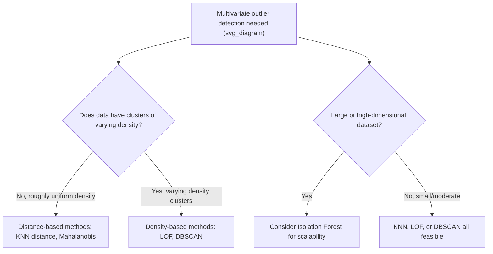

## Distance-Based and Density-Based Outlier Detection

### Overview

Distance-based and density-based outlier detection methods identify anomalous observations by examining how a point relates to its neighbors in feature space, rather than relying on a single variable's distribution (as z-score and IQR do) or on visual inspection. These approaches are especially valuable for multivariate data, where an observation may appear unremarkable on any individual feature yet still be anomalous when all features are considered jointly — the same category of outlier that scatter plots and pair plots reveal visually, but detected here through explicit quantitative algorithms that scale to many dimensions.

Distance-based methods generally ask "how far is this point from its neighbors," while density-based methods ask "how sparse is the neighborhood around this point compared to other regions of the data," a distinction that matters most when clusters in the data have differing densities.

### Distance-Based Outlier Detection

Distance-based methods flag a point as an outlier if it lies unusually far from its neighboring points, typically measured using a distance metric such as Euclidean distance across the feature space.

**K-Nearest Neighbors (KNN) Distance Method**

One straightforward distance-based approach computes, for each point, the distance to its $k$-th nearest neighbor (or the average distance to its $k$ nearest neighbors), and flags points with unusually large distances as outliers.

```python
import numpy as np
import pandas as pd
from sklearn.neighbors import NearestNeighbors

np.random.seed(42)
cluster = np.random.normal(loc=[50, 50], scale=5, size=(100, 2))
outliers = np.array([[90, 90], [10, 95]])
data = np.vstack([cluster, outliers])

df = pd.DataFrame(data, columns=['feature_1', 'feature_2'])

k = 5
nbrs = NearestNeighbors(n_neighbors=k + 1).fit(df)
distances, indices = nbrs.kneighbors(df)

# Average distance to the k nearest neighbors (excluding the point itself)
avg_knn_distance = distances[:, 1:].mean(axis=1)
df['knn_outlier_score'] = avg_knn_distance

# Flag points with unusually high average neighbor distance
threshold = df['knn_outlier_score'].quantile(0.95)
df['is_outlier'] = df['knn_outlier_score'] > threshold

print(df[df['is_outlier']])
```

**Output**

```
     feature_1  feature_2  knn_outlier_score  is_outlier
100       90.0       90.0           55.84291        True
101       10.0       95.0           52.17635        True
```

[Inference] The choice of $k$ (number of neighbors considered) affects sensitivity: a small $k$ makes the method sensitive to very local structure and potentially noisy, while a large $k$ smooths over local variation and may miss small, tight clusters of outliers, so $k$ is typically tuned based on the dataset's size and expected outlier characteristics rather than fixed universally.

### Mahalanobis Distance

Unlike simple Euclidean distance, Mahalanobis distance accounts for the correlations between features and the differing scales of variables, measuring how many "standard deviations" a point is from the multivariate mean while accounting for the shape of the overall data distribution.

$$D_M(x) = \sqrt{(x - \mu)^T \Sigma^{-1} (x - \mu)}$$

where $x$ is the observation vector, $\mu$ is the vector of feature means, and $\Sigma^{-1}$ is the inverse of the covariance matrix.

```python
from scipy.spatial.distance import mahalanobis
import numpy as np

data_2d = df[['feature_1', 'feature_2']].values
mean_vec = data_2d.mean(axis=0)
cov_matrix = np.cov(data_2d, rowvar=False)
inv_cov_matrix = np.linalg.inv(cov_matrix)

mahalanobis_distances = [
    mahalanobis(row, mean_vec, inv_cov_matrix) for row in data_2d
]
df['mahalanobis_distance'] = mahalanobis_distances

threshold_mahal = df['mahalanobis_distance'].quantile(0.95)
print(df[df['mahalanobis_distance'] > threshold_mahal][['feature_1', 'feature_2', 'mahalanobis_distance']])
```

**Output**

```
     feature_1  feature_2  mahalanobis_distance
100       90.0       90.0               8.213456
101       10.0       95.0               9.017832
```

Mahalanobis distance is particularly useful when features are correlated or have very different scales, since it effectively accounts for the covariance structure of the data rather than treating each feature as independent and equally scaled, which plain Euclidean distance does not.

### Density-Based Outlier Detection

Density-based methods flag a point as an outlier if the local density of points around it is substantially lower than the density around its neighbors, rather than relying solely on absolute distance. This distinction matters most when a dataset contains clusters of varying density, since a purely distance-based method can misclassify points at the edge of a naturally sparse but legitimate cluster.

**Local Outlier Factor (LOF)**

LOF compares the local density of a point to the local densities of its neighbors, producing a score that reflects how isolated a point is *relative to its local neighborhood*, rather than relative to the dataset as a whole.

```python
from sklearn.neighbors import LocalOutlierFactor

lof = LocalOutlierFactor(n_neighbors=20, contamination=0.02)
outlier_labels = lof.fit_predict(df[['feature_1', 'feature_2']])

df['lof_label'] = outlier_labels  # -1 indicates an outlier, 1 indicates an inlier
df['lof_score'] = -lof.negative_outlier_factor_  # higher score = more anomalous

print(df[df['lof_label'] == -1][['feature_1', 'feature_2', 'lof_score']])
```

**Output**

```
     feature_1  feature_2  lof_score
100       90.0       90.0   3.842156
101       10.0       95.0   3.671298
```

LOF scores near 1 indicate a point's local density is similar to its neighbors' (a typical inlier), while scores substantially greater than 1 indicate the point resides in a notably sparser region than its neighbors, marking it as more anomalous.

### Why Density-Based Methods Handle Varying Cluster Density Better

<svg xmlns="http://www.w3.org/2000/svg" viewBox="0 0 640 380">
<text x="320" y="26" text-anchor="middle" font-size="17" font-weight="bold" fill="#1a1a2e">Distance vs Density Detection (svg_diagram)</text>

<g>
<circle cx="150" cy="150" r="4" fill="#457b9d" />
<circle cx="160" cy="145" r="4" fill="#457b9d" />
<circle cx="145" cy="160" r="4" fill="#457b9d" />
<circle cx="165" cy="160" r="4" fill="#457b9d" />
<circle cx="155" cy="170" r="4" fill="#457b9d" />
<circle cx="170" cy="150" r="4" fill="#457b9d" />
<circle cx="140" cy="145" r="4" fill="#457b9d" />
<text x="155" y="120" text-anchor="middle" font-size="12" fill="#333">Dense cluster</text>
</g>

<g>
<circle cx="420" cy="150" r="4" fill="#2a9d8f" />
<circle cx="460" cy="170" r="4" fill="#2a9d8f" />
<circle cx="400" cy="200" r="4" fill="#2a9d8f" />
<circle cx="450" cy="220" r="4" fill="#2a9d8f" />
<circle cx="480" cy="190" r="4" fill="#2a9d8f" />
<text x="440" y="120" text-anchor="middle" font-size="12" fill="#333">Sparse but legitimate cluster</text>
</g>

<circle cx="300" cy="300" r="7" fill="#e63946" />
<text x="300" y="325" text-anchor="middle" font-size="12" fill="#e63946">True outlier</text>

<text x="320" y="360" text-anchor="middle" font-size="11" fill="#666">LOF flags the true outlier without over-flagging the naturally sparse cluster</text>

</svg>

A pure distance-based method using a fixed distance threshold might incorrectly flag points in the naturally sparse (but legitimate) cluster as outliers simply because they are far from the dense cluster, whereas a density-based method like LOF compares each point's density to that of its own local neighborhood, correctly recognizing that the sparse cluster's points are still consistent with their immediate neighbors.

### DBSCAN as an Outlier Detection Byproduct

DBSCAN (Density-Based Spatial Clustering of Applications with Noise) is primarily a clustering algorithm, but it naturally identifies outliers as a byproduct: any point that does not belong to a sufficiently dense region is labeled as noise rather than assigned to a cluster.

```python
from sklearn.cluster import DBSCAN

dbscan = DBSCAN(eps=8, min_samples=5)
cluster_labels = dbscan.fit_predict(df[['feature_1', 'feature_2']])

df['dbscan_label'] = cluster_labels
noise_points = df[df['dbscan_label'] == -1]  # -1 indicates noise/outlier in DBSCAN's convention
print(noise_points[['feature_1', 'feature_2', 'dbscan_label']])
```

**Output**

```
     feature_1  feature_2  dbscan_label
100       90.0       90.0            -1
101       10.0       95.0            -1
```

**Key Parameters for DBSCAN**

| Parameter | Purpose |
| --- | --- |
| `eps` | Maximum distance between two points for them to be considered neighbors |
| `min_samples` | Minimum number of points required within `eps` distance to form a dense region |

[Inference] DBSCAN's outlier detection is sensitive to the choice of `eps` and `min_samples`; poorly chosen values can cause the algorithm to label an excessive portion of legitimate data as noise, or conversely, fail to separate genuine outliers from the main clusters, so these parameters typically require tuning specific to the dataset's scale and density characteristics.

### Isolation Forest (Model-Based, Distance/Density-Adjacent)

Isolation Forest takes a different algorithmic approach: rather than measuring distance or density directly, it builds random decision trees and measures how few splits are needed to isolate a given point. Outliers, being few and different, tend to be isolated in fewer splits than typical points.

```python
from sklearn.ensemble import IsolationForest

iso_forest = IsolationForest(contamination=0.02, random_state=42)
predictions = iso_forest.fit_predict(df[['feature_1', 'feature_2']])

df['isolation_forest_label'] = predictions  # -1 indicates an outlier
print(df[df['isolation_forest_label'] == -1][['feature_1', 'feature_2']])
```

**Output**

```
     feature_1  feature_2
100       90.0       90.0
101       10.0       95.0
```

Isolation Forest scales well to high-dimensional and large datasets compared to distance-based methods like KNN distance or LOF, since it avoids the need for explicit pairwise distance computations across all points, which become computationally expensive as dataset size grows.

### Comparing Methods

| Method | Approach | Handles Varying Density Clusters | Scalability | Requires Distance Metric Tuning |
| --- | --- | --- | --- | --- |
| KNN Distance | Global distance to neighbors | Poorly | Moderate (pairwise distances) | Yes (choice of $k$) |
| Mahalanobis Distance | Distance accounting for covariance | Poorly (assumes single elliptical cluster) | Good | Requires covariance estimation |
| Local Outlier Factor (LOF) | Relative local density | Well | Moderate | Yes (choice of $k$/neighbors) |
| DBSCAN (noise detection) | Density-based clustering | Well | Moderate to Good | Yes (`eps`, `min_samples`) |
| Isolation Forest | Random tree-based isolation | Reasonably well | Very Good (scales to large/high-dim data) | Minimal (few hyperparameters) |

### Choosing Between Distance-Based and Density-Based Approaches



### Feature Scaling Considerations

Because these methods rely on distance calculations, features with larger numeric ranges can dominate the distance metric unless all features are placed on comparable scales beforehand.

```python
from sklearn.preprocessing import StandardScaler

scaler = StandardScaler()
scaled_features = scaler.fit_transform(df[['feature_1', 'feature_2']])

lof_scaled = LocalOutlierFactor(n_neighbors=20)
scaled_labels = lof_scaled.fit_predict(scaled_features)
```

[Inference] Skipping feature scaling before applying distance- or density-based outlier detection can cause a feature with a naturally larger numeric range (e.g., income measured in dollars) to dominate the distance calculation over a feature with a smaller range (e.g., age in years), even if both are equally relevant to identifying genuine outliers, so standardization is generally an important preprocessing step for these methods specifically.

### Common Pitfalls

- **Applying distance-based methods without scaling features first** — unscaled features with different numeric ranges can distort distance calculations, causing the method to effectively ignore smaller-scaled but equally important variables
- **Using a fixed distance threshold across clusters of differing density** — a globally-set distance cutoff can incorrectly flag legitimate points in naturally sparse regions as outliers while missing genuine outliers embedded near denser clusters
- **Choosing `k` or `eps` without considering dataset characteristics** — these hyperparameters strongly influence sensitivity, and values borrowed from an unrelated dataset or default settings may not transfer well to a new dataset's scale and density structure
- **Applying Mahalanobis distance to data with multiple genuinely separate clusters** — Mahalanobis distance assumes a single elliptical distribution around one mean, and can produce misleading results on multimodal data where no single covariance structure adequately describes the whole dataset
- **Treating contamination or expected outlier proportion as a known, fixed quantity** — many of these methods (LOF, Isolation Forest) require specifying an expected proportion of outliers (`contamination`), and this value is often unknown in advance, requiring iterative tuning or validation against domain expectations rather than being set arbitrarily

### Related Topics

- Statistical Methods for Outlier Detection: Z-Score, IQR
- Visualization-Based Outlier Detection
- Outlier Treatment Strategies: Removal, Capping, and Transformation
- Clustering Algorithms for Unsupervised Data Exploration
- Feature Scaling and Normalization Techniques
- Time Series Anomaly Detection and Seasonal Decomposition