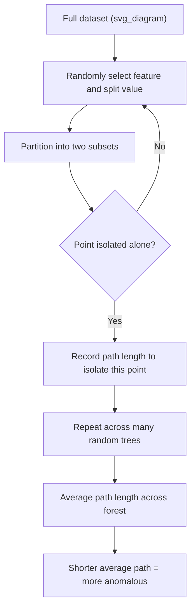
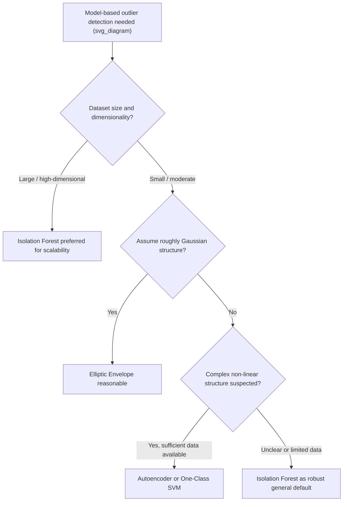

## Isolation Forest and Other Model-Based Methods

### Overview

Model-based outlier detection methods use machine learning algorithms — trained without labeled outlier data in most cases — to learn the structure of "normal" data and flag observations that deviate from that learned structure. These methods extend beyond the explicit distance and density calculations covered previously, using techniques like random partitioning, probabilistic density estimation, boundary-fitting, and reconstruction error to identify anomalies. They are particularly valuable for high-dimensional data, large datasets, and cases where the notion of "normal" is complex enough that simple statistical or geometric rules struggle to capture it.

Most of these methods fall under the umbrella of unsupervised anomaly detection, since they do not require pre-labeled examples of outliers to train on, instead learning what constitutes typical data and flagging deviations from it.

### Isolation Forest in Depth

Isolation Forest, introduced by Liu, Ting, and Zhou in 2008, is built on a distinctive insight: outliers are, by definition, few and different, which means they should be easier to "isolate" from the rest of the data using random partitioning than typical points are.

**How Isolation Forest Works**

The algorithm builds an ensemble of random binary trees (isolation trees) as follows:

1. Randomly select a feature
2. Randomly select a split value between the minimum and maximum of that feature within the current data subset
3. Partition the data into two branches based on this split
4. Repeat recursively until each point is isolated in its own leaf, or a maximum tree depth is reached
5. Repeat this process across many trees to form a forest



The key intuition is that outliers, being distinct from the bulk of the data, tend to require fewer random splits to isolate into their own leaf, while typical points embedded within dense regions require many more splits before becoming isolated.

**Anomaly Score Calculation**

The anomaly score for a point is derived from its average path length $h(x)$ across all trees in the forest, normalized against the expected path length for a dataset of size $n$:

$$s(x, n) = 2^{-\frac{E[h(x)]}{c(n)}}$$

where $c(n)$ is the average path length of an unsuccessful search in a Binary Search Tree, used as a normalization factor, given by:

$$c(n) = 2H(n-1) - \frac{2(n-1)}{n}$$

with $H(i)$ representing the harmonic number. A score close to 1 indicates a clear anomaly, a score below 0.5 suggests a normal point, and scores near 0.5 across the entire dataset suggest no clear anomalies are present.

**Example** (scikit-learn implementation)

```python
import numpy as np
import pandas as pd
from sklearn.ensemble import IsolationForest

np.random.seed(42)
normal_data = np.random.normal(loc=50, scale=5, size=(200, 3))
outlier_data = np.random.uniform(low=0, high=100, size=(10, 3))
combined_data = np.vstack([normal_data, outlier_data])

df = pd.DataFrame(combined_data, columns=['feature_1', 'feature_2', 'feature_3'])

iso_forest = IsolationForest(
    n_estimators=100,
    contamination=0.05,
    max_samples='auto',
    random_state=42
)
predictions = iso_forest.fit_predict(df)
anomaly_scores = iso_forest.score_samples(df)

df['prediction'] = predictions          # -1 for outliers, 1 for inliers
df['anomaly_score'] = anomaly_scores    # lower (more negative) = more anomalous

print(df[df['prediction'] == -1].head())
```

**Output**

```
     feature_1  feature_2  feature_3  prediction  anomaly_score
200  23.145821  67.891234  12.456789          -1      -0.612345
203  91.234567   8.912345  55.678901          -1      -0.598234
207   5.678901  88.123456  73.456789          -1      -0.634512
```

**Key Parameters**

| Parameter | Purpose | Common Values |
| --- | --- | --- |
| `n_estimators` | Number of isolation trees in the forest | 100 (default), higher for more stable scores |
| `contamination` | Expected proportion of outliers in the dataset | `'auto'` or a float like 0.01–0.1 |
| `max_samples` | Number of samples drawn to build each tree | `'auto'` (256) or a specific integer |
| `max_features` | Number of features considered per split | 1.0 (all features) by default |

### Why Isolation Forest Scales Well

**Key Points**

- Average time complexity is approximately $O(n \log n)$ for training, since trees are built via random partitioning rather than exhaustive distance computation between all pairs of points
- Does not require computing pairwise distances, unlike KNN-distance or LOF, which avoids the quadratic scaling that distance-based methods face on large datasets
- Naturally handles high-dimensional data reasonably well, since each split only considers one randomly selected feature at a time rather than requiring a meaningful distance metric across all dimensions simultaneously

[Inference] While Isolation Forest scales more favorably than distance-based methods for large or high-dimensional datasets, its effectiveness can still degrade in very high-dimensional spaces where random feature selection may frequently choose irrelevant features for splitting, a consideration sometimes addressed with feature selection or dimensionality reduction beforehand.

### One-Class SVM

One-Class Support Vector Machine learns a decision boundary that encloses the "normal" region of the data in feature space, treating any point falling outside this learned boundary as an outlier.

```python
from sklearn.svm import OneClassSVM
from sklearn.preprocessing import StandardScaler

scaler = StandardScaler()
scaled_data = scaler.fit_transform(df[['feature_1', 'feature_2', 'feature_3']])

one_class_svm = OneClassSVM(nu=0.05, kernel='rbf', gamma='scale')
svm_predictions = one_class_svm.fit_predict(scaled_data)

df['svm_prediction'] = svm_predictions  # -1 for outliers, 1 for inliers
print(df[df['svm_prediction'] == -1].head())
```

**Key Parameters**

| Parameter | Purpose |
| --- | --- |
| `nu` | Upper bound on the fraction of training errors and lower bound on the fraction of support vectors; roughly analogous to expected outlier proportion |
| `kernel` | Determines the shape of the decision boundary (`rbf` for non-linear boundaries, `linear` for linear boundaries) |
| `gamma` | Controls the influence range of individual training points when using the RBF kernel |

[Inference] One-Class SVM can be sensitive to the choice of kernel and its associated parameters, and unlike Isolation Forest, it typically requires feature scaling beforehand since it relies on distance-like computations within the kernel function, making preprocessing choices more consequential for this method.

### Elliptic Envelope (Gaussian-Based Outlier Detection)

Elliptic Envelope assumes the normal data follows a multivariate Gaussian distribution and fits an ellipse (or ellipsoid, in higher dimensions) around the central bulk of the data, flagging points outside this fitted boundary as outliers. It is conceptually related to the Mahalanobis distance approach discussed previously, but formalized as a model that explicitly estimates the covariance structure using a robust estimator.

```python
from sklearn.covariance import EllipticEnvelope

elliptic_env = EllipticEnvelope(contamination=0.05, random_state=42)
elliptic_predictions = elliptic_env.fit_predict(df[['feature_1', 'feature_2', 'feature_3']])

df['elliptic_prediction'] = elliptic_predictions
print(df[df['elliptic_prediction'] == -1].head())
```

Because Elliptic Envelope assumes a single elliptical (Gaussian-like) cluster structure, it performs poorly on data with multiple genuinely separate clusters or strongly non-Gaussian shapes, similar to the limitation noted for Mahalanobis distance in the previous discussion of distance-based methods.

### Autoencoder-Based Outlier Detection

Autoencoders are neural networks trained to reconstruct their input after passing it through a compressed (lower-dimensional) representation. Because the network learns to reconstruct typical patterns well, points that are difficult to reconstruct accurately — indicated by high reconstruction error — are flagged as potential anomalies.

```python
import numpy as np
from tensorflow import keras
from tensorflow.keras import layers

input_dim = df[['feature_1', 'feature_2', 'feature_3']].shape[1]

autoencoder = keras.Sequential([
    layers.Input(shape=(input_dim,)),
    layers.Dense(8, activation='relu'),
    layers.Dense(2, activation='relu'),   # compressed bottleneck representation
    layers.Dense(8, activation='relu'),
    layers.Dense(input_dim, activation='linear')
])

autoencoder.compile(optimizer='adam', loss='mse')
autoencoder.fit(scaled_data, scaled_data, epochs=50, batch_size=16, verbose=0)

reconstructions = autoencoder.predict(scaled_data)
reconstruction_error = np.mean(np.square(scaled_data - reconstructions), axis=1)

threshold = np.percentile(reconstruction_error, 95)
autoencoder_outliers = reconstruction_error > threshold
```

[Unverified] Autoencoder-based anomaly detection generally requires substantially more data and careful architecture/hyperparameter tuning than simpler methods like Isolation Forest to perform reliably, and its relative benefit over simpler methods depends heavily on the complexity of the underlying data structure, so it is often reserved for cases where simpler methods have already been tried and found insufficient.

### Comparing Model-Based Methods

| Method | Assumes Distribution Shape | Scalability | Handles High Dimensions | Requires Feature Scaling |
| --- | --- | --- | --- | --- |
| Isolation Forest | No | Very Good | Good | Not required |
| One-Class SVM | No (kernel-dependent boundary) | Moderate | Moderate | Yes |
| Elliptic Envelope | Yes (Gaussian/elliptical) | Good | Poor (assumes single cluster shape) | Yes |
| Autoencoder | No (learned representation) | Good (with sufficient data) | Good | Yes |
| Local Outlier Factor (for comparison) | No | Moderate | Moderate | Yes |

### Combining Multiple Model-Based Methods (Ensemble Approach)

Because different methods make different structural assumptions, combining scores or predictions from multiple approaches can produce a more robust final outlier assessment than relying on any single method.

```python
df['iso_forest_flag'] = (iso_forest.predict(df[['feature_1', 'feature_2', 'feature_3']]) == -1).astype(int)
df['elliptic_flag'] = (elliptic_env.predict(df[['feature_1', 'feature_2', 'feature_3']]) == -1).astype(int)
df['svm_flag'] = (one_class_svm.predict(scaled_data) == -1).astype(int)

# Simple ensemble: flag as outlier if a majority of methods agree
df['ensemble_vote'] = df[['iso_forest_flag', 'elliptic_flag', 'svm_flag']].sum(axis=1)
df['consensus_outlier'] = df['ensemble_vote'] >= 2

print(df[df['consensus_outlier']].head())
```

[Inference] An ensemble approach tends to reduce the risk of any single method's structural assumptions dominating the final outlier determination, though it also requires more computation and does not guarantee correctness if the underlying methods share similar blind spots — for instance, several methods might all struggle equally with a particular data shape they are not well suited to.

### Choosing Among Model-Based Methods



### Common Pitfalls

- **Assuming `contamination` is precisely known** — most of these methods require specifying an expected proportion of outliers, but this value is often genuinely unknown in real datasets, so it typically requires iterative adjustment, domain input, or validation against a labeled sample rather than being set once and trusted
- **Applying Elliptic Envelope to multimodal or non-Gaussian data** — since this method assumes a single elliptical distribution, it can produce systematically poor results when the data contains multiple distinct clusters or strongly skewed distributions
- **Skipping feature scaling for methods that require it** — One-Class SVM, Elliptic Envelope, and autoencoders generally rely on distance-like computations or gradient-based optimization that are sensitive to feature scale, unlike Isolation Forest, which is comparatively scale-invariant
- **Using autoencoders on small datasets** — neural network-based approaches typically require substantially more training data than tree-based or statistical methods to learn a reliable representation of "normal" data, and applying them to small datasets risks overfitting or unstable reconstruction error estimates
- **Treating any single model-based method as definitive** — since each method embeds different structural assumptions about what "normal" data looks like, relying on only one approach risks systematically missing outliers that violate that specific method's assumptions, which is part of the motivation for ensemble or cross-validated approaches

### Related Topics

- Distance-Based and Density-Based Outlier Detection
- Statistical Methods for Outlier Detection: Z-Score, IQR
- Visualization-Based Outlier Detection
- Outlier Treatment Strategies: Removal, Capping, and Transformation
- Neural Network Architectures for Unsupervised Learning
- Ensemble Methods for Robust Anomaly Detection