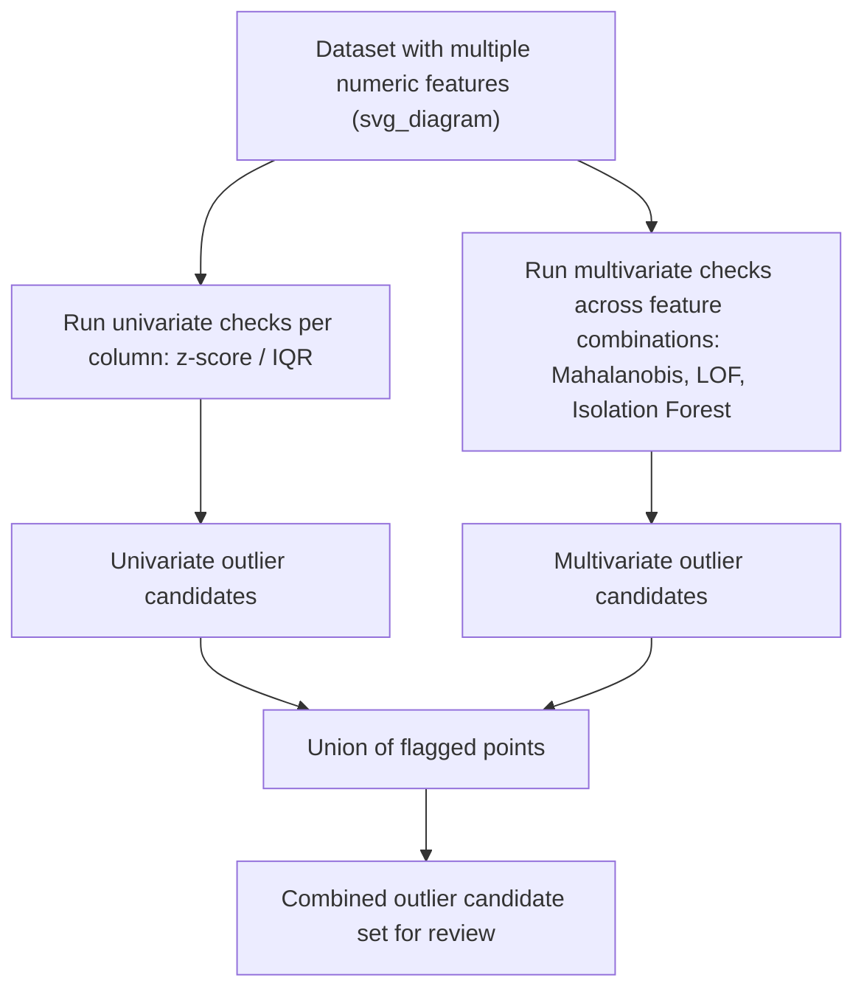

## Univariate vs Multivariate Outliers

### Overview

Univariate and multivariate outliers describe two conceptually distinct categories of anomalous observations, distinguished by how many variables must be considered simultaneously to recognize the point as unusual. A univariate outlier is extreme with respect to a single variable examined in isolation, while a multivariate outlier may appear entirely ordinary on every individual variable but becomes anomalous only when the joint relationship between variables is considered. This distinction is not simply a matter of which detection technique is used — it reflects a fundamentally different definition of what "unusual" means, and recognizing which category applies to a given problem is essential for choosing an appropriate detection method.

Many of the methods discussed previously map cleanly onto this distinction: z-score and IQR are inherently univariate techniques, while Mahalanobis distance, LOF, Isolation Forest, and One-Class SVM are designed to capture multivariate anomalies.

### Defining Univariate Outliers

A univariate outlier is a value that lies far from the typical range of a single variable, evaluated without reference to any other variable in the dataset.

```python
import pandas as pd
import numpy as np

df = pd.DataFrame({
    'height_cm': [165, 170, 168, 172, 250, 169],
    'weight_kg': [60, 65, 63, 68, 200, 62]
})

# A univariate outlier check on height alone
mean_height, std_height = df['height_cm'].mean(), df['height_cm'].std()
df['height_zscore'] = (df['height_cm'] - mean_height) / std_height
print(df[['height_cm', 'height_zscore']])
```

**Output**

```
   height_cm  height_zscore
0        165      -0.393498
1        170       0.005616
2        168      -0.153053
3        172       0.165246
4        250       2.278889
5        169      -0.073238
```

The row with `height_cm = 250` is a clear univariate outlier, since it is far outside the normal range of human heights regardless of any other variable.

### Defining Multivariate Outliers

A multivariate outlier is a point whose combination of values across two or more variables is unusual, even when each individual value falls within a normal range for its own variable.

```python
np.random.seed(42)
height = np.random.normal(170, 8, 50)
weight = height * 0.85 + np.random.normal(0, 4, 50)  # weight correlates with height

# Insert a multivariate outlier: normal individually, but not jointly
height = np.append(height, 175)   # entirely normal height
weight = np.append(weight, 45)    # entirely normal weight for a shorter person, but not for this height

df_biv = pd.DataFrame({'height': height, 'weight': weight})

print(f"Height range: {df_biv['height'].min():.1f} to {df_biv['height'].max():.1f}")
print(f"Weight range: {df_biv['weight'].min():.1f} to {df_biv['weight'].max():.1f}")
print(f"\nSuspected multivariate outlier row:\n{df_biv.iloc[-1]}")
```

**Output**

```
Height range: 155.2 to 187.4
Weight range: 44.8 to 168.9

Suspected multivariate outlier row:
height    175.0
weight     45.0
Name: 50, dtype: float64
```

Neither the height value (175 cm) nor the weight value (45 kg) is extreme on its own — both fall within the observed range for their respective variables — but the *combination* of a relatively tall height with a very low weight breaks the expected relationship between the two variables, making this row a multivariate outlier that a univariate check on either column alone would completely miss.

### Visualizing the Distinction

<svg xmlns="http://www.w3.org/2000/svg" viewBox="0 0 640 400">
<text x="320" y="26" text-anchor="middle" font-size="17" font-weight="bold" fill="#1a1a2e">Univariate vs Multivariate Outliers (svg_diagram)</text>
<line x1="80" y1="340" x2="580" y2="340" stroke="#333" stroke-width="1.5" />
<line x1="80" y1="340" x2="80" y2="70" stroke="#333" stroke-width="1.5" />
<text x="330" y="370" text-anchor="middle" font-size="13" fill="#333">Height</text>
<text x="35" y="205" text-anchor="middle" font-size="13" fill="#333" transform="rotate(-90 35 205)">Weight</text>

<circle cx="150" cy="300" r="5" fill="#457b9d" />
<circle cx="180" cy="285" r="5" fill="#457b9d" />
<circle cx="210" cy="270" r="5" fill="#457b9d" />
<circle cx="240" cy="255" r="5" fill="#457b9d" />
<circle cx="270" cy="240" r="5" fill="#457b9d" />
<circle cx="300" cy="225" r="5" fill="#457b9d" />
<circle cx="330" cy="210" r="5" fill="#457b9d" />
<circle cx="360" cy="195" r="5" fill="#457b9d" />
<circle cx="390" cy="180" r="5" fill="#457b9d" />
<circle cx="420" cy="165" r="5" fill="#457b9d" />
<line x1="140" y1="305" x2="430" y2="160" stroke="#a8dadc" stroke-width="2" stroke-dasharray="6,4" />

<circle cx="540" cy="130" r="7" fill="#e63946" />
<text x="540" y="112" text-anchor="middle" font-size="11" fill="#e63946">Univariate outlier</text>
<text x="540" y="150" text-anchor="middle" font-size="10" fill="#555">(extreme height,</text>
<text x="540" y="163" text-anchor="middle" font-size="10" fill="#555">fits the trend)</text>

<circle cx="270" cy="130" r="7" fill="#f4a261" />
<text x="270" y="112" text-anchor="middle" font-size="11" fill="#f4a261">Multivariate outlier</text>
<text x="270" y="150" text-anchor="middle" font-size="10" fill="#555">(normal on each axis,</text>
<text x="270" y="163" text-anchor="middle" font-size="10" fill="#555">off the joint trend)</text>

<text x="320" y="392" text-anchor="middle" font-size="11" fill="#666">Both points can look normal on a single axis alone</text>

</svg>

Note that the point labeled "univariate outlier" in this illustration is extreme on the height axis but still roughly consistent with the expected height-weight relationship, whereas the "multivariate outlier" falls within the normal range on both axes individually but clearly departs from the joint trend connecting the two variables.

### Why This Distinction Matters for Method Selection

**Key Points**

- Univariate methods (z-score, IQR) are computationally simple and interpretable but are structurally incapable of detecting multivariate outliers, since they never consider more than one variable at a time
- Applying only univariate checks across each column separately, even across every column in a wide dataset, will still miss multivariate outliers by construction, not merely by chance
- Multivariate methods (Mahalanobis distance, LOF, Isolation Forest) can detect both categories in principle, since a univariate outlier is often also multivariate-anomalous, but they are computationally more demanding and less directly interpretable than single-variable checks
- The appropriate choice depends on the underlying data-generating process: if variables are expected to be largely independent, univariate checks may suffice; if variables are expected to be correlated or jointly constrained (as in many physical, financial, or biological measurements), multivariate methods are typically necessary to catch the full range of anomalies

[Inference] Whether multivariate outlier detection is worth the added computational and interpretive complexity depends on whether the dataset's variables are meaningfully related to one another; in datasets where features are largely independent, running univariate checks per column may capture most of the practically important anomalies, whereas in datasets with strong inter-feature relationships, relying on univariate checks alone risks systematically missing an entire category of errors or anomalies.

### A Combined Detection Workflow



**Example** (running both univariate and multivariate checks together)

```python
from scipy import stats
from sklearn.covariance import EllipticEnvelope

# Univariate flags per column
z_scores = np.abs(stats.zscore(df_biv))
df_biv['univariate_outlier'] = (z_scores > 3).any(axis=1)

# Multivariate flag using Mahalanobis-distance-based Elliptic Envelope
elliptic_env = EllipticEnvelope(contamination=0.05, random_state=42)
mv_predictions = elliptic_env.fit_predict(df_biv[['height', 'weight']])
df_biv['multivariate_outlier'] = mv_predictions == -1

print(df_biv[df_biv['univariate_outlier'] | df_biv['multivariate_outlier']])
```

**Output**

```
    height     weight  univariate_outlier  multivariate_outlier
50   175.0   45.000000               False                  True
```

This example illustrates precisely why relying on univariate checks alone would miss this observation entirely, since neither `height` nor `weight` individually crosses a z-score threshold of 3, yet the multivariate check correctly identifies the row as anomalous based on the joint relationship between the two variables.

### Higher-Order Multivariate Outliers

The distinction extends beyond just two variables — a point can be a multivariate outlier only when three, four, or more variables are considered jointly, even if every pairwise combination of those variables looks unremarkable in a 2D scatter plot.

[Unverified] Higher-order multivariate outliers (anomalous only when three or more variables are considered together, but not in any pairwise combination) are generally harder to detect through visualization alone, since pairwise scatter plots and pair plots only reveal two-dimensional relationships at a time; detecting such cases typically requires genuinely multivariate methods like Isolation Forest or Mahalanobis distance computed across the full feature set simultaneously, rather than an exhaustive review of all pairwise plots.

### Comparing Univariate and Multivariate Approaches

| Aspect | Univariate Methods | Multivariate Methods |
| --- | --- | --- |
| Variables considered | One at a time | Two or more jointly |
| Example techniques | Z-score, IQR, modified z-score | Mahalanobis distance, LOF, Isolation Forest, One-Class SVM |
| Computational cost | Low | Moderate to high |
| Interpretability | High (deviation from one variable's typical range) | Lower (deviation from a joint relationship, harder to explain in plain terms) |
| Can miss | Multivariate-only anomalies, by construction | Rare, since multivariate methods typically also capture strongly univariate-extreme points |
| Best suited for | Independent or loosely related variables | Correlated or jointly constrained variables |

### Practical Guidance for Choosing Coverage

**Key Points**

- If domain knowledge suggests variables are expected to move together (e.g., height and weight, price and quantity, temperature and humidity), multivariate detection is generally necessary to catch anomalies that break these expected relationships
- If variables are conceptually unrelated (e.g., customer ID and purchase amount), univariate checks per relevant column are often sufficient, since there is no meaningful joint relationship to violate
- Running only multivariate detection without also spot-checking individual variables can occasionally miss an extreme univariate outlier if it happens to also be within an otherwise typical region of the full joint feature space, though this is a comparatively rare occurrence since sufficiently extreme single-variable values tend to also register as multivariate anomalies
- A combined approach — as shown in the workflow above — provides more comprehensive coverage than either category alone, at the cost of additional computation and more complex result interpretation

### Common Pitfalls

- **Assuming a full column-by-column univariate review is a complete outlier detection process** — this approach is structurally blind to multivariate anomalies by definition, regardless of how many columns are checked or how carefully thresholds are chosen
- **Applying multivariate methods without understanding which variables are meaningfully related** — including unrelated variables in a multivariate calculation like Mahalanobis distance can dilute or distort the detection of genuine anomalies among variables that are actually correlated
- **Assuming multivariate methods automatically supersede univariate checks** — while multivariate methods often catch univariate outliers as well, spot-checking key individual variables remains a useful, low-cost sanity check, particularly for variables with well-understood, domain-specific valid ranges
- **Relying only on pairwise visualizations to catch multivariate outliers** — anomalies that only emerge when three or more variables are considered jointly can be invisible in any single 2D scatter plot, requiring a fully multivariate method rather than exhaustive pairwise inspection
- **Ignoring the correlation structure when interpreting a flagged multivariate outlier** — understanding *which* relationship a flagged point violates (e.g., height-to-weight ratio, price-to-quantity ratio) is often necessary to determine whether the anomaly reflects a genuine data error or a legitimate rare event

### Related Topics

- Statistical Methods for Outlier Detection: Z-Score, IQR
- Distance-Based and Density-Based Outlier Detection
- Isolation Forest and Other Model-Based Methods
- Visualization-Based Outlier Detection
- Correlation and Covariance Structure Analysis
- Outlier Treatment Strategies: Removal, Capping, and Transformation