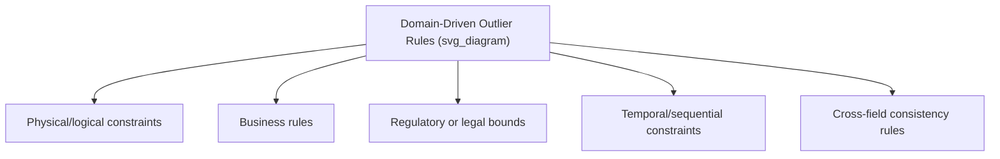
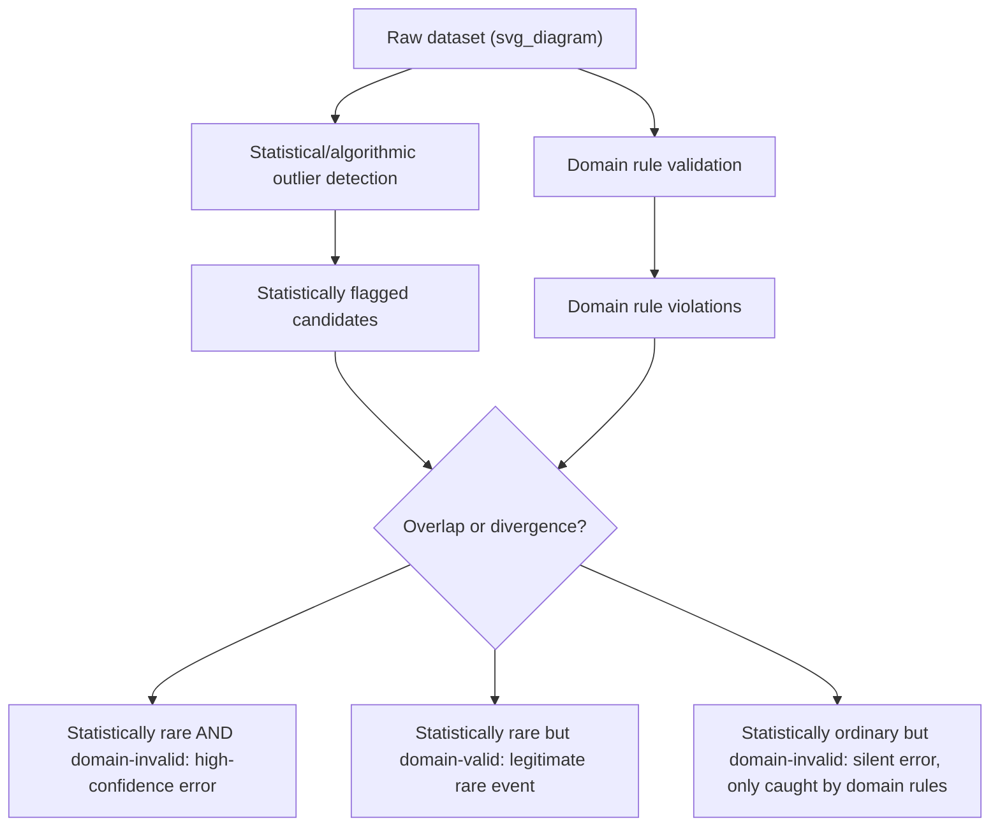

## Domain-Driven Outlier Definitions

### Overview

Domain-driven outlier definitions rely on expert knowledge, business rules, physical constraints, or regulatory standards to determine whether an observation is anomalous, rather than relying solely on statistical or algorithmic criteria. While the methods discussed previously — z-score, IQR, distance-based, density-based, and model-based approaches — define outliers purely in terms of a value's relationship to the rest of the dataset, domain-driven definitions instead ask whether a value is plausible or valid given real-world knowledge about what the variable represents, independent of how common or rare that value happens to be in the observed data.

This distinction matters because statistical rarity and domain implausibility are not the same thing: a statistically common value can still be domain-invalid, and a statistically rare value can still be entirely legitimate.

### Why Statistical Methods Alone Are Insufficient

**Key Points**

- A value can be statistically unremarkable (well within a normal z-score or IQR range) yet still be impossible or invalid given domain knowledge — for example, a recorded age of 45 is statistically ordinary, but a recorded age of 45 for a "years since company founding" field where the company was founded 10 years ago is domain-invalid
- Conversely, a value can be statistically extreme yet entirely legitimate — a very large single transaction amount might trigger a z-score or IQR flag, but could reflect a genuine large corporate purchase rather than an error
- Domain rules can catch errors that occur consistently across many records, which purely statistical methods may fail to flag if the erroneous pattern itself becomes the statistical norm within the flawed dataset (e.g., if a sensor consistently misreports a value, the erroneous readings will not appear as statistical outliers relative to each other)
- Domain knowledge is often necessary to correctly interpret whether a statistically flagged point represents an actual error or a valid rare event, making it a complement to, rather than a replacement for, statistical detection

[Inference] Purely statistical outlier detection methods are best understood as identifying candidates for further review rather than final determinations of validity, since they cannot incorporate context about what values are physically, logically, or legally possible for a given field without that knowledge being explicitly encoded through domain rules.

### Common Categories of Domain-Driven Rules



### Physical and Logical Constraints

Some variables have hard boundaries dictated by physical reality or logical necessity, independent of what the observed data distribution looks like.

```python
import pandas as pd
import numpy as np

df = pd.DataFrame({
    'age': [25, 34, -5, 150, 42],
    'temperature_celsius': [22.5, 18.0, -300.0, 45.2, 20.1],
    'percentage_complete': [45, 100, 105, 0, 87]
})

# Physical/logical constraint checks
df['age_invalid'] = (df['age'] < 0) | (df['age'] > 122)  # 122 is the documented maximum verified human age
df['temperature_invalid'] = df['temperature_celsius'] < -273.15  # absolute zero
df['percentage_invalid'] = (df['percentage_complete'] < 0) | (df['percentage_complete'] > 100)

print(df)
```

**Output**

```
   age  temperature_celsius  percentage_complete  age_invalid  temperature_invalid  percentage_invalid
0   25                 22.5                   45        False                False               False
1   34                 18.0                  100        False                False               False
2   -5               -300.0                  105         True                 True                True
3  150                 45.2                    0         True                False               False
4   42                 20.1                   87        False                False               False
```

Unlike a z-score or IQR check, these rules do not depend on the distribution of the observed data at all — a temperature reading below absolute zero is invalid regardless of how many other readings in the dataset happen to be similarly extreme, since it violates a fixed physical law rather than a statistical pattern.

### Business Rules

Many datasets are governed by organization-specific rules that define valid ranges or relationships based on operational context rather than universal physical law.

```python
orders = pd.DataFrame({
    'order_id': [1, 2, 3, 4],
    'quantity': [5, -2, 10000, 3],
    'unit_price': [19.99, 25.00, 5.00, 150000.00],
    'discount_percent': [10, 15, 20, 110]
})

# Business rule checks specific to this domain
orders['quantity_invalid'] = orders['quantity'] <= 0
orders['unit_price_suspicious'] = orders['unit_price'] > 10000  # threshold based on known product catalog max price
orders['discount_invalid'] = (orders['discount_percent'] < 0) | (orders['discount_percent'] > 100)

print(orders)
```

**Output**

```
   order_id  quantity  unit_price  discount_percent  quantity_invalid  unit_price_suspicious  discount_invalid
0         1         5       19.99                10             False                  False             False
1         2        -2       25.00                15              True                  False             False
2         3     10000        5.00                20             False                  False             False
3         4         3   150000.00               110             False                   True              True
```

[Inference] Business rule thresholds, such as the "$10,000 unit price" cutoff used above, typically require input from subject matter experts familiar with the specific product catalog, pricing structure, or operational context, rather than being derivable purely from the data itself, since these thresholds reflect organizational knowledge external to the dataset.

### Regulatory and Legal Bounds

Certain fields are constrained by external regulatory, legal, or industry-standard limits that define validity independent of the dataset's own statistical properties.

```python
medical_data = pd.DataFrame({
    'patient_id': [1, 2, 3],
    'systolic_bp': [120, 320, 85],
    'heart_rate_bpm': [72, 45, 250]
})

# Clinically defined plausible ranges (illustrative; actual clinical thresholds should come from medical guidelines)
medical_data['bp_out_of_clinical_range'] = (medical_data['systolic_bp'] < 60) | (medical_data['systolic_bp'] > 250)
medical_data['hr_out_of_clinical_range'] = (medical_data['heart_rate_bpm'] < 30) | (medical_data['heart_rate_bpm'] > 220)

print(medical_data)
```

**Output**

```
   patient_id  systolic_bp  heart_rate_bpm  bp_out_of_clinical_range  hr_out_of_clinical_range
0           1          120              72                     False                     False
1           2          320              45                      True                     False
2           3           85             250                     False                      True
```

[Unverified] The specific numeric thresholds used for clinically implausible ranges should always be sourced from current medical literature or established clinical guidelines rather than assumed defaults, since these values carry real consequences if applied incorrectly in a healthcare context; the values shown here are illustrative of the *technique* rather than a citation of a specific clinical standard.

### Temporal and Sequential Constraints

Some domain rules concern the logical ordering or consistency of dates and events, which purely statistical methods examining single columns in isolation cannot detect.

```python
events = pd.DataFrame({
    'user_id': [1, 2, 3],
    'account_created': pd.to_datetime(['2024-01-15', '2024-06-01', '2025-03-10']),
    'first_purchase': pd.to_datetime(['2024-02-01', '2024-05-15', '2025-03-05'])
})

# A purchase cannot logically occur before the account was created
events['temporal_inconsistency'] = events['first_purchase'] < events['account_created']
print(events)
```

**Output**

```
   user_id account_created first_purchase  temporal_inconsistency
0        1      2024-01-15     2024-02-01                   False
1        2      2024-06-01     2024-05-15                    True
2        3      2025-03-10     2025-03-05                    True
```

Neither `first_purchase` date on its own is statistically unusual — both fall within an entirely ordinary range of dates — but the logical relationship between the two columns reveals an impossible sequence of events that a single-column statistical check would never surface.

### Cross-Field Consistency Rules

Related to temporal constraints, many domain rules check whether values across multiple fields are mutually consistent according to known relationships, even when no individual field is statistically extreme.

```python
shipping = pd.DataFrame({
    'order_id': [1, 2, 3],
    'country': ['USA', 'Japan', 'Germany'],
    'postal_code': ['90210', '150-0001', '999999']
})

def validate_postal_code(row):
    if row['country'] == 'USA':
        return bool(pd.Series(row['postal_code']).str.match(r'^\d{5}(-\d{4})?$').iloc[0])
    elif row['country'] == 'Japan':
        return bool(pd.Series(row['postal_code']).str.match(r'^\d{3}-\d{4}$').iloc[0])
    elif row['country'] == 'Germany':
        return bool(pd.Series(row['postal_code']).str.match(r'^\d{5}$').iloc[0])
    return True

shipping['postal_code_valid'] = shipping.apply(validate_postal_code, axis=1)
print(shipping)
```

**Output**

```
   order_id  country postal_code  postal_code_valid
0         1      USA       90210               True
1         2    Japan    150-0001               True
2         3  Germany      999999              False
```

The German postal code `999999` is invalid not because it is statistically rare within the dataset, but because it does not conform to the known structural format for German postal codes, a rule that depends entirely on domain knowledge of postal system conventions rather than any statistical property of the data.

### Building a Domain Rule Engine

For datasets requiring many such checks, encapsulating domain rules into a structured, reusable validation framework improves maintainability compared to scattering ad hoc checks throughout a codebase.

```python
class DomainRuleValidator:
    def __init__(self):
        self.rules = []

    def add_rule(self, name, condition_func, description):
        self.rules.append({'name': name, 'condition': condition_func, 'description': description})

    def validate(self, df):
        results = pd.DataFrame(index=df.index)
        for rule in self.rules:
            results[rule['name']] = df.apply(rule['condition'], axis=1)
        results['any_violation'] = results.any(axis=1)
        return results

validator = DomainRuleValidator()
validator.add_rule(
    'negative_quantity',
    lambda row: row['quantity'] <= 0,
    'Order quantity must be positive'
)
validator.add_rule(
    'excessive_discount',
    lambda row: row['discount_percent'] > 100,
    'Discount cannot exceed 100%'
)

validation_results = validator.validate(orders)
print(validation_results)
```

**Output**

```
   negative_quantity  excessive_discount  any_violation
0              False               False          False
1               True               False           True
2              False               False          False
3              False                True           True
```

This kind of structured rule engine allows domain rules to be documented, reused across datasets, and audited independently of any single analysis, distinguishing it from one-off statistical thresholding that may not generalize across different data pulls or projects.

### Combining Statistical and Domain-Driven Detection



The most informative cases often arise at the divergence between these two detection approaches: a value that is domain-invalid but statistically unremarkable represents exactly the kind of error that purely statistical methods would silently miss, while a value that is statistically extreme but domain-valid represents a legitimate observation that a naive statistical threshold might incorrectly discard.

### Comparing Statistical and Domain-Driven Approaches

| Aspect | Statistical/Algorithmic Detection | Domain-Driven Detection |
| --- | --- | --- |
| Basis for flagging | Rarity relative to the observed dataset | Plausibility relative to real-world knowledge |
| Requires domain expertise | No | Yes |
| Can catch dataset-wide systematic errors | Often no (if the error is consistent, it isn't statistically rare) | Yes, if the rule encodes a known constraint |
| Can catch legitimate rare events incorrectly | Yes, without additional context | No, by design, since valid rare events pass domain rules |
| Maintainability across datasets | Method transfers automatically to new data | Rules must be defined for each specific field and often each specific domain |
| Auditability | Threshold and method are explicit, but rationale can be opaque | Rules are typically explicit business/physical logic, often easier to justify to stakeholders |

### Common Pitfalls

- **Relying exclusively on statistical methods without domain input** — as illustrated by the temporal consistency and postal code examples, some categories of errors are entirely invisible to statistical approaches and require explicit domain knowledge to detect at all
- **Assuming domain thresholds are fixed and universal** — regulatory limits, business rules, and even physical constraints can change over time (e.g., updated clinical guidelines, revised pricing policies), so domain rules should be periodically reviewed rather than treated as permanently fixed
- **Applying domain rules from one context to a superficially similar but different context** — a business rule threshold appropriate for one product line, region, or time period may not transfer correctly to another without re-validation by someone familiar with the new context
- **Treating a domain rule violation as automatically indicating a data entry error** — a cross-field inconsistency might reflect a genuine upstream process issue (e.g., a backdated purchase record) rather than a simple typo, and understanding the root cause often requires investigation beyond just flagging the violation
- **Neglecting to document the rationale behind domain rules** — a validation rule without an accompanying explanation of why it exists (which regulation, business policy, or physical law it encodes) becomes difficult to maintain, audit, or update as circumstances change

### Related Topics

- Statistical Methods for Outlier Detection: Z-Score, IQR
- Univariate vs Multivariate Outliers
- Data Validation and Schema Enforcement
- Cross-Field Consistency Checks and Business Rule Engines
- Outlier Treatment Strategies: Removal, Capping, and Transformation
- Data Quality Monitoring in Production Pipelines