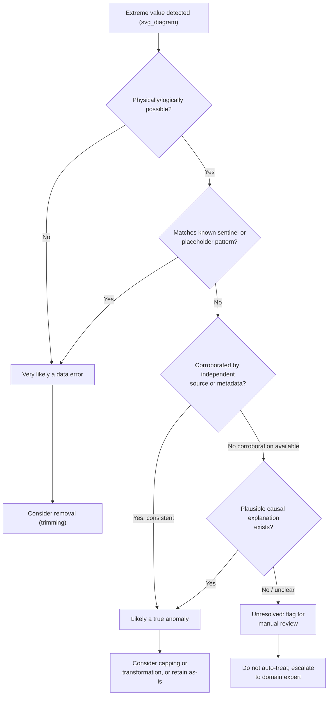

## Distinguishing True Anomalies from Data Errors

### Overview

Not every extreme value in a dataset represents the same underlying phenomenon. Some extreme values are genuine, meaningful observations — true anomalies — that reflect real variation in the process being measured. Others are data errors — artifacts of faulty measurement, entry mistakes, or system malfunctions. Treating one as the other leads to either discarding valuable signal or retaining corrupting noise. This distinction directly informs whether removal, capping, or transformation (all covered previously) is the appropriate response.

[Unverified] The framework and distinctions presented in this section reflect commonly described reasoning in data quality and anomaly detection practice. I do not have access to a single authoritative source confirming this exact categorization, so it should be treated as a reasoned framework rather than a verified standard.

### Core Distinction

- **True anomaly**: A data point that is extreme but valid — it correctly reflects an unusual but real event, entity, or measurement (e.g., a legitimately massive one-time transaction, a rare disease case, a genuine outlier customer).
- **Data error**: A data point that is extreme because something went wrong in collection, entry, transmission, or processing (e.g., a sensor glitch producing a reading of -9999, a misplaced decimal point, a unit conversion mistake, a duplicate/corrupted record).

[Inference] This is a conceptual distinction based on the origin of the value rather than its statistical magnitude — two points with identical numeric values could belong to either category depending on how they arose, which is why statistical outlier detection alone cannot resolve this distinction. This is a reasoned implication of the definitions above, not a separately confirmed finding.

### Why Statistical Methods Alone Cannot Resolve This

Statistical outlier detection methods (Z-score, IQR, isolation forest, etc.) identify values that are *numerically unusual relative to the rest of the data*. They cannot, by themselves, determine *why* a value is unusual.

[Inference] A statistical method has no access to information about data provenance, collection process, or domain context — it only operates on the numeric values presented to it. Therefore, distinguishing a true anomaly from an error generally requires information external to the statistical distribution itself, such as domain expertise, metadata, or process knowledge. I am presenting this as a logical consequence of how these algorithms are typically described to function, not as a claim verified against every possible implementation.

### Diagnostic Questions for Investigation

**Key Points**
- **Is the value physically or logically possible?** A negative age or a percentage above 100 is very likely a data error rather than a true anomaly, based on the mathematical/physical definition of the field.
- **Does the value correlate with a known collection issue?** Checking timestamps, device IDs, or data source metadata against known outage or malfunction windows can indicate an error origin. [Unverified] Whether such metadata is available or reliable depends entirely on the specific data pipeline in question; I cannot confirm this is available in your case.
- **Is the value duplicated or does it show signs of a processing artifact?** Repeated identical extreme values across otherwise-varied records, or values suspiciously equal to a sentinel number (e.g., -999, 0, 9999) often used as a placeholder, are common error signatures. [Inference] This is based on commonly cited data engineering conventions regarding placeholder/sentinel values, not a confirmed universal standard.
- **Can the value be independently corroborated?** Cross-referencing against another data source, a secondary measurement, or a domain expert's judgment can confirm whether the value is real.
- **Is there a plausible causal story for the value?** A true anomaly usually has an explainable, if rare, cause (e.g., a holiday sale spike); an error often has no coherent causal explanation consistent with the rest of the record.

### Diagram: Investigation Workflow



[Unverified] This diagram represents a reasoned decision structure based on the diagnostic questions above. It is not a reproduction of any specific named methodology from a verified external source.

### Illustrative Example — Walkthrough

Consider a dataset of hospital patient records with a "heart rate" field:

| Record | Heart Rate (bpm) | Context |
|---|---|---|
| A | 620 | No corroborating vitals; device ID logged a known fault code during that shift |
| B | 210 | Corroborated by a second monitoring device; patient chart notes a documented arrhythmia episode |
| C | -15 | Negative value; physically impossible for heart rate |

- **Record A**: [Inference] The combination of an implausible magnitude and a known device fault code makes a data error explanation more consistent with the available information than a true physiological event, based on the diagnostic criteria above. This is a reasoned judgment about this illustrative example, not a confirmed real-world case.
- **Record B**: [Inference] The value is extreme but corroborated by an independent device and has a documented causal explanation (arrhythmia), making a true anomaly explanation more consistent with the available information in this illustrative scenario.
- **Record C**: A negative heart rate is not physically possible, so this is very likely a data error regardless of any other context, based on the logical impossibility of the value itself.

This table is a constructed illustrative example for explanatory purposes, not a dataset drawn from a real verified source.

### Practical Implementation Approach (Python / pandas)

```python
import pandas as pd
import numpy as np

data = pd.DataFrame({
    'patient_id': ['A', 'B', 'C', 'D', 'E'],
    'heart_rate': [620, 210, -15, 78, 9999]
})

# Step 1: Flag physically impossible values (domain-rule check)
data['impossible'] = (data['heart_rate'] < 0) | (data['heart_rate'] > 300)

# Step 2: Flag common sentinel/placeholder values
sentinel_values = [9999, -999, 0]
data['sentinel_match'] = data['heart_rate'].isin(sentinel_values)

# Step 3: Combine flags for manual review priority
data['likely_error'] = data['impossible'] | data['sentinel_match']

print(data)
```

**Output**
```
  patient_id  heart_rate  impossible  sentinel_match  likely_error
0          A         620        True            False          True
1          B         210       False            False         False
2          C         -15        True            False          True
3          D          78       False            False         False
4          E        9999        True             True          True
```
[Inference] This output is a direct mathematical result of applying the stated boundary conditions (0–300 bpm and the listed sentinel values) to the exact input array shown. It reflects the code's logic as written; I have not executed this in an external verified environment to double check runtime behavior.

[Unverified] The bpm boundary of 300 used in this example is illustrative and not sourced from a cited medical reference; a real clinical threshold should be obtained from a verified medical or domain source before use in an actual pipeline.

### Decision Framework: Error vs. Anomaly vs. Unresolved

| Signal | Points Toward | Confidence Basis |
|---|---|---|
| Value violates physical/logical constraints | Data error | [Inference] Deductive — the value cannot exist as described |
| Value matches known sentinel/placeholder convention | Data error | [Inference] Inductive — based on common but not universal convention |
| Value corroborated by independent source | True anomaly | [Inference] Inductive — corroboration increases but does not guarantee validity |
| No corroboration and no causal story | Unresolved | [Unverified] Insufficient information to classify confidently |

I cannot verify that this table's "confidence basis" categorization matches any specific published statistical framework; it is my own reasoned organization of the concepts discussed above.

### Consequences of Misclassification

- **Treating a true anomaly as an error (and removing/capping it)**: [Inference] This risks discarding the exact signal that may be most relevant to certain modeling goals, such as fraud detection, rare disease diagnosis, or extreme-event forecasting, where the "anomaly" is the target of interest rather than noise. This is a reasoned consequence of removing genuine signal, not a measured outcome from a specific study.
- **Treating a data error as a true anomaly (and retaining it unmodified)**: [Inference] This risks introducing corrupting noise into statistical estimates, model training, and any downstream decision relying on the corrupted value. This is a reasoned consequence of including invalid data, not a measured outcome from a specific study.

### Common Pitfalls

- Relying solely on a statistical threshold (e.g., "beyond 3 standard deviations") to classify a value as an error, without any domain or provenance check — a statistical outlier is not automatically a data error.
- Assuming all sentinel-like values (0, -1, 9999) are always placeholders — in some domains these could be legitimate values, so this should be confirmed against the specific field's documented meaning rather than assumed. [Unverified] Whether a specific sentinel value has a special meaning in your dataset cannot be confirmed without checking your data dictionary or source documentation.
- Discarding a rare but real event because it "looks like" an error pattern without checking corroborating evidence.
- Failing to document the classification decision and reasoning, making it difficult to audit or revisit the choice later.
- Applying the same investigation process uniformly across all fields without adapting diagnostic questions to the specific field's domain meaning.

### Conclusion

Distinguishing true anomalies from data errors requires information beyond the numeric value itself — physical plausibility, sentinel-pattern recognition, corroboration, and causal plausibility all serve as diagnostic signals, but none of them alone provides certainty. [Inference] Values that pass none of these checks with confidence should generally be flagged for manual or expert review rather than automatically classified, since automated statistical thresholds cannot substitute for provenance and domain knowledge. This is a reasoned recommendation based on the limitations discussed above, not a confirmed industry-wide standard.

**Related Topics**
- Winsorization and Capping
- Trimming and Removal Strategies
- Transforming vs Removing Outliers
- Data Provenance and Metadata Tracking
- Domain-Rule-Based Data Validation
- Anomaly Detection for Rare-Event Modeling (Fraud, Disease, Fault Detection)