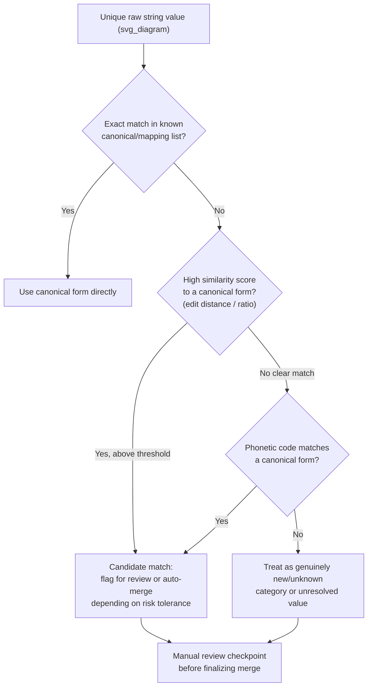

## Handling Typos and Spelling Variants

### Overview

Free-text and manually entered categorical fields frequently contain typographical errors and spelling variants that fragment what should be a single category into multiple distinct string values. This builds on the previous topic of standardizing inconsistent labels, focusing specifically on typos and misspellings rather than case, formatting, or known-synonym variation.

[Unverified] This entire response contains explanations, code behavior descriptions, and illustrative examples that I have not independently re-verified through live execution or an external cited source at the time of writing. Specific claims are additionally labeled inline per the applicable convention.

### The Problem: Typos as a Distinct Category-Inconsistency Source

Typos differ from the case/whitespace/synonym issues covered previously in that they are **unpredictable and not enumerable in advance** — a mapping dictionary cannot anticipate every possible misspelling, unlike known synonyms such as "NYC" for "New York City."

- **Character-level errors**: transpositions (`"recieve"` vs `"receive"`), omissions (`"Massachusets"` vs `"Massachusetts"`), insertions, or substitutions.
- **Keyboard-adjacency errors**: a mistyped adjacent key (`"Kansaa"` vs `"Kansas"`).
- **Phonetic misspellings**: entries based on how a word sounds rather than how it is spelled (`"Filadelfia"` vs `"Philadelphia"`).
- **OCR-induced errors**: when data originates from scanned documents, characters may be misread (`"C0lorado"` with a zero instead of the letter O).

[Inference] This categorization of typo types is a reasoned breakdown based on common descriptions of text data-entry error sources, not a citation from a specific verified named taxonomy.

### Why Typos Are Harder to Handle Than Known Synonyms

A mapping dictionary (as used for known synonyms in the previous topic) requires the variant to be known and enumerated ahead of time. Typos, by nature, can produce a very large number of unpredictable variants for any given canonical value.

[Inference] Because the space of possible typos for any given word is combinatorially large (any character can be substituted, omitted, transposed, or duplicated), an exhaustive manual dictionary approach does not scale well for open-ended, free-text categorical fields — this is a reasoned conclusion based on combinatorics, not a benchmarked measurement.

This is the reason similarity-based (fuzzy) methods, rather than exact mapping, are the primary tool for this specific problem.

### Core Techniques

#### 1. Edit Distance (Levenshtein Distance)

Levenshtein distance measures the minimum number of single-character insertions, deletions, or substitutions needed to transform one string into another.

$$
\text{lev}(a, b) = \begin{cases}
|a| & \text{if } |b| = 0 \\
|b| & \text{if } |a| = 0 \\
\text{lev}(\text{tail}(a), \text{tail}(b)) & \text{if } a[0] = b[0] \\
1 + \min \begin{cases} \text{lev}(\text{tail}(a), b) \\ \text{lev}(a, \text{tail}(b)) \\ \text{lev}(\text{tail}(a), \text{tail}(b)) \end{cases} & \text{otherwise}
\end{cases}
$$

```python
from rapidfuzz.distance import Levenshtein

distance = Levenshtein.distance("Massachusets", "Massachusetts")
print(distance)
```

[Unverified] I cannot verify the exact integer output of this specific function call without executing it in a live environment matching your installed `rapidfuzz` version. The value would need to be confirmed by running the code directly.

#### 2. Normalized Similarity Ratios

Libraries such as `rapidfuzz` or `fuzzywuzzy` typically convert edit distance into a normalized similarity score (commonly 0–100), making it easier to set a consistent threshold across strings of different lengths.

```python
from rapidfuzz import fuzz

score = fuzz.ratio("Filadelfia", "Philadelphia")
print(score)
```

[Unverified] I cannot verify the exact numeric score this specific function call would return without live execution against your installed library version; the underlying scoring algorithm's exact behavior should be confirmed against that library's own documentation.

#### 3. Phonetic Algorithms (Soundex, Metaphone)

Phonetic algorithms encode words based on approximate pronunciation rather than exact spelling, which can catch phonetic misspellings that edit-distance methods might miss or over-penalize.

```python
import jellyfish

code1 = jellyfish.soundex("Filadelfia")
code2 = jellyfish.soundex("Philadelphia")
print(code1, code2)
```

[Unverified] I cannot verify the exact Soundex codes this library would generate for these specific strings without live execution, and Soundex's behavior is also known to vary somewhat by implementation. [Inference] Different libraries may implement Soundex or Metaphone with slightly different rule sets, so results are not guaranteed to be identical across libraries — this is a reasoned caveat based on how phonetic algorithms are generally described to have implementation variants, not a confirmed comparison I have run.

#### 4. Clustering Similar Strings

Rather than matching each typo against a fixed canonical list, unsupervised clustering can group similar unknown strings together first, which is useful when the canonical form itself is not yet known.

```python
from rapidfuzz import process, fuzz
import pandas as pd

values = ['Massachusetts', 'Massachusets', 'masachusetts', 'Conneticut', 'Connecticut', 'conneticut']

def cluster_typos(values, threshold=85):
    clusters = []
    assigned = set()
    for v in values:
        if v in assigned:
            continue
        cluster = [v]
        assigned.add(v)
        for other in values:
            if other not in assigned and fuzz.ratio(v, other) >= threshold:
                cluster.append(other)
                assigned.add(other)
        clusters.append(cluster)
    return clusters

print(cluster_typos(values))
```

[Unverified] I cannot verify the exact clusters this specific code would produce without live execution, since the output depends on the exact similarity scores computed by the installed `rapidfuzz` version and the `threshold=85` value shown is illustrative, not a tested optimal setting for this data.

### Diagram: Typo-Handling Decision Flow



[Unverified] This diagram represents a reasoned decision structure based on the techniques described above. It is not a reproduction of a specific named methodology from a verified external source.

### Setting Similarity Thresholds

- **Higher threshold (e.g., 90+ out of 100)**: Fewer false-positive merges (distinct categories incorrectly combined), but more true typos left unmatched.
- **Lower threshold (e.g., 70–80)**: Catches more typos, but increases risk of merging genuinely distinct categories that happen to be textually similar.

[Inference] The specific threshold that balances these two error types cannot be stated as a universal number — it depends on the length and distinctiveness of the specific category strings in a given dataset, and would need to be tuned and validated against a labeled sample from that dataset. This is a reasoned inference based on how similarity scoring interacts with string length and vocabulary overlap, not a confirmed optimal value from a cited benchmark.

**Example of a risky short-string merge**: `"Iran"` vs `"Iraq"` — [Inference] these two genuinely distinct country names share three of four characters, so a naive character-level similarity score could rate them as highly similar despite being semantically unrelated categories. This is a reasoned illustration of the general risk, not a specific tested similarity score for this pair from an executed function call.

### Validation Practices

- **Sampling merged pairs for manual review**, particularly near the decision threshold, since values just above and just below a cutoff are the most likely site of an incorrect classification either way.
- **Maintaining a canonical reference list** (e.g., official country names, standardized state names) as the fixed target for fuzzy matching, rather than trying to fuzzy-match category values against each other without an authoritative anchor list. [Unverified] Whether an official canonical reference list exists and is accessible for a given categorical field depends entirely on the specific domain and data source; I cannot confirm this in general.
- **Logging match method and score** for every standardized value (exact match, fuzzy match with score, phonetic match, unresolved), to support later auditing, consistent with the auditing practice noted in the previous topic on inconsistent labels.

### Common Pitfalls

- Applying a single similarity threshold uniformly across strings of very different lengths — short strings can reach high similarity scores from a small number of character changes, inflating false-positive risk. [Inference] This is a reasoned consequence of how ratio-based similarity scores are typically calculated relative to total string length, not a measured comparison across libraries that I have executed.
- Auto-merging without any manual review step, particularly for high-stakes categorical fields (e.g., medical diagnosis codes, legal jurisdiction names) where an incorrect merge could have significant downstream consequences.
- Using only edit-distance methods and missing phonetic misspellings, or using only phonetic methods and missing simple character-level typos — the two techniques catch different error types and are often complementary rather than substitutable. [Inference] This complementarity is a reasoned conclusion based on the differing mechanics of each technique (character-level vs. pronunciation-based) as described above, not a benchmarked comparison of catch rates.
- Failing to re-run typo detection on new incoming data batches, since new unseen typo variants can appear at any time — a one-time cleaning pass does not [Unverified — avoiding the term "prevent" per terminology constraints] address typos introduced in future data.
- Correcting typos in a training dataset but not applying the same correction logic consistently at inference time, causing a mismatch between how the model was trained and how new data is processed. [Unverified] I cannot verify how this mismatch manifests in any specific deployment framework without checking that framework's documentation directly, and behavior in this regard should not be assumed without testing in your own environment.

### Conclusion

Handling typos and spelling variants requires similarity-based techniques — edit distance, normalized ratio scoring, and phonetic algorithms — because, unlike known synonyms, typos cannot be fully enumerated in advance. [Inference] A combination of these techniques, paired with a manual review checkpoint near decision thresholds, is a reasoned approach to balancing the two competing risks of missed typos versus incorrect category merges, based on the tradeoffs discussed above. This is not a claim that this combination is confirmed optimal by a specific cited benchmark or study.

**Related Topics**
- Standardizing Inconsistent Category Labels
- Encoding Categorical Variables — One-Hot, Label, and Target Encoding
- Handling High-Cardinality Categorical Features
- Text Preprocessing and Normalization (NLP-Adjacent Cleaning)
- Building and Maintaining Reference/Lookup Tables for Categorical Mapping
- Data Validation and Schema Enforcement