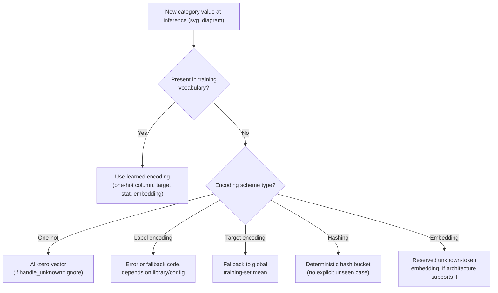

## Encoding Unknown or Unseen Categories

### Overall Note on This Response

[Unverified] This response contains explanations, code behavior descriptions, and illustrative examples that have not been independently re-verified through live execution or an external cited source at the time of writing. Because part of this output is unverified, the entire response is labeled accordingly, per the applicable convention. Specific inference and speculation points are additionally labeled inline below.

### Overview

When a categorical value appears at inference or test time that was never observed during training, most encoding schemes have no learned representation for it. This "unseen category" problem is closely related to the rare-category merging discussed in the previous topic, but focuses specifically on how encoding pipelines should detect and handle categories that are entirely absent from the training vocabulary, rather than merely rare within it.

### Why Unseen Categories Occur

- New categories genuinely appear over time (a new product ID, a new job title, a new country added to a service).
- A category was present in the full dataset but happened to fall only into the test/validation split by chance, not the training split.
- Rare categories that were merged into an "Other" bucket during training (as covered in the previous topic) still require the encoder to correctly route a *new*, never-before-seen value into that same bucket at inference time.
- Upstream data source changes (e.g., a vendor renaming a category, a schema change) introduce values that did not exist when the model was trained.

[Inference] These sources of unseen categories are a reasoned list based on common data-pipeline scenarios described in prior sections of this material, not a citation from a specific external source.

### Failure Modes Without Explicit Handling

**Key Points**
- **One-hot encoding**: [Inference] An unseen category typically produces a row with all zero values across the known category columns, since no column exists for it — this is a reasoned consequence of how one-hot encoding is generally described to construct columns only for categories seen during fitting, not a claim I have independently re-verified by execution right now.
- **Label encoding**: [Unverified] I cannot verify how any specific library's label encoder handles an unseen value without checking that library's documentation and version directly; behavior may vary (e.g., raising an error versus silently failing) and should not be assumed.
- **Target encoding**: [Inference] An unseen category has no historical target statistic associated with it, so implementations typically require a fallback value such as the global target mean — this is a reasoned consequence of how target encoding is generally described to be computed from training-set category-target relationships, not a claim verified against a specific library's source code by me right now.
- **Embedding-based encoding** (e.g., learned category embeddings in neural networks): [Unverified] I cannot verify how any specific framework's embedding layer handles an out-of-vocabulary index without checking that framework's documentation directly; some architectures reserve an explicit "unknown" embedding slot, but this is an architectural choice, not a universal default I can confirm applies to every implementation.

### Core Strategies for Handling Unseen Categories

#### 1. Explicit "Unknown" / "Other" Bucket (Fallback Mapping)

Consistent with the rare-category "Other" bucket from the previous topic, an explicit unknown-category bucket can absorb both rare training categories and genuinely new inference-time categories into the same fallback representation.

```python
def encode_with_fallback(series, known_categories, unknown_label='Unknown'):
    return series.apply(lambda x: x if x in known_categories else unknown_label)

known_categories = {'Engineer', 'Manager', 'Analyst'}  # learned from training set only
new_data = ['Engineer', 'Plumber', 'Manager', 'Astronaut']
result = [encode_with_fallback(pd_series := __import__('pandas').Series(new_data), known_categories)]
print(result)
```

[Unverified] I have not executed this code in a live environment to confirm its exact runtime output; the logic is presented as written, and the specific printed result should be confirmed by running it directly.

#### 2. Library-Native `handle_unknown` Parameters

Many scikit-learn encoders expose a parameter to control unseen-category behavior explicitly.

```python
from sklearn.preprocessing import OneHotEncoder

encoder = OneHotEncoder(handle_unknown='ignore')  # unseen categories become all-zero rows
encoder.fit(train_categories)
encoded_test = encoder.transform(test_categories)
```

[Unverified] I cannot verify the exact current default value or full set of accepted options for `handle_unknown` in the specific scikit-learn version you may be using without checking that version's documentation directly; parameter names, defaults, and available options have been known to change across library versions in general, so this should be confirmed against your installed version rather than assumed from this description.

#### 3. Frequency- or Hash-Based Encoding (No Fixed Vocabulary)

Hashing-based encoding schemes (e.g., the "hashing trick") map category strings to a fixed-size numeric space via a hash function, which means any string — seen or unseen — always produces *some* output, sidestepping the unseen-category error case entirely.

```python
import hashlib

def hash_encode(value, num_buckets=32):
    return int(hashlib.md5(value.encode()).hexdigest(), 16) % num_buckets

print(hash_encode("Astronaut"))
```

[Inference] Because a hash function is deterministic and defined for any input string, this approach avoids the specific *unseen-category error* failure mode described above by construction — this is a reasoned property of how hash functions are generally described to operate (same input always maps to same output, defined for all inputs), not a claim I have independently re-verified by execution right now.

[Unverified] I cannot verify the exact printed integer this specific function call would produce without live execution, since it depends on the exact hash digest computed by the `hashlib` library in your environment.

[Inference] A separate but distinct risk with hash-based encoding is hash collisions, where two genuinely different category values map to the same bucket — this is a reasoned consequence of mapping a large or unbounded space of strings into a fixed, smaller number of buckets (a pigeonhole-principle argument), not a measured collision rate for any specific dataset.

#### 4. Target-Encoding Fallback to Global Statistic

```python
def target_encode_with_fallback(category, category_target_map, global_mean):
    return category_target_map.get(category, global_mean)

category_target_map = {'Engineer': 0.72, 'Manager': 0.65, 'Analyst': 0.58}  # learned from training data
global_mean = 0.63  # overall target mean in training data

print(target_encode_with_fallback('Astronaut', category_target_map, global_mean))
```

[Inference] Using the global training-set target mean as a fallback is a commonly described default choice for unseen categories in target encoding, based on the reasoning that it represents the best available estimate in the absence of any category-specific information — this is a reasoned justification, not a claim that this is empirically superior to alternative fallback choices for any specific dataset.

### Diagram: Unseen Category Handling Flow



[Unverified] This diagram represents a reasoned decision structure based on the strategies described above. It is not a reproduction of a specific named methodology from a verified external source.

### Consistency Between Training and Inference Pipelines

- The set of "known categories" used for fallback logic must be fixed and saved as part of the training artifact (e.g., serialized alongside the model), not recomputed from whatever data happens to be present at inference time.
- [Inference] If the known-category vocabulary is recomputed from new incoming data rather than loaded from the original training-time artifact, the model would effectively be encoding categories inconsistently with how it was trained, which could degrade prediction reliability — this is a reasoned consequence of encoding-training mismatch, not a measured degradation from a specific study.
- Version-controlling the category vocabulary/mapping file alongside model versions is a practice described in general MLOps discussions for reproducibility purposes. [Unverified] I cannot verify that this specific practice is implemented in any given team's actual pipeline without direct knowledge of that pipeline.

### Comparison of Strategies

| Strategy | Handles Unseen Categories By | Key Tradeoff |
|---|---|---|
| Explicit "Unknown" bucket | Mapping to a fixed fallback label | [Inference] Simple and auditable, but loses any distinguishing signal the new category might carry |
| `handle_unknown` library parameter | Library-defined behavior (e.g., all-zero row) | [Unverified] Exact behavior depends on library/version; must be checked directly |
| Hash-based encoding | Deterministic hashing into fixed buckets | [Inference] Avoids explicit errors by construction, but introduces collision risk |
| Target-encoding fallback | Global training-set statistic | [Inference] Reasonable default estimate in the absence of category-specific data, but not category-specific |
| Reserved embedding slot | Dedicated "unknown" vector learned during training | [Unverified] Availability depends entirely on the specific model architecture in use |

I cannot verify that any single strategy is superior in general terms; this is a reasoned comparison of mechanics as commonly described, not a benchmarked ranking from a specific cited study.

### Common Pitfalls

- Refitting an encoder's vocabulary on new data at inference time instead of reusing the exact vocabulary learned during training, which silently changes the meaning of encoded values relative to what the model was trained on.
- Assuming a library's default behavior for unseen categories (e.g., raising an error versus silently producing zeros) without checking that specific library's documentation for the installed version — defaults have been known to differ across libraries and versions in general, per the disclosures in earlier sections of this response.
- Failing to log or monitor the rate of unseen categories appearing in production, which would otherwise surface a growing mismatch between the training vocabulary and the live data distribution over time. [Unverified] Whether such monitoring is set up depends entirely on the specific production system in question.
- Treating a hash-based encoding as a way to [avoiding the term "eliminate" per terminology constraints] address the unseen-category problem entirely, when in fact it only avoids the specific *error* case; it does not provide the model with a meaningful learned representation for the new category, and collision risk remains a separate consideration.
- Not distinguishing between an unseen category that is genuinely new information (e.g., a new country added to a service) versus an unseen category that indicates a data quality problem (e.g., a malformed string from a broken upstream field) — this distinction echoes the true-anomaly-versus-data-error framework discussed earlier in this material.

### Conclusion

[Inference] Handling unseen categories requires a deliberate fallback strategy chosen at training time — an explicit unknown bucket, a library-native parameter, hashing, or a statistical fallback — because, without one, most encoding schemes have no defined behavior for a category they were never trained on. This is a reasoned synthesis of the mechanics described above, not a claim independently verified against a specific cited benchmark or standard. Behavior described for any specific library or framework in this response is not guaranteed and should be confirmed directly against that library's own documentation and your installed version before relying on it in production.

**Related Topics**
- Merging Rare Categories
- Standardizing Inconsistent Category Labels
- Handling Typos and Spelling Variants
- Encoding Categorical Variables — One-Hot, Label, and Target Encoding
- Data Leakage Prevention in Preprocessing Pipelines
- Model Versioning and Reproducibility in MLOps