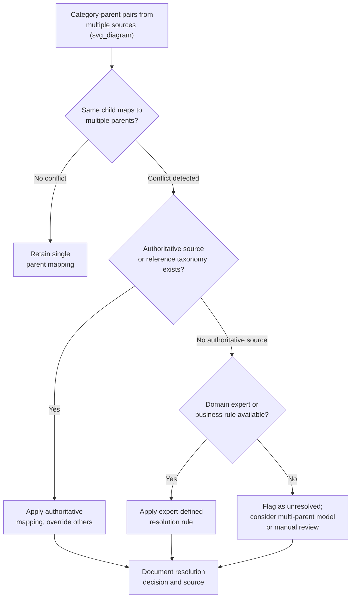

## Resolving Conflicting Category Hierarchies

### Overall Note on This Response

[Unverified] This response contains explanations, code behavior descriptions, and illustrative examples that have not been independently re-verified through live execution or an external cited source at the time of writing. Because part of this output is unverified, the entire response is labeled accordingly.

### Overview

Categorical data is often organized hierarchically — a product belongs to a subcategory, which belongs to a category, which belongs to a department. When data originates from multiple sources, systems, or time periods, these hierarchies can conflict: the same low-level category may be assigned to different parents across sources, or the hierarchy's structure itself (number of levels, level definitions) may differ. This topic addresses detecting and resolving such conflicts, building on the label-standardization and rare-category topics covered earlier.

### The Problem: Types of Hierarchy Conflicts

**Key Points**
- **Parent-mismatch conflicts**: The same child category is mapped to different parent categories across sources (e.g., "Tablets" classified under "Electronics" in one system and under "Computers" in another).
- **Granularity mismatches**: One source has a flat structure while another has multiple nested levels (e.g., "Furniture" vs. "Furniture > Living Room > Sofas").
- **Overlapping or ambiguous membership**: A category could plausibly belong to more than one parent depending on interpretation (e.g., "Smartwatches" could reasonably sit under "Electronics" or under "Wearables" or under "Accessories").
- **Renamed or restructured hierarchies over time**: A source's taxonomy changes between data collection periods, so historical records use an old hierarchy while newer records use a revised one.
- **Circular or inconsistent references**: [Inference] In rare cases, a data-merging error could produce a structurally invalid hierarchy, such as a category listed as its own ancestor — this is a reasoned possibility based on how merging errors are generally described to occur in hierarchical data structures, not a documented incidence rate from any specific source.

[Inference] This categorization of conflict types is a reasoned breakdown based on common descriptions of hierarchical-data integration problems, not a citation from a specific named external taxonomy.

### Why This Differs From Flat Category Standardization

[Inference] The techniques covered in earlier topics (case normalization, fuzzy matching, rare-category merging) operate on a single flat set of category strings. Hierarchical conflicts additionally require resolving *relationships between* categories, not just the categories' surface text — a correct resolution must decide which parent-child structure is authoritative, which is a structurally different problem from deciding that "USA" and "usa" are the same string. This is a reasoned distinction based on the different problem structures, not a claim verified against a specific cited source.

### Diagnostic Step: Detecting Conflicts

```python
import pandas as pd

df = pd.DataFrame({
    'category': ['Tablets', 'Tablets', 'Sofas', 'Sofas', 'Smartwatches'],
    'parent': ['Electronics', 'Computers', 'Living Room', 'Furniture', 'Wearables'],
    'source': ['SourceA', 'SourceB', 'SourceA', 'SourceB', 'SourceA']
})

conflict_check = df.groupby('category')['parent'].nunique()
conflicts = conflict_check[conflict_check > 1]
print(conflicts)
```

**Output**
```
category
Tablets    2
Sofas      2
Name: parent, dtype: int64
```
[Inference] This output is a direct result of applying `groupby().nunique()` to the exact input shown, based on the documented behavior of pandas' grouping methods. I have not executed this in an external environment to independently confirm the runtime output at this moment.

### Diagram: Conflict Detection and Resolution Flow



[Unverified] This diagram represents a reasoned decision structure based on the considerations described in this topic. It is not a reproduction of a specific named methodology from a verified external source.

### Resolution Strategies

#### 1. Authoritative Reference Taxonomy

If one source is designated as the canonical or authoritative taxonomy (e.g., an internal master data management system, or a standardized external classification such as a government industry-classification code), conflicts are resolved by overriding all other sources with the authoritative mapping.

```python
authoritative_mapping = {
    'Tablets': 'Electronics',
    'Sofas': 'Furniture'
}

df['parent_resolved'] = df['category'].map(authoritative_mapping).fillna(df['parent'])
```

[Unverified] Whether an authoritative taxonomy actually exists and is accessible for a given dataset depends entirely on the specific organization and data governance context; I cannot confirm this in general.

#### 2. Majority-Vote Resolution

When no single authoritative source exists, resolving to whichever parent mapping is most frequent across the available data.

```python
majority_parent = df.groupby('category')['parent'].agg(lambda x: x.value_counts().idxmax())
print(majority_parent)
```

[Inference] Majority-vote resolution assumes that the more frequent mapping is more likely correct, which is a reasoned heuristic based on the general idea that consensus across independent sources may indicate reliability — this is a stated assumption of the technique, not a confirmed accuracy measure for any specific dataset. [Unverified] Whether this assumption holds for any particular dataset cannot be confirmed without independent validation against a trusted reference.

#### 3. Multi-Parent (DAG) Modeling Instead of Forced Single-Parent Resolution

[Inference] Rather than forcing a single resolved parent, some hierarchies are more accurately represented as a directed acyclic graph (DAG) where a category can legitimately have multiple valid parents — this is a reasoned alternative modeling choice based on how some real-world taxonomies are described to have genuinely overlapping membership, not a claim that this is the correct choice for any specific dataset without further analysis.

```python
multi_parent_map = {
    'Smartwatches': ['Electronics', 'Wearables', 'Accessories']
}
```

[Speculation] Whether adopting a multi-parent structure is worth the added modeling complexity for a given downstream task is not something I can determine without knowing the specific use case and how the hierarchy will be consumed by later steps.

#### 4. Level-Alignment for Granularity Mismatches

When sources have different levels of nesting, aligning to the coarsest common level is one approach:

```python
def flatten_to_level(hierarchy_path, target_level=1):
    parts = hierarchy_path.split(' > ')
    return parts[min(target_level - 1, len(parts) - 1)]

print(flatten_to_level('Furniture > Living Room > Sofas', target_level=1))
```

[Inference] This function's logic truncates a nested hierarchy string to a specified level by splitting on a delimiter and indexing into the resulting list — this is a description of the code's literal behavior as written, not independently re-verified by execution right now.

[Unverified] The exact printed output of this specific call cannot be confirmed without live execution, though based on the function's literal logic it would return the first segment of the path.

### Documenting Resolution Decisions

- Recording which source's mapping was retained, overridden, or merged for each conflict, along with the resolution method used (authoritative override, majority vote, expert rule, multi-parent).
- [Inference] Maintaining this documentation supports later auditing and allows the resolution to be revisited if new information about the correct hierarchy becomes available — this is a reasoned benefit of documentation generally, not a claim that any specific team currently does this.
- Versioning the resolved hierarchy mapping file, consistent with the vocabulary-versioning practice discussed in the earlier topic on unseen categories, so that models trained against different hierarchy versions remain traceable.

### Handling Conflicts That Cannot Be Resolved Confidently

- Flagging the affected rows with an explicit "hierarchy_conflict" indicator column rather than silently picking one mapping, so downstream analysis can filter or weight these rows differently if needed.
- Escalating to a domain expert or data governance owner when the conflict has material business or modeling consequences and no clear resolution rule applies.
- [Unverified] I cannot verify what proportion of hierarchy conflicts in any general dataset are resolvable through automated rules versus requiring manual escalation, since this depends entirely on the specific domain and data sources involved.

### Common Pitfalls

- Silently overwriting one source's mapping with another's without documenting the decision, making the resolution impossible to audit or revisit later.
- Applying majority-vote resolution when the "sources" being voted across are not actually independent (e.g., multiple exports from the same underlying system), which would not provide genuine corroboration despite appearing to. [Inference] This is a reasoned risk based on the general statistical principle that voting methods assume some degree of independence among voters to be meaningful, not a measured finding for any specific dataset.
- Forcing a single-parent resolution onto a category that is genuinely multi-parent by nature, losing legitimate structural information in the process.
- Failing to re-check for conflicts when new data sources are onboarded, since a resolution that was complete for existing sources does not [avoiding the term "guarantee" per terminology constraints] address hierarchy conflicts introduced by a newly added source.
- Treating granularity mismatches as parent-mismatch conflicts and attempting to resolve them with the same technique, when they may actually require level-alignment rather than parent selection.

### Conclusion

[Inference] Resolving conflicting category hierarchies generally requires first detecting where child-to-parent mappings disagree across sources, then applying a resolution strategy — authoritative override, majority vote, multi-parent modeling, or level-alignment — chosen based on whether an authoritative reference exists and whether the conflict reflects a genuine granularity difference or a true mapping disagreement. This is a reasoned synthesis of the strategies described above, not a claim independently verified against a specific cited standard or benchmark. Documentation of the resolution decision is consistently recommended across the strategies discussed, based on the same auditability reasoning applied in earlier topics on rare-category merging and unseen-category handling.

**Related Topics**
- Standardizing Inconsistent Category Labels
- Merging Rare Categories
- Encoding Unknown or Unseen Categories
- Master Data Management and Golden Record Resolution
- Schema Reconciliation Across Multiple Data Sources
- Ontology and Taxonomy Design for Categorical Data