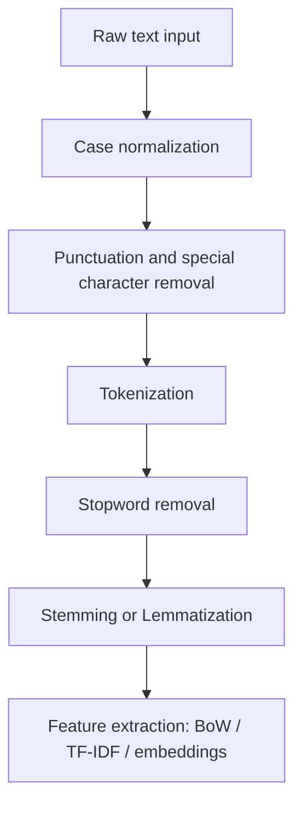

## Case Normalization

### Definition and Purpose

Case normalization is the process of converting text to a consistent letter case—typically lowercase—to reduce variability in textual data before it is used in machine learning pipelines. Without normalization, a model or algorithm may treat "Apple", "apple", and "APPLE" as three distinct tokens, even though they carry the same semantic meaning in most contexts.

### Why Case Normalization Matters

**Key Points**
- Reduces vocabulary size and sparsity in text-based feature representations (e.g., bag-of-words, TF-IDF)
- Prevents duplicate token entries that differ only in case, improving statistical efficiency
- Improves matching consistency for tasks like deduplication, keyword search, and string comparison
- Reduces noise in downstream tasks such as classification, clustering, and named entity recognition, though the degree of improvement is task-dependent [Inference]

Without case normalization, a vectorizer may assign separate dimensions to "Data", "data", and "DATA", inflating the feature space unnecessarily and diluting the frequency signal for what is conceptually a single term.

### Common Normalization Strategies

#### Lowercasing

The most common approach converts all characters to lowercase. This is the default behavior in many popular NLP preprocessing tools.

```python
text = "The Quick Brown FOX Jumps"
normalized = text.lower()
# Output: "the quick brown fox jumps"
```

This is a standard, well-documented string operation in Python and most programming languages, not an uncertain claim.

#### Uppercasing

Less common in NLP pipelines, but occasionally used in domains such as legal or governmental document processing where uppercase is the established convention for certain identifiers (e.g., country codes, certain acronyms).

```python
text = "iso 3166 country codes"
normalized = text.upper()
# Output: "ISO 3166 COUNTRY CODES"
```

#### Title Case / Sentence Case

Used primarily for display formatting rather than feature engineering, since it does not reduce vocabulary variability as effectively as lowercasing.

```python
text = "machine learning preprocessing"
normalized = text.title()
# Output: "Machine Learning Preprocessing"
```

### When Case Normalization Should Be Applied

**Key Points**
- Beneficial for tasks where case does not carry semantic meaning (general text classification, topic modeling, search indexing)
- Should be applied *before* tokenization in most pipelines, so tokens are consistent from the outset
- Should generally occur early in the pipeline, prior to stopword removal and stemming/lemmatization, since those steps often assume a consistent case

### When Case Normalization Should Be Avoided or Applied Carefully

Case can carry meaningful signal in certain tasks, and blanket lowercasing may remove useful information:

- **Named Entity Recognition (NER):** Capitalization often signals proper nouns (e.g., "Apple" the company vs. "apple" the fruit). Lowercasing indiscriminately can reduce NER model performance. [Inference] — this depends on the specific NER model and training data, and the magnitude of impact is not something that can be stated as a fixed fact.
- **Sentiment analysis:** Capitalization patterns (e.g., "THIS IS AMAZING") can signal emphasis or emotional intensity, which lowercasing removes.
- **Acronym disambiguation:** "US" (United States) vs. "us" (pronoun) become indistinguishable after lowercasing.
- **Code or identifier fields:** Variable names, function names, and file paths are often case-sensitive by definition, and normalizing case could alter their meaning entirely.

### Implementation Example (Pandas)

```python
import pandas as pd

df = pd.DataFrame({
    "review_text": ["Great PRODUCT!", "Terrible service.", "AMAZING Value"]
})

df["review_text_normalized"] = df["review_text"].str.lower()
print(df)
```

**Output**
```
      review_text        review_text_normalized
0     Great PRODUCT!     great product!
1     Terrible service.  terrible service.
2     AMAZING Value      amazing value
```

### Interaction with Other Preprocessing Steps

Case normalization interacts with several other cleaning steps, and the order of operations can affect results:### Interaction with Other Preprocessing Steps

Case normalization interacts with several other cleaning steps, and the order in which these are applied can affect downstream results.



**Key Points**
- Applying case normalization *before* tokenization ensures consistent token boundaries, since some tokenizers may treat capitalized and non-capitalized versions of a word differently in edge cases. [Unverified] — this depends on the specific tokenizer implementation and is not something that can be asserted universally across all libraries.
- Applying it *before* stopword removal is generally necessary because stopword lists (e.g., "the", "and", "is") are typically stored in lowercase; failing to normalize case first can cause "The" or "AND" to be missed by the filter.
- Stemming and lemmatization algorithms are often case-sensitive in their rule matching, so normalizing case beforehand improves consistency of the output root forms. [Inference] — behavior varies by specific library and language model used.

### Effect on Vocabulary Size (Illustrative)

The following diagram illustrates conceptually how case normalization reduces the number of unique tokens recognized by a vectorizer.

<svg width="100%" viewBox="0 0 680 320" role="img"><title>Vocabulary size before and after case normalization (svg_diagram)</title><desc>Comparison showing that unnormalized text produces more unique tokens than case-normalized text, using the words Data, data, DATA versus a single token data.</desc>
<defs><marker id="arrow" viewBox="0 0 10 10" refX="8" refY="5" markerWidth="6" markerHeight="6" orient="auto-start-reverse"><path d="M2 1L8 5L2 9" fill="none" stroke="context-stroke" stroke-width="1.5" stroke-linecap="round" stroke-linejoin="round" /></marker></defs>
<text class="th" x="40" y="35" text-anchor="start">Before normalization (svg_diagram)</text>
<g class="c-coral">
<rect x="40" y="55" width="120" height="44" rx="8" stroke-width="0.5" />
<text class="th" x="100" y="77" text-anchor="middle" dominant-baseline="central">"Data"</text>
</g>
<g class="c-coral">
<rect x="180" y="55" width="120" height="44" rx="8" stroke-width="0.5" />
<text class="th" x="240" y="77" text-anchor="middle" dominant-baseline="central">"data"</text>
</g>
<g class="c-coral">
<rect x="320" y="55" width="120" height="44" rx="8" stroke-width="0.5" />
<text class="th" x="380" y="77" text-anchor="middle" dominant-baseline="central">"DATA"</text>
</g>
<text class="ts" x="40" y="125" text-anchor="start">Result: 3 distinct vocabulary entries</text>

<line x1="240" y1="150" x2="240" y2="190" class="arr" marker-end="url(#arrow)" />
<text class="ts" x="250" y="175" text-anchor="start">.lower()</text>

<text class="th" x="40" y="225" text-anchor="start">After normalization (svg_diagram)</text>
<g class="c-teal">
<rect x="180" y="245" width="120" height="44" rx="8" stroke-width="0.5" />
<text class="th" x="240" y="267" text-anchor="middle" dominant-baseline="central">"data"</text>
</g>
<text class="ts" x="40" y="315" text-anchor="start">Result: 1 unified vocabulary entry</text>
</svg>

### Language and Locale Considerations

- **Turkish "I" problem:** In Turkish, the standard `.lower()` and `.upper()` behavior of some string libraries can produce unexpected results because Turkish distinguishes between dotted and dotless "I"/"i" characters. Using a locale-aware normalization method (e.g., Python's `str.casefold()` combined with proper locale settings, or ICU-based libraries) is recommended for such languages. [Unverified] — exact behavior depends on the programming language, library version, and locale configuration in use.
- **`str.lower()` vs `str.casefold()` (Python):** `casefold()` is more aggressive than `lower()` and is designed specifically for caseless matching across a wider range of Unicode characters, such as the German "ß", which `casefold()` converts to "ss" while `lower()` leaves unchanged in most implementations. This is documented Python standard library behavior.

```python
text = "straße"
print(text.lower())     # Output: "straße"
print(text.casefold())  # Output: "strasse"
```

- **Non-Latin scripts:** Many scripts (e.g., Chinese, Japanese, Korean, Arabic, Thai) do not have a case distinction at all, so case normalization is not applicable to them. Applying `.lower()` to such text typically has no effect but does not cause errors in most standard libraries.

### Case Normalization in Different ML Contexts

#### Traditional NLP Pipelines (Bag-of-Words, TF-IDF)

Case normalization is almost universally recommended here, since these methods rely purely on exact string/token matches and gain no benefit from case distinctions in most general-purpose text classification tasks.

#### Modern Transformer-Based Models

Many pretrained transformer models come in both cased and uncased variants (e.g., "bert-base-uncased" vs. "bert-base-cased"). This is a documented, well-established distinction in widely used model families.

- **Uncased models:** Text is lowercased during preprocessing to match the tokenizer's training data. Applying additional manual lowercasing before feeding text into an uncased tokenizer is typically redundant if the tokenizer already performs this step internally, but does not usually cause errors.
- **Cased models:** Case is preserved because it can carry useful signal for tasks like NER or tasks where proper noun distinction matters. Manually lowercasing input intended for a cased model would remove information the model was trained to use, and could reduce performance. [Inference] — the magnitude of any performance impact depends on the specific model, task, and dataset, and should not be treated as a guaranteed outcome.

**Key Points**
- Always match the preprocessing (including case handling) to what the specific pretrained model expects; mismatched preprocessing is a common source of degraded model performance. [Inference] — this is a widely cited best practice in NLP literature, but the specific degree of degradation is task- and model-dependent and cannot be quantified without empirical testing.

### Common Pitfalls

- **Applying normalization inconsistently between training and inference data.** If training data is lowercased but production/inference data is not, the model may encounter out-of-vocabulary tokens or mismatched features at inference time.
- **Normalizing case on fields where it is semantically meaningful**, such as user-entered product codes, license plates, or currency codes, without first confirming this is safe for the specific field.
- **Forgetting locale-specific casing rules** when working with multilingual datasets, which can silently produce incorrect results for certain languages (e.g., Turkish).
- **Applying `.lower()` blindly to structured text mixed with free text** (e.g., a column that contains both sentences and embedded codes like "SKU-4521"), which can alter identifiers unintentionally.

### Practical Recommendation Summary

| Scenario | Recommended Action |
|---|---|
| General text classification (BoW/TF-IDF) | Apply lowercasing |
| Sentiment analysis | Evaluate case sensitivity carefully; consider preserving case |
| Named Entity Recognition | Preserve case where possible, or use a cased model |
| Using an "uncased" pretrained model | Lowercasing is typically handled internally; manual step often unnecessary |
| Using a "cased" pretrained model | Do not lowercase |
| Multilingual data | Use locale-aware case normalization methods |
| Structured/mixed fields (codes, IDs) | Avoid blanket normalization; handle selectively |

### Conclusion

Case normalization is a foundational but context-dependent step in text preprocessing. While lowercasing is the default and generally beneficial choice for traditional bag-of-words or TF-IDF-based pipelines, it is not universally appropriate. Tasks such as named entity recognition, sentiment analysis, and use of case-sensitive pretrained models require a more deliberate, evaluated approach. The general principle is to align case handling with what the downstream model or algorithm was designed and trained to expect.

**Related Topics**
- Data Cleaning for Text Fields — Punctuation and special character removal
- Data Cleaning for Text Fields — Unicode normalization (NFC/NFKC/NFD/NFKD forms)
- Data Cleaning for Text Fields — Tokenization strategies
- Data Cleaning for Text Fields — Stopword removal
- Data Cleaning for Text Fields — Stemming vs. Lemmatization
- Data Cleaning for Text Fields — Handling contractions and abbreviations
- Data Cleaning for Text Fields — Whitespace and encoding normalization