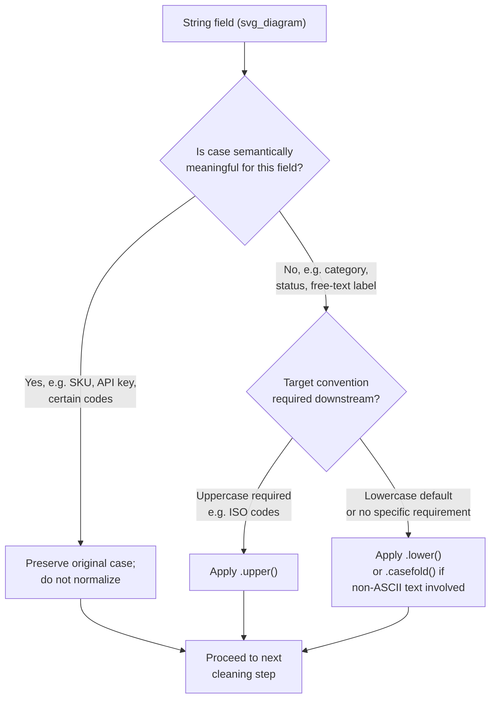

## Case Normalization

### Overall Note on This Response

[Unverified] This response contains explanations, code behavior descriptions, and illustrative examples that have not been independently re-verified through live execution or an external cited source at the time of writing. Because part of this output is unverified, the entire response is labeled accordingly.

### Overview

Case normalization converts text to a consistent casing convention — typically lowercase, though uppercase or title case are used in specific contexts — so that string comparison, matching, grouping, and encoding operations treat differently-cased variants of the same value as identical. This topic isolates case conversion specifically, distinct from whitespace handling (previous topic) and typo correction (covered earlier), though the three are commonly applied together as part of a single cleaning sequence.

### Why Case Differences Fragment Data

[Inference] Most programming languages and data libraries compare strings by exact character sequence by default, and lowercase and uppercase letters are distinct characters at the code-point level (e.g., `"A"` and `"a"` are different Unicode code points) — this is a reasoned description of how character encoding and string comparison are generally documented to work, not independently re-verified against every specific language or library implementation right now. As a result, `"Yes"`, `"yes"`, and `"YES"` are treated as three separate values unless explicitly normalized.

### Common Case Conventions

**Key Points**
- **Lowercase**: The most common default target for case normalization in general-purpose categorical and text cleaning, since it is a single deterministic target regardless of the original casing style.
- **Uppercase**: Used in specific domains such as certain identifier codes, country codes (e.g., ISO 3166 alpha-2 codes), or legacy system conventions that expect uppercase.
- **Title Case**: Sometimes used for display purposes (e.g., proper nouns, headings) but generally not recommended as a matching/comparison target since title-casing rules can behave inconsistently around apostrophes, hyphens, and multi-word proper nouns. [Inference] This inconsistency risk is a reasoned concern based on how title-casing algorithms are generally described to apply simple word-boundary rules that may not correctly handle every linguistic edge case, not a documented failure rate from a specific library.
- **Sentence case**: Rarely relevant for categorical matching; more common in free-text display formatting.

[Unverified] Whether uppercase or lowercase is the "correct" convention for any specific field depends entirely on downstream system requirements and existing conventions in a given project; I cannot state a universal default that applies to every case.

### Core Techniques

#### 1. Basic Lowercase Conversion

```python
import pandas as pd

df = pd.DataFrame({'response': ['Yes', 'yes', 'YES', 'No', 'NO', 'no']})
df['response_clean'] = df['response'].str.lower()
print(df)
```

**Output**
```
  response response_clean
0      Yes            yes
1      yes            yes
2      YES            yes
3       No             no
4       NO             no
5       no             no
```
[Inference] This output is a direct result of applying `str.lower()` to the exact input shown, based on the documented behavior of pandas' string accessor methods. I have not executed this in an external environment to independently confirm the runtime output at this moment.

#### 2. Uppercase Conversion (for Codes/Identifiers)

```python
df['country_code_clean'] = df['country_code'].str.upper()
```

[Unverified] I cannot verify whether uppercase is the correct target convention for a specific identifier field without knowing the relevant standard or system requirement it must conform to (e.g., a documented ISO standard or an internal system's expected format).

#### 3. Case Folding for Unicode-Aware Comparison

For text containing non-ASCII characters, simple `.lower()` conversion may not correctly normalize all case variants across languages, since some Unicode characters have case-conversion behavior that differs from standard ASCII lowercase.

```python
text = "STRASSE"
print(text.casefold())
```

[Inference] Python's `str.casefold()` method is generally documented as intended for more aggressive, locale-independent case comparison than `.lower()`, particularly for certain non-ASCII characters — this is a description of documented Python behavior, not independently re-verified by execution against your specific Python version right now. [Unverified] The exact printed output of this specific call, and whether it differs from `.lower()` for this specific input, cannot be confirmed without live execution against your installed Python version.

#### 4. Selective Case Normalization (Preserving Case-Sensitive Fields)

```python
case_sensitive_fields = ['product_sku', 'api_key']
case_insensitive_fields = ['category', 'status', 'country']

for col in case_insensitive_fields:
    if col in df.columns:
        df[col] = df[col].str.lower()
```

[Inference] This pattern explicitly separates fields where case normalization is appropriate from fields where it is not, based on the reasoning that some identifiers or codes are legitimately case-sensitive by domain convention (e.g., certain SKU formats, API keys, or programming identifiers) — this is a reasoned design choice, not a claim that this specific list of fields is universally correct for any given dataset.

### Diagram: Case Normalization Decision Point



[Unverified] This diagram represents a reasoned decision structure based on the considerations described in this topic. It is not a reproduction of a specific named methodology from a verified external source.

### Interaction With Other Cleaning Steps

- [Inference] Case normalization is generally applied before fuzzy matching or typo correction (covered in an earlier topic), since comparing `"USA"` against `"usa"` without first normalizing case could cause a similarity-scoring function to register an artificial difference that is not actually meaningful — this is a reasoned sequencing rationale based on how case differences would otherwise be counted as character mismatches by most string-distance algorithms, not independently re-verified against every specific library's scoring behavior right now.
- Case normalization should generally occur alongside or immediately after whitespace normalization (previous topic), since both are deterministic, rule-based steps that do not require reference lists or similarity thresholds, unlike fuzzy matching or hierarchy resolution covered in earlier topics.

### Validation After Case Normalization

- **Unique-value count comparison**: Comparing the number of distinct values before and after lowercasing can indicate how much fragmentation was due to case alone, versus other issues (whitespace, typos, synonyms) requiring separate techniques. [Unverified] The specific expected reduction cannot be predicted without inspecting the actual dataset.
- **Spot-checking case-sensitive fields were correctly excluded**: Confirming that fields intentionally left case-sensitive (e.g., identifiers) were not inadvertently altered by a blanket normalization step applied across an entire dataframe.

### Common Pitfalls

- Applying blanket lowercase conversion across an entire dataset without first identifying which fields are legitimately case-sensitive (e.g., certain identifiers, codes, or programming-related string fields), which would incorrectly alter values that should remain distinct.
- Using `.lower()` on text containing non-ASCII characters without considering whether `.casefold()` or a more Unicode-aware normalization method is more appropriate for the specific language and character set involved. [Unverified] Whether this distinction matters for any specific dataset depends on the actual character content present, which I cannot confirm without inspecting it.
- Performing case normalization after fuzzy matching or typo correction rather than before, potentially causing case differences to be misattributed as typos or triggering unnecessary similarity-scoring computation, consistent with the sequencing rationale noted above.
- Assuming case normalization alone resolves all label inconsistency, when whitespace, synonyms, typos, and hierarchy conflicts (covered in separate topics) often require additional, distinct techniques.
- Failing to apply the same case-normalization logic consistently between training and inference/production pipelines, echoing the training/inference-consistency pitfall raised in multiple earlier topics in this material.

### Conclusion

[Inference] Case normalization is a deterministic, rule-based cleaning step — typically lowercasing, though uppercase or Unicode-aware case-folding apply in specific contexts — that should generally be applied early in a cleaning sequence, before similarity-based techniques such as fuzzy matching, and selectively excluded for fields where case carries legitimate domain meaning. This is a reasoned conclusion based on the mechanics and sequencing considerations described above, not a claim independently verified against a specific cited standard or benchmark. Behavior of specific string methods referenced in this response has not been independently re-executed and confirmed at this moment, and should be tested directly against your specific language/library version before being relied upon in production.

**Related Topics**
- Handling Case Sensitivity and Whitespace Issues
- Whitespace Trimming and Normalization
- Standardizing Inconsistent Category Labels
- Handling Typos and Spelling Variants
- Text Preprocessing and Normalization (NLP-Adjacent Cleaning)
- Unicode Normalization Forms (NFC, NFKC) in Text Cleaning