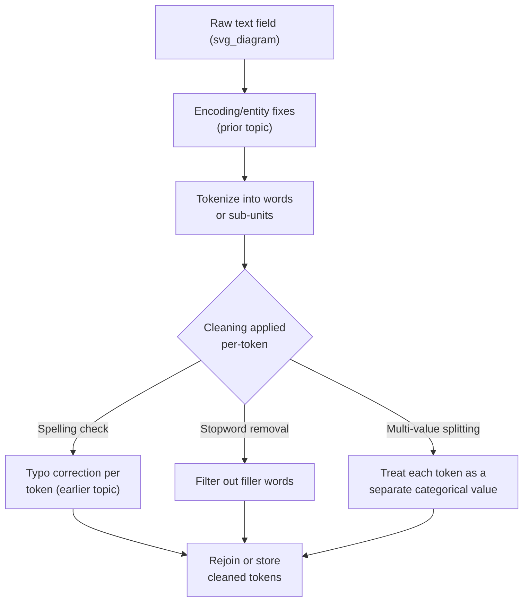

## Tokenization Basics for Cleaning Purposes

### Overall Note on This Response

[Unverified] This response contains explanations, code behavior descriptions, and illustrative examples that have not been independently re-verified through live execution or an external cited source at the time of writing. Because part of this output is unverified, the entire response is labeled accordingly.

### Overview

Tokenization is the process of splitting a string of text into smaller units — words, subwords, or characters — for further processing. In a data-cleaning context (as opposed to full NLP modeling), tokenization is typically used to detect and correct issues at a more granular level than the whole-field techniques covered in earlier topics, such as isolating individual words to check spelling, remove stopwords, or standardize multi-word fields.

### Why Tokenization Matters for Cleaning

- Some cleaning operations are more naturally applied per-token than per-field — for example, checking each word in a multi-word category field against a known-good vocabulary, or removing filler words from a free-text field.
- [Inference] Tokenization choices (what counts as a token boundary) directly affect the results of downstream cleaning steps such as fuzzy matching or typo correction described in earlier topics, since a poorly chosen tokenization scheme could split a value in an unintended way — this is a reasoned consequence of tokenization determining the granularity at which later steps operate, not independently re-verified against a specific benchmark right now.
- Multi-value fields (e.g., `"Sales, Marketing, Finance"`) require a tokenization/splitting step before the individual values can be standardized using the category-cleaning techniques from earlier topics.

### Levels of Tokenization

**Key Points**
- **Character-level tokenization**: Splitting text into individual characters. [Inference] This granularity is generally described as more relevant to certain low-level text-processing tasks (e.g., detecting character-level corruption) than to categorical-field cleaning specifically, based on how character-level analysis operates below the level of meaningful word units — not independently re-verified against a specific cited source right now.
- **Word-level tokenization**: Splitting text into words, typically based on whitespace and punctuation boundaries. This is the level most directly relevant to the cleaning techniques discussed in this material (typo correction, stopword removal, multi-value field splitting).
- **Subword tokenization**: Splitting text into units smaller than a full word but larger than a single character (e.g., splitting "unhappiness" into "un", "happi", "ness"). [Inference] This is generally described as more relevant to certain modern NLP model architectures than to traditional rule-based data cleaning, based on how subword tokenization is typically discussed in the context of neural language model vocabularies — not independently re-verified against a specific cited source right now.
- **Sentence-level tokenization**: Splitting a longer text block into individual sentences, relevant primarily for free-text fields rather than short categorical labels.

[Unverified] I cannot verify which tokenization level is universally "best" for any given cleaning task without knowing the specific field, its content, and the intended downstream use.

### Basic Word Tokenization Techniques

#### 1. Simple Whitespace Splitting

```python
text = "Sales Marketing Finance"
tokens = text.split()
print(tokens)
```

[Inference] Python's built-in `str.split()` method, when called with no arguments, is generally documented to split on any whitespace and discard empty strings resulting from multiple consecutive spaces — this is a description of documented Python standard-library behavior, not independently re-verified by execution against your specific Python version right now. [Unverified] I cannot verify the exact printed output of this specific call without live execution, though based on the documented method behavior it would likely produce a list of the three words shown.

#### 2. Delimiter-Based Splitting for Multi-Value Fields

```python
import re

text = "Sales, Marketing; Finance | Operations"
tokens = re.split(r'[,;|]', text)
tokens = [t.strip() for t in tokens if t.strip()]
print(tokens)
```

[Inference] This pattern splits on any of several possible delimiter characters and then trims and filters the resulting pieces, consistent with the multi-value field handling approach introduced in the earlier topic on standardizing inconsistent labels — this is a description of the code's literal logic as written, not independently re-verified by execution right now.

#### 3. Regex-Based Word Tokenization (Handling Punctuation)

```python
text = "Customer's order: shoes, hats, & bags."
tokens = re.findall(r"[A-Za-z']+", text)
print(tokens)
```

[Unverified] I cannot verify the exact list this specific regex pattern would produce for this specific string without live execution; the pattern is written to capture sequences of letters and apostrophes while excluding punctuation like colons, commas, and ampersands, based on the literal regex as written.

#### 4. Library-Based Tokenization (NLTK, spaCy)

```python
import nltk
tokens = nltk.word_tokenize("Don't split this incorrectly.")
print(tokens)
```

[Unverified] I cannot verify the exact tokenization output this specific NLTK function would produce without live execution against your installed NLTK version and downloaded tokenizer models, since word-tokenization libraries can implement different rules for handling contractions, punctuation, and special characters. This should be confirmed by running the code directly in your environment.

```python
import spacy
nlp = spacy.load("en_core_web_sm")
doc = nlp("Don't split this incorrectly.")
tokens = [token.text for token in doc]
print(tokens)
```

[Unverified] I cannot verify the exact tokenization output this specific spaCy pipeline would produce without live execution against your installed spaCy version and model, for the same reasons noted above regarding NLTK.

### Diagram: Tokenization's Role in the Cleaning Pipeline



[Unverified] This diagram represents a reasoned decision structure based on the considerations described in this topic and cross-referenced with earlier topics in this material. It is not a reproduction of a specific named methodology from a verified external source.

### Applying Per-Token Cleaning

#### Removing Stopwords (Filler Words)

```python
stopwords = {'the', 'a', 'an', 'of', 'and', 'in', 'on', 'at'}

def remove_stopwords(tokens):
    return [t for t in tokens if t.lower() not in stopwords]

tokens = ['the', 'quick', 'brown', 'fox', 'in', 'the', 'garden']
print(remove_stopwords(tokens))
```

[Inference] This function's logic filters out any token whose lowercased form matches an entry in the provided stopword set — this is a description of the code's literal behavior as written, not independently re-verified by execution right now. [Unverified] The specific stopword list shown is illustrative and minimal; a comprehensive stopword list for a given language is typically much larger and would need to be sourced from a maintained reference or library rather than constructed manually for production use.

#### Per-Token Typo Correction (Building on Earlier Topic)

```python
from rapidfuzz import process, fuzz

known_vocabulary = ['sales', 'marketing', 'finance', 'operations']

def correct_token(token, vocabulary, threshold=85):
    match, score, _ = process.extractOne(token.lower(), vocabulary, scorer=fuzz.ratio)
    return match if score >= threshold else token

tokens = ['sales', 'markting', 'financ', 'operations']
corrected = [correct_token(t, known_vocabulary) for t in tokens]
print(corrected)
```

[Unverified] I cannot verify the exact similarity scores or resulting corrected list this specific code would produce without live execution against the installed `rapidfuzz` version, consistent with the same caveat raised for fuzzy-matching code in the earlier topic on typos and spelling variants.

### Rejoining Tokens After Cleaning

```python
cleaned_tokens = ['sales', 'marketing', 'finance']
rejoined = ', '.join(cleaned_tokens)
print(rejoined)
```

[Inference] This produces a single delimiter-joined string from a list of cleaned tokens, based on the documented behavior of Python's `str.join()` method — a description of documented standard-library behavior, not independently re-verified by execution right now.

### Considerations Specific to Categorical (Non-NLP) Cleaning

- [Inference] For short categorical or multi-value fields, simple whitespace or delimiter-based tokenization (as opposed to full NLP-library tokenization) is often sufficient and avoids the additional dependency and computational overhead of a full tokenizer library — this is a reasoned tradeoff based on the relative complexity of the task versus the tool, not a benchmarked performance comparison from a specific study.
- [Speculation] Whether a full NLP tokenizer (NLTK, spaCy) provides meaningfully better results than simple regex-based splitting for a specific categorical cleaning task is not something I can determine without testing on the actual field content in question, since the benefit depends heavily on the presence of contractions, punctuation edge cases, or multi-word entities in that specific data.
- Tokenization decisions should be documented as part of the cleaning pipeline, consistent with the documentation-and-auditability practice recommended in earlier topics (rare-category merging, hierarchy conflict resolution), since the choice of delimiter or tokenizer directly affects what counts as a distinct value downstream.

### Common Pitfalls

- Using a naive whitespace split on a field that also uses other delimiters (commas, semicolons, pipes) for multi-value entries, producing incorrect tokens that combine multiple intended values into one.
- Tokenizing before applying encoding/entity fixes (previous topic), which could split a corrupted or entity-encoded string incorrectly if the corruption itself introduces spurious characters that affect word boundaries.
- Applying a generic stopword list intended for one domain or language to a dataset in a different domain or language, potentially removing tokens that are actually meaningful category values rather than filler words. [Unverified] Whether a specific stopword list is appropriate for a given dataset's domain and language cannot be confirmed without direct review of that dataset.
- Failing to preserve the ability to reconstruct or map cleaned tokens back to the original field value, complicating auditability if the tokenization and rejoining logic changes over the life of a project.
- Applying different tokenization logic between training and inference/production pipelines, echoing the training/inference-consistency pitfall raised in multiple earlier topics in this material.

### Conclusion

[Inference] Tokenization for cleaning purposes generally serves as a granularity-adjustment step — breaking a field into words or sub-units so that per-token operations such as typo correction, stopword removal, or multi-value splitting can be applied — with the appropriate tokenization method (simple splitting versus a full NLP library) depending on the complexity of the field's content. This is a reasoned synthesis based on the techniques and reasoning described above, not a claim independently verified against a specific cited standard or benchmark. Behavior of specific tokenization functions and libraries referenced in this response (`str.split()`, `re.findall()`, NLTK, spaCy, `rapidfuzz`) has not been independently re-executed and confirmed at this moment, and should be tested directly against your specific library versions before being relied upon in production.

**Related Topics**
- Handling Typos and Spelling Variants
- Standardizing Inconsistent Category Labels
- Encoding and Decoding Issues (Unicode, HTML Entities)
- Text Preprocessing and Normalization (NLP-Adjacent Cleaning)
- Stopword Removal and Vocabulary Filtering
- Multi-Value Categorical Field Handling