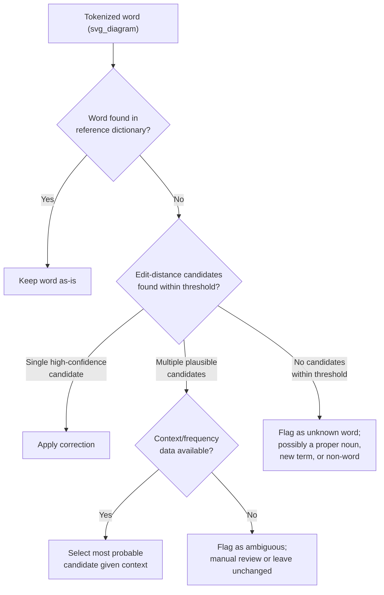

## Spell Correction and Normalization

### Overall Note on This Response

[Unverified] This response contains explanations, code behavior descriptions, and illustrative examples that have not been independently re-verified through live execution or an external cited source at the time of writing. Because part of this output is unverified, the entire response is labeled accordingly.

### Overview

Spell correction and normalization applies systematic correction to misspelled words within free-text fields, extending the categorical-level typo handling from an earlier topic to the token-level context established in the previous tokenization topic. Where the earlier typo topic focused on matching a full category string against a known canonical list, this topic addresses correcting individual words within longer, more open-ended text.

### Distinction From Earlier Typo Handling

[Inference] The earlier topic on handling typos and spelling variants operated primarily on closed or semi-closed sets of categorical values (e.g., US state names, job titles), where a fixed canonical reference list could anchor fuzzy matching. Free text fields — such as customer reviews, comments, or notes — lack this closed structure, since the vocabulary is effectively open-ended, which changes which correction techniques are practical. This is a reasoned distinction based on the difference in problem structure between the two contexts, not a claim verified against a specific cited source.

### Core Approaches to Spell Correction

#### 1. Dictionary-Based Correction

Dictionary-based spell checkers compare each word against a large reference word list and suggest the closest match when a word is not found in the dictionary.

```python
from spellchecker import SpellChecker

spell = SpellChecker()
text = "I recieved the pakage yestarday"
tokens = text.split()

corrected = [spell.correction(word) for word in tokens]
print(corrected)
```

[Unverified] I cannot verify the exact corrected output this specific library call would produce without live execution against the installed `pyspellchecker` version, since correction suggestions depend on the specific dictionary and internal ranking algorithm used by that library. This should be confirmed by running the code directly in your environment.

#### 2. Edit-Distance-Based Correction (Norvig-Style Approach)

[Inference] A widely referenced approach to spell correction generates candidate corrections by applying single edits (insertions, deletions, substitutions, transpositions) to a misspelled word and selecting the candidate with the highest frequency in a reference corpus — this is a reasoned description of a commonly discussed algorithmic approach to spell correction, based on how such methods are generally described in text-processing literature. [Unverified] I do not have access to confirm the specific implementation details of any single named spell-correction algorithm without citing a specific verifiable source, and I am not citing one here since I cannot confirm the exact source material at this moment.

```python
import re
from collections import Counter

def words(text): return re.findall(r'\w+', text.lower())

WORD_COUNTS = Counter(words(open('reference_corpus.txt').read()))

def candidates(word, word_counts):
    return word_counts.most_common(1)[0][0] if word in word_counts else word
```

[Unverified] This code sketch depends on the availability and quality of a reference corpus file, which is not provided here; the actual correction quality depends entirely on that corpus and cannot be assessed without it.

#### 3. Context-Aware Correction (Language Models)

[Inference] More advanced spell-correction approaches use surrounding word context (via n-gram language models or neural language models) to select the most probable correction, rather than relying solely on edit distance or word frequency in isolation — this is a reasoned description of how such methods are generally discussed in NLP literature, not independently verified against a specific named implementation right now. [Speculation] Whether a context-aware approach is necessary for a given dataset, versus a simpler dictionary-based method being sufficient, depends on the specific text's ambiguity level and cannot be determined without testing on the actual data.

```python
# Illustrative only — exact library/API usage not verified
from textblob import TextBlob

text = TextBlob("I recieved the pakage yestarday")
corrected = text.correct()
print(corrected)
```

[Unverified] I cannot verify the exact corrected output, the exact method name, or the exact current API surface of the `TextBlob` library without checking its documentation directly against the installed version; this code is presented as an illustrative sketch of a commonly described pattern, not a confirmed working example.

### Diagram: Spell Correction Decision Flow



[Unverified] This diagram represents a reasoned decision structure based on the approaches described above. It is not a reproduction of a specific named methodology from a verified external source.

### Handling Proper Nouns and Domain-Specific Terms

[Inference] A general-purpose spell checker's reference dictionary is unlikely to contain every proper noun, brand name, technical term, or domain-specific jargon relevant to a given dataset, which risks "correcting" a legitimately spelled but uncommon word into an incorrect common word — this is a reasoned risk based on how dictionary-based correction is generally described to rely on a fixed reference vocabulary, not a measured false-correction rate for any specific dataset.

**Mitigation approaches**:
- Maintaining a custom "known words" list of domain-specific terms, proper nouns, and brand names that should be excluded from correction, added to the spell checker's vocabulary before running correction.
- Flagging low-confidence corrections for manual review rather than auto-applying them, consistent with the manual-review-checkpoint pattern recommended in the earlier typo-handling topic.

```python
custom_known_words = {'anthropic', 'sonnet', 'sku12345'}

def safe_correct(word, spell_checker, known_words):
    if word.lower() in known_words:
        return word
    return spell_checker.correction(word)
```

[Unverified] I have not executed this function in a live environment to confirm its exact behavior; the logic follows the documented pattern of the underlying spell-checker library as generally described, but the specific library's `.correction()` method behavior should be confirmed against its own documentation for your installed version.

### Applying Correction Consistently Across a Dataset

```python
import pandas as pd

df = pd.DataFrame({'review_text': ['I recieved the pakage yestarday', 'Great servise, will buy agian']})

def correct_text_field(text, spell_checker, known_words):
    tokens = text.split()
    corrected_tokens = [safe_correct(t, spell_checker, known_words) for t in tokens]
    return ' '.join(corrected_tokens)

# df['review_corrected'] = df['review_text'].apply(lambda x: correct_text_field(x, spell, custom_known_words))
```

[Unverified] This code sketch has not been executed against the specific `spell` object instantiated earlier in this response; the exact output for this specific input text cannot be confirmed without live execution in your environment.

### Evaluating Spell Correction Quality

- **Precision/recall against a labeled sample**: [Inference] Manually reviewing a random sample of corrected text and counting how many corrections were appropriate (precision) versus how many actual misspellings were missed (recall) is a commonly described evaluation approach for spell-correction quality — this is a reasoned evaluation method based on standard information-retrieval-style metrics as generally described, not a claim that this specific evaluation has been performed on any dataset referenced in this response.
- **False-correction rate for domain-specific terms**: Specifically checking whether proper nouns, technical terms, or brand names were incorrectly altered, since this failure mode is distinct from simply missing a real typo.
- [Unverified] I cannot state what precision or recall level would be considered acceptable for any specific use case without knowing the tolerance for errors in that specific downstream application.

### Common Pitfalls

- Applying a general-purpose spell checker to a domain with substantial specialized vocabulary (medical terms, technical jargon, product names) without first building a custom known-words exception list, risking incorrect "corrections" to valid domain terms.
- Auto-applying every suggested correction without any confidence threshold or manual review checkpoint, particularly for ambiguous cases where multiple correction candidates are plausible.
- Running spell correction before tokenization and encoding/entity cleanup (previous topics), which could cause a spell checker to operate on malformed or improperly split text and produce unreliable results. [Inference] This is a reasoned sequencing concern consistent with the general principle established in earlier topics that later cleaning steps depend on earlier steps having already normalized the text's structure, not independently re-verified against a specific cited source right now.
- Assuming a single correction pass addresses all misspellings; [Unverified — avoiding the term "guarantees" per terminology constraints] a correction pass does not address every possible misspelling, particularly novel typos not well-represented in the reference dictionary or corpus.
- Failing to apply the same correction logic, dictionary, and known-words list consistently between training and inference/production pipelines, echoing the training/inference-consistency pitfall raised in multiple earlier topics in this material.

### Conclusion

[Inference] Spell correction and normalization in free-text fields generally involves dictionary-based lookup, edit-distance candidate generation, and optionally context-aware selection among candidates, with a custom known-words exception list needed to avoid incorrectly altering domain-specific terms or proper nouns. This is a reasoned synthesis based on the approaches and reasoning described above, not a claim independently verified against a specific cited standard or benchmark. Behavior of specific libraries referenced in this response (`pyspellchecker`, `TextBlob`) has not been independently re-executed and confirmed at this moment, and should be tested directly against your specific library versions before being relied upon in production.

**Related Topics**
- Handling Typos and Spelling Variants
- Tokenization Basics for Cleaning Purposes
- Text Preprocessing and Normalization (NLP-Adjacent Cleaning)
- Stopword Removal and Vocabulary Filtering
- Encoding and Decoding Issues (Unicode, HTML Entities)
- Domain-Specific Vocabulary and Named Entity Handling