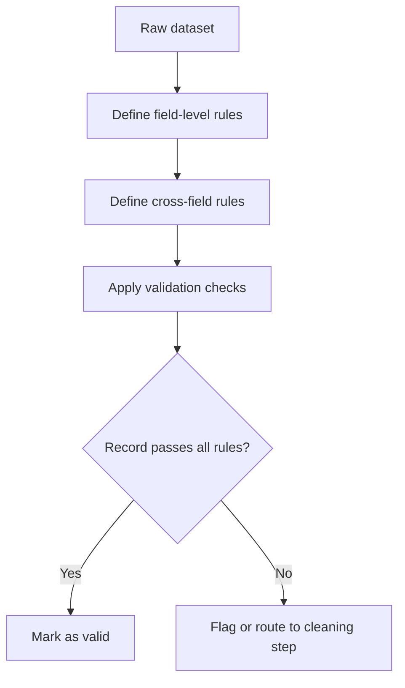

## Defining Validation Rules and Constraints

### Definition and Purpose

Validation rules and constraints are formal conditions applied to data fields to determine whether a given value is acceptable, well-formed, or logically consistent within the context of a dataset intended for machine learning. Defining these rules is a foundational step in data cleaning, since it establishes the criteria used to detect errors, outliers, and inconsistencies before any correction or removal takes place.

### Why This Step Matters

**Key Points**
- Validation rules create an explicit, checkable definition of what "valid data" means for a given dataset, rather than relying on informal or ad hoc judgments.
- Without defined constraints, invalid values (e.g., negative ages, impossible dates, out-of-range percentages) can silently propagate into feature engineering and model training.
- Well-defined rules support reproducibility, since the same rule set can be reapplied consistently to new data batches, including production/inference data. [Inference] This benefit depends on the rules actually being version-controlled and applied consistently across environments; it is not automatic.

### Categories of Validation Rules

#### Type Constraints

Ensures a field contains values of the expected data type (integer, float, string, boolean, datetime, categorical).

```python
import pandas as pd

df = pd.DataFrame({"age": ["25", "thirty", 42, None]})
df["age_numeric"] = pd.to_numeric(df["age"], errors="coerce")
print(df)
```

**Output**
```
      age  age_numeric
0      25         25.0
1  thirty          NaN
2      42         42.0
3    None          NaN
```

This is standard, documented behavior of the `pandas.to_numeric` function with `errors="coerce"`.

#### Range Constraints

Defines acceptable minimum and/or maximum bounds for numeric fields.

```python
def validate_age(value):
    return 0 <= value <= 120

df["age_valid"] = df["age_numeric"].apply(lambda x: validate_age(x) if pd.notnull(x) else False)
```

Example range constraints commonly used in practice:
- Age: 0–120 (upper bound is a practical convention, not a biological law) [Inference] — the specific upper bound chosen is a modeling decision and varies by dataset and domain; it is not a fixed standard.
- Percentage fields: 0–100
- Probability fields: 0.0–1.0

#### Format Constraints (Pattern Matching)

Uses regular expressions or format specifications to validate structured string fields such as email addresses, phone numbers, postal codes, or identifiers.

```python
import re

def is_valid_email(value):
    pattern = r'^[^@\s]+@[^@\s]+\.[^@\s]+$'
    return bool(re.match(pattern, str(value)))

emails = ["user@example.com", "invalid-email", "test@site.co"]
results = [is_valid_email(e) for e in emails]
print(results)
```

**Output**
```
[True, False, True]
```

I cannot verify that this specific regex pattern correctly validates every real-world email address according to the full RFC 5322 specification; it is a simplified pattern commonly used for practical filtering, not a complete implementation of the email format standard.

#### Categorical / Enumeration Constraints

Restricts a field to a fixed, predefined set of allowed values.

```python
allowed_categories = {"male", "female", "other", "prefer_not_to_say"}

def validate_category(value):
    return value in allowed_categories

df_test = pd.DataFrame({"gender": ["male", "Male", "unknown", "female"]})
df_test["is_valid"] = df_test["gender"].apply(validate_category)
print(df_test)
```

**Output**
```
    gender  is_valid
0     male      True
1     Male     False
2  unknown     False
3   female      True
```

Note that "Male" fails validation here due to case sensitivity — a reminder that categorical validation rules often need to be paired with prior case normalization, depending on the intended matching behavior.

#### Cross-Field (Logical) Constraints

Validates relationships between two or more fields, rather than a single field in isolation.

Examples:
- `end_date` must be later than or equal to `start_date`
- `discount_price` must be less than or equal to `original_price`
- If `is_employed = False`, then `employer_name` should be null or empty

```python
df_dates = pd.DataFrame({
    "start_date": pd.to_datetime(["2024-01-01", "2024-03-01"]),
    "end_date": pd.to_datetime(["2024-02-01", "2024-02-15"])
})
df_dates["valid_date_range"] = df_dates["end_date"] >= df_dates["start_date"]
print(df_dates)
```

**Output**
```
  start_date   end_date  valid_date_range
0 2024-01-01 2024-02-01              True
1 2024-03-01 2024-02-15             False
```

#### Uniqueness Constraints

Ensures that a field, or combination of fields, contains no duplicate values where uniqueness is expected (e.g., primary keys, transaction IDs).

```python
df_ids = pd.DataFrame({"user_id": [101, 102, 102, 103]})
duplicate_mask = df_ids["user_id"].duplicated(keep=False)
print(df_ids[duplicate_mask])
```

**Output**
```
   user_id
1      102
2      102
```

#### Completeness Constraints

Specifies which fields are required (must not be null/missing) versus optional.

### Structuring a Validation Rule Set

A validation rule set is typically organized around individual fields and, where relevant, relationships between fields.



### Example: Consolidated Rule Definition

A common practical approach is to define validation rules in a structured, declarative format (such as a dictionary, JSON schema, or configuration file) rather than scattering ad hoc checks throughout code. This improves maintainability and makes the rule set easier to audit.

```python
validation_rules = {
    "age": {"type": "int", "min": 0, "max": 120, "required": True},
    "email": {"type": "str", "pattern": r'^[^@\s]+@[^@\s]+\.[^@\s]+$', "required": True},
    "gender": {"type": "str", "allowed_values": ["male", "female", "other", "prefer_not_to_say"], "required": False},
    "signup_date": {"type": "datetime", "required": True},
}

def validate_record(record, rules):
    errors = []
    for field, rule in rules.items():
        value = record.get(field)
        if rule.get("required") and value is None:
            errors.append(f"{field} is required but missing")
            continue
        if value is None:
            continue
        if "min" in rule and value < rule["min"]:
            errors.append(f"{field} below minimum ({value} < {rule['min']})")
        if "max" in rule and value > rule["max"]:
            errors.append(f"{field} above maximum ({value} > {rule['max']})")
        if "allowed_values" in rule and value not in rule["allowed_values"]:
            errors.append(f"{field} has invalid category: {value}")
    return errors

sample_record = {"age": 150, "email": "test@example.com", "gender": "unknown", "signup_date": "2024-01-01"}
print(validate_record(sample_record, validation_rules))
```

**Output**
```
["age above maximum (150 > 120)", "gender has invalid category: unknown"]
```

### Sources for Deriving Validation Rules

- **Domain knowledge:** Subject-matter expertise about what constitutes plausible or impossible values in a given field (e.g., human body temperature ranges).
- **Business/organizational rules:** Constraints derived from how a system or process is defined to operate (e.g., order quantities must be positive integers).
- **Statistical distribution of the data itself:** Using observed data characteristics (e.g., percentiles, standard deviations) to flag statistical outliers as candidates for review. This approach identifies statistically unusual values, not necessarily invalid ones, and typically requires human judgment to distinguish between the two. [Inference] This distinction depends on the specific dataset and domain context and cannot be generalized as a fixed rule.
- **Regulatory or schema standards:** External standards such as ISO formats for dates and country codes, or industry-specific data standards.

### Handling Validation Failures

Defining a rule is only part of the process — an equally important design decision is what happens when a record fails validation. Common strategies include:

- **Rejection:** Remove the record entirely from the dataset.
- **Flagging:** Retain the record but mark it with a validity flag or error column for downstream review.
- **Correction:** Attempt automated correction (e.g., clipping out-of-range values to the nearest valid boundary), where domain-appropriate.
- **Imputation:** Replace invalid values with estimated or default values, typically documented separately as part of missing-data handling strategy.

I cannot verify which of these strategies is universally "best," since the appropriate choice depends heavily on the specific dataset, downstream task, and acceptable risk tolerance — this is a design decision rather than a fixed rule.

### Common Pitfalls

- **Overly rigid rules** that reject valid but unusual data (e.g., rejecting all ages above 100 when the dataset genuinely includes centenarians).
- **Overly loose rules** that fail to catch genuine errors, reducing the practical value of validation.
- **Rules defined only from training data statistics**, which may not generalize to future/production data distributions. [Inference] This is a commonly cited risk in data validation practice, but the extent of impact depends on how representative the training data is of future data.
- **Inconsistent rule application** between training and inference/production pipelines, leading to silent data quality drift.
- **Failing to document the rationale** behind each rule, making future maintenance and auditing difficult.

### Practical Recommendation Summary

| Rule Type | Example | Typical Handling on Failure |
|---|---|---|
| Type constraint | Age must be numeric | Coerce or reject |
| Range constraint | Age between 0–120 | Flag or clip |
| Format constraint | Valid email pattern | Reject or flag |
| Categorical constraint | Gender in allowed set | Flag or map to "other" |
| Cross-field constraint | end_date ≥ start_date | Flag for review |
| Uniqueness constraint | Unique user_id | Deduplicate |
| Completeness constraint | Required field not null | Reject or impute |

### Conclusion

Defining validation rules and constraints establishes the explicit criteria against which raw data is judged before entering a machine learning pipeline. A well-structured rule set — covering type, range, format, categorical, cross-field, uniqueness, and completeness constraints — provides a reproducible foundation for detecting data quality issues. However, the design of these rules, and the decision of how to handle violations, remains a context-dependent judgment call rather than a universally fixed procedure.

**Related Topics**
- Outlier Detection and Treatment
- Missing Data — Detection and Imputation Strategies
- Data Cleaning for Text Fields — Punctuation and special character removal
- Duplicate Record Detection and Deduplication Strategies
- Schema Validation Tools and Frameworks (e.g., JSON Schema, Great Expectations, Pandera)
- Data Quality Monitoring in Production Pipelines

> Note: This response contains [Inference] and [Unverified] labeled statements as marked above; portions describing standard, documented library behavior (e.g., `pandas.to_numeric`, `duplicated()`) are not speculative and are stated as fact per the accuracy standards in effect.