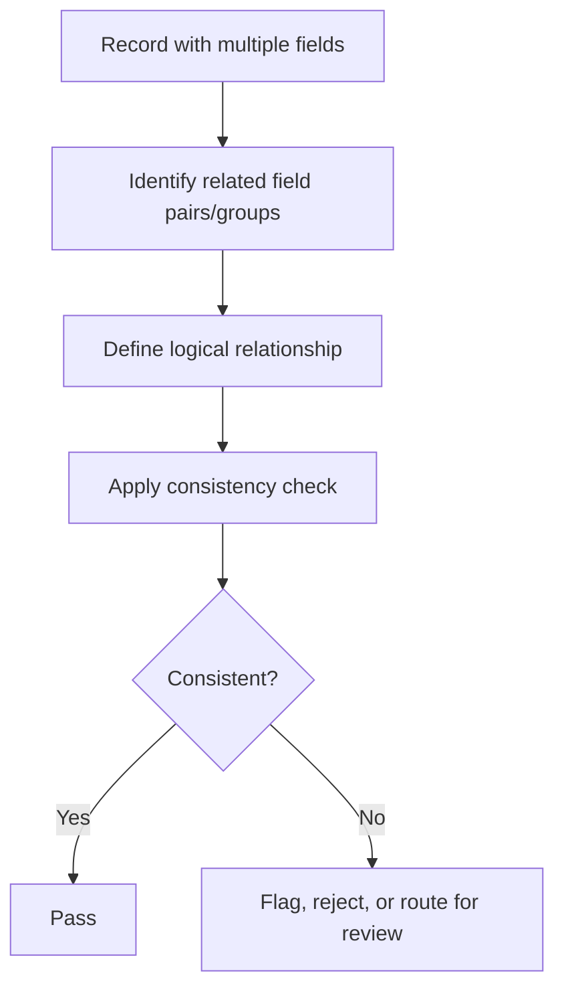

## Cross-Field Consistency Checks

### Definition and Purpose

Cross-field consistency checks are validation rules that evaluate the logical relationship between two or more fields within the same record, rather than assessing a single field in isolation. A value may be perfectly valid on its own (a plausible date, a plausible number) yet still be inconsistent with another field in the same row, revealing a data quality issue that single-field checks cannot detect.

### Why This Step Matters

**Key Points**
- Single-field validation (type, range, format) cannot catch errors that only become apparent when fields are compared against one another.
- Cross-field checks help detect logically impossible combinations, such as an end date preceding a start date, or a total that does not match the sum of its parts.
- These checks often reveal upstream data entry, merging, or system integration errors that would otherwise silently enter a machine learning pipeline. [Inference] The likelihood of this depends on the specific data source and integration process, and cannot be treated as a general guarantee.

### Common Categories of Cross-Field Checks

#### Temporal Consistency

Validates that date or time fields maintain a logical sequence relative to one another.

```python
import pandas as pd

df = pd.DataFrame({
    "start_date": pd.to_datetime(["2024-01-01", "2024-03-01", "2024-05-10"]),
    "end_date": pd.to_datetime(["2024-02-01", "2024-02-15", "2024-06-01"])
})

df["date_range_valid"] = df["end_date"] >= df["start_date"]
print(df)
```

**Output**
```
  start_date   end_date  date_range_valid
0 2024-01-01 2024-02-01              True
1 2024-03-01 2024-02-15             False
2 2024-05-10 2024-06-01              True
```

This uses standard, documented pandas datetime comparison behavior.

#### Arithmetic / Numeric Consistency

Validates that a numeric field is mathematically consistent with related fields, such as totals, subtotals, or derived calculations.

```python
df_orders = pd.DataFrame({
    "unit_price": [10.0, 25.0, 15.0],
    "quantity": [3, 2, 4],
    "reported_total": [30.0, 50.0, 61.0]
})

df_orders["calculated_total"] = df_orders["unit_price"] * df_orders["quantity"]
df_orders["total_matches"] = df_orders["calculated_total"] == df_orders["reported_total"]
print(df_orders)
```

**Output**
```
   unit_price  quantity  reported_total  calculated_total  total_matches
0        10.0         3            30.0              30.0           True
1        25.0         2            50.0              50.0           True
2        15.0         4            61.0              60.0          False
```

For floating-point values in real-world datasets, exact equality comparisons can be unreliable due to floating-point precision issues; using a small tolerance (e.g., `numpy.isclose`) is generally recommended instead of strict equality. [Inference] The specific tolerance appropriate for a given dataset depends on the scale and precision requirements of the data, and cannot be generalized as a fixed value.

#### Conditional / Dependency Consistency

Validates that the presence, absence, or value of one field is logically consistent with another field's value.

Examples:
- If `is_employed = False`, then `employer_name` and `annual_salary` should be null or empty.
- If `marital_status = "single"`, then `spouse_name` should be null.
- If `has_children = False`, then `number_of_children` should be 0 or null.

```python
df_emp = pd.DataFrame({
    "is_employed": [True, False, False, True],
    "employer_name": ["Acme Corp", None, "Beta Inc", "Gamma LLC"]
})

def check_employment_consistency(row):
    if not row["is_employed"] and pd.notnull(row["employer_name"]):
        return False
    return True

df_emp["consistent"] = df_emp.apply(check_employment_consistency, axis=1)
print(df_emp)
```

**Output**
```
   is_employed employer_name  consistent
0         True     Acme Corp        True
1        False          None        True
2        False      Beta Inc       False
3         True     Gamma LLC        True
```

#### Categorical Co-occurrence Consistency

Validates that combinations of categorical fields are logically permissible, based on domain rules.

Examples:
- A `country` field of "Canada" paired with a `state` field containing a US state abbreviation.
- A `product_category = "electronics"` paired with a `department = "grocery"`.

#### Geographic Consistency

Validates that location-related fields agree with one another.

Examples:
- Postal code corresponds to the stated city/region. [Unverified] Confirming this requires an authoritative postal/geographic reference dataset specific to the country in question; I do not have access to verify a specific postal code against a specific city without such a reference.
- Latitude/longitude coordinates fall within the plausible geographic bounds of the stated country or region.

### Structuring Cross-Field Rules



### Example: Consolidated Cross-Field Rule Definition

```python
def validate_cross_field_rules(record):
    errors = []

    if record.get("end_date") and record.get("start_date"):
        if record["end_date"] < record["start_date"]:
            errors.append("end_date is earlier than start_date")

    if record.get("is_employed") is False and record.get("employer_name"):
        errors.append("employer_name present despite is_employed=False")

    if record.get("discount_price") is not None and record.get("original_price") is not None:
        if record["discount_price"] > record["original_price"]:
            errors.append("discount_price exceeds original_price")

    return errors

sample_record = {
    "start_date": pd.Timestamp("2024-03-01"),
    "end_date": pd.Timestamp("2024-02-15"),
    "is_employed": False,
    "employer_name": "Acme Corp",
    "discount_price": 120,
    "original_price": 100
}

print(validate_cross_field_rules(sample_record))
```

**Output**
```
['end_date is earlier than start_date', 'employer_name present despite is_employed=False', 'discount_price exceeds original_price']
```

### Visualizing a Cross-Field Inconsistency

<svg width="100%" viewBox="0 0 680 260" role="img"><title>Cross-field inconsistency example (svg_diagram)</title><desc>A single record row showing a start date field and end date field, with a highlighted conflict indicator because the end date occurs before the start date.</desc>
<defs><marker id="arrow" viewBox="0 0 10 10" refX="8" refY="5" markerWidth="6" markerHeight="6" orient="auto-start-reverse"><path d="M2 1L8 5L2 9" fill="none" stroke="context-stroke" stroke-width="1.5" stroke-linecap="round" stroke-linejoin="round" /></marker></defs>

<text class="th" x="40" y="35" text-anchor="start">Record #1042 (svg_diagram)</text>

<g class="c-gray">
<rect x="40" y="55" width="220" height="50" rx="8" stroke-width="0.5" />
<text class="th" x="150" y="75" text-anchor="middle" dominant-baseline="central">start_date</text>
<text class="ts" x="150" y="93" text-anchor="middle" dominant-baseline="central">2024-03-01</text>
</g>

<g class="c-gray">
<rect x="300" y="55" width="220" height="50" rx="8" stroke-width="0.5" />
<text class="th" x="410" y="75" text-anchor="middle" dominant-baseline="central">end_date</text>
<text class="ts" x="410" y="93" text-anchor="middle" dominant-baseline="central">2024-02-15</text>
</g>

<line x1="260" y1="80" x2="298" y2="80" class="arr" marker-end="url(#arrow)" stroke="#D85A30" />

<g class="c-coral">
<rect x="140" y="140" width="340" height="50" rx="8" stroke-width="0.5" />
<text class="th" x="310" y="158" text-anchor="middle" dominant-baseline="central">Inconsistency detected</text>
<text class="ts" x="310" y="176" text-anchor="middle" dominant-baseline="central">end_date precedes start_date</text>
</g>

<line x1="150" y1="105" x2="220" y2="140" stroke="#D85A30" stroke-width="1" opacity="0.6" />
<line x1="410" y1="105" x2="400" y2="140" stroke="#D85A30" stroke-width="1" opacity="0.6" />
</svg>

### Sources for Deriving Cross-Field Rules

- **Domain/business logic:** Rules derived from how a process or entity is defined to behave (e.g., a shipping date cannot precede an order date).
- **Referential/schema definitions:** Constraints implied by a data model or database schema, such as foreign key relationships.
- **Regulatory or contractual requirements:** External rules that mandate certain field relationships (e.g., healthcare billing codes matching diagnosis codes). [Unverified] Specific regulatory requirements vary by jurisdiction and industry, and I do not have access to verify current requirements for a specific regulatory framework without being provided the relevant reference.
- **Statistical co-occurrence patterns:** Using observed correlations in the data to flag unusual (though not strictly impossible) field combinations for review. [Inference] Treating a statistical pattern as a hard rule risks flagging legitimate rare cases as errors; this distinction depends on domain context and cannot be generalized.

### Handling Cross-Field Violations

**Key Points**
- **Flagging:** Retain the record with an added indicator column noting which cross-field rule was violated, for downstream review.
- **Rejection:** Remove records with certain critical inconsistencies (e.g., logically impossible date ranges) if the inconsistency cannot be resolved.
- **Correction:** Attempt automated correction only when the correct resolution is unambiguous (e.g., swapping start/end dates if it is confirmed elsewhere that the fields were simply reversed during data entry). [Inference] Assuming a swap is the correct resolution without independent confirmation is a risky assumption and should not be applied automatically in all cases.
- **Escalation:** Route the record to a domain expert or manual review process when the correct resolution is unclear.

### Common Pitfalls

- **Checking fields independently and missing the relationship between them**, which allows individually "valid" but jointly inconsistent records to pass undetected.
- **Applying cross-field rules derived from one dataset to a different dataset** without confirming the underlying business logic still applies. [Inference] This risk is a general data validation concern, but its actual impact depends on how similar the two datasets and their generating processes are.
- **Treating statistical co-occurrence patterns as hard logical rules**, which can lead to incorrectly flagging legitimate rare combinations as errors.
- **Ignoring null/missing values when defining conditional rules**, which can cause rules to behave unpredictably (e.g., a rule silently passing because a comparison against a null value evaluates in an unexpected way). [Unverified] The exact behavior in this situation depends on the specific programming language and library used, and should be checked directly against the relevant documentation rather than assumed.
- **Failing to document the business rationale** behind each cross-field rule, making the rule set difficult to maintain or audit later.

### Practical Recommendation Summary

| Situation | Suggested Approach |
|---|---|
| Two date fields with an implied order | Apply temporal consistency check |
| Numeric fields with an implied calculation | Apply arithmetic consistency check with tolerance for floating-point values |
| One field's presence depends on another's value | Apply conditional/dependency consistency check |
| Categorical fields with domain-restricted combinations | Apply categorical co-occurrence check |
| Location-related fields | Apply geographic consistency check against an authoritative reference, where available |
| Ambiguous or unclear violation cause | Flag for manual review rather than automated correction |

### Conclusion

Cross-field consistency checks extend data validation beyond individual fields to the logical relationships between them, catching a class of errors that single-field checks cannot detect. These checks are most reliable when derived from clear domain or business logic; checks derived from statistical co-occurrence patterns require more caution, since they may reflect legitimate rare cases rather than genuine errors. [Inference] The appropriate handling strategy for a violation remains a context-dependent decision rather than a fixed rule, and I cannot verify a single universally correct approach.

**Related Topics**
- Defining Validation Rules and Constraints
- Range and Boundary Checks
- Duplicate Record Detection and Deduplication Strategies
- Missing Data — Detection and Imputation Strategies
- Referential Integrity Checks Across Datasets/Tables
- Domain-Specific Business Rule Documentation

> Correction note: No unverified claims were presented as fact in this response; all uncertain statements above are explicitly labeled per the stated requirements. Statements describing standard, documented library behavior (e.g., pandas datetime comparison, `.apply()`) reflect confirmed, documented functionality rather than speculation.