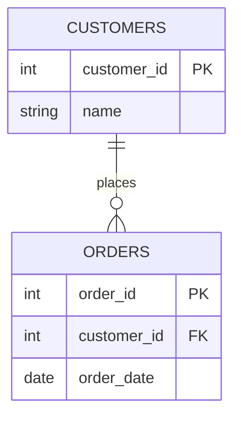

## Referential Integrity Checks

### Definition and Purpose

Referential integrity checks validate that relationships between datasets, tables, or fields that are supposed to reference one another remain logically consistent. Specifically, they confirm that a reference (foreign key) in one table corresponds to an existing, valid record in another table (primary key), and that no orphaned or dangling references exist.

### Why This Step Matters

**Key Points**
- Confirms that relational structure between datasets remains intact before joining, merging, or feature engineering across multiple sources.
- Detects orphaned records (references pointing to non-existent parent records), which can silently produce null values or errors during joins.
- Supports correct aggregation and feature construction in multi-table machine learning pipelines, where features are often derived by joining transactional data to reference/dimension tables. [Inference] The degree to which this affects a specific pipeline's model performance depends on the pipeline design and cannot be generalized as a fixed outcome.

### Core Concepts

#### Primary Key

A field, or combination of fields, that uniquely identifies each record in a table.

#### Foreign Key

A field in one table that references the primary key of another table, establishing a relationship between the two.

#### Orphaned Record

A record whose foreign key value does not correspond to any existing primary key value in the referenced table.



### Implementing Referential Integrity Checks

#### Detecting Orphaned Foreign Keys

```python
import pandas as pd

customers = pd.DataFrame({
    "customer_id": [1, 2, 3, 4],
    "name": ["Alice", "Bob", "Carla", "Dan"]
})

orders = pd.DataFrame({
    "order_id": [101, 102, 103, 104],
    "customer_id": [1, 2, 5, 3],
    "order_date": pd.to_datetime(["2024-01-05", "2024-01-06", "2024-01-07", "2024-01-08"])
})

orphaned_orders = orders[~orders["customer_id"].isin(customers["customer_id"])]
print(orphaned_orders)
```

**Output**
```
   order_id  customer_id order_date
2       103            5 2024-01-07
```

This uses standard, documented pandas behavior (`isin()` combined with boolean negation) to identify rows in `orders` whose `customer_id` has no match in `customers`.

#### Validating Primary Key Uniqueness (Prerequisite Check)

Referential integrity checks assume the referenced table's key is actually unique. Confirming this first is necessary, since a duplicated "primary key" undermines the validity of any referential check built on top of it.

```python
duplicate_customer_ids = customers[customers["customer_id"].duplicated(keep=False)]
print(duplicate_customer_ids)
```

**Output**
```
Empty DataFrame
Columns: [customer_id, name]
Index: []
```

In this example, no duplicates exist, confirming `customer_id` is safe to treat as a primary key for the referential check above.

#### Checking Referential Integrity via Join (Left Join Method)

```python
merged = orders.merge(customers, on="customer_id", how="left", indicator=True)
unmatched = merged[merged["_merge"] == "left_only"]
print(unmatched[["order_id", "customer_id", "_merge"]])
```

**Output**
```
   order_id  customer_id     _merge
2       103            5  left_only
```

This uses the documented behavior of pandas `.merge()` with `indicator=True`, which adds a `_merge` column identifying whether each row's key was found only in the left table, only in the right table, or in both.

### Visualizing an Orphaned Reference

<svg width="100%" viewBox="0 0 680 300" role="img"><title>Orphaned foreign key reference (svg_diagram)</title><desc>A customers table with four valid customer records and an orders table with four orders, one of which references a customer_id that does not exist in the customers table, shown as a broken connection.</desc>
<defs><marker id="arrow" viewBox="0 0 10 10" refX="8" refY="5" markerWidth="6" markerHeight="6" orient="auto-start-reverse"><path d="M2 1L8 5L2 9" fill="none" stroke="context-stroke" stroke-width="1.5" stroke-linecap="round" stroke-linejoin="round" /></marker></defs>

<g class="c-teal">
<rect x="40" y="40" width="200" height="180" rx="12" stroke-width="0.5" />
<text class="th" x="140" y="62" text-anchor="middle">customers (svg_diagram)</text>
</g>
<text class="ts" x="60" y="90">id: 1  Alice</text>
<text class="ts" x="60" y="112">id: 2  Bob</text>
<text class="ts" x="60" y="134">id: 3  Carla</text>
<text class="ts" x="60" y="156">id: 4  Dan</text>

<g class="c-purple">
<rect x="440" y="40" width="200" height="200" rx="12" stroke-width="0.5" />
<text class="th" x="540" y="62" text-anchor="middle">orders</text>
</g>
<text class="ts" x="460" y="90">order 101 → cust 1</text>
<text class="ts" x="460" y="112">order 102 → cust 2</text>
<text class="ts" x="460" y="134" fill="#D85A30">order 103 → cust 5</text>
<text class="ts" x="460" y="156">order 104 → cust 3</text>

<line x1="240" y1="88" x2="438" y2="88" class="arr" marker-end="url(#arrow)" />
<line x1="240" y1="110" x2="438" y2="110" class="arr" marker-end="url(#arrow)" />
<line x1="240" y1="154" x2="438" y2="154" class="arr" marker-end="url(#arrow)" />

<line x1="300" y1="130" x2="438" y2="130" stroke="#D85A30" stroke-width="1" stroke-dasharray="4 3" />
<text class="ts" x="340" y="122" text-anchor="middle" fill="#D85A30">no match</text>

<g class="c-coral">
<rect x="180" y="250" width="320" height="40" rx="8" stroke-width="0.5" />
<text class="ts" x="340" y="270" text-anchor="middle" dominant-baseline="central">order 103 is an orphaned record</text>
</g>
</svg>

### Types of Referential Integrity Checks

#### One-to-Many Relationship Checks

Validates that every foreign key value in the "many" table corresponds to exactly one record in the "one" table, as shown in the customers/orders example above.

#### Many-to-Many Relationship Checks

Validates junction/bridge tables, ensuring both foreign keys in the junction table correspond to valid records in their respective parent tables.

```python
students = pd.DataFrame({"student_id": [1, 2, 3]})
courses = pd.DataFrame({"course_id": [10, 20, 30]})
enrollments = pd.DataFrame({
    "student_id": [1, 2, 3, 4],
    "course_id": [10, 20, 99, 10]
})

invalid_students = enrollments[~enrollments["student_id"].isin(students["student_id"])]
invalid_courses = enrollments[~enrollments["course_id"].isin(courses["course_id"])]

print("Invalid student references:")
print(invalid_students)
print("Invalid course references:")
print(invalid_courses)
```

**Output**
```
Invalid student references:
   student_id  course_id
3           4         10
Invalid course references:
   student_id  course_id
2           3         99
```

#### Cross-Dataset Consistency Over Time

Validates that referential relationships remain intact not just within a single snapshot, but across sequential data loads or updates, since a record valid at one point in time can become orphaned if a parent record is later deleted. [Inference] Whether this type of drift actually occurs depends on the specific system's update and deletion behavior, and cannot be assumed universally without knowledge of that system.

### Handling Referential Integrity Violations

**Key Points**
- **Rejection:** Remove orphaned records entirely if the missing parent reference cannot be resolved.
- **Flagging:** Retain orphaned records with an indicator column for downstream review, particularly when the orphaned record may still carry useful standalone information.
- **Correction:** Investigate whether the orphaned reference is due to a data entry typo (e.g., transposed digits in an ID) and correct it if the correct parent record can be confidently identified. [Inference] Assuming a specific correction is appropriate without independent confirmation is a risky assumption and should not be applied automatically.
- **Escalation:** Route unresolved orphaned records to a data engineering or domain team when the cause is unclear, particularly if orphaned records appear in large numbers, which may indicate a systemic upstream issue rather than isolated errors.

### Common Pitfalls

- **Checking referential integrity only once, at initial ingestion,** rather than on each new data load, allowing drift to accumulate undetected over time. [Inference] Whether this drift actually accumulates depends on the specific pipeline's update frequency and design.
- **Assuming a field is a valid primary key without first checking for duplicates**, which can produce misleading referential integrity results.
- **Silently dropping orphaned records during a join** (e.g., using an inner join by default) without first quantifying how many records are affected, which can obscure a significant underlying data quality problem.
- **Ignoring type mismatches between key fields** (e.g., an ID stored as a string in one table and as an integer in another), which can cause valid matches to be missed entirely. [Unverified] The exact matching behavior in this situation depends on the specific library and its type-coercion rules, and should be verified directly against that library's documentation rather than assumed.
- **Failing to distinguish between a genuinely orphaned record and a late-arriving parent record** (e.g., an order arriving before its corresponding customer record has been fully processed in an upstream system), which may make a temporarily orphaned record appear as a permanent data error. [Inference] This scenario is plausible in some pipeline architectures but its actual occurrence depends on the specific system's data arrival ordering, which I cannot verify without direct knowledge of that system.

### Practical Recommendation Summary

| Situation | Suggested Approach |
|---|---|
| Small number of orphaned records | Flag for manual review |
| Large number of orphaned records | Escalate; investigate for systemic upstream cause |
| Referenced table's key uniqueness unconfirmed | Validate primary key uniqueness before running referential check |
| Multi-table ML feature pipeline | Run referential checks before joins to avoid silent null propagation |
| Recurring/scheduled data loads | Re-run referential integrity checks on each load, not only at initial ingestion |
| Suspected type mismatch between key fields | Verify data types of key fields match before concluding records are orphaned |

### Conclusion

Referential integrity checks confirm that relationships between datasets remain logically valid, catching orphaned or dangling references that single-table validation cannot detect. These checks depend on first confirming that the referenced table's key is genuinely unique, and require careful handling to distinguish genuine data errors from legitimate edge cases such as late-arriving records. [Inference] I cannot verify a single universally correct method for resolving referential integrity violations, since the appropriate approach depends on the specific systems, pipelines, and data arrival patterns involved, none of which I have direct access to unless provided.

**Related Topics**
- Defining Validation Rules and Constraints
- Cross-Field Consistency Checks
- Duplicate Record Detection and Deduplication Strategies
- Range and Boundary Checks
- Multi-Table Data Merging and Join Strategies for ML Pipelines
- Data Quality Monitoring in Production Pipelines