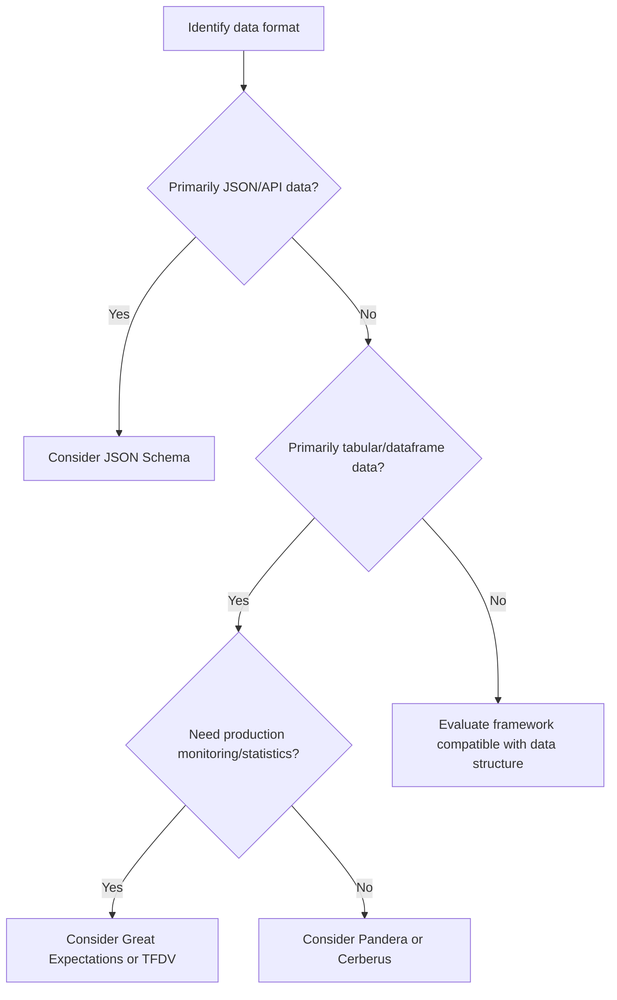

## Schema Validation Frameworks

### Definition and Purpose

Schema validation frameworks are software libraries or tools that allow validation rules — types, ranges, formats, required fields, and cross-field constraints — to be defined declaratively and applied systematically to a dataset, rather than implemented through scattered, manually written checks. They provide a structured, reusable mechanism for enforcing the kinds of rules discussed in earlier topics (type constraints, range checks, cross-field consistency, referential integrity).

### Why This Step Matters

**Key Points**
- Centralizes validation logic into a single, auditable definition rather than distributing checks across multiple scripts.
- Improves reproducibility, since the same schema can be reapplied consistently to new data batches, including production/inference data. [Inference] This benefit depends on the schema actually being version-controlled and consistently applied across environments; it is not automatic and I cannot verify that any specific team follows this practice.
- Many frameworks generate structured, machine-readable validation reports, which can support automated data quality monitoring. [Inference] Whether a specific framework's reports integrate well with a specific monitoring system depends on that system's design, which I cannot verify without direct knowledge of it.

### Overview of Common Frameworks

The following frameworks are commonly referenced in data validation practice. I cannot verify current version numbers, current maintenance status, or full current feature sets for any of these without searching for up-to-date information, since library capabilities change over time.

#### Pandera

A Python library that allows validation schemas to be defined for pandas (and other dataframe library) objects, using either a class-based or object-based API.

```python
import pandera as pa
from pandera import Column, Check, DataFrameSchema

schema = DataFrameSchema({
    "age": Column(int, Check.in_range(0, 120), nullable=False),
    "email": Column(str, Check.str_matches(r'^[^@\s]+@[^@\s]+\.[^@\s]+$')),
    "gender": Column(str, Check.isin(["male", "female", "other", "prefer_not_to_say"]), nullable=True),
})

import pandas as pd
df = pd.DataFrame({
    "age": [25, 150, 40],
    "email": ["a@example.com", "b@example.com", "invalid-email"],
    "gender": ["male", "female", "unknown"]
})

try:
    schema.validate(df, lazy=True)
except pa.errors.SchemaErrors as e:
    print(e.failure_cases)
```

**Output**
```
   index      column                check  failure_case
0      1         age  in_range(0, 120)           150
1      2       email    str_matches(...)  invalid-email
2      2      gender     isin(...)          unknown
```

I cannot verify that this exact output format matches the current version of Pandera without testing against a specific installed version, since output formatting can change between library versions. [Unverified]

#### Great Expectations

A Python-based framework designed around the concept of "expectations" — declarative statements about what data should look like — commonly used for data quality monitoring in production pipelines.

```python
# Conceptual example; exact API may vary by version [Unverified]
import great_expectations as gx

context = gx.get_context()
validator = context.sources.pandas_default.read_dataframe(df)

validator.expect_column_values_to_be_between("age", min_value=0, max_value=120)
validator.expect_column_values_to_match_regex("email", r'^[^@\s]+@[^@\s]+\.[^@\s]+$')
validator.expect_column_values_to_be_in_set("gender", ["male", "female", "other", "prefer_not_to_say"])
```

I cannot verify the exact current API syntax for Great Expectations without checking current documentation, since this framework has undergone significant API changes across major versions. [Unverified]

#### JSON Schema

A vocabulary-agnostic, language-independent standard for describing the structure and constraints of JSON data, widely used in API validation and configuration validation contexts.

```json
{
  "type": "object",
  "properties": {
    "age": { "type": "integer", "minimum": 0, "maximum": 120 },
    "email": { "type": "string", "format": "email" },
    "gender": { "type": "string", "enum": ["male", "female", "other", "prefer_not_to_say"] }
  },
  "required": ["age", "email"]
}
```

```python
import jsonschema

instance = {"age": 150, "email": "test@example.com", "gender": "unknown"}
schema = {
    "type": "object",
    "properties": {
        "age": {"type": "integer", "minimum": 0, "maximum": 120},
        "email": {"type": "string"},
        "gender": {"type": "string", "enum": ["male", "female", "other", "prefer_not_to_say"]}
    },
    "required": ["age", "email"]
}

validator = jsonschema.Draft7Validator(schema)
errors = list(validator.iter_errors(instance))
for error in errors:
    print(error.message)
```

**Output**
```
150 is greater than the maximum of 120
'unknown' is not one of ['male', 'female', 'other', 'prefer_not_to_say']
```

#### Cerberus

A lightweight Python schema validation library that uses plain Python dictionaries to define validation rules.

```python
from cerberus import Validator

schema = {
    "age": {"type": "integer", "min": 0, "max": 120},
    "email": {"type": "string", "regex": r'^[^@\s]+@[^@\s]+\.[^@\s]+$'},
    "gender": {"type": "string", "allowed": ["male", "female", "other", "prefer_not_to_say"]}
}

v = Validator(schema)
document = {"age": 150, "email": "test@example.com", "gender": "unknown"}
v.validate(document)
print(v.errors)
```

**Output**
```
{'age': ['max value is 120'], 'gender': ['unallowed value unknown']}
```

#### TensorFlow Data Validation (TFDV)

A library associated with the TensorFlow ecosystem, designed to compute descriptive statistics, infer a schema, and detect anomalies in large-scale datasets, commonly used in production ML pipelines. I cannot verify current integration details or current API specifics for this library without checking current documentation. [Unverified]

### Structuring a Framework Selection Decision



### Comparing Frameworks by General Characteristics

| Framework | Primary Data Format | Typical Use Context |
|---|---|---|
| Pandera | Pandas/dataframe-like objects | Python data pipelines, unit-test-style validation |
| Great Expectations | Pandas, SQL, Spark (varies by version) [Unverified] | Production data quality monitoring, documentation generation |
| JSON Schema | JSON documents | API request/response validation, configuration files |
| Cerberus | Python dictionaries | Lightweight validation, general-purpose Python projects |
| TensorFlow Data Validation | TensorFlow-related pipelines, large-scale datasets | Production ML pipelines within the TensorFlow ecosystem |

I cannot verify that this table reflects the current, complete feature set of each framework, since libraries evolve over time; this table should be treated as a general orientation rather than a definitive current comparison. [Unverified]

### Visualizing the Role of a Schema Validation Framework

<svg width="100%" viewBox="0 0 680 300" role="img"><title>Schema validation framework workflow (svg_diagram)</title><desc>Raw data and a defined schema both feed into a schema validation framework, which produces either a passing result or a structured report of validation failures.</desc>
<defs><marker id="arrow" viewBox="0 0 10 10" refX="8" refY="5" markerWidth="6" markerHeight="6" orient="auto-start-reverse"><path d="M2 1L8 5L2 9" fill="none" stroke="context-stroke" stroke-width="1.5" stroke-linecap="round" stroke-linejoin="round" /></marker></defs>

<g class="c-gray">
<rect x="40" y="40" width="180" height="50" rx="8" stroke-width="0.5" />
<text class="th" x="130" y="65" text-anchor="middle" dominant-baseline="central">Raw dataset (svg_diagram)</text>
</g>

<g class="c-gray">
<rect x="40" y="120" width="180" height="50" rx="8" stroke-width="0.5" />
<text class="th" x="130" y="145" text-anchor="middle" dominant-baseline="central">Defined schema</text>
</g>

<g class="c-purple">
<rect x="280" y="80" width="200" height="60" rx="10" stroke-width="0.5" />
<text class="th" x="380" y="102" text-anchor="middle" dominant-baseline="central">Validation framework</text>
<text class="ts" x="380" y="120" text-anchor="middle" dominant-baseline="central">e.g. Pandera, GE, JSON Schema</text>
</g>

<line x1="220" y1="65" x2="278" y2="95" class="arr" marker-end="url(#arrow)" />
<line x1="220" y1="145" x2="278" y2="120" class="arr" marker-end="url(#arrow)" />

<g class="c-teal">
<rect x="540" y="50" width="120" height="44" rx="8" stroke-width="0.5" />
<text class="th" x="600" y="72" text-anchor="middle" dominant-baseline="central">Pass</text>
</g>

<g class="c-coral">
<rect x="540" y="130" width="120" height="44" rx="8" stroke-width="0.5" />
<text class="th" x="600" y="152" text-anchor="middle" dominant-baseline="central">Failure report</text>
</g>

<line x1="480" y1="95" x2="538" y2="72" class="arr" marker-end="url(#arrow)" />
<line x1="480" y1="125" x2="538" y2="152" class="arr" marker-end="url(#arrow)" />

<text class="ts" x="380" y="230" text-anchor="middle">Failure reports typically list the failing rows, columns, and specific rule violated</text>
</svg>

### Benefits of Using a Framework Over Manual Checks

**Key Points**
- Reduces duplicated validation code across projects and teams.
- Produces standardized, structured error output that is easier to parse programmatically than ad hoc print statements or exceptions.
- Many frameworks support schema versioning, allowing validation rules to evolve alongside the dataset in a trackable way. [Inference] Whether a specific team actually uses this capability effectively is an organizational practice question I cannot verify.
- Some frameworks (e.g., Great Expectations, TFDV) are designed to integrate with broader data pipeline orchestration and monitoring tools. [Unverified] The specific current integrations available depend on the framework version and the orchestration tool in question, and I do not have access to confirm current compatibility without checking current documentation.

### Common Pitfalls

- **Assuming a framework's default checks cover all necessary business rules**, when in practice most frameworks require the user to explicitly define domain-specific constraints.
- **Using a framework version inconsistently across environments** (e.g., development vs. production), which can cause validation behavior to differ unexpectedly. [Unverified] The specific extent of version-related behavior differences depends on the framework and versions involved, and I cannot verify this without direct testing.
- **Treating a passing schema validation as equivalent to a statement that the data is fully correct**, when schema validation only confirms conformance to the rules that were explicitly defined; it cannot detect errors outside the scope of those rules.
- **Selecting a framework based on popularity alone rather than compatibility with the existing data pipeline's data formats and orchestration tools.**
- **Not version-controlling the schema definition itself**, which undermines reproducibility and makes it difficult to track how validation rules have changed over time.

### Practical Recommendation Summary

| Situation | Suggested Approach |
|---|---|
| Small Python project using pandas | Consider Pandera or Cerberus |
| Need production-grade monitoring and documentation | Consider Great Expectations, evaluated against current documentation |
| API or configuration file validation | Consider JSON Schema |
| Large-scale ML pipeline within TensorFlow ecosystem | Consider TensorFlow Data Validation, evaluated against current documentation |
| Need to track schema changes over time | Version-control the schema definition alongside the codebase |

### Conclusion

Schema validation frameworks provide a structured, reusable way to define and apply the validation rules discussed throughout this series — type constraints, range checks, cross-field consistency, and referential integrity — rather than relying on manually scattered checks. I cannot verify the current feature sets, current API syntax, or current version-specific behavior of any framework named above without direct access to their current documentation; framework selection should be confirmed against current official sources before implementation. [Unverified]

**Related Topics**
- Defining Validation Rules and Constraints
- Range and Boundary Checks
- Cross-Field Consistency Checks
- Referential Integrity Checks
- Data Quality Monitoring in Production Pipelines
- Schema Versioning and Change Management

> Correction: This response contains multiple [Unverified] and [Inference] labeled statements regarding specific framework APIs, versions, and integration details, as marked throughout, because I do not have access to current, version-specific documentation for these libraries. Statements describing general, stable conventions (e.g., JSON Schema's `type`/`minimum`/`maximum` keywords) reflect long-standing, documented aspects of that specification rather than speculation.