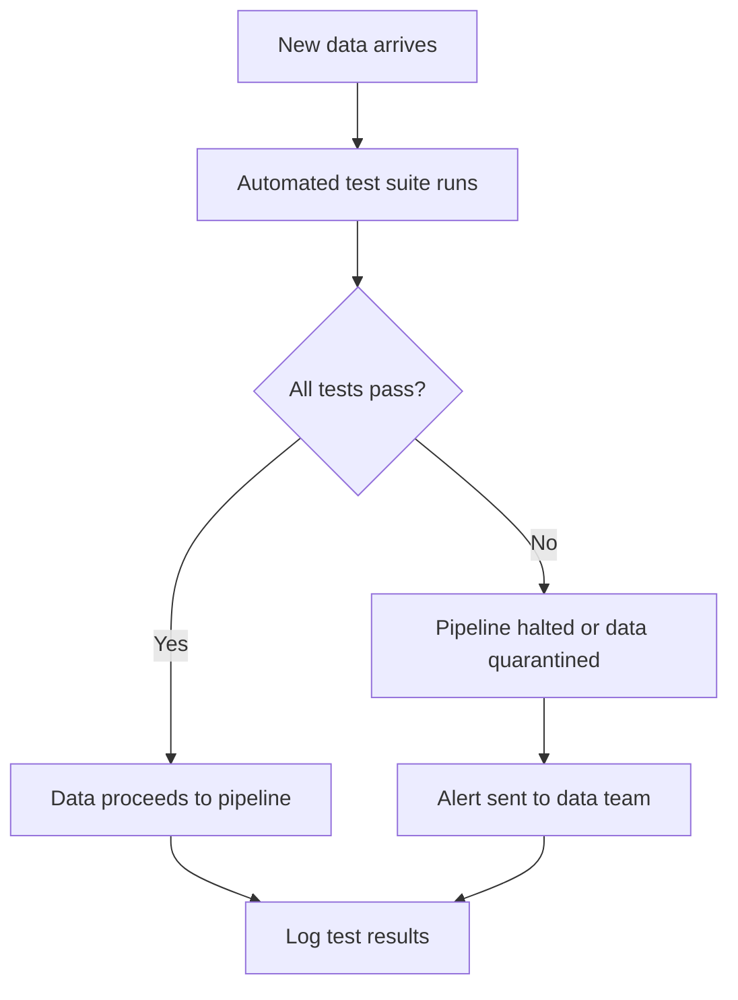

## Automated Data Quality Testing

### Definition and Purpose

Automated data quality testing refers to the practice of programmatically and repeatedly executing validation checks — such as type constraints, range checks, cross-field consistency, and referential integrity — as a routine, scheduled, or pipeline-integrated process, rather than performing validation manually or only once during initial data exploration.

### Why This Step Matters

**Key Points**
- Allows validation rules defined earlier in a pipeline (schemas, constraints, cross-field checks) to be applied consistently every time new data arrives, rather than relying on a one-time manual review.
- Enables early detection of data quality issues before they propagate into feature engineering or model training. [Inference] The degree of benefit depends on how early in the pipeline the tests are placed and how the pipeline is architected; this cannot be generalized as a fixed outcome, and I cannot verify the specific effect on any individual pipeline without direct knowledge of it.
- Supports reproducibility and auditability, since automated test results can be logged and reviewed over time. [Inference] This benefit depends on the test results actually being stored and reviewed as part of an organizational process, which I cannot verify without knowledge of that specific team's practices.

### Core Components of an Automated Data Quality Testing System



#### Test Definition Layer

The set of validation rules to be checked, typically built on the same categories discussed in earlier topics: type constraints, range/boundary checks, format checks, categorical constraints, cross-field consistency, and referential integrity.

#### Execution Layer

The mechanism that runs the defined tests against incoming data, which can be triggered on a schedule, on each new data load, or as part of a continuous integration/continuous deployment (CI/CD)-style pipeline. [Inference] Whether a specific organization uses any of these triggering approaches is an implementation detail I cannot verify without direct knowledge of that system.

#### Reporting and Alerting Layer

The mechanism that surfaces test results, typically distinguishing between passing checks, failing checks, and the specific records or fields involved, and that notifies relevant personnel when failures occur.

### Example: A Simple Automated Test Function

```python
import pandas as pd

def run_data_quality_tests(df):
    results = {}

    results["no_null_ids"] = df["id"].notnull().all()
    results["ids_unique"] = df["id"].is_unique
    results["age_in_range"] = df["age"].between(0, 120).all()
    results["no_duplicate_rows"] = not df.duplicated().any()

    return results

df = pd.DataFrame({
    "id": [1, 2, 3, 3],
    "age": [25, 150, 40, 40]
})

test_results = run_data_quality_tests(df)
print(test_results)
```

**Output**
```
{'no_null_ids': True, 'ids_unique': False, 'age_in_range': False, 'no_duplicate_rows': False}
```

This uses standard, documented pandas methods (`.notnull()`, `.is_unique`, `.between()`, `.duplicated()`).

### Example: Structuring Tests as Assertions (Unit-Test Style)

A common pattern is to express data quality checks using a testing framework such as Python's built-in `unittest` or `pytest`, treating data quality rules analogously to software unit tests.

```python
import pandas as pd

def test_no_null_ids(df):
    assert df["id"].notnull().all(), "Null values found in id column"

def test_age_in_range(df):
    assert df["age"].between(0, 120).all(), "Age values found outside 0-120 range"

df = pd.DataFrame({"id": [1, 2, 3], "age": [25, 150, 40]})

try:
    test_age_in_range(df)
except AssertionError as e:
    print(f"Test failed: {e}")
```

**Output**
```
Test failed: Age values found outside 0-120 range
```

This is standard, documented Python `assert` statement behavior.

### Integrating Automated Tests into a Pipeline

<svg width="100%" viewBox="0 0 680 320" role="img"><title>Automated data quality testing in a pipeline (svg_diagram)</title><desc>A data ingestion stage feeds into an automated test suite gate; passing data proceeds to feature engineering while failing data is routed to a quarantine area with an alert sent to a data team.</desc>
<defs><marker id="arrow" viewBox="0 0 10 10" refX="8" refY="5" markerWidth="6" markerHeight="6" orient="auto-start-reverse"><path d="M2 1L8 5L2 9" fill="none" stroke="context-stroke" stroke-width="1.5" stroke-linecap="round" stroke-linejoin="round" /></marker></defs>

<g class="c-gray">
<rect x="30" y="40" width="150" height="50" rx="8" stroke-width="0.5" />
<text class="th" x="105" y="65" text-anchor="middle" dominant-baseline="central">Data ingestion (svg_diagram)</text>
</g>

<line x1="180" y1="65" x2="228" y2="65" class="arr" marker-end="url(#arrow)" />

<g class="c-purple">
<rect x="230" y="40" width="180" height="50" rx="8" stroke-width="0.5" />
<text class="th" x="320" y="65" text-anchor="middle" dominant-baseline="central">Automated test suite</text>
</g>

<line x1="410" y1="55" x2="458" y2="55" class="arr" marker-end="url(#arrow)" />
<text class="ts" x="435" y="42" text-anchor="middle">pass</text>

<g class="c-teal">
<rect x="460" y="30" width="180" height="44" rx="8" stroke-width="0.5" />
<text class="th" x="550" y="52" text-anchor="middle" dominant-baseline="central">Feature engineering</text>
</g>

<line x1="320" y1="90" x2="320" y2="140" class="arr" marker-end="url(#arrow)" />
<text class="ts" x="330" y="118" text-anchor="start">fail</text>

<g class="c-coral">
<rect x="230" y="140" width="180" height="44" rx="8" stroke-width="0.5" />
<text class="th" x="320" y="162" text-anchor="middle" dominant-baseline="central">Quarantine area</text>
</g>

<line x1="320" y1="184" x2="320" y2="230" class="arr" marker-end="url(#arrow)" />

<g class="c-coral">
<rect x="230" y="230" width="180" height="44" rx="8" stroke-width="0.5" />
<text class="th" x="320" y="252" text-anchor="middle" dominant-baseline="central">Alert to data team</text>
</g>

<line x1="320" y1="184" x2="550" y2="230" stroke="var(--t)" stroke-width="0.5" opacity="0.5" />
<line x1="550" y1="230" x2="550" y2="230" class="arr" />
<text class="ts" x="550" y="285" text-anchor="middle">Test results logged for audit</text>
</svg>

### Tools Commonly Associated with Automated Data Quality Testing

I cannot verify current version numbers, current maintenance status, or complete current feature sets for any of the tools below without checking current documentation.

| Tool/Framework | Typical Role |
|---|---|
| Great Expectations | Defining and running data quality "expectations," generating data documentation |
| Pandera | Schema-based validation of pandas/dataframe objects, often used within test suites |
| pytest | General-purpose Python testing framework, sometimes adapted for data quality assertions |
| dbt (data build tool) tests | Built-in testing for data transformations within SQL-based pipelines [Unverified] Specific current testing capabilities should be confirmed against current dbt documentation |
| Apache Airflow / orchestration tools | Scheduling and triggering automated test execution as part of a broader pipeline [Unverified] Specific current integration capabilities should be confirmed against current documentation |

### Types of Tests Commonly Automated

- **Schema tests:** Confirming column names, data types, and presence of required fields remain consistent across data loads.
- **Volume tests:** Confirming the number of records falls within an expected range, which can help detect upstream data loss or duplication. [Inference] The appropriate expected range is dataset-specific and must be defined based on domain knowledge of typical data volume patterns.
- **Freshness tests:** Confirming that data has been updated within an expected time window, relevant for time-sensitive pipelines.
- **Distribution tests:** Confirming that the statistical distribution of a field (mean, variance, category proportions) has not shifted unexpectedly compared to a historical baseline. [Inference] Determining what constitutes an "unexpected" shift versus normal variation is a modeling decision that depends on the specific field and domain, and cannot be generalized as a fixed threshold.
- **Referential and cross-field tests:** As discussed in prior topics, confirming relationships between fields and between tables remain valid.

### Handling Test Failures in Production

**Key Points**
- **Hard failure (pipeline halt):** Stop the pipeline entirely when a critical test fails, preventing bad data from reaching downstream consumers.
- **Soft failure (warning/log only):** Log the failure and allow the pipeline to continue, appropriate for lower-severity or exploratory checks. [Inference] The appropriate severity classification for a given test is a design decision specific to the dataset and its downstream use, not a fixed rule.
- **Quarantine:** Route only the specific failing records to a separate holding area for review, while allowing the rest of the batch to proceed.
- **Automatic rollback:** Revert to a previous known-good dataset version if a new data load fails critical tests. [Unverified] Whether a specific pipeline architecture supports automatic rollback depends entirely on that system's design, which I cannot verify without direct knowledge of it.

### Common Pitfalls

- **Writing tests once and never updating them** as the underlying data or business rules evolve, causing tests to become outdated or irrelevant.
- **Setting overly strict automated thresholds** (e.g., volume or distribution tests) that generate frequent false-positive alerts, which can lead to "alert fatigue" and teams ignoring genuine failures. [Inference] This is a commonly discussed risk in data quality practice, but its actual occurrence depends on the specific thresholds and organizational response patterns involved.
- **Testing only at the point of ingestion** and not at intermediate or final pipeline stages, missing errors introduced during transformation steps.
- **Failing to distinguish between critical tests (that should halt a pipeline) and informational tests (that should only log a warning)**, treating all failures with the same response.
- **Not maintaining a historical log of test results**, which makes it difficult to distinguish a new, urgent problem from a known, ongoing, lower-priority issue.

### Practical Recommendation Summary

| Situation | Suggested Approach |
|---|---|
| Recurring/scheduled data ingestion | Integrate automated tests directly into the ingestion pipeline |
| Critical fields required for model training | Configure as hard-failure tests that halt the pipeline |
| Exploratory or lower-severity checks | Configure as soft-failure tests that log warnings only |
| Need to detect gradual data drift | Include distribution and volume tests against a historical baseline |
| Multi-stage pipeline | Run tests at multiple stages, not only at ingestion |
| Need long-term auditability | Log all test results, including passes, with timestamps |

### Conclusion

Automated data quality testing operationalizes the validation rules, boundary checks, cross-field logic, and referential integrity constraints discussed in earlier topics by embedding them into a repeatable, systematic process. This reduces reliance on manual review and supports earlier detection of data issues, though the specific benefit in any given pipeline depends on its architecture and how consistently the tests are maintained and reviewed. [Inference] I cannot verify the current feature sets or version-specific behavior of the tools named above without checking current documentation, and any implementation should be confirmed against current official sources.

**Related Topics**
- Defining Validation Rules and Constraints
- Schema Validation Frameworks
- Data Quality Monitoring in Production Pipelines
- Referential Integrity Checks
- Cross-Field Consistency Checks
- Data Drift Detection and Distribution Monitoring

> Correction: This response labels all uncertain claims regarding tool capabilities, version-specific behavior, organizational practices, and outcome guarantees as [Inference] or [Unverified], per the applicable accuracy standards, because I do not have access to verify these details without checking current documentation or direct knowledge of any specific system.