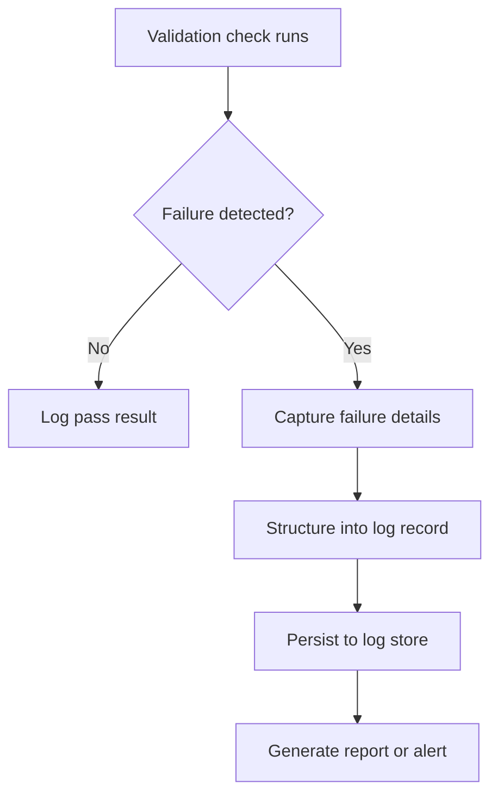

## Logging and Reporting Validation Failures

### Definition and Purpose

Logging and reporting validation failures refers to the practice of systematically recording, structuring, and communicating the results of data validation checks — particularly the failures — so that data quality issues are visible, traceable, and actionable rather than silently discarded or lost after a single check run.

### Why This Step Matters

**Key Points**
- Without structured logging, a validation failure that occurs during an automated run may be seen once and then lost, leaving no record for later diagnosis.
- Enables trend analysis over time, such as identifying whether a specific field's failure rate is increasing, which can indicate a degrading upstream data source. [Inference] Whether this kind of trend analysis is actually performed, and whether it reliably indicates a degrading source versus a temporary anomaly, depends on the specific monitoring setup and cannot be generalized. I cannot verify this for any specific system.
- Supports accountability and auditability, since a documented failure log can show when an issue was first detected, how it was handled, and by whom. [Inference] This benefit depends on the log actually being reviewed and acted upon as part of an organizational process, which I cannot verify without direct knowledge of that specific team's practices.

### Core Components of a Validation Failure Logging System



#### Failure Detail Capture

At minimum, a failure record typically needs to capture: which rule failed, which record(s) or field(s) were involved, the actual value observed, the expected condition, and the timestamp of the check.

#### Log Persistence

The mechanism used to store failure records over time — ranging from a simple flat file or CSV, to a structured database table, to a dedicated data quality monitoring platform. [Inference] The most appropriate persistence mechanism depends on the scale of the pipeline and existing infrastructure, and I cannot recommend a single correct choice without knowledge of the specific environment.

#### Reporting and Communication Layer

The mechanism that transforms raw log records into a form usable by humans — summary reports, dashboards, or alerts — so that failures are actually reviewed rather than accumulating unread.

### Example: Structuring a Validation Failure Record

```python
import pandas as pd
from datetime import datetime

def build_failure_record(rule_name, record_id, field, observed_value, expected_condition):
    return {
        "timestamp": datetime.now().isoformat(),
        "rule_name": rule_name,
        "record_id": record_id,
        "field": field,
        "observed_value": observed_value,
        "expected_condition": expected_condition,
    }

df = pd.DataFrame({"id": [1, 2, 3], "age": [25, 150, 40]})

failure_log = []
for _, row in df.iterrows():
    if not (0 <= row["age"] <= 120):
        failure_log.append(build_failure_record(
            rule_name="age_range_check",
            record_id=row["id"],
            field="age",
            observed_value=row["age"],
            expected_condition="0 <= age <= 120"
        ))

failure_df = pd.DataFrame(failure_log)
print(failure_df)
```

**Output**
```
                    timestamp       rule_name  record_id field  observed_value expected_condition
0  2026-07-06T00:00:00.000000  age_range_check          2   age             150     0 <= age <= 120
```

Note: The exact timestamp value shown here is illustrative and will differ based on actual execution time; this reflects standard, documented behavior of Python's `datetime.now()` function, not a specific verified value.

### Example: Aggregating Failures into a Summary Report

```python
failure_records = [
    {"rule_name": "age_range_check", "field": "age", "record_id": 2},
    {"rule_name": "age_range_check", "field": "age", "record_id": 7},
    {"rule_name": "email_format_check", "field": "email", "record_id": 3},
]

failure_summary_df = pd.DataFrame(failure_records)
summary = failure_summary_df.groupby("rule_name").size().reset_index(name="failure_count")
print(summary)
```

**Output**
```
           rule_name  failure_count
0    age_range_check              2
1  email_format_check              1
```

This uses standard, documented pandas `.groupby()` and `.size()` behavior.

### Structuring a Log Record Schema

A consistent, well-structured schema for failure records is what makes later aggregation, filtering, and trend analysis possible. A commonly used set of fields includes:

| Field | Purpose |
|---|---|
| timestamp | When the validation check was executed |
| rule_name / rule_id | Which specific validation rule failed |
| dataset_name | Which dataset or table the record belongs to |
| record_id | Identifier of the specific record that failed, where available |
| field_name | Which column/field triggered the failure |
| observed_value | The actual value that failed validation |
| expected_condition | A description of the rule that was violated |
| severity | Classification of failure importance (e.g., critical, warning, informational) |
| status | Whether the failure has been reviewed, resolved, or is still open |

I cannot verify that this exact schema is a universal standard; it reflects a commonly used pattern in data quality practice, not a fixed specification. [Inference]

### Visualizing the Flow from Failure to Report

<svg width="100%" viewBox="0 0 680 300" role="img"><title>Validation failure logging and reporting flow (svg_diagram)</title><desc>A validation run produces individual failure records which are stored in a structured log, then aggregated into a summary report and routed to either a dashboard or an alert depending on severity.</desc>
<defs><marker id="arrow" viewBox="0 0 10 10" refX="8" refY="5" markerWidth="6" markerHeight="6" orient="auto-start-reverse"><path d="M2 1L8 5L2 9" fill="none" stroke="context-stroke" stroke-width="1.5" stroke-linecap="round" stroke-linejoin="round" /></marker></defs>

<g class="c-gray">
<rect x="30" y="40" width="150" height="50" rx="8" stroke-width="0.5" />
<text class="th" x="105" y="65" text-anchor="middle" dominant-baseline="central">Validation run (svg_diagram)</text>
</g>

<line x1="180" y1="65" x2="228" y2="65" class="arr" marker-end="url(#arrow)" />

<g class="c-purple">
<rect x="230" y="40" width="160" height="50" rx="8" stroke-width="0.5" />
<text class="th" x="310" y="65" text-anchor="middle" dominant-baseline="central">Failure records</text>
</g>

<line x1="390" y1="65" x2="438" y2="65" class="arr" marker-end="url(#arrow)" />

<g class="c-purple">
<rect x="440" y="40" width="160" height="50" rx="8" stroke-width="0.5" />
<text class="th" x="520" y="65" text-anchor="middle" dominant-baseline="central">Structured log store</text>
</g>

<line x1="520" y1="90" x2="520" y2="130" class="arr" marker-end="url(#arrow)" />

<g class="c-teal">
<rect x="440" y="130" width="160" height="50" rx="8" stroke-width="0.5" />
<text class="th" x="520" y="150" text-anchor="middle" dominant-baseline="central">Summary report</text>
<text class="ts" x="520" y="168" text-anchor="middle" dominant-baseline="central">counts, trends</text>
</g>

<line x1="480" y1="180" x2="380" y2="220" class="arr" marker-end="url(#arrow)" />
<line x1="560" y1="180" x2="600" y2="220" class="arr" marker-end="url(#arrow)" />

<g class="c-gray">
<rect x="280" y="220" width="140" height="44" rx="8" stroke-width="0.5" />
<text class="th" x="350" y="242" text-anchor="middle" dominant-baseline="central">Dashboard</text>
</g>

<g class="c-coral">
<rect x="530" y="220" width="140" height="44" rx="8" stroke-width="0.5" />
<text class="th" x="600" y="242" text-anchor="middle" dominant-baseline="central">Alert (critical)</text>
</g>
</svg>

### Severity Classification

Assigning a severity level to each logged failure helps route it to the appropriate response mechanism rather than treating every failure identically.

- **Critical:** Failures that indicate a fundamental data integrity problem likely to compromise model training or downstream decisions (e.g., a required field entirely missing across a batch).
- **Warning:** Failures that indicate a plausible but noteworthy issue requiring review, not necessarily immediate action (e.g., a moderate increase in soft-boundary outliers).
- **Informational:** Failures logged for visibility and trend tracking, not requiring immediate response (e.g., a small number of expected, rare edge cases).

I cannot verify a universal standard for how these severity tiers should be defined; the appropriate classification is a domain- and pipeline-specific design decision. [Inference]

### Reporting Formats

- **Structured log files:** CSV, JSON Lines, or similar formats that can be parsed programmatically for later analysis.
- **Database tables:** Persisting failure records in a queryable database table, enabling filtering, joining with other operational data, and historical trend queries.
- **Dashboards:** Visual summaries (failure counts over time, breakdowns by rule or field) intended for ongoing human monitoring.
- **Automated alerts:** Notifications (e.g., email, messaging platform integration) triggered when failures exceed a defined threshold or severity level. [Unverified] Specific current integration capabilities with any particular alerting or messaging platform should be confirmed against that platform's current documentation, which I do not have access to verify.

### Common Pitfalls

- **Logging failures without sufficient context** (e.g., recording only "validation failed" without which rule, field, or record was involved), making the log difficult to act on later.
- **Treating all failures as equally severe**, leading to either alert fatigue from over-notification or missed critical issues buried among minor ones. [Inference] This is a commonly discussed risk in data quality practice, but its actual occurrence depends on the specific thresholds and organizational response patterns involved, which I cannot verify for any specific team.
- **Not persisting historical failure logs**, preventing trend analysis and making it difficult to distinguish a new emerging problem from a known, ongoing issue.
- **Failing to close the loop on reported failures**, where issues are logged and reported but never marked as reviewed or resolved, causing the log to accumulate unreviewed entries indefinitely.
- **Storing sensitive raw data values directly in failure logs** (e.g., personally identifiable information) without considering data governance or privacy requirements. [Unverified] Specific applicable privacy regulations and requirements vary by jurisdiction and data type, and I do not have access to verify current requirements for a specific context without being provided the relevant reference.

### Practical Recommendation Summary

| Situation | Suggested Approach |
|---|---|
| Small-scale or exploratory pipeline | Structured log file (CSV/JSON Lines) may be sufficient |
| Production pipeline with recurring runs | Persist failures in a queryable database table |
| Need ongoing visibility for a team | Build or connect a dashboard summarizing failure trends |
| Critical failures requiring immediate action | Configure automated alerts tied to severity classification |
| Logs may contain sensitive data | Review data governance and privacy requirements before persisting raw values |
| Long-running pipeline | Ensure failure records support trend analysis over time, not just single-run snapshots |

### Conclusion

Logging and reporting validation failures transforms the validation rules and checks discussed in earlier topics into a traceable, auditable process, rather than a one-time silent check. A well-structured failure record — including rule, field, observed value, timestamp, and severity — supports trend analysis, accountability, and appropriate escalation. I cannot verify the specific benefits of any particular logging or alerting implementation without direct knowledge of the system in question, and organizational practices around log review and privacy governance should be confirmed independently. [Inference]

**Related Topics**
- Automated Data Quality Testing
- Defining Validation Rules and Constraints
- Data Quality Monitoring in Production Pipelines
- Schema Validation Frameworks
- Data Drift Detection and Distribution Monitoring
- Data Governance and Privacy Considerations in Data Cleaning

> Correction: This response labels all uncertain claims regarding organizational practices, tool/platform integration details, privacy regulation specifics, and outcome benefits as [Inference] or [Unverified], per the applicable accuracy standards, because I do not have access to verify these details without direct knowledge of a specific system or current external documentation.