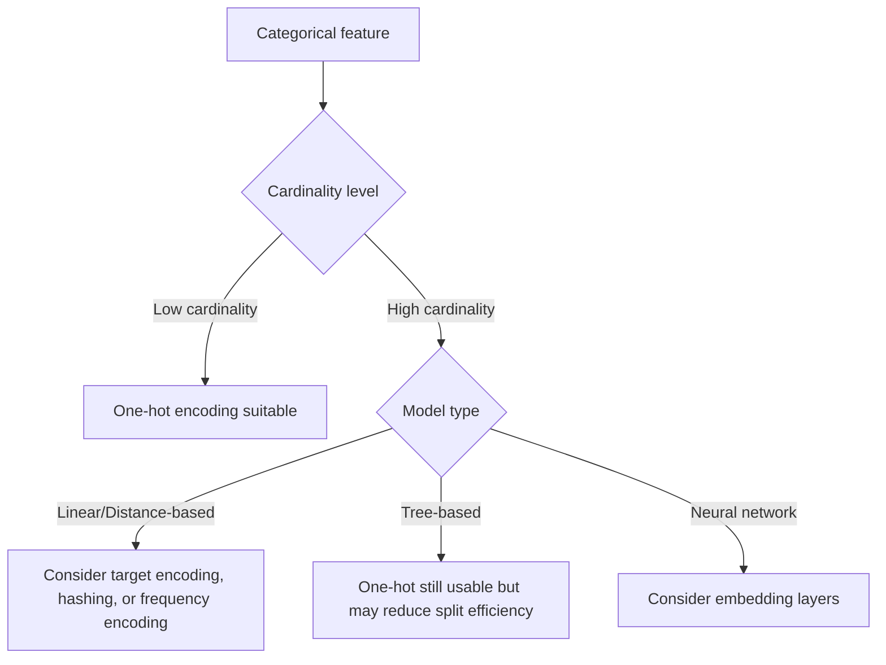

## One-Hot Encoding

### Overview

One-hot encoding is a technique for converting categorical variables into a numerical format that machine learning models can process. Each category value is transformed into a new binary column, where a value of 1 indicates the presence of that category for a given observation, and 0 indicates its absence. This avoids implying a false ordinal relationship between category values that plain integer encoding would introduce.

### Why One-Hot Encoding Is Necessary

Most machine learning algorithms require numerical input. Categorical variables like `color` (red, blue, green) or `city` (Paris, Tokyo, Lagos) cannot be fed directly into models that operate on numerical computation, such as linear regression or neural networks.

A naive approach — assigning integers like red=1, blue=2, green=3 — introduces an unintended ordinal relationship (implying green > blue > red), which can mislead models that assume numerical order or magnitude carries meaning, such as linear regression or distance-based models. One-hot encoding avoids this by representing each category as an independent binary feature.

### Mechanics of One-Hot Encoding

For a categorical feature with $k$ unique categories, one-hot encoding creates $k$ new binary columns (or $k-1$, depending on configuration — see "Dummy Variable Trap" below).

**Example:**

| Original: `color` |
|---|
| red |
| blue |
| green |

Becomes:

| color_red | color_blue | color_green |
|---|---|---|
| 1 | 0 | 0 |
| 0 | 1 | 0 |
| 0 | 0 | 1 |

Each row has exactly one column set to 1 (hence "one-hot") and the rest set to 0.

### The Dummy Variable Trap

When one-hot encoding produces $k$ columns for $k$ categories, the columns are linearly dependent — knowing $k-1$ of the values lets you infer the last one. This is known as the **dummy variable trap**, and it can cause multicollinearity issues in linear models (e.g., linear regression), where the design matrix becomes singular or unstable in coefficient estimation.

**Solution:** Drop one category column, producing $k-1$ columns. The dropped category becomes the implicit "reference" category, represented by all-zero values across the remaining columns.

This is a standard, well-documented practice in statistical modeling (often called "dummy encoding" as distinct from full one-hot encoding), not merely a stylistic preference.

- [Inference] Whether dropping a column is necessary depends on the downstream model. Tree-based models and regularized linear models are generally more tolerant of the dummy variable trap than unregularized linear regression, since regularization or split-based logic reduces sensitivity to multicollinearity. This is a reasoned extension based on how these model types handle correlated features, not a benchmarked claim.

### One-Hot Encoding in Practice

#### Using pandas

```python
import pandas as pd

df = pd.DataFrame({'color': ['red', 'blue', 'green']})
encoded = pd.get_dummies(df, columns=['color'])
```

`pd.get_dummies` is a documented pandas function that performs one-hot encoding, with an optional `drop_first=True` parameter to avoid the dummy variable trap.

#### Using scikit-learn

```python
from sklearn.preprocessing import OneHotEncoder

encoder = OneHotEncoder(sparse_output=True, drop='first')
encoded = encoder.fit_transform(df[['color']])
```

scikit-learn's `OneHotEncoder` supports sparse output by default (as of recent versions), since one-hot encoded matrices are often mostly zeros, and returning a sparse matrix saves memory. It also supports a `drop` parameter to handle the dummy variable trap directly.

- [Unverified] Exact default parameter values (e.g., whether `sparse_output` defaults to `True` or `False`) can differ across scikit-learn versions. I do not have access to confirm which specific version you may be using, so this should be checked against the installed version's documentation rather than assumed.

### High-Cardinality Categorical Features

One-hot encoding becomes problematic when a categorical feature has a very large number of unique values (high cardinality), such as `zip_code` or `user_id`.

**Consequences:**
- **Dimensionality explosion:** A feature with 10,000 unique categories produces 10,000 (or 9,999) new columns, which can drastically increase memory usage and training time.
- **Sparsity:** Most rows will have mostly zero values across these new columns, which is often only efficiently handled by sparse-aware model implementations.
- **Overfitting risk:** [Inference] With very high cardinality, some categories may appear only a handful of times in the training data, giving the model very little signal to learn a stable relationship for those specific categories. This increases the risk of overfitting to rare categories, though the severity depends on dataset size and model regularization — I cannot quantify this risk generally without specifics of a given dataset.

**Common alternatives for high-cardinality features:**
- Target encoding (replacing categories with a statistic like mean target value)
- Frequency encoding (replacing categories with their occurrence count or frequency)
- Hashing trick (mapping categories into a fixed number of buckets via a hash function)
- Embedding layers (in neural network contexts, learning a dense vector representation per category)

### One-Hot Encoding and Downstream Model Compatibility



- **Tree-based models:** [Inference] One-hot encoding can reduce the effectiveness of tree splits on high-cardinality features, since each binary column carries a small amount of information individually, potentially requiring deeper trees to capture patterns that a single multi-way categorical split could capture directly. This is a reasoned mechanical explanation based on how trees split on individual features, not an empirical benchmark result.
- **Linear models:** One-hot encoding is standard and well-suited, provided the dummy variable trap is addressed.
- **Neural networks:** One-hot vectors are a valid input format, but are often replaced with learned embeddings for high-cardinality categorical features to reduce dimensionality and capture latent relationships between categories.

### Handling Unseen Categories at Inference Time

A common real-world issue: a category present in production/test data that was not seen during training (e.g., a new `city` value). Standard one-hot encoding implementations require an explicit strategy for this:

- **scikit-learn's `OneHotEncoder`** supports a `handle_unknown='ignore'` parameter, which assigns all-zero values across the encoded columns for unseen categories rather than raising an error. This is documented behavior, not an inference.
- Without this handling, encoding an unseen category can raise a runtime error or, in poorly designed pipelines, be silently misencoded.

### Common Pitfalls

- Applying one-hot encoding before splitting data into train/test sets, using categories from the full dataset. This can leak information about category distributions from the test set into training and can cause mismatches if test-only categories don't appear in the training encoding scheme.
- Not addressing the dummy variable trap in linear regression, leading to unstable or non-unique coefficient estimates.
- Applying one-hot encoding to high-cardinality features without considering memory and overfitting consequences.
- Forgetting to handle unseen categories at inference time, causing pipeline failures in production.

### Key Points

- One-hot encoding avoids implying false ordinal relationships in categorical data.
- The dummy variable trap is a documented linear algebra consequence of full one-hot encoding and is commonly addressed by dropping one column.
- High-cardinality features pose dimensionality and sparsity challenges; alternatives like target encoding, frequency encoding, or embeddings are commonly used instead.
- [Inference] Tree-based models may see reduced split efficiency with one-hot encoded high-cardinality features compared to native categorical splitting, based on how tree splits function mechanically — this has not been benchmarked here against a specific dataset.
- Handling unseen categories at inference time requires explicit configuration (e.g., `handle_unknown='ignore'` in scikit-learn) to avoid pipeline failures.

I cannot verify exact default behaviors or parameter names for library versions not specified, and any such detail should be checked against the current official documentation for the version in use.

**Related Topics**
- Target encoding and mean encoding techniques
- Frequency and count encoding for high-cardinality features
- The hashing trick for categorical feature reduction
- Embedding layers for categorical data in deep learning
- Ordinal encoding and when it is appropriate versus one-hot encoding
- Handling rare categories via grouping ("other" bucket strategies)
