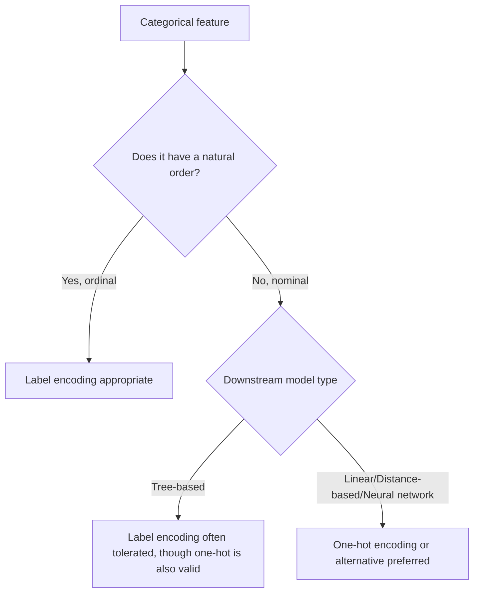

## Label Encoding

### Overview

Label encoding converts categorical values into integer labels, assigning a unique whole number to each distinct category. Unlike one-hot encoding, it produces a single column rather than multiple binary columns, but it introduces an implicit numerical ordering between categories that may or may not be appropriate depending on the nature of the data and the downstream model.

### Mechanics of Label Encoding

Each unique category in a feature is mapped to an integer, typically starting at 0.

**Example:**

| Original: `size` | Label Encoded |
|---|---|
| small | 0 |
| medium | 1 |
| large | 2 |

The mapping is usually determined either alphabetically or by order of first appearance, depending on the implementation.

```python
from sklearn.preprocessing import LabelEncoder

encoder = LabelEncoder()
encoded = encoder.fit_transform(['small', 'medium', 'large'])
```

scikit-learn's `LabelEncoder` assigns integers based on sorted (alphabetical/numerical) order of unique values by default. This is documented behavior.

### Ordinal vs. Nominal Data: The Core Consideration

Label encoding is mathematically appropriate for **ordinal** categorical variables — those with a natural, meaningful order, such as `size` (small < medium < large) or `education_level` (high school < bachelor's < master's < PhD). In these cases, the assigned integers preserve a real-world ranking relationship that models can meaningfully interpret.

Label encoding is generally **inappropriate** for **nominal** categorical variables — those without inherent order, such as `color` (red, blue, green) or `country`. Assigning arbitrary integers to nominal categories (e.g., red=0, blue=1, green=2) implies a false ordinal relationship (green > blue > red) that does not reflect any real property of the data.

- For models that treat numerical input as having ordered, continuous meaning (e.g., linear regression, k-NN, SVM), this false ordering can distort learned relationships, since the model may assume green is "more" of something than red simply due to its integer value.
- [Inference] The severity of this distortion depends on the specific model and how heavily it relies on numeric magnitude or distance in its computations. This is a reasoned mechanical consequence of how these models process numeric input, not a benchmarked measurement of impact on any specific dataset.

### Label Encoding and Tree-Based Models

Tree-based models (decision trees, random forests, gradient boosting) are commonly considered more tolerant of label encoding applied to nominal variables, because they split on thresholds (e.g., `feature <= 1.5`) rather than treating the numeric value as a continuous magnitude with inherent distance meaning.

- [Inference] A tree can still partition a label-encoded nominal feature into meaningful groups across multiple splits, even without a true ordinal relationship, because the model effectively treats each split as a way to separate subsets of categories rather than assuming numeric closeness implies similarity. This is a reasoned explanation of split mechanics, not a claim verified against a specific benchmark or dataset.
- This tolerance is not universal across all tree implementations or configurations, and results can vary based on tree depth, number of categories, and the specific library implementation used.

### Practical Example

Consider an `education_level` feature with categories: high school, bachelor's, master's, PhD. Label encoding this as 0, 1, 2, 3 respects the real-world ordinal relationship, and a model like linear regression can meaningfully interpret increasing values as increasing education level.

By contrast, consider a `city` feature with categories: Lagos, Tokyo, Paris. Label encoding this as 0, 1, 2 does not reflect any real-world order. A linear regression model might incorrectly learn that Paris (2) contributes "twice as much" as Tokyo (1) to a prediction, which has no grounding in reality.

### Label Encoding vs. One-Hot Encoding: Decision Path



### Custom Ordinal Mapping

For genuinely ordinal data, it is often preferable to define an explicit custom mapping rather than relying on default alphabetical ordering, since alphabetical order does not necessarily match the true ordinal relationship.

**Example:**

```python
mapping = {'small': 0, 'medium': 1, 'large': 2}
df['size_encoded'] = df['size'].map(mapping)
```

This ensures the encoded values reflect the true real-world order rather than an arbitrary sort order. This is a standard manual approach used in practice, not a claim about any specific library's internal default.

scikit-learn's `OrdinalEncoder` is also commonly used for this purpose, and it accepts a `categories` parameter to explicitly define category order rather than relying on default sorting.

### Handling Unseen Categories at Inference Time

Similar to one-hot encoding, label encoding pipelines must account for categories seen at inference time that were not present during training.

- scikit-learn's `LabelEncoder` does not have a built-in `handle_unknown` parameter and will raise an error on unseen labels during `transform`. This is documented behavior.
- `OrdinalEncoder`, by contrast, does support a `handle_unknown='use_encoded_value'` parameter, allowing a specified fallback value (such as -1) for unseen categories. This is documented, version-dependent behavior and should be verified against the specific scikit-learn version in use, since parameter availability has changed across versions. I cannot verify which exact version introduced this parameter without checking current documentation.

### Common Pitfalls

- Applying label encoding to nominal (unordered) categorical features when using models that assume numeric magnitude or distance carries meaning, introducing a false ordinal relationship.
- Relying on default alphabetical ordering for genuinely ordinal data, which can misrepresent the true order (e.g., "high", "low", "medium" sorted alphabetically does not match the real order low < medium < high).
- Fitting the encoder separately on training and test sets, which can produce inconsistent integer mappings between the two sets for the same categories.
- Not planning for unseen categories at inference time, which can cause runtime errors in production pipelines.

### Key Points

- Label encoding assigns a single integer per category and is mathematically appropriate for ordinal data with genuine order.
- Applying label encoding to nominal data risks introducing a false numeric relationship that can affect models sensitive to magnitude or distance.
- [Inference] Tree-based models are generally more tolerant of label-encoded nominal data due to their threshold-based splitting mechanics, though this tolerance is not absolute and can vary by implementation and dataset.
- Custom ordinal mappings are preferable to default alphabetical sorting when encoding genuinely ordinal categories.
- Unseen categories at inference time require explicit handling, and the specific parameters available for this depend on the library and version in use.

I cannot verify exact parameter availability or default behavior for library versions not specified here; such details should be confirmed against current official documentation for the version being used.

**Related Topics**
- One-hot encoding and the dummy variable trap
- Ordinal encoding with explicit category ordering
- Target encoding as an alternative for high-cardinality nominal data
- Encoding strategies for tree-based models versus linear models
- Handling unseen categories in production ML pipelines

