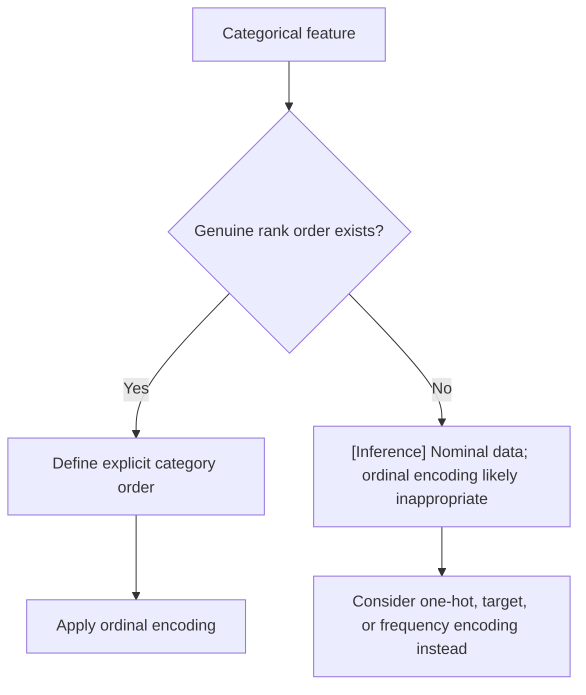

## Ordinal Encoding

### Overview

Ordinal encoding assigns integer values to categorical data based on an explicit, meaningful rank order. It is closely related to label encoding but is distinguished by intent: ordinal encoding is used specifically when categories have a genuine, defined sequence, and the encoding is constructed to reflect that sequence rather than an arbitrary or alphabetical assignment.

### Mechanics of Ordinal Encoding

The core idea is to map each category to an integer that corresponds to its position in a known real-world order, rather than letting a library sort categories automatically.

**Example:**

| Original: `education_level` | Ordinal Encoded |
|---|---|
| high school | 0 |
| bachelor's | 1 |
| master's | 2 |
| PhD | 3 |

```python
from sklearn.preprocessing import OrdinalEncoder

categories = [['high school', "bachelor's", "master's", 'PhD']]
encoder = OrdinalEncoder(categories=categories)
encoded = encoder.fit_transform(df[['education_level']])
```

Passing an explicit `categories` list to `OrdinalEncoder` is documented, standard scikit-learn behavior for controlling category order, rather than relying on default alphabetical sorting.

### Why Explicit Order Matters

If category order is not explicitly specified, many implementations default to sorting categories alphabetically or by order of first appearance. This can misrepresent the true ordinal relationship.

**Example of the problem:** For a `satisfaction` feature with values "low", "medium", "high", alphabetical sorting produces the order: high, low, medium — assigned as 0, 1, 2 respectively. This does not match the real-world order (low < medium < high) and would corrupt any model relying on the numeric relationship between categories.

Explicitly defining the category order avoids this issue and is considered standard practice when working with genuinely ordinal data.

### Ordinal Encoding vs. Label Encoding

The mathematical operation performed by ordinal encoding and label encoding is often identical — both assign integers to categories. The distinction is primarily conceptual and practical:

- **Label encoding** (e.g., scikit-learn's `LabelEncoder`) is designed primarily for encoding target/label variables in classification tasks and defaults to alphabetical ordering.
- **Ordinal encoding** (e.g., scikit-learn's `OrdinalEncoder`) is designed for encoding input features and supports explicit control over category order via the `categories` parameter, as well as handling multiple columns simultaneously.

[Inference] In practice, many practitioners use `LabelEncoder` for encoding ordinal input features as well, since the underlying operation is similar; this is a common pattern observed in tutorials and codebases, not a confirmed universal convention documented as a formal standard.

### When Ordinal Encoding Is Appropriate

Ordinal encoding is well-suited when:

- The categorical feature has a clear, agreed-upon rank order (e.g., `size`: small/medium/large; `rating`: poor/fair/good/excellent).
- The downstream model can meaningfully use the numeric distance between encoded values (e.g., linear regression assuming equal spacing between "poor" and "fair" versus "fair" and "good").

[Inference] The assumption that categories are "equally spaced" numerically (e.g., the gap between high school=0 and bachelor's=1 is treated as equivalent to the gap between master's=2 and PhD=3) may not reflect the true real-world relationship between those categories. This is a reasoned limitation based on how integer encoding works mathematically, not a benchmarked measurement of impact on any specific dataset or model.

### When Ordinal Encoding Is Inappropriate

Ordinal encoding should generally be avoided for nominal categorical variables — those without inherent order, such as `color` or `country`. Assigning an arbitrary sequential order to nominal categories introduces a false ranking relationship that does not exist in the underlying data. This concern is identical to the one discussed for label encoding on nominal features.

### Model Compatibility Considerations



- **Linear models:** Ordinal encoding is appropriate when the equal-spacing assumption between encoded values is reasonable for the data; otherwise, it may introduce a distorted linear relationship. [Unverified] Whether this distortion meaningfully affects model performance depends on the specific dataset and cannot be stated as a general fact without testing on that data.
- **Tree-based models:** [Inference] Tree-based models may be comparatively more tolerant of imperfect spacing between ordinal values, since splits partition the ordered range rather than assuming a strict linear numeric relationship. I cannot verify this holds universally across all tree implementations or configurations without direct benchmarking.
- **Distance-based models (k-NN, k-Means):** Ordinal encoding directly affects distance calculations, since consecutive categories are treated as numerically closer than distant ones. This is consistent with the intent of ordinal encoding, provided the assumed spacing reasonably reflects the real relationship between categories.

### Handling Unseen Categories at Inference Time

scikit-learn's `OrdinalEncoder` supports a `handle_unknown='use_encoded_value'` parameter combined with an explicit `unknown_value`, allowing unseen categories at inference time to be assigned a specified fallback value rather than raising an error. [Unverified] I cannot verify the exact scikit-learn version in which this parameter was introduced without checking documentation directly, so this should be confirmed against the specific version in use.

### Common Pitfalls

- Relying on default alphabetical category sorting instead of explicitly specifying the true rank order.
- Applying ordinal encoding to nominal data, introducing a false rank relationship.
- Assuming equal spacing between all encoded values when the real-world gaps between categories may not be uniform (e.g., the practical difference between "fair" and "good" may not equal the difference between "good" and "excellent").
- Not handling unseen categories at inference time, which can cause pipeline failures in production if not explicitly configured.

### Key Points

- Ordinal encoding assigns integers based on an explicit, defined rank order rather than arbitrary or alphabetical sorting.
- It is mathematically similar to label encoding, but distinguished by its intended use for genuinely ordinal input features with explicit order control.
- [Inference] The assumption of equal spacing between encoded categories may not reflect true real-world differences between those categories; this is a reasoned limitation, not a confirmed measurement for any specific dataset.
- [Inference] Tree-based models may tolerate imperfect ordinal spacing better than linear or distance-based models, based on how splitting mechanics work; this has not been benchmarked here.
- Unseen categories at inference time require explicit handling via library-specific parameters, and exact availability depends on the version in use, which I cannot verify without checking documentation directly.

I do not have access to confirm exact default parameter behaviors for unspecified library versions; such details should be checked against current official documentation.

**Related Topics**
- Label encoding and its distinction from ordinal encoding
- One-hot encoding for nominal categorical data
- Target encoding for high-cardinality features
- Encoding strategies compatible with tree-based versus linear models
- Handling unseen categories across different encoding schemes
